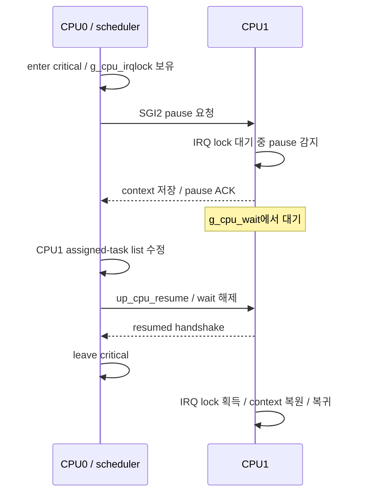

# TizenRT 동기화 API와 SMP pause 동작 분석

분석일: 2026-09-08. 기준 소스: `29d2ed503c2915bd123ff020f5c76353aa19f34c`.

현재 checkout의 함수 본문과 호출 경로를 읽은 정적 분석이다. `os/.config`가 없어 현재 선택된 보드는 특정하지 않았다. 듀얼 코어 설명은 `CONFIG_SMP=y`인 공통 커널과 ARMv7-A pause 구현을 중심으로 한다. 실제 예로 `build/configs/rtl8730e/flat_apps/defconfig`는 ARMv7-A, SMP 2 CPU, mutex types, mutex unsafe, priority inheritance를 선택한다. 다른 보드·Xtensa·SMP가 아닌 멀티프로세서 구성에는 같은 세부 동작을 그대로 적용하지 않는다. 빌드·실기기 재현·시간 측정은 수행하지 않았다.

문서의 `파일:줄`은 이 SHA의 로컬 소스 위치다. 구현 사실과 그로부터 도출한 사용 권고·교착 시나리오를 구분한다. NuttX 최신 구현을 TizenRT 구현으로 대입하지 않았다.

## 1. 먼저 구분해야 할 것

이 API들을 모두 같은 종류의 blocking API로 보면 선택을 잘못하기 쉽다.

| API | 기다리는 방법 | 보호 범위 | IRQ/다른 코어 | 주 용도 |
|---|---|---|---|---|
| `sem_wait` / timed wait | 자원이 없으면 task를 대기 큐로 이동 | 같은 semaphore를 사용하는 참여자 | 보유 중 IRQ와 다른 task 실행 가능 | 자원 개수, task 간 배제, 완료 통지 대기 |
| `pthread_mutex_lock` | 내부 semaphore에서 task 대기 | 같은 mutex를 사용하는 pthread, owner 추적 | 사용자 보유 구간에서 IRQ/다른 코어 실행 가능 | 앱의 pthread 공유 상태 |
| `spin_lock` | atomic test-and-set 반복; 설정에 따라 WFE | 같은 spinlock 참여자 | 자체 IRQ disable/선점 방지 없음 | 진행 보장이 이미 성립한 저수준 코드 |
| `spin_lock_irqsave(&lock)` | 로컬 IRQ disable 후 spin | 같은 private lock 참여자 | 다른 코어는 계속 실행 | 매우 짧은 레지스터/ISR 공유 데이터 |
| `spin_lock_irqsave(NULL)` | 로컬 IRQ disable 후 별도 전역 spin | 이 NULL 변형의 모든 사용자 | SMP에서 CPU별 nesting | 기존 코드의 짧은 전역 배제; 새 코드는 범위 검토 |
| `enter_critical_section` | 로컬 IRQ disable + SMP 커널 IRQ lock 대기 | 같은 커널 critical-section 체계 | 다른 코어를 자동 pause하지 않음 | scheduler/IRQ와 연결된 커널 상태 |
| `irqsave` | 대기 없이 로컬 CPU IRQ mask 변경 | 해당 CPU의 mask되는 IRQ | 다른 코어 보호 없음 | 아키텍처/저수준 구현 내부 |
| `sched_lock` | task의 선점 잠금 count 증가; SMP에서 짧은 내부 critical section | scheduling 정책 | IRQ와 이미 실행 중인 다른 코어 task는 계속 | 짧은 선점 지연, 커널 스케줄링 순서 제어 |
| `up_cpu_pause` | IPI 요청 후 상대 코어 ACK를 spin 대기 | 대상 코어의 context/assigned-task list | 상대 코어가 pause 처리 경로에서 대기 | scheduler/architecture 전용 |

서로 다른 잠금 체계는 자동으로 호환되지 않는다. 한 경로가 `enter_critical_section()`, 다른 경로가 private spinlock만 쓰면 같은 변수는 보호되지 않는다. 모든 접근자와 ISR이 동일한 보호 규약에 참여해야 한다.

근거: [os/kernel/semaphore/spinlock.c:61](../os/kernel/semaphore/spinlock.c#L61), [os/kernel/irq/irq_spinlock.c:88](../os/kernel/irq/irq_spinlock.c#L88), [os/kernel/irq/irq_csection.c:176](../os/kernel/irq/irq_csection.c#L176), [os/kernel/sched/sched_lock.c:184](../os/kernel/sched/sched_lock.c#L184), [os/arch/arm/src/armv7-a/arm_cpupause.c:322](../os/arch/arm/src/armv7-a/arm_cpupause.c#L322).

## 2. semaphore: 자원 잠금과 완료 통지를 구분

`sem_wait()`는 task context 전용이다. 내부 critical section에서 count가 양수면 하나 감소시키고 holder를 기록한다. 자원이 없으면 count를 감소시키고 `tcb->waitsem`을 설정한 뒤, 필요 시 priority inheritance를 적용하고 `up_block_task(..., TSTATE_WAIT_SEM)`로 CPU를 다른 task에 넘긴다. 음수 count는 대기자 수를 나타낸다.

`sem_post()`는 count를 증가시키고, 전역 우선순위 대기 큐에서 해당 semaphore를 기다리는 첫 task를 찾아 깨운다. 따라서 일반 FIFO lock으로 설명하면 안 된다. post는 ISR에서 호출할 수 있으나, 내부 critical-section 진입, 대기 큐 탐색, holder/PI 정리, scheduler unblock을 수행한다. SMP에서는 직접 또는 pending 해제 경로를 통해 원격 CPU pause/resume까지 이어질 수 있다. “sleep하지 않는다”는 “일정 시간 내 즉시 반환한다”와 다르다.

| 형태 | 용도 | 주의 |
|---|---|---|
| `sem_init(&s, 0, 1)` | 자원 독점 | raw semaphore에는 pthread mutex 같은 owner/재귀 검사가 없음 |
| `sem_init(&s, 0, N)` | N개 자원 제한 | 실제 자원과 count의 대응 유지 |
| `sem_init(&s, 0, 0)` | producer/ISR의 완료 통지 | 초기화 후 `sem_setprotocol(&s, SEM_PRIO_NONE)` 권장 |
| `sem_trywait` | 자원이 있으면 가져오고 없으면 실패 | `-1`, `errno=EAGAIN`; 이 구현에서는 ISR도 DEBUGASSERT로 금지 |
| `sem_timedwait` | 절대 deadline까지 대기 | CLOCK_REALTIME 기반; watchdog 할당 실패 가능 |
| `sem_tickwait` | 커널 내부 tick 기준 대기 | 비표준 start tick/delay 계약 확인; delay 0은 trywait |

초기값 0이고 `SAVE_SEM_HOLDER`가 활성화된 경우 `sem_init()`이 `FLAGS_SIGSEM`을 설정하고 holder 추적을 생략한다. 그래도 event semaphore는 PI NONE을 명시하는 실제 driver 관례를 따른다. 초기값이 1인 token 전달처럼 다른 task가 post하는 구조도 자원 owner 기반 PI에 그대로 맞지 않는다.

`CONFIG_PRIORITY_INHERITANCE`가 활성화되면 높은 우선순위 waiter 때문에 자원을 보유한 task의 우선순위를 올려 priority inversion을 줄이고, 해제 시 복원한다. 이것은 ABBA 교착·재귀 획득·pause 교착을 해결하지 않는다. holder 추적의 설정/자원 한도도 존재한다. Kconfig 기본은 PI off이므로 프로젝트 defconfig/실제 `.config` 확인 없이 항상 적용된다고 말할 수 없다. 앞서 든 rtl8730e 예는 PI on이다.

`sem_wait()`는 성공 0, 실패 -1 및 errno를 사용한다. signal interruption은 EINTR이며, `sem_timedwait()`의 timeout은 ETIMEDOUT이다. timeout/signal로 대기를 중단하는 커널 경로는 count를 복구하고 waitsem을 지운다. 취소점이 켜져 있으면 task cancellation 정책도 고려한다. 실패했는데 semaphore를 획득했다고 생각하고 post하면 안 된다.

```c
/* 정상 task context. 초기화된 resource semaphore라고 가정. */
int ret;
do {
    ret = sem_wait(&resource);
} while (ret < 0 && errno == EINTR);  /* 이 작업은 signal에도 계속할 정책 */
if (ret < 0) {
    return -errno;
}

/* 자원을 사용. 반환/오류/취소 때 누가 해제할지 명확히 정한다. */
use_resource();
ret = sem_post(&resource);
return ret < 0 ? -errno : 0;
```

위 EINTR 재시도는 정책 예시다. 취소 가능한 I/O라면 중단을 상위 호출자에 반환하는 편이 맞을 수 있다. timedwait 재시도는 같은 절대 deadline을 사용해 대기 한도가 계속 늘어나지 않게 한다. 현재 timedwait는 먼저 watchdog을 할당하고 trywait하므로 ENOMEM이 날 수 있고, 즉시 획득되면 과거 deadline이라도 성공할 수 있다. microsecond 정밀도나 순수 nonblocking fast path를 가정하지 않는다.

초기값 1 semaphore라도 두 번 post하면 일반 count는 2가 되어 배제가 깨질 수 있다. `FLAGS_SEM_MUTEX`는 pthread mutex 초기화가 별도로 설정한다. `sem_getvalue()`를 읽고 후속 동작을 결정하는 방식 대신 wait/trywait의 원자적인 획득 결과로 판단한다.

`sem_destroy()`는 waiter가 있어도 반드시 EBUSY를 반환하지 않는다. 이 구현은 count가 음수여도 OK를 반환하면서 initialized flag/holder를 정리한다. 먼저 신규 접근과 ISR 생산자를 중단하고 in-flight 작업/대기자를 종료시킨 뒤 destroy해야 한다. kernel semaphore의 static initializer는 app separation recovery 등록을 건너뛰므로 헤더에서도 kernel에서는 `sem_init()`을 쓰도록 명시한다. 또한 `sem_init`의 pshared 인자는 현재 본문에서 사용되지 않으므로 값을 바꾼다고 loadable app 사이의 메모리가 자동 공유되는 것은 아니다.

근거: [lib/libc/semaphore/sem_init.c:103-143](../lib/libc/semaphore/sem_init.c#L103), [os/kernel/semaphore/sem_wait.c:122-261](../os/kernel/semaphore/sem_wait.c#L122), [os/kernel/semaphore/sem_post.c:97-234](../os/kernel/semaphore/sem_post.c#L97), [os/kernel/semaphore/sem_trywait.c:118-168](../os/kernel/semaphore/sem_trywait.c#L118), [os/kernel/semaphore/sem_waitirq.c:134-170](../os/kernel/semaphore/sem_waitirq.c#L134), [os/kernel/semaphore/sem_timedwait.c:181-287](../os/kernel/semaphore/sem_timedwait.c#L181), [os/include/tinyara/semaphore.h:112-140](../os/include/tinyara/semaphore.h#L112), [os/kernel/semaphore/sem_holder.c:724-735,800-883](../os/kernel/semaphore/sem_holder.c#L724), [os/kernel/semaphore/sem_destroy.c:120-160](../os/kernel/semaphore/sem_destroy.c#L120), [os/include/semaphore.h:172-174](../os/include/semaphore.h#L172), [os/kernel/Kconfig:770-787](../os/kernel/Kconfig#L770).

## 3. pthread mutex: owner/type/configuration을 함께 본다

현재 구현은 초기값 1 semaphore에 owner `pid`, 선택적인 `type/nlocks`, robust 관련 목록/flag를 더한 구조다. mutex lock은 내부 semaphore를 기다리고 성공하면 pid를 현재 실행자의 ID로 설정한다. unlock은 owner/nesting을 정리하고 semaphore를 post한다. mutex를 가진 동안 다른 코어와 IRQ는 계속 실행하므로 이들이 같은 상태를 무잠금으로 만지면 보호되지 않는다.

| 종류 | 같은 owner가 다시 lock | 의미 |
|---|---|---|
| NORMAL / DEFAULT | 일반적으로 스스로 대기하여 교착 | 기본값; 재진입 허용으로 가정하지 않음 |
| ERRORCHECK | EDEADLK | 개발 중 owner/재획득 실수 탐지 |
| RECURSIVE | nesting 증가 | 성공 횟수만큼 unlock; INT16_MAX에서 EOVERFLOW |

types는 `CONFIG_PTHREAD_MUTEX_TYPES`에 의존한다. priority protocol은 PI build 여부 및 attribute에 의존한다. robustness는 `CONFIG_PTHREAD_MUTEX_UNSAFE/ROBUST/BOTH`와 기본 robustness 선택에 따라 달라진다. `pthread_mutex_init(..., NULL)`의 모든 속성이 프로젝트 간 같다고 가정하지 않는다.

`pthread_mutex_lock()`은 **0 또는 양의 오류 코드**를 반환한다. semaphore처럼 `ret == -1`과 errno만 검사하면 안 된다. 내부 helper는 EINTR를 재시도한다. trylock의 점유 오류는 EBUSY다. ISR에서는 lock/trylock 모두 사용하지 않는다. unsafe NORMAL 경로가 잘못된 owner의 unlock을 모두 잡아주지 못하더라도, 소유자가 아닌 실행자가 unlock하는 코드는 작성하지 않는다.

```c
/* pthread context, 이미 초기화된 mutex. */
int err = pthread_mutex_lock(&mutex);
if (err != 0) {
    /* 이 checkout의 EOWNERDEAD도 아래 성공 경로로 넘기지 않는다. */
    return err;
}
update_shared_state();
return pthread_mutex_unlock(&mutex);
```

소유 중 task를 강제 종료하거나 cancellation 가능한 함수를 부를 때는 cleanup 및 상태 일관성 계약이 필요하다. 이 checkout의 mutex lock은 `pthread_sem_take → sem_wait → enter_cancellation_point`를 거치며 lock 쪽에서 cancellation을 감추지 않는다. 취소점 설정을 켠 제품에서는 일반 POSIX mutex cancellation 가정을 그대로 가져오지 않는다.

특히 robust 경로는 별도 주의가 필요하다. 현재 `pthread_mutex_lock()`의 dead-owner 분기는 inconsistent flag와 EOWNERDEAD를 반환하면서 호출자를 새 pid로 설정하지 않는다. `pthread_mutex_consistent()`는 dead pid를 -1로 바꾸고 `sem_reset(1)`을 수행할 수 있으며, 호출자를 소유자로 세우는 동작이 아니다. 따라서 “EOWNERDEAD면 이미 내가 잠금을 소유했으니 데이터를 복구하고 consistent 후 unlock”하는 관용구를 이 코드에 그대로 붙이면 안 된다. 제품에서 이 복구 기능을 쓰려면 복구 동시성·대기자·owner 종료 경로를 따로 검증해야 한다. 이는 코드상 차이이며 이 조사에서 실기 재현한 버그 보고는 아니다.

또 `!CONFIG_PTHREAD_MUTEX_UNSAFE` 구현의 held-mutex 목록 처리는 `this_task()`를 `pthread_tcb_s`로 캐스팅해 pthread 전용 `mhead`에 접근한다. `task_tcb_s`와는 별도 확장 구조다. 그래서 kernel thread나 `task_create` 진입 함수에도 무조건 pthread mutex를 권하는 것은 부적절하다. 해당 task 종류와 build 경로를 확인하고, 범용 kernel/driver task-context lock은 기존 semaphore(1) 규약을 우선한다. 앞서 든 rtl8730e flat_apps는 UNSAFE를 선택하므로 이 목록 경로가 제외된다.

상태가 특정 조건을 만족할 때까지 기다리는 pthread 로직은 condition variable도 검토할 수 있다. `pthread_cond_wait()` 본문은 owner 검사, waiter 등록, mutex 반납, 조건 semaphore 대기, mutex 재획득 순서다. 공유 조건 자체를 mutex로 보호하고 wakeup 후 `while (!predicate)`로 재검사하는 구조로 사용한다. event 누적이 필요한 semaphore와 조건 만족 여부를 기다리는 condvar는 서로 다른 계약이다. recursive/robust mutex와 결합하는 세부 경로는 별도 확인 없이 일반화하지 않는다.

근거: [os/kernel/pthread/pthread_mutexinit.c:109-180](../os/kernel/pthread/pthread_mutexinit.c#L109), [os/kernel/pthread/pthread_mutexlock.c:145-250](../os/kernel/pthread/pthread_mutexlock.c#L145), [os/kernel/pthread/pthread_mutextrylock.c:137-228](../os/kernel/pthread/pthread_mutextrylock.c#L137), [os/kernel/pthread/pthread_mutexunlock.c:168-245](../os/kernel/pthread/pthread_mutexunlock.c#L168), [os/kernel/pthread/pthread_initialize.c:132-156](../os/kernel/pthread/pthread_initialize.c#L132), [os/kernel/pthread/pthread_mutex.c:88-100,122-158,243-264](../os/kernel/pthread/pthread_mutex.c#L88), [os/kernel/pthread/pthread_mutexconsistent.c:120-164](../os/kernel/pthread/pthread_mutexconsistent.c#L120), [os/include/tinyara/sched.h:692-733](../os/include/tinyara/sched.h#L692), [os/kernel/pthread/pthread_condwait.c:98-175](../os/kernel/pthread/pthread_condwait.c#L98), [os/kernel/Kconfig:507-550](../os/kernel/Kconfig#L507).

## 4. sched_lock: 데이터 mutex가 아닌 선점 제어

단일 코어에서는 현재 TCB의 `lockcount`를 증가시킨다. 새로 runnable이 된 고우선순위 task는 pending으로 보류된다. IRQ는 계속 실행한다. 현재 task가 `sem_wait`, sleep 등으로 스스로 block하면 다른 task가 실행할 수 있으므로, blocking 호출을 사이에 둔 데이터 배제 수단이 아니다.

SMP의 실제 순서는 다음과 같다.

1. task context인지 검사한다. ISR에서 호출하면 효과 없이 OK를 반환한다.
2. `enter_critical_section()`으로 짧게 scheduler 자료구조를 보호한다.
3. 첫 잠금이면 `g_cpu_lockset`에 현재 CPU bit를 설정하고 `g_cpu_schedlock`을 locked로 표시한다.
4. 현재 TCB의 `lockcount`를 증가시킨다.
5. 공통 `g_readytorun`의 task를 `g_pendingtasks`로 옮긴다.
6. critical section을 나온다. 이 뒤의 사용자 구간 전체가 IRQ-off인 것은 아니다.

핵심은 3번에서 `g_cpu_schedlock`을 상호배제 mutex처럼 획득하고 계속 보유하는 구현이 아니라는 점이다. `spin_setbit()`는 bitset 갱신을 직렬화하고 전역 상태를 표시한다. CPU0과 CPU1의 이미 실행 중인 task가 모두 `sched_lock()`을 성공시키고 동시에 사용자 구간을 실행할 수 있다. 파일 상단의 “한 bit만 설정될 것”이라는 설명보다 함수 본문이 우선한다.

반대로 영향은 로컬 선점에만 국한되지 않는다. `sched_addreadytorun()`은 전역 scheduler lock을 검사해서 새 task를 pending으로 보낼 수 있다. 따라서 CPU0의 긴 `sched_lock()`이 CPU1에 배치될 고우선순위 task의 시작까지 지연시킬 수 있다. 기존 running task는 계속 실행한다는 사실과 모순되지 않는다.

`sched_unlock()`은 nesting을 줄이고 마지막 해제 시 CPU bit를 지운다. 다른 CPU가 여전히 scheduler를 잠갔거나 IRQ-lock 조건이 남으면 pending 처리를 보류한다. 이후 `leave_critical_section()`에서도 pending 해제를 수행할 수 있다. unlock에서 즉시 context switch 또는 원격 코어 pause가 일어날 가능성을 고려해야 한다.

사용 권고: 커널에서 특정 wakeup 이전에 bookkeeping을 끝내는 등 기존 scheduler 계약이 요구할 때 짧게 사용한다. 앱의 공유 객체·드라이버 레지스터 보호용으로 선택하지 않는다. `sched_lock(); while (!other_task_done) {}`는 완료시킬 task가 pending인 경우 영구 대기가 된다. affinity를 고정해도 ISR·blocking·signal까지 해결되는 것은 아니다.

근거: [os/kernel/sched/sched_lock.c:184-269](../os/kernel/sched/sched_lock.c#L184), [os/kernel/sched/sched_unlock.c:121-213](../os/kernel/sched/sched_unlock.c#L121), [os/kernel/semaphore/spinlock.c:288](../os/kernel/semaphore/spinlock.c#L288), [os/kernel/sched/sched_addreadytorun.c:232-260](../os/kernel/sched/sched_addreadytorun.c#L232), [os/kernel/sched/sched_removereadytorun.c:251-268](../os/kernel/sched/sched_removereadytorun.c#L251).

## 5. enter_critical_section: 커널과 협력하는 IRQ 잠금

`CONFIG_IRQCOUNT`가 없으면 `enter/leave_critical_section`은 `irqsave/irqrestore` 매크로다. SMP는 Kconfig에서 `SPINLOCK`과 `IRQCOUNT`를 선택한다.

SMP에서는 로컬 IRQ를 먼저 끄고, 최초 진입 시 `g_cpu_irqlock`을 획득한다. 일반 task는 `tcb->irqcount`, ISR은 `g_cpu_nestcount[cpu]`로 nesting을 관리하며, `g_cpu_irqset`에 CPU의 참여 상태를 기록한다. 이 전역 IRQ lock은 `spin_lock_irqsave(NULL)`의 `g_irq_spin`과 별개다.

“모든 CPU의 인터럽트를 끈다”는 함수 설명을 하드웨어 동작으로 해석하면 안 된다. ARMv7-A의 `irqsave()`는 로컬 CPSR에 `cpsid i`를 실행한다. FIQ는 `CONFIG_ARMV7A_DECODEFIQ`일 때 추가로 mask한다. 다른 CPU의 일반 코드와 이 전역 lock에 진입하지 않는 ISR은 계속 실행할 수 있다. DMA도 이 잠금에 참여하지 않는다.

critical section은 짧고 non-blocking인 공유 상태 갱신에 사용한다. scheduler task list 조작은 실제로 이 계약을 명시하며 `sched_lock()`만으로는 안 된다고 적고 있다.

다만 “critical section 안에서는 어떤 context switch도 불가능하다”도 이 코드에서는 틀리다. `sem_wait()`의 커널 구현 자체가 critical section 안에서 대기 큐 편입과 `up_block_task()`를 수행한다. ARMv7-A의 syscall/IRQ 복귀 경로는 `restore_critical_section()`으로 다음 task의 `irqcount` 및 ISR nesting에 따라 CPU의 전역 IRQ-lock 참여를 정리한다. 대기한 task가 다시 실행될 때 기존 커널 호출 흐름으로 돌아온다.

따라서 커널의 wait 구현처럼 의도된 “조건 확인 → 대기 등록 → block”은 가능하지만, 일반 드라이버가 “외부 critical section을 유지한 채 sleep하니 공유 데이터가 그동안 계속 독점된다”고 생각해서는 안 된다. 명시적 blocking/wakeup/signal 호출을 포함한 구간은 별도의 scheduler 계약 검토가 필요하다. 새 일반 코드에서는 잠금 안에서 상태를 갱신하고, 밖에서 긴 처리와 대기를 수행한다.

```c
irqstate_t flags = enter_critical_section();
/* 짧은 상태 갱신. 모든 접근자가 같은 critical-section 규약 사용. */
update_state_without_wait_or_callback();
leave_critical_section(flags);
```

각 진입에서 반환한 flags를 해당 해제에 전달하고 역순으로 해제한다. 무조건 `up_irq_enable()`로 끝내면 바깥 호출자가 이미 꺼둔 IRQ까지 켜버린다. 오류 return에서도 해제를 누락하지 않는다.

근거: [os/include/tinyara/irq.h:141](../os/include/tinyara/irq.h#L141), [os/kernel/Kconfig:304-312](../os/kernel/Kconfig#L304), [os/kernel/irq/irq_csection.c:176-390,442-571,669-709](../os/kernel/irq/irq_csection.c#L176), [os/arch/arm/include/armv7-a/irq.h:366-416](../os/arch/arm/include/armv7-a/irq.h#L366), [os/kernel/sched/sched_addreadytorun.c:109](../os/kernel/sched/sched_addreadytorun.c#L109), [os/arch/arm/src/armv7-a/arm_blocktask.c:82](../os/arch/arm/src/armv7-a/arm_blocktask.c#L82), [os/arch/arm/src/armv7-a/arm_syscall.c:601](../os/arch/arm/src/armv7-a/arm_syscall.c#L601), [os/arch/arm/src/armv7-a/arm_doirq.c:112](../os/arch/arm/src/armv7-a/arm_doirq.c#L112).

## 6. 왜 pause가 필요하고, 잠금 대기 중에도 pause를 처리하는가

CPU0이 CPU1의 `g_assignedtasks[1]`와 실행 중 TCB를 변경하려면, CPU1이 여전히 그 context를 실행·변경하는 상태를 멈춰야 한다. 전역 critical section만으로는 CPU1의 실행 자체가 멈추지 않으므로 scheduler가 별도로 pause한다. 대표 경로는 `sched_addreadytorun()`과 `sched_removereadytorun()`이다.

ARMv7-A 구현에는 CPU별 세 가지 handshake spinlock이 있다.

| 변수 | 역할 |
|---|---|
| `g_cpu_paused[cpu]` | pause 요청을 보냈고 ACK를 기다리는 상태 |
| `g_cpu_wait[cpu]` | 요청자가 해제할 때까지 대상 CPU를 붙잡음 |
| `g_cpu_resumed[cpu]` | 대상 CPU의 paused 단계와 resume handshake 동기화 |

정상 흐름은 다음과 같다.

1. CPU0이 전역 critical section 안에서 `up_cpu_pause(1)` 호출.
2. CPU0이 `g_cpu_wait[1]`, `g_cpu_paused[1]`을 잠그고 SGI2 전송.
3. CPU1은 pause handler에서 `enter_critical_section()`에 진입하려 한다. CPU0이 전역 IRQ lock을 보유하므로 대기 루프가 pause 요청을 발견한다.
4. CPU1은 `up_cpu_paused_save()`로 현재 context를 저장하고 `up_cpu_paused(1)`로 ACK를 보낸다. 내부적으로 `g_cpu_resumed[1]`을 잡고 `g_cpu_paused[1]`을 해제한 후 `g_cpu_wait[1]`에서 기다린다.
5. ACK를 받은 CPU0이 CPU1의 assigned-task list를 수정한다.
6. CPU0의 `up_cpu_resume(1)`이 wait lock을 해제하고 resumed handshake를 기다린다.
7. CPU1은 handshake를 마치고 전역 IRQ lock 획득을 재시도한다. CPU0이 critical section을 풀면 CPU1이 획득하고 새 head task의 context를 복원한다.

`up_cpu_resume()`의 handshake 완료는 상대 앱이 실제 실행을 재개했거나 한 명령 이상 진행했다는 보장이 아니다. 상대는 아직 전역 IRQ lock 획득/복귀 과정에 있을 수 있다.



교착 방지의 핵심은 일반 `spin_lock()`이 아니라 `irq_waitlock()`이다. 이것은 `g_cpu_irqlock`을 기다리면서 `up_cpu_pausereq()`를 검사한다.

- task context: pending pause를 발견하면 `irqrestore(ret)` 후 재시도하여 IPI가 처리될 기회를 준다.
- ISR context: IRQ를 단순히 켜는 대신 현재 context를 저장하고 pause를 직접 처리한 뒤 IRQ lock 획득을 재시도한다. ARMv7-A handler는 이 우회 경로가 pause를 처리한다는 전제까지 코드에 담고 있다.
- `CONFIG_CPU_HOTPLUG`이면 wait loop가 hotplug 요청도 확인하고 ISR 쪽에 abort 처리 분기가 추가된다. 구체적인 전원 상태 전이는 보드별 추가 분석 대상이다.

반면 raw spinlock에는 pause 감지 로직이 없다. task에서 이미 `irqsave()`로 IRQ를 끈 뒤 처음 `enter_critical_section()`을 호출하면, 이 함수가 저장한 `ret`도 IRQ-off다. IRQ lock 경합과 pause가 겹칠 때 `irqrestore(ret)`를 해도 IPI가 처리되지 않으므로 이 탈출 경로가 무력화될 수 있다. 단순한 “IRQ disable은 중첩 가능”이라는 논리로 raw IRQ-off → 첫 critical 진입을 합성하면 안 된다.

Xtensa의 `xtensa_cpupause.c`는 context 저장/복원을 `up_cpu_paused()` 안에서 수행하는 별도 구현이며 ARMv7-A와 handshake 구조도 다르다. 이 문서의 SGI2/save/restore 순서를 Xtensa 공통 동작이라고 읽으면 안 된다.

근거: [os/kernel/sched/sched_addreadytorun.c:255-359](../os/kernel/sched/sched_addreadytorun.c#L255), [os/kernel/sched/sched_removereadytorun.c:200,280](../os/kernel/sched/sched_removereadytorun.c#L200), [os/kernel/sched/sched_cpupause.c:58-86](../os/kernel/sched/sched_cpupause.c#L58), [os/arch/arm/src/armv7-a/arm_cpupause.c:99-121,138-247,272-420](../os/arch/arm/src/armv7-a/arm_cpupause.c#L99), [os/kernel/irq/irq_csection.c:114-151,261-319,355-366](../os/kernel/irq/irq_csection.c#L114), [os/arch/xtensa/src/xtensa/xtensa_cpupause.c:129-183](../os/arch/xtensa/src/xtensa/xtensa_cpupause.c#L129).

## 7. spinlock과 spin_lock_irqsave

`spin_lock()`은 `up_testset()`이 성공할 때까지 반복한다. ARMv7-A에서는 LDREXB/STREXB 및 성공 시 DMB를 사용한다. 공통 구현에는 acquire/release barrier와 설정에 따른 WFE/SEV가 있다. WFE는 scheduler가 task를 semaphore 대기 상태로 전환하는 sleep이 아니다. 대기 CPU가 그 일을 붙잡은 상태라는 점은 같다. fairness, timeout, priority inheritance도 이 루프에는 없다.

raw `spin_lock()`은 IRQ나 선점을 막지 않는다. A가 lock을 보유한 상태에서 같은 CPU의 고우선순위 B가 선점하고 같은 lock을 spin하면, A가 다시 실행되어 unlock할 수 없어 교착한다. ISR이 interrupted task의 lock을 잡으려 해도 같은 문제다. 소스 헤더의 raw API 전제도 interrupt level이 아니라고 명시한다. 애플리케이션 thread 동기화에 raw spinlock을 기본 선택하지 않는다.

`spin_lock_irqsave(&lock)`은 **로컬 IRQ를 먼저 끈 뒤 지정 lock을 획득**한다. 매우 짧은 레지스터 read-modify-write나 ISR/task 공유 ring index에 적합하다. SMP가 아니면 이 API는 lock 객체를 획득하지 않고 `irqsave()`로 축약된다. raw spinlock API와 혼용하면 UP/SMP 간 보호 규약이 달라질 수 있다.

`spin_lock_irqsave(NULL)`은 별도 전역 `g_irq_spin`과 CPU별 8비트 nesting counter를 사용한다. NULL 버전은 중첩 가능하지만, 지정 private lock은 같은 lock을 재획득하면 교착한다. NULL 버전도 sleep/context-switch에 맞춰 TCB별로 저장되는 critical-section 체계는 아니다.

```c
/* 아래는 SMP ARM 예. dev 객체의 생존은 별도로 보장되어 있다고 가정. */
static spinlock_t reg_lock = SP_UNLOCKED;

irqstate_t flags = spin_lock_irqsave(&reg_lock);
update_register_or_ring_index();  /* wait/로그/할당/커널 wakeup 없음 */
spin_unlock_irqrestore(&reg_lock, flags);

/* 필요하면 잠금을 나온 뒤 완료 통지. dev/sem은 여전히 유효해야 함. */
sem_post(&dev->done);
```

private spinlock 안에서는 `sem_wait`, mutex lock, sleep, blocking I/O를 호출하지 않는다. 더 강하게, **`sem_post`, `sched_lock/unlock`, work queue 등록, signal, allocator, printf 등 전역 critical section이나 scheduling으로 이어질 수 있는 호출도 밖으로 뺀다.** 모두 무조건 같은 동작을 한다는 뜻이 아니라, 내부 call graph와 lock 순서를 증명하기 전에는 안전한 leaf 연산으로 취급하지 않는다는 권고다.

두 가지 교착 예가 있다.

1. CPU0: 전역 critical 보유 → private L 대기. CPU1: L 보유 → `sem_post()` → 전역 critical 대기. 전형적인 lock-order inversion이다.
2. CPU0: 전역 critical 보유 → CPU1 pause ACK 대기. CPU1: IRQ-off private spin 구간 → 전역 critical 최초 진입 → IPI를 다시 열 수 없음. 또는 private lock을 기다리느라 pause 요청 자체를 검사하지 못한다.

`irq_waitlock()`의 특별 처리는 모든 spinlock의 교착을 자동으로 해결하지 않는다. 기존 코드에서 두 체계를 반드시 중첩해야 한다면 전체 call graph에서 순서를 고정하고, spin 구간의 kernel 호출·상대 코어 진행 의존을 제거해야 한다. 새 코드에는 중첩 자체를 줄이는 쪽을 권한다.

`volatile`은 atomic read-modify-write나 lock을 대신하지 않는다. CPU간 공유 RAM, cache coherence, DMA cache maintenance, MMIO ordering은 각각 별도 계약이다. spinlock barrier가 DMA 완료나 cache flush까지 보장한다고 해석하지 않는다.

근거: [os/kernel/semaphore/spinlock.c:61-85,109-118,139-164,219-230](../os/kernel/semaphore/spinlock.c#L61), [os/arch/arm/src/armv7-a/arm_testset.S:95-122](../os/arch/arm/src/armv7-a/arm_testset.S#L95), [os/arch/arm/include/spinlock.h:62-67](../os/arch/arm/include/spinlock.h#L62), [os/kernel/irq/irq_spinlock.c:44-152](../os/kernel/irq/irq_spinlock.c#L44), [os/include/tinyara/spinlock.h:400-480](../os/include/tinyara/spinlock.h#L400), [os/kernel/semaphore/sem_post.c:199-234](../os/kernel/semaphore/sem_post.c#L199), [os/wqueue/work_queue.c:119-174](../os/wqueue/work_queue.c#L119).

## 8. 기능별 선택과 결합

| 상황 | 권장 선택 | 핵심 규칙 |
|---|---|---|
| 앱의 pthread끼리 공유 상태 | pthread mutex | owner thread가 unlock, 설정별 type/robust 차이 확인 |
| task/kernel thread와 task 사이의 자원 독점 | 초기값 1 semaphore 또는 해당 서브시스템의 기존 lock wrapper | 성공한 take에만 give, mutex처럼 쓰면 같은 논리 소유자가 반환 |
| 제한된 N개 자원 | 초기값 N counting semaphore | take/post와 실제 자원 개수를 일치시킴 |
| ISR → task 완료 통지 | 초기값 0 semaphore, `SEM_PRIO_NONE` | ISR은 post, task는 wait; 데이터 보호는 별도 |
| 긴 SPI/I2C transaction | task semaphore(호출자가 pthread이면 mutex도 검토) + 완료 semaphore | IRQ-off/spin 상태로 DMA/IRQ 완료를 기다리지 않음 |
| ISR과 task가 공유하는 짧은 HW 상태 | private `spin_lock_irqsave` 또는 기존 전역 critical 규약 | 전 접근자 동일 규약, bounded leaf 연산 |
| scheduler/TCB/전역 대기 큐 | `enter_critical_section` 및 기존 scheduler helper | 필요 시 pause/resume 포함; private spin으로 임의 치환 금지 |
| 짧은 선점 순서 제어 | `sched_lock` | SMP 데이터 배제 아님; 긴 작업·상대 task polling 금지 |
| 오래 걸리는 ISR 후처리 | worker thread로 넘김 | ISR에서는 상태 capture/ack/짧은 통지만 |
| CPU context 직접 변경 | scheduler의 pause/resume 경로 | 앱·일반 드라이버가 범용 락처럼 직접 사용하지 않음 |

SPI/I2C/DMA 드라이버의 전형적인 구조는 다음과 같다.

1. task context에서 transaction semaphore를 획득한다.
2. 짧은 irqsave-spin 구간에서 register/descriptor 및 공유 상태를 준비하고 시작한다.
3. irqsave-spin을 풀고 완료 semaphore에서 기다린다.
4. ISR은 같은 보호 규약으로 status를 확인/ack하고, spin을 풀고 완료 semaphore를 post한다.
5. task가 결과를 읽고 transaction semaphore를 반환한다.

transaction semaphore는 같은 장치를 사용하는 다른 task를 막는 용도다. ISR이 이 semaphore를 wait해서는 안 된다. 완료 semaphore는 ISR이 post할 수 있고 holder가 있는 자원 잠금이 아니다. 이전 transaction의 늦은 IRQ·timeout 후 completion·중복 post는 별도 상태/세대 식별자로 처리해야 한다. 락만 고른다고 이 수명 문제가 해결되지 않는다.

작업을 spin 밖으로 미룰 때도 object가 그 사이 free될 수 없어야 한다. 제거 경로가 IRQ/worker/대기자를 정리하고 객체 수명을 보장해야 한다. 통지보다 먼저 완성된 상태를 공개하며, 대기 측은 그 상태를 같은 규약으로 읽는다.

실제 serial driver는 `xmit.sem/recv.sem`을 1로 초기화해 접근 배제에 쓰고, `xmitsem/recvsem`을 0으로 초기화해 통지에 쓰며 후자에 `SEM_PRIO_NONE`을 설정한다. work queue는 queue 조작을 critical section으로 보호하되 사용자 worker callback 전에는 이를 해제한다. 한 worker에서 장시간 block하면 같은 worker의 뒤 작업을 늦추므로 긴 처리는 적절한 LPWORK/전용 task 설계를 검토한다.

근거: [os/drivers/serial/serial.c:452-460,1361-1376](../os/drivers/serial/serial.c#L452), [os/wqueue/work_queue.c:129-174](../os/wqueue/work_queue.c#L129), [os/wqueue/work_process.c:165-213](../os/wqueue/work_process.c#L165), [os/wqueue/kwqueue/kwork_queue.c:96-107](../os/wqueue/kwqueue/kwork_queue.c#L96).

## 9. 앱·signal·vendor wrapper의 추가 경계

protected/loadable 앱은 공개 semaphore/pthread API 및 syscall 경계를 사용한다. 이 소스의 syscall lookup에는 `sched_lock`, `sem_wait`, `pthread_mutex_lock`이 있지만, raw IRQ mask/아키텍처 spin 동작을 사용자 모드의 일반 동기화 API로 생각하면 안 된다. flat build에서 심볼을 부를 수 있다는 것과 앱에 적합한 API라는 것은 별개다.

signal handler는 ISR과 다르지만, interrupted task가 보유한 비재귀 lock을 다시 기다리면 원래 실행이 unlock할 수 없다. `sched_lock()`을 signal mask로 사용하지 않는다. ARMv7-A `arm_sigdeliver()`는 SMP의 기존 irqcount를 저장한 뒤 critical section을 풀고 IRQ를 켜서 handler를 실행하고, 복귀 시 irqcount를 복원한다. 따라서 critical section도 signal 재진입 전체를 차단하는 일반 해법이 아니다. handler는 최소한의 통지로 끝내고 복잡한 상태 변경을 정상 thread 흐름으로 넘기는 구조가 안전하다.

vendor 이름은 TizenRT 원시 API의 의미를 보장하지 않는다. 예를 들어 다음 파일의 `rtw_spinlock_init()`은 `sem_t`를 할당/초기화하고, `rtw_spin_lock()`은 `sem_wait()`, unlock은 `sem_post()`를 실행한다. 이 심볼이 실제 선택되는 build에서는 잠들 수 있는 락이다. 같은 파일의 조건부 critical stub 및 별도 macro 정의 때문에, 호출 지점의 include·매크로·build source 선택까지 따라가야 한다. 이 관찰을 모든 Realtek 빌드의 동작으로 일반화하지 않는다.

근거: [os/syscall/syscall_lookup.h:69,89,193](../os/syscall/syscall_lookup.h#L69), [os/arch/arm/src/armv7-a/arm_sigdeliver.c:77-140](../os/arch/arm/src/armv7-a/arm_sigdeliver.c#L77), [os/board/rtl8730e/src/component/os_dep/osdep_service_critical.c:19-42,88-131](../os/board/rtl8730e/src/component/os_dep/osdep_service_critical.c#L19).

## 10. 디버깅할 때 함께 기록할 상태

교착이 의심되면 CPU 하나의 backtrace만 보지 말고 모든 CPU의 PC/LR, 현재 TCB, IRQ mask, `irqcount`, `lockcount`, `g_cpu_irqset`, `g_cpu_nestcount`, `g_cpu_lockset`, 전역/private spin 값, pause handshake, semaphore count/waitsem/holder를 같은 시점에서 확인한다. 전역 spin이 locked라는 값만으로 소유 task를 단정하지 않는다.

- 한 코어가 `up_cpu_pause()` ACK를 기다리는가? 상대는 IRQ-off 상태에서 어떤 lock을 기다리는가?
- 상대가 `irq_waitlock()`인가, pause 검사가 없는 raw `spin_lock()`인가?
- `g_cpu_wait`를 풀어야 하는 쪽이 또 상대의 private lock을 기다리는가?
- semaphore 대기자인지 scheduler pending인지 구분했는가?
- wakeup API가 성공했더라도 target이 pending/paused여서 아직 실행되지 않은 것은 아닌가?
- 같은 CPU 재귀 획득, 순서가 역전된 두 lock, signal 재진입, 늦은 IRQ에 의한 파괴된 객체 접근은 없는가?

`CONFIG_SCHED_INSTRUMENTATION_SPINLOCKS`, `CONFIG_SCHED_INSTRUMENTATION_CSECTION`, `CONFIG_SEMAPHORE_HISTORY` 및 scheduler history 관련 hook을 분석 대상으로 삼을 수 있다. 이 옵션들의 현재 전체 build 성공이나 실기기 overhead를 검증한 것은 아니다. spin/IRQ-off 구간에 printf를 추가하면 lock 경로나 timing을 바꾸므로 가능하면 기존 trace나 사전 할당한 최소 기록을 사용한다.

권장 실기기 검증은 1 CPU/2 CPU 비교, 두 CPU에 고정한 경쟁 task, ISR post와 timeout 경합, IRQ-off 진입과 pause 경합, 고우선순위 wakeup 지연, signal 재진입을 구분하는 것이다. 이 문서의 교착 시나리오는 코드 경로에서 도출한 조건부 분석이며 실제 보드에서 재현했다고 주장하지 않는다.
