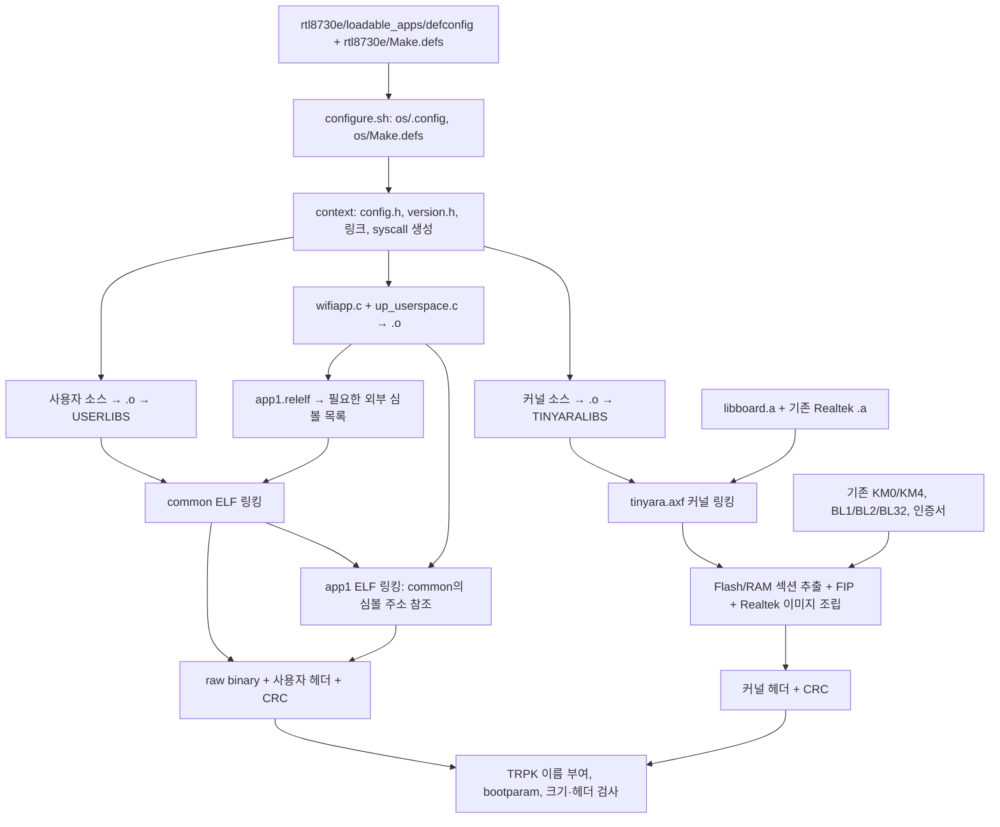
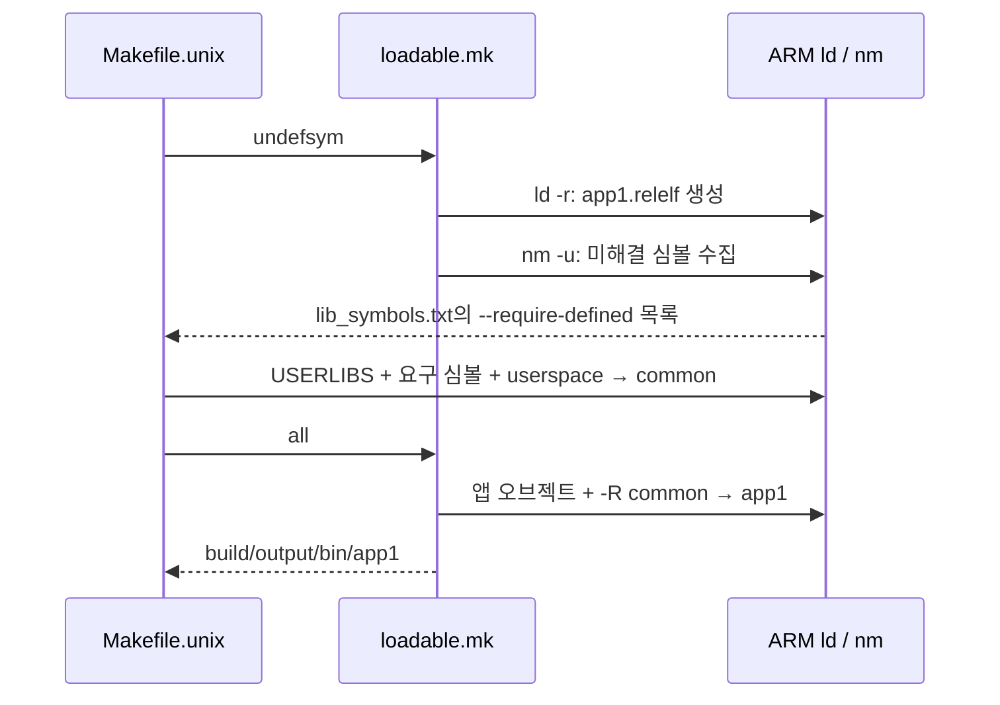
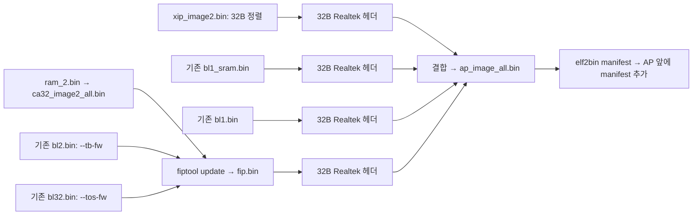

# RTL8730E `loadable_apps` 빌드 전체 과정

이 문서는 `rtl8730e/loadable_apps`를 선택했을 때 **어떤 설정이 어떤 소스를 컴파일하고, 어떤 라이브러리를 만들며, 어떤 링킹과 패키징을 거쳐 최종 파일이 되는지** 설명한다. 경로는 저장소 루트를 기준으로 표기한다. Makefile의 `TOPDIR`는 저장소 루트가 아니라 **`os/`**다.

분석 기준은 2026-09-08의 커밋 `29d2ed503c2915bd123ff020f5c76353aa19f34c`와 [기준 defconfig](../build/configs/rtl8730e/loadable_apps/defconfig)다. 기존 `os/.config`가 없는 상태에서 저장소의 원본 설정을 분석했다. 초기에는 원본 `mkldscript.py`를 임시 디렉터리에서 실행해 주소를 확인했고, 이후 실제 전체 빌드도 추가 수행했다. **1~15장은 소스에 따른 빌드 규칙 설명이고, 실제 실행 환경·결과·산출물 검증은 16장에 기록한다.** 보드 다운로드와 실기기 부팅은 수행하지 않았다.

## 목차

1. [먼저 이해할 전체 구조](#1-먼저-이해할-전체-구조)
2. [설정과 빌드 시작](#2-설정과-빌드-시작)
3. [컴파일 전 준비](#3-컴파일-전-준비)
4. [소스에서 오브젝트와 정적 라이브러리까지](#4-소스에서-오브젝트와-정적-라이브러리까지)
5. [실제로 만들어지는 라이브러리](#5-실제로-만들어지는-라이브러리)
6. [Pass 1: common과 app1 링킹](#6-pass-1-common과-app1-링킹)
7. [메모리와 링커 스크립트](#7-메모리와-링커-스크립트)
8. [Pass 2: 커널 링킹](#8-pass-2-커널-링킹)
9. [앱과 common의 패키징](#9-앱과-common의-패키징)
10. [Realtek 커널 이미지 조립](#10-realtek-커널-이미지-조립)
11. [TRPK, HEX, bootparam과 검증](#11-trpk-hex-bootparam과-검증)
12. [빌드 결과가 실행되는 방법](#12-빌드-결과가-실행되는-방법)
13. [무엇을 바꾸려면 어디를 고치는가](#13-무엇을-바꾸려면-어디를-고치는가)
14. [실제 빌드와 문제 추적 방법](#14-실제-빌드와-문제-추적-방법)
15. [자주 헷갈리는 부분](#15-자주-헷갈리는-부분)
16. [실제 빌드 실행과 산출물 검증](#16-실제-빌드-실행과-산출물-검증)

## 1. 먼저 이해할 전체 구조

이 설정에서는 다음 세 가지 실행 이미지를 분리한다.

| 이미지 | 내용 | 링크 직후 | 배포 패키지 |
|---|---|---|---|
| 커널 | 스케줄러, 드라이버, 네트워크, 파일시스템, 바이너리 관리자, syscall 처리 | `tinyara.axf` | `kernel_rtl8730e_200204.trpk` |
| 공통 사용자 이미지 | 사용자 libc, C++, 프레임워크, 외부 라이브러리, built-in 앱 중 링크에 필요한 코드 | `common` | `common_rtl8730e_200204.trpk` |
| 개별 사용자 앱 | `loadable_apps/loadable_sample/wifiapp`의 코드와 앱 userspace 정보 | `app1` | `app1_rtl8730e_190412.trpk` |

세 패키지는 모두 `build/output/bin/`에 놓인다. `CONFIG_NUM_APPS=1`이므로 `app2`는 만들지 않는다. `common`은 별도의 사용자 실행 이미지이지 `.a` 파일이나 Linux의 `.so`가 아니다. 개별 앱이 사용하는 공통 함수의 주소를 링크 시점에 제공한다.



위 그림은 데이터 의존성을 보여 준다. Makefile의 정확한 타깃 구조는 다음과 같다. `os/Makefile`이 Linux 계열에서 [Makefile.unix](../os/Makefile.unix)를 포함한다.

```text
all → memstat → build/output/bin/tinyara.axf
                     ├─ pass1deps → pass1dep + USERLIBS
                     ├─ pass2deps → pass2dep + TINYARALIBS
                     ├─ pass1     → common/app1 생성
                     ├─ pass2     → 커널 ELF 생성
                     └─ post      → 패키징과 검증
```

`romfs`도 `memstat`의 전제 타깃이지만 이 설정의 `CONFIG_FS_ROMFS`는 꺼져 있어 이미지 생성은 하지 않는다. `memstat`의 상세 보고서는 별도로 `MEMSTATS`가 설정된 경우 실행된다.

## 2. 설정과 빌드 시작

### 2.1 설정 파일은 세 층으로 나뉜다

| 층 | 파일 | 역할 |
|---|---|---|
| 설정 항목의 정의 | [os/Kconfig](../os/Kconfig), [보드 Kconfig](../os/board/rtl8730e/Kconfig), [binfmt Kconfig](../os/binfmt/Kconfig), 각 모듈의 `Kconfig` | 메뉴, 자료형, 기본값, 의존성, `select` 정의 |
| 보드·프로필의 선택값 | [loadable_apps/defconfig](../build/configs/rtl8730e/loadable_apps/defconfig) | 이 빌드에서 선택한 기능과 수치 |
| 실제 빌드 입력 | `os/.config`, `os/Make.defs` | Make와 생성 도구가 읽는 현재 설정 |

`tools/configure.sh rtl8730e/loadable_apps`를 `os/`에서 실행하면 [configure.sh](../os/tools/configure.sh)가 다음을 복사한다.

```text
build/configs/rtl8730e/loadable_apps/defconfig → os/.config
build/configs/rtl8730e/Make.defs               → os/Make.defs
os/tools/setenv.sh                            → os/setenv.sh
```

`loadable_apps` 디렉터리에 별도의 `Make.defs`가 있는 것이 아니다. **프로필의 부모 디렉터리인 `rtl8730e/Make.defs`를 공유한다.** 이후 `make menuconfig`는 `os/.config`를 변경한다. 원본 `defconfig`나 복사 원본 `Make.defs`를 고쳤다고 이미 복사된 빌드 입력이 자동으로 갱신되는 것은 아니다.

### 2.2 이 프로필의 핵심 값

| 설정 | 값 | 실제 의미 |
|---|---|---|
| `CONFIG_HOST_LINUX` | `y` | GNU/Linux 빌드 환경 전제 |
| `CONFIG_DOCKER_VERSION` | `"2.0.0"` | `dbuild.sh`가 사용할 TizenRT 이미지 태그 |
| `CONFIG_APP_BINARY_SEPARATION` | `y` | 커널과 사용자 앱 분리 |
| `CONFIG_BUILD_PROTECTED`, `CONFIG_BUILD_2PASS` | `y`, `y` | 보호 빌드 및 두 단계 빌드 |
| `CONFIG_SUPPORT_COMMON_BINARY` | `y` | 공통 사용자 라이브러리를 별도 바이너리로 링크 |
| `CONFIG_NUM_APPS`, `CONFIG_APP1_INFO` | `1`, `y` | 개별 앱 하나 |
| `CONFIG_XIP_ELF`, `CONFIG_ELF` | `y`, 미선택 | ELF로 링크하되 Flash 실행용 raw 이미지로 배포 |
| `CONFIG_XIP_ELF_WARCHIVE` | 미선택 | common에 모든 아카이브 멤버를 강제로 넣지 않음 |
| `CONFIG_ARCH_CHIP`, `CONFIG_ARCH_BOARD` | `amebasmart`, `rtl8730e` | 칩 코드와 보드 코드 선택 |
| `CONFIG_ARCH_CORTEXA32`, `CONFIG_ARM_THUMB` | `y`, `y` | CA32용 Thumb 명령어 생성 |
| `CONFIG_ARCH_USE_MMU`, `CONFIG_SMP` | `y`, 미선택 | MMU 사용, 이 프로필에서는 SMP 미사용 |
| `CONFIG_RAM_PSRAM`, `CONFIG_RAM_DDR` | `y`, 미선택 | PSRAM용 커널 링커 스크립트 선택 |
| `CONFIG_DEBUG_FULLOPT`, `CONFIG_DEBUG_SYMBOLS` | `y`, `y` | 이 도구 정의에서는 `-Os`와 `-g` 사용 |
| `CONFIG_HAVE_CXX`, `CONFIG_LIBCXX_EXCEPTION` | `y`, `y` | C++ 및 예외 처리 지원 |
| `CONFIG_RAW_BINARY`, `CONFIG_INTELHEX_BINARY` | `y`, `y` | 바이너리 패키지와 커널 HEX 생성 |
| `CONFIG_BINARY_SIGNING` | 미선택 | TizenRT 사용자·커널 서명 훅 비활성 |
| `CONFIG_USE_BP` | `y` | `bootparam.bin` 생성 |

`CONFIG_PASS1_TARGET="all"`, `CONFIG_PASS1_OBJECT=""`도 있지만, 이 보드의 핵심 사용자 빌드는 `Makefile.unix`의 common/XIP 분기로 직접 구현되어 있다. 빈 `PASS1_OBJECT` 때문에 사용자 전체가 커널의 추가 오브젝트로 들어가는 것도 아니다.

### 2.3 실행 환경

[dbuild.sh](../os/dbuild.sh)는 Docker 이미지 선택, 저장소를 `/root/tizenrt`로 마운트, 작업 디렉터리를 `/root/tizenrt/os`로 설정, 컨테이너 안에서 `make` 실행, `build.log` 저장을 맡는 래퍼다. 컴파일·링킹 자체의 규칙은 Makefile에 있다.

이 소스에는 Python 2 문법의 `mkbootparam.py`, Python 2의 문자열·바이너리 동작을 전제로 한 `mkchecksum.py` 등이 있고, 보드 스크립트는 `stat -c`, `du -b`, `uname -o` 같은 GNU 도구를 사용한다. 따라서 macOS의 기본 Python 3와 BSD 도구만으로 동일한 전체 빌드를 실행할 수 있다고 가정하면 안 된다. 설정에 지정된 Linux 빌드 환경을 기준으로 해석해야 한다. 정확한 GCC 버전은 defconfig의 도구 접두어만으로 확정할 수 없으며 실행 환경에서 `arm-none-eabi-gcc --version`으로 확인한다.

## 3. 컴파일 전 준비

### 3.1 `context`: 설정을 C 소스가 사용할 형태로 바꾸기

[Makefile.unix](../os/Makefile.unix)의 `context`는 다음을 준비한다.

| 결과 | 만드는 방법 | 용도 |
|---|---|---|
| `os/include/tinyara/config.h` | 호스트용 `tools/mkconfig`가 `.config` 변환 | C/C++의 `#ifdef CONFIG_...` |
| `os/.version`, `include/tinyara/version.h` | `version.sh`, 호스트용 `mkversion` | OS 버전 정보 |
| `include/math.h`, `include/stdarg.h` | 설정에 따라 헤더 복사 | 표준 헤더 진입점 |
| `include/arch` | `arch/arm/include`에 연결 | 선택된 아키텍처 헤더 |
| `include/arch/board`, `include/arch/chip` | 보드 include, `amebasmart` include에 연결 | 공통 경로로 보드·칩 접근 |
| `arch/arm/src/board`, `arch/arm/src/chip` | `board/rtl8730e/src`, `arch/arm/src/amebasmart`에 연결 | 아키텍처 Makefile의 보드·칩 선택 |
| syscall 프록시·스텁 C 파일 | `mksyscall` + `syscall.csv` | 사용자 호출과 커널 진입 연결 |
| built-in 앱 등록 정보 | 앱별 `context`, `REGISTER` 매크로 | 앱 이름·진입 함수 등록 |
| 힙 영역 정보 | `os/mm`의 context 및 `mk_heap_regioninfo.sh` | 커널 메모리 영역 설정 |

`mkconfig`, `mkversion`, `mkdeps`, `mksyscall`은 **빌드 PC에서 실행할 프로그램**이므로 [Makefile.host](../os/tools/Makefile.host)의 호스트 컴파일러로 만든다. ARM용 `gcc`로 만드는 펌웨어 코드와 구분해야 한다.

`context`는 기존 `tinyara.axf`가 있으면 출력 디렉터리 내용도 지우고 built-in 등록 파일을 재생성한다. 따라서 단순 조회 명령으로 취급해서 직접 실행하지 않는다.

### 3.2 `depend`: 헤더 변경과 재빌드 관계 만들기

`pass1dep`는 사용자 디렉터리, `pass2dep`는 커널 디렉터리에 `make depend`를 호출한다. 디렉터리 선택은 [Directories.mk](../os/Directories.mk)가 맡는다. 하위 Makefile은 `mkdeps`에 소스·컴파일 옵션·검색 경로를 전달해 `Make.dep` 등을 생성한다.

이 파일에는 예를 들어 `xxx.o`가 어떤 `.c`와 `.h`에 의존하는지가 기록된다. `VPATH`는 Make가 소스를 찾는 경로, `DEPPATH`는 의존성 도구가 소스를 찾는 경로, `-I`와 `-isystem`은 컴파일러가 헤더를 찾는 경로다. 이 셋은 서로 다른 역할이다.

## 4. 소스에서 오브젝트와 정적 라이브러리까지

### 4.1 컴파일 도구와 옵션은 어디에서 정해지는가

[보드 Make.defs](../build/configs/rtl8730e/Make.defs)는 `.config`, [Config.mk](../os/tools/Config.mk), [ARMv7-A Toolchain.defs](../os/arch/arm/src/armv7-a/Toolchain.defs)를 읽는다. 이후 보드 자체 정의로 일부 변수를 다시 설정한다. 따라서 Toolchain.defs의 중간 값만 보고 최종 옵션을 판단하면 안 된다.

| 변수 | 이 설정의 도구/핵심 옵션 | 역할 |
|---|---|---|
| `CROSSDEV` | 기본 `arm-none-eabi-` | 크로스 도구 접두어 |
| `CC`, `CXX` | `arm-none-eabi-gcc`, `arm-none-eabi-g++` | C/C++ 컴파일 |
| `CPP` | `arm-none-eabi-gcc -E` | 전처리 |
| `LD` | `arm-none-eabi-ld` | 직접 링커 호출 |
| `AR` | `arm-none-eabi-ar rcs` | 아카이브 생성/갱신 및 심볼 인덱스 |
| `NM`, `OBJCOPY`, `OBJDUMP` | 대응하는 ARM binutils | 심볼, 포맷 변환, 역어셈블 |
| `ARCHCPUFLAGS` | `-mthumb -mcpu=cortex-a32 -mfloat-abi=hard -mfpu=neon-vfpv4` | CPU·명령어·부동소수점 ABI |
| 최적화/디버그 | `-Os -g`, strict aliasing 비활성 등 | 크기 최적화와 디버그 정보 병행 |
| C/C++ 섹션 | `-ffunction-sections -fdata-sections` | 함수·데이터별 입력 섹션 생성 |
| 앱 `CELFFLAGS` | `CFLAGS`에 `-mlong-calls` 추가 | 멀리 떨어진 common 함수 호출 지원 |
| 커널 `LDFLAGS` | `-nostdlib --gc-sections`, 보드 `-T` 등 | 기본 라이브러리 자동 사용 억제, 사용하지 않는 섹션 제거, 주소 배치 |

C++는 이 설정에서 `-std=c++11`, RTTI, 예외 처리를 사용한다. 보드 Make.defs가 `ARCHCXXFLAGS`를 재정의하므로 Toolchain.defs에 등장하는 `-fno-rtti` 등을 그대로 최종 동작으로 설명해서는 안 된다.

### 4.2 실제 컴파일 명령의 형태

다음은 [Config.mk](../os/tools/Config.mk)의 매크로를 이해하기 위한 축약 명령이다. 디렉터리별 include와 define은 생략했다.

```sh
# COMPILE: 전처리 → C 컴파일 → 어셈블을 gcc -c 안에서 수행
arm-none-eabi-gcc -c <CFLAGS> source.c -o source.o

# COMPILEXX
arm-none-eabi-g++ -c <CXXFLAGS> source.cpp -o source.o

# ASSEMBLE: .S도 gcc로 전처리한 뒤 어셈블
arm-none-eabi-gcc -c <CFLAGS> -D__ASSEMBLY__ startup.S -o startup.o

# ARCHIVE: 여러 오브젝트를 하나의 정적 라이브러리로 보관
flock /tmp/ar.lock arm-none-eabi-ar rcs libxxx.a a.o b.o
```

일반 빌드에서 `.i`, `.s` 중간 파일을 반드시 디스크에 남기는 것은 아니다. 결과 `.o`에는 기계어, 데이터, 심볼, 아직 주소가 확정되지 않은 참조의 재배치 정보가 들어간다.

`ar`는 최종 주소를 결정하지 않는다. `.a`는 `.o`들의 묶음이며 실행 파일이 아니다. 라이브러리 안의 어떤 오브젝트를 실제 이미지에 포함할지, 외부 함수 주소를 어디로 연결할지, 섹션을 어느 메모리에 놓을지는 이후 `ld`가 결정한다. 현재 `ARCHIVE` 매크로의 `flock /tmp/ar.lock`은 병렬 작업이 같은 아카이브를 동시에 갱신하는 것을 막는다.

### 4.3 소스 파일 선택과 kernel/user 구분

하위 `Make.defs`는 `CONFIG_...`에 따라 `CSRCS`, `CXXSRCS`, `ASRCS`를 추가한다. 상위 Makefile이 이들을 `.o` 목록으로 바꿔 컴파일한다.

예를 들어 [os/kernel/Makefile](../os/kernel/Makefile)은 `sched/Make.defs`, `task/Make.defs`, `binary_manager/Make.defs` 등을 포함하여 `libkernel.a`를 만든다. [framework/Makefile](../framework/Makefile)은 `src/*/Make.defs`를 읽어 `libframework.a`를 만든다.

[LibTargets.mk](../os/LibTargets.mk)는 커널 빌드에 보통 `KERNEL=y EXTRADEFINES=-D__KERNEL__`, 사용자 빌드에 `KERNEL=n`을 전달한다. 일부 특수 타깃은 예외가 있으며 `libstubs` 호출에는 `KERNEL=y` 전달이 주석 처리되어 있다. 따라서 라이브러리의 최종 링크 위치와 모든 소스의 `__KERNEL__` 정의 여부를 동일시하면 안 된다.

libc·메모리 관리자·work queue처럼 양쪽에 필요한 코드는 `kbin/`, `ubin/`의 별도 오브젝트로 만들어진다. 예를 들어 `lib/libc/kbin/*.o → libkc.a`, `lib/libc/ubin/*.o → libuc.a`다. 같은 소스라도 전처리 분기와 호출 경로가 달라질 수 있다.

## 5. 실제로 만들어지는 라이브러리

라이브러리의 **선택 목록**은 [ProtectedLibs.mk](../os/ProtectedLibs.mk), **빌드 및 복사 규칙**은 [LibTargets.mk](../os/LibTargets.mk)에 있다. 대부분 소유 디렉터리에서 `.a`를 만든 뒤 `build/output/libraries/`로 `install`한다. 여기서 `install`은 보드 플래싱이 아니라 파일 복사다.

### 5.1 커널에 링크하는 `TINYARALIBS`

| 라이브러리 | 소유 디렉터리 | 내용/선택 이유 |
|---|---|---|
| `libkernel.a` | `os/kernel` | 스케줄러, 태스크, IPC, 타이머, 바이너리 관리자 등 |
| `libstubs.a` | `os/syscall` | syscall 디스패치와 커널 함수 연결 |
| `libkc.a` | `lib/libc` | 커널용 C 라이브러리 |
| `libkmm.a` | `os/mm` | 커널용 메모리 관리 |
| `libkarch.a` | `os/arch/arm/src` | ARM 공통·CA32·AmebaSmart 아키텍처 코드 |
| `libkwque.a` | `os/wqueue` | 커널 work queue |
| `libnet.a` | `os/net` | 네트워크 및 선택된 lwIP 경로 |
| `libse.a` | `os/se` | 보안 요소 지원: `CONFIG_SE=y` |
| `libcompression.a` | `os/compression` | `CONFIG_COMPRESSED_BINARY=y`에 따라 링크 목록에 추가 |
| `libpm.a` | `os/pm` | 전원 관리 |
| `libfs.a` | `os/fs` | VFS, SmartFS, procfs 등 |
| `libdrivers.a` | `os/drivers` | 장치 드라이버 계층 |
| `libbinfmt.a` | `os/binfmt` | 바이너리 로더, 이 설정의 XIP 로더 |

이 설정에서는 `libaudio.a`, `libcrypto.a`는 해당 기능이 꺼져 있어 이 목록에 추가되지 않는다. 보안 기능이 켜져 있다는 이유로 `CONFIG_CRYPTO`까지 켜진 것은 아니다.

### 5.2 common에 사용할 `USERLIBS`

| 라이브러리 | 소유 디렉터리 | 내용 |
|---|---|---|
| `libproxies.a` | `os/syscall` | 사용자 API에서 syscall을 호출하는 프록시 |
| `libuc.a` | `lib/libc` | 사용자용 libc 및 선택된 수학 함수 |
| `libumm.a` | `os/mm` | 사용자 메모리 관리 |
| `libuarch.a` | `os/arch/arm/src` | 사용자용 아키텍처 지원 |
| `libuwque.a` | `os/wqueue` | 사용자 work queue |
| `libframework.a` | `framework` | Wi-Fi/BLE manager, security API 등 선택된 프레임워크 |
| `libcxx.a` | `lib/libxx`, `external/libcxx` | C++ 지원 코드와 LLVM libc++ 구현 |
| `libexternal.a` | `external` | 설정된 외부 모듈의 오브젝트 |
| `libiotivity.a` | `external/iotivity` | 활성화된 IoTivity 구현 |
| `libapps.a` | `apps` | built-in 예제, 셸, 시스템 기능 |

[external/Makefile](../external/Makefile)은 하위 `Make.defs`로 직접 소스 목록 또는 재귀 빌드 디렉터리를 모은다. 따라서 외부 패키지 하나당 반드시 별도 최종 `.a`가 생기는 것은 아니다.

현재 [IoTivity Makefile](../external/iotivity/Makefile)은 `iotivity_1.2-rel`의 소스를 직접 열거하여 컴파일하고 `libiotivity.a`를 만든다. `configure.sh`에 SCons 설치 안내가 남아 있어도 이 Makefile의 실제 호출은 일반 Make/GCC 경로다.

### 5.3 보드 및 사전 빌드 라이브러리

[보드 Makefile](../os/board/rtl8730e/src/Makefile)은 Realtek의 peripheral/core, Wi-Fi API, Bluetooth, OS 포팅, FTL/KV/VFS 등 `component/.../Make.defs`를 포함하여 **`os/board/rtl8730e/src/libboard.a`**를 만든다. 이 파일은 일반 라이브러리 복사 목록과 별도로 최종 커널 링커가 보드 경로에서 `-lboard`로 찾는다.

[amebasmart/Make.defs](../os/arch/arm/src/amebasmart/Make.defs)는 이 설정에서 다음 기존 아카이브도 커널 링크에 추가한다.

```text
os/board/rtl8730e/src/libs/lib_btgap.a
os/board/rtl8730e/src/libs/lib_wpa_lite.a
os/board/rtl8730e/src/libs/lib_wifi_common.a
```

이 세 파일을 이 빌드 경로가 다시 소스부터 생성하는 것은 아니다. 입력으로 사용하는 사전 빌드 라이브러리다. 도구 체인이 제공하는 `libgcc.a`와 예외 지원용 `libsupc++.a`도 기존 입력이며 GCC의 `-print-libgcc-file-name`, `--print-file-name=libsupc++.a`로 위치를 찾는다. 일반 커널 링크의 `EXTRA_LIBS`와 common/app 링크 규칙에서 각기 참조한다.

## 6. Pass 1: common과 app1 링킹

### 6.1 `app1`의 실제 소스는 hello가 아니라 wifiapp

[loadable_apps/Makefile](../loadable_apps/Makefile)은 하위 `Make.defs`의 `CONFIGURED` 목록을 순회한다. `CONFIG_EXAMPLES_LOADABLE=y`이면 sample의 Make.defs가 포함되고, `wifiapp`이 선택된다. `micomapp`은 `CONFIG_NUM_APPS > 1`일 때만 선택되므로 이번에는 제외된다.

[wifiapp/Makefile](../loadable_apps/loadable_sample/wifiapp/Makefile)의 기본 소스는 `wifiapp.c`, 출력 이름은 `CONFIG_APP1_BIN_NAME`, 즉 `app1`이다. 추가 메시징·복구·업데이트 테스트 소스는 각각의 설정이 켜질 때 추가된다. 이번 기본 프로필에서는 기본 `wifiapp.c`가 대상이다.

한편 `CONFIG_USER_ENTRYPOINT="hello_main"`과 `CONFIG_EXAMPLES_HELLO=y`는 일반 `apps` 쪽 설정이다. [hello Makefile](../apps/examples/hello/Makefile)은 `hello_main.o`를 `libapps.a`에 넣고 built-in 등록 정보를 만든다. 이 설정을 보고 개별 파일 `app1`의 ELF entry가 `hello_main`이라고 해석하면 안 된다.

### 6.2 common보다 먼저 앱의 미해결 심볼을 수집한다

핵심은 [loadable.mk](../loadable_apps/loadable.mk)와 `Makefile.unix`의 `pass1`이다. 실제 순서는 다음과 같다.

1. `USERLIBS`를 준비한다.
2. `mkldscript.py`로 `common_0.ld`, `common_1.ld`, `app1_0.ld`, `app1_1.ld`를 생성한다.
3. `userspace/up_userspace.c`를 `-D__COMMON_BINARY__`로 컴파일하여 `up_userspace_common.o`를 만든다. 소스 파일 이름은 `up_userspace_common.c`가 아니다.
4. 앱 소스와 `up_userspace.o`를 컴파일하고 `undefsym` 타깃을 수행한다.
5. 수집한 심볼 요구 목록으로 `common`을 링크한다.
6. 완성된 `common`을 참조하여 `app1`을 다시 최종 링크하고 출력 디렉터리로 복사한다.



아래 명령은 핵심 인수만 남긴 형태다.

```sh
# 1. 아직 common이 없으므로 재배치 가능한 중간 ELF를 만든다.
arm-none-eabi-ld -r -e main -T os/userspace/userspace_apps.ld \
  -Bstatic -o build/output/bin/app1.relelf \
  wifiapp.o up_userspace.o --start-group <libgcc.a> --end-group

# 2. 예: U printf → --require-defined printf
arm-none-eabi-nm -u build/output/bin/app1.relelf

# 3. 앱이 필요한 함수들과 common userspace 구조체의 참조를 해결한다.
arm-none-eabi-ld -o build/output/bin/common \
  -T build/output/bin/common_0.ld \
  -T build/configs/rtl8730e/scripts/xipelf/userspace_all.ld \
  os/userspace/up_userspace_common.o \
  --start-group <USERLIBS> <libgcc.a> <libsupc++.a> --end-group \
  <lib_symbols.txt의 --require-defined 목록> \
  -Map build/output/bin/common.map

# 4. common의 코드를 복사하지 않고 심볼 주소를 받아 앱을 링크한다.
arm-none-eabi-ld -e main -o app1 \
  -T build/output/bin/app1_0.ld \
  -T build/configs/rtl8730e/scripts/xipelf/userspace_all.ld \
  wifiapp.o up_userspace.o \
  --start-group <libgcc.a> <libsupc++.a> --end-group \
  -R build/output/bin/common
```

`-r`은 최종 실행 주소를 확정하지 않는 부분 링크다. 반대로 XIP의 최종 `common` 및 `app1` 링크에는 `-r`을 사용하지 않는다. `-R common`은 이 GNU ld 호출에서 **common 파일의 심볼 주소만 읽는 옵션**이다. 공유 라이브러리 검색용 runtime path가 아니다.

`--start-group/--end-group`은 아카이브 사이의 상호 참조를 해결하기 위해 반복 검색한다. `--require-defined`는 아직 직접 포함되지 않은 라이브러리 멤버도 해당 심볼 정의를 제공하도록 요구한다. `CONFIG_XIP_ELF_WARCHIVE`가 꺼져 있으므로 기본 common 링크는 `--whole-archive` 경로가 아니다.

`--gc-sections`는 커널 링크의 `LDFLAGS`에 있지만, 여기의 XIP 직접 링크 명령은 그 변수를 사용하지 않는다. 따라서 common은 **필요한 아카이브 멤버를 뽑는 것**과 **멤버 내부의 미사용 섹션까지 제거하는 것**을 구분해서 이해해야 한다. `-ffunction-sections`만으로 모든 미사용 함수가 사라지는 것은 아니다.

## 7. 메모리와 링커 스크립트

### 7.1 링커 스크립트의 두 역할

`MEMORY`는 사용할 메모리의 시작 주소와 용량을, `SECTIONS`는 `.text`, `.data`, `.bss`를 어디에 놓을지 정의한다.

| 대상 | 주소·용량 정의 | 섹션 배치 정의 |
|---|---|---|
| 커널 | [rlx8730e_img2.ld](../build/configs/rtl8730e/scripts/rlx8730e_img2.ld)의 `MEMORY` | 같은 파일의 `SECTIONS` |
| common | 생성되는 `common_0.ld` | [xipelf/userspace_all.ld](../build/configs/rtl8730e/scripts/xipelf/userspace_all.ld) |
| app1 | 생성되는 `app1_0.ld` | 같은 `userspace_all.ld` |
| 앱 부분 링크 | [userspace_apps.ld](../os/userspace/userspace_apps.ld) | 아직 최종 Flash 주소를 확정하지 않는 용도 |

`CONFIG_RAM_DDR=y`일 때만 커널이 `rlx8730e_img2_ddr.ld`로 바뀐다. 이번에는 PSRAM용 `rlx8730e_img2.ld`가 선택된다.

### 7.2 앱의 Flash와 RAM 배치

사용자 스크립트의 중요한 규칙은 다음과 같다.

```text
uflash:
  .text 시작
    LONG(0)                  ← 4바이트 자리
    KEEP(*(.userspace))       ← 로더가 읽을 시작·끝 주소와 entry 정보
    실제 코드
  .ARM.extab / .ARM.exidx     ← C++ 예외 처리
  .rodata                    ← 읽기 전용 데이터
  .ctors / .dtors            ← 생성자·소멸자 테이블
  .data의 초기값             ← Flash에 저장할 원본

usram:
  .data                      ← 실행 중 수정되는 데이터
  .bss                       ← 로딩 시 0으로 초기화
  32바이트 정렬 후 heap
```

`.data > usram AT > uflash`가 핵심이다. 실행 시 주소인 **VMA**는 RAM, 저장 이미지에 초기값을 담는 주소인 **LMA**는 Flash다. `.bss`는 크기는 차지하지만 초기값을 모두 파일에 저장하지 않는다.

### 7.3 이번 설정의 RAM 주소

[mkldscript.py](../os/tools/mkldscript.py)는 `CONFIG_RAM_START + CONFIG_RAM_SIZE`에서 아래로 common과 app1의 RAM을 배정한다.

```text
CONFIG_RAM_START = 0x60100000
CONFIG_RAM_SIZE  = 0x00700000 = 7 MiB
RAM 끝          = 0x60800000

0x60100000 ┌─────────────────────────────────────┐
           │ 커널 코드·데이터·스택·힙 측 영역    │
0x60280000 ├─────────────────────────────────────┤
           │ app1 usram: 0x500000 = 5 MiB        │
0x60780000 ├─────────────────────────────────────┤
           │ common usram: 0x70000 = 448 KiB     │
0x607F0000 ├─────────────────────────────────────┤
           │ 페이지 테이블 예약: 0x10000        │
0x60800000 └─────────────────────────────────────┘
```

common 예약값은 `CONFIG_COMMON_BIN_STATIC_RAMSIZE=524288` 즉 512 KiB이지만, 생성기가 끝의 64 KiB를 빼므로 `usram LENGTH`는 448 KiB다. `CONFIG_APP1_BIN_DYN_RAMSIZE=5242880`은 이름과 달리 이 XIP 스크립트에서는 app1의 **전체 usram 길이**로 사용된다. 실제 앱 heap은 그 안에서 `.data`, `.bss`와 관리 구조 등을 제외한 나머지다.

커널 링커 스크립트의 CA32 RAM 영역 자체는 7 MiB로 선언되어 있다. 위 그림의 커널 측 1.5 MiB를 모두 자유로운 heap이라고 해석하면 안 된다. 보드 초기화의 [ameba_app_start.c](../os/board/rtl8730e/src/component/soc/amebad2/fwlib/ap_core/ameba_app_start.c)에서 `APP_RAM_SIZE`, `ALL_PGTABLE_SIZE`를 빼서 실제 커널 heap 영역을 정한다. 커널 정적 섹션이 커질 때는 최종 map과 사용자 예약 주소도 함께 확인해야 한다.

### 7.4 물리 Flash 파티션

defconfig의 `CONFIG_FLASH_PART_SIZE/TYPE/NAME`은 같은 순서의 병렬 목록이며 크기는 KiB 단위다. 아래 주소의 끝은 포함하지 않는다.

| 이름 | 크기 KiB | Flash 장치 내 offset | `0x08000000` 기준 시작 주소 |
|---|---:|---|---|
| bl1 | 60 | `0x000000` | `0x08000000` |
| reserved | 40 | `0x00F000` | `0x0800F000` |
| ftl | 12 | `0x019000` | `0x08019000` |
| ss | 400 | `0x01C000` | `0x0801C000` |
| kernel slot 0 | 1844 | `0x080000` | `0x08080000` |
| common slot 0 | 3040 | `0x24D000` | `0x0824D000` |
| app1 slot 0 | 1384 | `0x545000` | `0x08545000` |
| kernel slot 1 | 1844 | `0x69F000` | `0x0869F000` |
| common slot 1 | 3040 | `0x86C000` | `0x0886C000` |
| app1 slot 1 | 1384 | `0xB64000` | `0x08B64000` |
| userfs | 2048 | `0xCBE000` | `0x08CBE000` |
| micom | 1280 | `0xEBE000` | `0x08EBE000` |
| bootparam | 8 | `0xFFE000` | `0x08FFE000` |

합계는 `0x1000000`, 즉 16 MiB다. 파티션 이름 `micom`이 있다고 `micomapp` 실행 바이너리를 빌드하는 것은 아니다. 파티션 배치와 앱 선택은 별개 설정이다.

### 7.5 XIP 링크 주소는 물리 파티션 주소와 다르다

CA32는 재매핑된 Flash 주소를 사용한다. `mkldscript.py`는 RTL8730E에 대해 [loadable_xip_elf.py](../build/tools/amebasmart/gnu_utility/loadable_xip_elf.py)의 `get_offset()`을 호출한다.

```text
shift = align_up(size(km0_km4_app.bin), 4096) + 4096
      = align_up(434720, 4096) + 4096
      = 0x6C000

초기 offset = CONFIG_FLASH_VSTART_LOADABLE - shift
            = 0x0E000000 - 0x6C000
            = 0x0DF94000
```

이 값에서 생성기는 `kernel/common/app1/app2` 파티션의 크기를 누적하고, 각 사용자 헤더 공간을 더한다. `bl1/reserved/ftl/ss` 등은 이 누적에서 건너뛴다. 물리 Flash의 모든 파티션 크기를 무조건 더하는 계산이 아니다.

원본 생성기를 격리 실행한 결과는 다음과 같다. `km0_km4_app.bin` 크기가 바뀌면 다시 계산해야 한다.

| 생성 파일 | `uflash ORIGIN` | `uflash LENGTH` | `usram ORIGIN` | `usram LENGTH` |
|---|---|---|---|---|
| `common_0.ld` | `0x0E161010` | `0x2F7FF0` | `0x60780000` | `0x70000` |
| `app1_0.ld` | `0x0E459030` | `0x159FD0` | `0x60280000` | `0x500000` |
| `common_1.ld` | `0x0E780010` | `0x2F7FF0` | `0x60780000` | `0x70000` |
| `app1_1.ld` | `0x0EA78030` | `0x159FD0` | `0x60280000` | `0x500000` |

common은 `0x10`, app1은 `0x30`바이트를 CRC와 헤더 공간으로 건너뛴다. 기본 최종 링크는 **`_0.ld`만 사용한다.** `_1.ld`가 생성된다는 사실만으로 slot 1용 실행 파일도 따로 링크한다고 볼 수 없다. 실제 슬롯 사용과 Flash 재매핑은 부팅·업데이트 경로의 책임이다.

## 8. Pass 2: 커널 링킹

`Makefile.unix`의 `pass2`는 [arch/arm/src/Makefile](../os/arch/arm/src/Makefile)을 호출하며 `LINKLIBS`, 출력 경로, `EXTRA_OBJS`, 커널 define을 전달한다.

이 Makefile은 `chip/Make.defs`, 즉 AmebaSmart 정의로 ARM 공통·ARMv7-A·칩 소스를 선택한다. 이번 설정의 직접 시작 오브젝트 목록은 `arm_vectortab.o`, `smccc_call.o`이며, 다른 시작 코드도 아키텍처 아카이브를 통해 연결된다. 보드 `libboard.a`도 이 단계의 전제 타깃이다.

```sh
# 실제 규칙의 핵심 구조. 라이브러리 전체 경로와 반복 인수는 축약했다.
arm-none-eabi-ld --entry=__start \
  <LDFLAGS 및 -T rlx8730e_img2.ld> \
  -L build/output/libraries -L os/board/rtl8730e/src \
  -o build/output/bin/tinyara.axf \
  arm_vectortab.o smccc_call.o <EXTRA_OBJS> \
  --start-group <TINYARALIBS의 -l 목록> -lboard \
    <Realtek 사전 빌드 라이브러리 및 도구 체인 라이브러리> \
  --end-group -Map build/output/bin/tinyara.map
```

스크립트에는 `ENTRY(_vector_start)`도 있지만 명령행의 `--entry=__start`가 ELF entry 지정에 우선한다. 실제 부팅은 아래의 보드 패키지·부트 체인을 통해 이루어지므로 ELF entry 하나로 전체 부팅 순서를 설명할 수는 없다.

### 커널 섹션 배치

| 출력 섹션 | 위치 | 주요 내용 |
|---|---|---|
| `.xip_image2.text` | `0x0E000020`부터 Flash 가상 영역 | 일반 코드, rodata, 일부 등록 테이블 |
| `.code` | `0x60100000`부터 CA32 RAM 영역 | 벡터, 시작 코드, 시간 민감 코드, MMU·일부 동기화 코드 |
| `.ARM.extab`, `.ARM.exidx`, ctor/dtor/array | Flash | 예외 처리와 초기화 테이블 |
| `.data` | CA32 RAM | 초기값이 있는 쓰기 가능 데이터 |
| `.bss`, `.heap`, `.stack` 등 | CA32 RAM, `NOLOAD` 영역 포함 | 초기화·예약할 RAM |
| `.bluetooth_trace.text` | 별도 BTRACE 영역 | Bluetooth trace 데이터 |

링크가 끝나면 `tinyara.axf`는 ELF 파일이다. `tinyara.map`은 `ld -Map`의 결과이며 라이브러리 멤버·입력 섹션·주소 추적에 사용한다. `System.map`은 `nm` 출력에서 일부 심볼을 걸러 정렬한 목록이다. 둘은 같은 종류의 map 파일이 아니다.

`CONFIG_RAW_BINARY=y`로 일반 `objcopy -O binary tinyara.axf tinyara.axf.bin`도 실행하지만, 보드 후처리가 이 큰 중간 파일을 나중에 삭제한다. Flash·RAM·trace처럼 떨어진 주소 공간을 가진 ELF를 단순 평탄화한 결과 대신, 아래처럼 필요한 섹션을 나누어 패키징한다.

## 9. 앱과 common의 패키징

`post`의 XIP용 `PREPARE_APP`은 `app1`, 이후 `common`에 대해 다음을 수행한다.

```text
링크된 app1 ELF
  ├─ 복사 → app1_dbg                 [디버그 ELF 보존]
  └─ objcopy -O binary → app1.bin    [Flash 저장 payload]
       └─ app1 이름으로 복사
            └─ mkbinheader.py        [TizenRT 사용자 헤더 추가]
                 └─ mkchecksum.py   [CRC32를 맨 앞에 추가]
                      └─ user/app1 복사
```

common도 동일하며 `common_dbg`, `common.bin`, `user/common`을 만든다. `mkbinheader.py`는 변환 전 payload를 `app1_without_header`, `common_without_header`로도 보존한다. 최종 `app1`과 `common`은 이름이 링크 직후와 같지만 **더 이상 ELF가 아니다.** 심볼 확인에는 `_dbg` 파일을 사용해야 한다.

### 9.1 헤더 구조

[mkbinheader.py](../os/tools/mkbinheader.py)와 [mkchecksum.py](../os/tools/mkchecksum.py)의 처리 순서를 합치면 다음과 같다.

```text
app1:  [CRC32 4B][user header 44B][XIP payload]
common:[CRC32 4B][common header 12B][XIP payload]
kernel:[CRC32 4B][kernel header 12B][Realtek 복합 payload]
```

| user header 필드 | 의미 |
|---|---|
| header size, binary type | 헤더 크기, `ELF=1` 형식 식별자 |
| main priority, loading priority | `180`, `LOW → 1` |
| binary size, name, version | payload 크기, `app1`, `190412` |
| binary RAM size | 스크립트가 ELF 섹션 크기와 설정으로 계산한 값 |
| main stack size | `8192` |
| kernel version | `200204` |
| padding | XIP에서 4바이트 정렬을 위한 3바이트 |

common은 header size, version `200204`, payload size, 2바이트 padding을 담는다. 커널은 header size, version, payload size, secure header size 필드를 담으며 보드에서 secure header size를 `32`로 전달한다. 이 필드가 있다는 이유로 여기서 실제 제품 서명 32바이트를 새로 생성한다고 해석하면 안 된다.

앱 헤더의 RAM size 계산은 현재 공통 스크립트가 `_dbg` ELF의 `.text/.rodata/.data/.bss`를 읽고 설정의 dynamic RAM을 더한 뒤 2의 거듭제곱으로 올리는 경로다. 이것은 7장에서 확인한 XIP의 `usram LENGTH`와 다른 계산이다. 실행 시 XIP 로더가 사용하는 RAM 경계는 userspace 구조체의 링크 심볼에서 얻는다. 헤더 수치와 실제 heap 크기를 같은 것으로 보지 않는다.

### 9.2 압축과 검증의 실제 분기

`CONFIG_COMPRESSED_BINARY=y`, `CONFIG_COMPRESSION_TYPE=2`, block size `16384`이므로 압축 도구 준비와 커널 압축 라이브러리 선택은 활성화된다. 그러나 **XIP용 `PREPARE_APP`에는 `COMPRESS_BIN` 호출이 없다.** 압축 호출은 별도의 `CONFIG_ELF=y`용 매크로에 있다. 이 프로필의 앱·common이 압축된다고 설명하면 잘못이다.

common을 사용할 때 `VERIFY_APP(app1, ...)` 호출은 생략되고 common에 대해 실행한다. 이 검증은 `nm -u`로 미해결 심볼을 검사하고 MMU 설정이면 `mkverifyappsize.py`로 L2 테이블 수를 추정한다. common에 대해서는 dynamic RAM 인수가 `0`이다. XIP 추정 코드에는 필요한 L2 수를 `min(4, ...)`로 제한하는 로직도 있다. 따라서 이 검사 통과만으로 app1의 모든 메모리 배치·런타임 접근이 검증되었다고 볼 수 없다.

## 10. Realtek 커널 이미지 조립

이 단계의 진입점은 [rtl8730e_make_bin.sh](../build/configs/rtl8730e/rtl8730e_make_bin.sh)다. 사용자 `app1/common` 파일을 이 커널 payload 안에 합치는 것이 아니라, **CA32 커널과 KM0/KM4·부팅 관련 이미지**를 조립한다.

### 10.1 커널 ELF에서 필요한 부분 추출

| 입력/명령 | 결과 | 목적 |
|---|---|---|
| `tinyara.axf` 복사 | `target_img2.axf` | 보드 도구가 사용할 ELF |
| `nm` 및 정렬 | `target_img2.map` | 보드 헤더에 넣을 심볼 주소 검색 |
| `objdump -d` | `target_img2.asm` | 역어셈블 결과 |
| 복사 후 `strip` | `target_pure_img2.axf` | 추출용 ELF |
| `objcopy -j .code -j .data -O binary` | `ram_2.bin` | RAM에 적재할 커널 코드·초기 데이터 |
| `.xip_image2.text`, 예외·생성자 관련 섹션 추출 | `xip_image2.bin` | Flash에 남겨 실행할 부분 |
| `.bluetooth_trace.text` 추출 | `APP.trace` | Bluetooth 분석용 데이터 |
| `ram_2.bin` 내용 복사 | `ca32_image2_all.bin` | FIP의 non-trusted firmware 입력 |

`code_analyze.py`와 `size`도 이 단계에서 분석 출력을 만든다. `target_img2.map`은 `nm` 목록이므로 앞의 `tinyara.map` 링커 보고서와 구분한다.

### 10.2 FIP와 AP 이미지 생성



`fiptool update`는 `bl2.bin`을 `--tb-fw`, `bl32.bin`을 `--tos-fw`, 방금 만든 CA32 RAM 이미지를 `--nt-fw`로 등록한다. FIP는 여러 펌웨어 구성 요소를 담는 컨테이너다.

[prepend_header.sh](../build/tools/amebasmart/gnu_utility/prepend_header.sh)는 이미지마다 32바이트 Realtek 헤더를 붙인다. 이미지 식별값, 길이, 적재 주소, 예약 필드가 들어간다. 적재 주소는 `target_img2.map`의 `__flash_text_start__`, `__ca32_bl1_sram_start__`, `__ca32_bl1_dram_start__`, `__ca32_fip_dram_start__`에서 구한다.

[imagetool_hp.sh](../build/tools/amebasmart/gnu_utility/imagetool_hp.sh)는 이번 입력 `ap_image_all.bin`에 대해 `elf2bin manifest`를 실행한다. 도구의 입력은 같은 디렉터리의 `manifest_ca32.json`, `key_ca32.json`이고, 만든 manifest를 AP 이미지 앞에 붙인다. 이 Realtek 도구 작업과 TizenRT의 `CONFIG_BINARY_SIGNING` 훅은 별개다. 비공개 제품 서명 체인이 완성되었다는 의미는 아니다.

### 10.3 기존 KM0/KM4 이미지와 결합

서명 비활성 경로의 실제 조립은 다음과 같다.

```text
기존 km0_km4_app.bin 복사
  → 임시 파일에서 앞 4096바이트 제거(rmcert.sh)
  → 4096바이트 경계로 0xFF padding(pad.sh)

기존 cert.bin
  + 위 임시 KM0/KM4 이미지
  + manifest가 붙은 ap_image_all.bin
  = km0_km4_ap_image_all.bin
```

입력은 `build/tools/amebasmart/gnu_utility/`의 `km0_km4_app.bin`, `cert.bin`, `bl1_sram.bin`, `bl1.bin`, `bl2.bin`, `bl32.bin` 등이다. 이 Make 경로가 이들 펌웨어 전체를 소스부터 다시 컴파일하는 것은 아니다.

또한 `build/tools/amebasmart/bootloader/km4_boot_all.bin`과 `flashloader/`의 `flash_loader_ram_1.bin`, `target_FPGA.axf`를 출력 폴더로 복사한다. 이 파일들은 이번 CA32 커널 링크의 결과가 아니다.

마지막에 중간 `tinyara.axf.bin`을 삭제한다. [rtl8730e_signing.sh](../build/configs/rtl8730e/rtl8730e_signing.sh)는 현재 공개 트리에서 kernel/user 모두 미지원 안내만 출력한다. 이 기준 설정에서는 호출도 비활성이다.

## 11. TRPK, HEX, bootparam과 검증

### 11.1 커널 헤더와 배포 이름

[board_metadata.txt](../build/configs/rtl8730e/board_metadata.txt)는 `KERNEL="km0_km4_ap_image_all"`, `BL1="km4_boot_all"`, `BOOTPARAM="bootparam"`을 정의한다.

[mksamsungheader.py](../os/tools/mksamsungheader.py)는 이 metadata로 커널 입력을 찾아 `mkbinheader.py`와 `mkchecksum.py`를 호출한다. 따라서 `km0_km4_ap_image_all.bin`은 이 단계 이후 CRC와 TizenRT 헤더를 포함한 파일로 바뀐다. 원래 Realtek payload는 `km0_km4_ap_image_all_without_header.bin`으로 보존된다.

이어 [set_bininfo.py](../os/tools/set_bininfo.py)가 `os/.bininfo`에 이름을 기록하고 [convert_binary.py](../os/tools/convert_binary.py)가 해당 이름으로 파일을 복사한다. TRPK는 이 경로에서 ZIP으로 압축하는 형식이 아니라 **TizenRT 헤더가 붙은 payload에 `.trpk` 이름을 부여한 패키지**다.

| 최종/보조 파일 | 어떻게 만들어지는가 |
|---|---|
| `kernel_rtl8730e_200204.trpk` | 헤더·CRC가 붙은 `km0_km4_ap_image_all.bin` 복사 |
| `common_rtl8730e_200204.trpk` | 헤더·CRC가 붙은 `common` 복사 |
| `app1_rtl8730e_190412.trpk` | 헤더·CRC가 붙은 `app1` 복사 |
| `km0_km4_ap_image_all.hex` | 커널 `.bin`을 Intel HEX로 변환 |
| `bootparam.bin` | 초기 활성 슬롯과 버전 등의 부팅 파라미터 |
| `km4_boot_all.bin` | 기존 부트로더 복사 |
| `flash_loader_ram_1.bin`, `target_FPGA.axf` | 다운로드 도구용 기존 파일 복사 |

HEX 변환은 `--change-addresses CONFIG_FLASH_START_ADDR`, 즉 `0x08000000`을 사용한다. 파티션 표의 실제 kernel slot 0 주소 `0x08080000`과 같지 않다. HEX의 주소 기준과 보드 downloader의 파티션 배치를 혼동하여 수동 플래싱 주소를 결정해서는 안 된다.

### 11.2 bootparam은 무엇인가

[mkbootparam.py](../os/tools/mkbootparam.py)는 kernel 파티션 주소, 초기 활성 인덱스 `0`, BP 버전 `1`, 포맷 버전 `2`, 사용자 바이너리 이름과 활성 인덱스를 기록한다. 사용자 목록은 `build/output/bin/user/`에서 읽으므로 이번에는 `app1`, `common`이 대상이다.

첫 4 KiB에는 CRC를 포함한 BP1을 만들고 나머지 4 KiB는 `0xFF`로 채워 BP2 공간을 확보한다. 완성된 유효 BP 레코드 두 개를 복제하는 것이 아니다. 설정상 bootparam 파티션은 Flash 마지막 8 KiB여야 하며 이번에는 offset `0xFFE000`에 해당한다.

### 11.3 마지막 검증이 보장하는 범위

[validate_output.py](../os/tools/validate_output.py)는 다음을 호출한다.

| 검사 | 소스 | 확인 내용 |
|---|---|---|
| 파티션 구성 | [check_partition.py](../os/tools/check_partition.py) | size/type/name 항목 수 일치, 총 크기가 Flash 용량 이하 |
| 패키지 용량 | [check_package_size.py](../os/tools/check_package_size.py) | `.bininfo`에 지정된 바이너리가 해당 파티션에 들어가는지 |
| 패키지 헤더 | [check_package_header.py](../os/tools/check_package_header.py) | 출력 `.trpk` 헤더 검사 |

패키지 크기가 파티션을 넘으면 크기 검사 스크립트는 해당 출력 파일을 삭제하고 실패하며, 사용률이 95%를 넘으면 경고한다. 현재 `validate_output.py`는 파티션·크기 검사의 종료값은 전파하지만 헤더 검사 호출의 종료값은 따로 확인하지 않는다. 따라서 최종 출력 파일 존재나 마지막 로그 한 줄만으로 모든 검증 성공을 단정하면 안 된다.

`CONFIG_RESOURCE_FS`, `CONFIG_FS_ROMFS`, `CONFIG_GENERATE_FS_IMAGE`는 이 기준에서 꺼져 있다. userfs 파티션이 있다는 이유로 매번 새로운 SmartFS 이미지가 자동 생성되는 것은 아니다.

## 12. 빌드 결과가 실행되는 방법

빌드 관점에서 알아야 할 실행 연결은 다음과 같다. 실제 부팅 검증 결과가 아니라 소스상 역할 설명이다.

1. 보드의 부트 체인이 Realtek 복합 이미지와 FIP 구성 요소를 사용해 CA32 펌웨어 실행을 준비한다. 커널의 RAM 부분과 Flash 실행 부분은 10장에서 따로 만든 payload에 대응한다.
2. 커널의 바이너리 관리·로더 경로가 common과 앱을 다룬다. 사용자 코드의 커널 API 호출은 프록시 → syscall → 스텁/커널 함수로 이어진다. [syscall/Makefile](../os/syscall/Makefile), [ARM syscall 처리](../os/arch/arm/src/armv7-a/arm_syscall.c)가 관련 소스다.
3. [XIP 로더](../os/binfmt/libxipelf/xipelf.c)는 패키지 헤더 뒤의 `userspace_s`를 읽어 `.bss`를 0으로 만들고, Flash의 `.data` 초기값을 RAM에 복사하고, heap과 entry를 설정한다. 일반 ELF 섹션 헤더를 매번 해석하여 모든 코드를 RAM에 복사하는 경로가 아니다.
4. [up_userspace.c](../os/userspace/up_userspace.c)의 구조체에 들어가는 주소들은 앞서 링커가 만든 심볼이다. 앱 entry는 `main`이며, common용 컴파일에서는 해당 entry 초기화를 제외한다.
5. [wifiapp.c](../loadable_apps/loadable_sample/wifiapp/wifiapp.c)의 `main`은 이 설정에서 `preapp_start`를 호출하고 앱 시작을 binary manager에 알린 뒤 수동 테스트 흐름으로 들어간다.

따라서 `.userspace` 배치, 헤더 크기, Flash 주소, common의 심볼 주소는 함께 맞아야 한다. common을 다시 링크하면 함수 주소가 달라질 수 있으므로 기존 app1이 그대로 호환된다고 가정하지 말고 같은 빌드의 결과를 한 세트로 다룬다.

## 13. 무엇을 바꾸려면 어디를 고치는가

| 하고 싶은 변경 | 우선 확인할 원본 | 함께 확인할 사항 |
|---|---|---|
| 이 프로필의 기능 on/off | `build/configs/rtl8730e/loadable_apps/defconfig` | 현재 `.config`, Kconfig 의존성, clean 재빌드 |
| 설정 항목 추가/메뉴 변경 | `os/Kconfig`, 모듈/보드 `Kconfig` | `select`, `depends on`, source 포함 관계 |
| 컴파일러·CPU ABI·최적화 | 보드 `Make.defs`, ARMv7-A `Toolchain.defs` | 최종 재정의 순서, 사전 빌드 `.a`와 ABI 호환 |
| 모든 C 파일의 공통 컴파일 동작 | `os/tools/Config.mk` | 모든 보드에 영향을 주는 공통 매크로 |
| 특정 모듈 소스 추가 | 해당 모듈 `Make.defs` 또는 `Makefile` | `CSRCS`, `VPATH`, `DEPPATH`, include 경로 |
| 라이브러리를 커널/사용자에 추가 | `os/ProtectedLibs.mk`, `os/LibTargets.mk` | 소유 Makefile, 링크 그룹, 커널/사용자 define |
| 보드 드라이버·Realtek 포팅 소스 | `os/board/rtl8730e/src/Makefile`과 하위 `Make.defs` | `libboard.a`, 칩 Make.defs의 추가 라이브러리 |
| app1 기능·소스 변경 | `loadable_apps/loadable_sample/wifiapp/Makefile`, `wifiapp.c` | common 요구 심볼 재수집과 재링크 |
| 앱 추가 | `loadable_apps`의 Make.defs/Kconfig, `CONFIG_NUM_APPS`, APPn 설정 | common 링크, RAM, Flash 슬롯 모두 함께 설계 |
| 앱 이름·버전·스택·우선순위 | `CONFIG_APP1_*` | header 생성 제약, 생성기에서 `app1` 이름을 직접 쓰는 부분 |
| common 크기·버전 | `CONFIG_COMMON_*` | 앱 링크 주소 호환, 64 KiB 페이지 테이블 예약 |
| Flash 파티션 변경 | `CONFIG_FLASH_PART_SIZE/TYPE/NAME` | 두 슬롯, bootparam 위치, 사용자 링커 주소, downloader |
| 사용자 Flash/RAM 배치 | `os/tools/mkldscript.py`, `scripts/xipelf/userspace_all.ld` | 사용자 헤더 크기, KM0/KM4 크기, 보드 heap 초기화 |
| 커널 RAM/Flash 배치 | `scripts/rlx8730e_img2.ld` | `.config` RAM 값, section 추출 목록, 사용자 영역과 겹침 |
| 최종 커널에 합치는 입력 | `rtl8730e_make_bin.sh`, `gnu_utility/` | BL/FIP/KM 이미지 버전, manifest, 정렬 |
| 패키지 내용·헤더 | `mkbinheader.py`, `mkchecksum.py` | 로더/업데이터의 구조체와 일치 |
| 패키지 기본 이름 | `board_metadata.txt`, `set_bininfo.py`, `convert_binary.py` | `.bininfo`, downloader 입력 |
| 초기 부팅 슬롯 | `mkbootparam.py` | BP 포맷과 runtime BP 처리 호환 |
| 다운로드 경로 | [common_download.sh](../build/configs/common_download.sh), [rtl8730e_download.sh](../build/configs/rtl8730e/rtl8730e_download.sh) | 빌드와 별도 작업, 장치/파티션별 다운로드 |

생성된 `common_0.ld`, `config.h`, `.bininfo`를 직접 고치는 것은 지속 가능한 설정 변경이 아니다. 생성 원본을 고치고 필요한 단계를 다시 수행한다. 특히 앱 이름을 임의로 바꾸는 일은 `CONFIG_APP1_BIN_NAME` 하나만의 문제가 아니다. 생성기가 `app1_0.ld`를 만들고 앱 링커는 출력 이름 기반 `$@_0.ld`를 찾으므로 관련 규칙의 일치도 확인해야 한다.

## 14. 실제 빌드와 문제 추적 방법

### 14.1 기본 실행

다음은 설정 전의 작업 디렉터리와 필요한 Linux/Docker 환경이 준비되었다는 전제다. 실제 실행에서는 16장에 기록한 로컬 이미지 보완과 호스트 실행 환경 설정도 적용했다.

```sh
cd os
./tools/configure.sh rtl8730e/loadable_apps
./dbuild.sh
```

이미 빌드한 다른 프로필이 있으면 필요한 설정을 보관한 후 `./dbuild.sh distclean`으로 정리하고 다시 configure한다. `clean`은 주로 오브젝트·바이너리를, `distclean`은 `.config`, `Make.defs`, context 생성물까지 지운다.

빌드 도구가 준비된 **컨테이너 내부의 `os/`**에서는 다음처럼 실제 명령을 표시할 수 있다.

```sh
make V=1
```

여기에서 무작정 최상위 `make -j`를 추가하지 않는 편이 좋다. 현 Makefile에서 `pass1`, `pass2`, `post`는 최종 타깃의 형제 prerequisite로 나열되어 있고, 모든 단계 사이의 순서 의존성이 명시되어 있지는 않다. 일반 직렬 상위 호출 안에서도 `LibTargets.mk`는 `JOBS=-j<nproc>` 등으로 하위 컴파일을 병렬화한다. 최상위 단계 병렬화와 하위 소스 컴파일 병렬화는 구분한다.

### 14.2 어느 단계에서 실패했는가

| 로그/증상 | 단계 | 먼저 볼 곳 |
|---|---|---|
| 설정 없음, 헤더/심볼릭 링크 없음 | context | `.config`, `Make.defs`, `config.h`, `dirlinks` |
| `CC`, `CXX`, `AS` 오류 | 개별 컴파일 | 실제 옵션, 선택된 소스, include, kernel/user define |
| `AR ... FAILED` | 라이브러리 생성 | 입력 `.o`, 아카이브 경로, `flock` 사용 환경 |
| `undefsym` 또는 `app1.relelf` 실패 | 부분 링크 | `loadable.mk`, 앱 userspace 오브젝트, 도구 체인 |
| common의 undefined symbol | 공통 링크 | `lib_symbols.txt`, USERLIBS, `--require-defined` |
| app1의 undefined symbol | 최종 앱 링크 | `-R common`, common의 심볼, 앱·common 빌드 일치 |
| `region ... overflowed` | 링크 주소 배치 | 실제 사용 중인 `.ld`, 섹션 크기, 예약 RAM/Flash |
| `No fip.bin`, Realtek 도구 오류 | 보드 후처리 | 사전 빌드 입력, 실행 환경, `fiptool`, `elf2bin` |
| `print` 문법/문자열·bytes 오류 | Python 후처리 | 필요한 Python 환경과 호출되는 `python` |
| 파티션 용량 초과 및 TRPK 삭제 | 최종 검증 | `check_package_size.py`, 최종 payload+헤더 크기 |

### 14.3 생성된 내용을 확인하는 명령

아래는 저장소 루트에서 실행하는 읽기 전용 예시다. ARM binutils를 사용할 수 있는 빌드 환경에서 수행한다.

```sh
# 아카이브에 들어간 오브젝트
arm-none-eabi-ar t build/output/libraries/libkernel.a
arm-none-eabi-ar t build/output/libraries/libapps.a

# hello가 어디에 정의되어 있는지
arm-none-eabi-nm -A build/output/libraries/libapps.a | rg hello_main

# 최종 ELF의 헤더, 섹션, 적재 정보
arm-none-eabi-readelf -h -S -l build/output/bin/tinyara.axf
arm-none-eabi-readelf -h -S -l build/output/bin/app1_dbg
arm-none-eabi-objdump -h build/output/bin/common_dbg

# common의 주소와 앱 심볼 연결 확인
arm-none-eabi-nm -n build/output/bin/common_dbg
arm-none-eabi-nm -u build/output/bin/app1_dbg

# 섹션 크기와 실제 패키지 크기는 별도로 확인
arm-none-eabi-size -A build/output/bin/tinyara.axf
ls -l build/output/bin/*.trpk

# 링크에 포함된 특정 소스/라이브러리 추적
rg 'libboard|libkarch|arm_mmu' build/output/bin/tinyara.map
cat build/output/bin/lib_symbols.txt
cat os/.bininfo
```

기본 app1 링크 규칙에는 별도 `-Map` 인수가 없다. `app1.map`이 자동으로 생성된다고 기대하지 말고 필요하면 해당 링크 명령에 추가한다. `common.map`은 기본 경로에서 생성된다.

`make -n`도 이 저장소 전체에서 완전히 부작용 없는 탐색이라고 가정하지 않는다. Makefile의 `$(shell ...)`은 읽는 과정에 평가될 수 있고 재귀 Make도 특수하게 취급된다. 분석 목적이라면 소스를 읽거나 복사한 임시 환경에서 제한된 생성 단계를 확인한다.

## 15. 자주 헷갈리는 부분

| 질문 | 이 프로필에서의 답 |
|---|---|
| `.a`는 Flash에 그대로 올리는 파일인가? | 아니다. `.o`의 묶음이며 링커 입력이다. |
| `tinyara.axf`가 전체 제품의 유일한 펌웨어인가? | 아니다. CA32 커널 ELF이며 Realtek 부팅 입력과 결합하고 앱/common은 별도 패키징한다. |
| `tinyara.axf.bin`을 찾을 수 없는 이유는? | 보드 후처리가 의도적으로 삭제한다. |
| `app1` 파일에 `readelf`가 실패하는 이유는? | post 단계에서 raw+header+CRC로 바뀐다. `app1_dbg`가 ELF다. |
| `CONFIG_APP1_BIN_TYPE="ELF"`인데 파일은 왜 raw인가? | 헤더의 형식 식별자와 빌드 중간 형식은 ELF지만 XIP post가 raw로 변환한다. |
| common을 쓰면 실행 때 함수 이름으로 동적 링크하는가? | 이 XIP 빌드는 `-R common`으로 링크 시점의 주소를 앱에 연결한다. |
| `CONFIG_USER_ENTRYPOINT`가 개별 앱 entry인가? | 이번 app1은 `wifiapp.c`의 `main`이다. 일반 built-in 앱 설정과 구분한다. |
| `CONFIG_COMPRESSED_BINARY=y`이면 app1도 압축되는가? | 이 XIP 패키징 매크로는 압축 함수를 호출하지 않는다. |
| 512 KiB common RAM이 전부 data/bss 공간인가? | 생성기는 페이지 테이블용 64 KiB를 제외한다. |
| 5 MiB app RAM이 전부 malloc용 공간인가? | 아니다. XIP usram 안에 data/bss 등도 배치된다. |
| 파티션 주소와 `.ld`의 주소가 왜 다른가? | 물리 Flash 배치와 CA32 재매핑 주소가 다르고 복합 이미지 offset도 반영한다. |
| `_1.ld`가 있으니 두 앱 바이너리를 링크하는가? | 기본 최종 링크는 `_0.ld`만 사용한다. |
| Wi-Fi/BLE/부트로더도 모두 새로 컴파일하는가? | 일부 포팅·API는 컴파일하지만 기존 `.a`, KM 이미지, BL 바이너리도 입력으로 사용한다. |
| `make`가 끝나면 보드에 설치되는가? | 아니다. 라이브러리 `install`은 파일 복사이고 다운로드는 별도 타깃이다. |
| 빌드 성공은 부팅·업데이트 성공의 증거인가? | 아니다. 패키지 생성·정적 검사와 보드 실행 검증은 별도다. |

문서를 따라 실제 결과를 확인할 때는 **설정 → 소스 목록 → `.o` → `.a` → 링크 ELF/map → 추출 payload → 헤더/CRC → TRPK → 다운로드** 순서로 추적하면 된다. 실제 전체 빌드 결과는 다음 장에 기록하며, 실기기 동작은 별도 검증 대상이다.

## 16. 실제 빌드 실행과 산출물 검증

### 16.1 실행 환경과 원본 설정의 차이

2026-09-08에 macOS ARM64 호스트의 Docker Desktop에서 실제 빌드를 수행했다. 사용자 요청의 `dbuld.sh`에 해당하는 저장소의 실제 파일명은 **`os/dbuild.sh`**다.

| 항목 | 실제 사용값 |
|---|---|
| 소스 커밋 | `29d2ed503c2915bd123ff020f5c76353aa19f34c` |
| 호스트 | macOS ARM64 |
| Docker 서버 | `29.7.2`, Linux aarch64 |
| 기본 로컬 이미지 | `tizenrt/tizenrt:2.0.1-arm64-local` |
| 보완 후 사용한 이미지 | `tizenrt/tizenrt:2.0.1-arm64-rtl8730e-local` |
| 컨테이너 OS | Ubuntu 16.04.7 LTS ARM64 |
| ARM 컴파일러 | GNU Arm Embedded Toolchain 10.3-2021.10, GCC `10.3.1 20210824` |
| Python / Make | Python `2.7.12` / GNU Make `4.1` |
| 호스트 메뉴 실행 셸 | Homebrew Bash `5.3.15`, `/opt/homebrew/bin/bash` |
| Docker 플랫폼 지정 | `DOCKER_DEFAULT_PLATFORM=linux/arm64` |

도구 버전 출력은 [toolchain.txt](build-evidence/rtl8730e-loadable-apps/toolchain.txt)에 보관했다. 기존 환경에 `DOCKER_DEFAULT_PLATFORM=linux/amd64`가 설정되어 있어, ARM64 로컬 이미지가 존재해도 일반 `docker run`은 플랫폼이 맞는 이미지를 찾지 못하고 pull을 시도했다. 이번 실행에서는 명령 단위로 `linux/arm64`를 지정했다. 호스트 메뉴 스크립트는 `${변수,,}` 같은 Bash 기능을 사용하므로 macOS 기본 Bash 대신 위 Bash를 사용했다.

원본 defconfig는 `CONFIG_DOCKER_VERSION="2.0.0"`이다. 실제 빌드의 `.config`는 이 항목만 `"2.0.1-arm64-rtl8730e-local"`로 바꿨다. **공식 `2.0.0` 이미지에서의 빌드 성공을 확인한 것은 아니다.** 앱 설정, Flash 파티션, RAM 크기, 컴파일·링크 규칙 및 펌웨어 소스는 변경하지 않았다.

### 16.2 처음 실행할 때 만난 환경 문제와 해결

1. Docker 데몬이 중지되어 있어 Docker Desktop을 시작했다.
2. `./tools/configure.sh rtl8730e/loadable_apps`는 성공했다. 생성 `.config`는 수정 전 원본 defconfig와 바이트 단위로 같았다. 호스트의 SCons 경고는 출력됐지만 구성 완료를 막지는 않았다.
3. 기본 이미지 `tizenrt/tizenrt:2.0.0`을 가져오려는 `dbuild.sh`는 macOS 키체인 접근 오류로 중단됐다. 임시 Docker 설정으로 공개 pull도 시도했지만 같은 오류였다. 키체인 설정이나 인증 정보를 변경하지 않고 기존 로컬 이미지로 전환했다.
4. 로컬 이미지에서 컴파일·앱 링킹·커널 링킹은 완료했지만, 보드 후처리의 저장소 내 `fiptool`이 다음 오류로 실패했다.

```text
fiptool: error while loading shared libraries: libcrypto.so.1.1:
cannot open shared object file: No such file or directory
No fip.bin
make: *** [post] Error 1
```

해당 `fiptool`과 `elf2bin`은 x86-64 Linux 실행 파일이다. 로컬 이미지는 ARM64 컴파일 도구를 제공하지만 이 x86-64 도구가 필요한 공유 라이브러리가 모두 있지는 않았다. `libcrypto`를 추가한 일회성 컨테이너에서는 다음으로 `libdl.so.2` 누락도 확인했다.

저장소 도구를 교체하지 않고 별도 Docker 이미지에 다음 **x86-64 빌드 도구 실행용 의존성**을 추가했다. 펌웨어에 이 Linux 라이브러리를 링크한 것이 아니다.

| 공식 Ubuntu 아카이브 입력 | 용도 |
|---|---|
| `libc6_2.28-0ubuntu1_amd64.deb` | x86-64 loader/libc/libdl 등 |
| `libssl1.1_1.1.1-1ubuntu2.5_amd64.deb` | x86-64 `libcrypto.so.1.1` |

다운로드 출처는 `https://old-releases.ubuntu.com/ubuntu/pool/main/g/glibc/`와 `https://old-releases.ubuntu.com/ubuntu/pool/main/o/openssl/`다. 파일 SHA-256은 [dependency-sha256.txt](build-evidence/rtl8730e-loadable-apps/dependency-sha256.txt), 이미지 생성 규칙은 [Dockerfile](build-evidence/rtl8730e-loadable-apps/Dockerfile)에 보관했다. 재현 시 두 패키지를 Dockerfile과 같은 빌드 context에 각각 `libc6-amd64.deb`, `libssl1.1.deb`로 놓는다.

```dockerfile
FROM tizenrt/tizenrt:2.0.1-arm64-local
COPY libc6-amd64.deb libssl1.1.deb /tmp/rtl8730e-deps/
RUN dpkg-deb -x /tmp/rtl8730e-deps/libc6-amd64.deb / && \
    dpkg-deb -x /tmp/rtl8730e-deps/libssl1.1.deb / && \
    rm -r /tmp/rtl8730e-deps
```

이후 `fiptool`과 `elf2bin`의 사용법 출력까지 실제 실행으로 확인하고, 이 이미지를 사용해 빌드를 다시 수행했다. 원래 로컬 이미지는 유지했다. 최초 후처리 실패 로그는 [configure-first-failure.txt](build-evidence/rtl8730e-loadable-apps/configure-first-failure.txt)에 보관했다.

**관찰한 중요한 점:** 최초 `make: *** [post] Error 1`에도 `dbuild.sh` 프로세스는 0으로 종료했다. `BUILD()`의 `docker run ... | tee build.log`와 뒤의 상태 갱신만으로는 내부 make의 실패가 호출자에게 그대로 전달되지 않는다. 이번 성공 여부는 래퍼 종료 코드에만 기대지 않고, 실제 로그·패키지 존재·헤더·CRC·용량으로 확인했다.

### 16.3 경로 A: configure 스크립트 후 빌드

실행한 절차는 다음과 같다. 중간 이미지 의존성 보완 과정은 바로 앞 절에 설명했다.

```sh
cd os
./tools/configure.sh rtl8730e/loadable_apps

# 이번 macOS 환경에서만 적용한 도구 이미지 선택:
# os/.config의 CONFIG_DOCKER_VERSION을
# "2.0.1-arm64-rtl8730e-local"로 변경

DOCKER_DEFAULT_PLATFORM=linux/arm64 \
  /opt/homebrew/bin/bash ./dbuild.sh
```

구성 직후의 `.config`와 defconfig 일치를 먼저 확인했으며, 이미지 변경 후의 설정 차이도 Docker 태그 한 줄뿐임을 확인했다. 성공한 전체 빌드 로그는 [configure-build-success.txt](build-evidence/rtl8730e-loadable-apps/configure-build-success.txt), 그 시점의 출력 파일별 크기·SHA-256은 [configure-artifacts.json](build-evidence/rtl8730e-loadable-apps/configure-artifacts.json)에 있다.

### 16.4 경로 B: 실제 메뉴에서 보드·프로필 선택 후 재빌드

```sh
cd os
DOCKER_DEFAULT_PLATFORM=linux/arm64 \
  /opt/homebrew/bin/bash ./dbuild.sh menu
```

실제 메뉴에서 다음 순서로 입력했다. 보드 번호는 저장소의 보드 목록에 따라 달라질 수 있으므로 번호보다 표시되는 이름을 확인한다.

```text
4. Clean Build
2. Re-configure
Select Board: 13. rtl8730e
Select Configuration of rtl8730e: 6. loadable_apps
1. Build with Current Configuration
```

이 과정에서 두 가지 환경 처리가 필요했다.

- `Clean Build`는 현재 스크립트에서 `make clean`만 수행한다. 빌드까지 자동으로 이어지지 않으므로 마지막에 `1`을 별도로 선택했다. clean 뒤에도 `.version`이 남아 `configure.sh`의 재구성 방지 조건에 걸릴 수 있어, clean을 완료한 상태에서 생성 파일 `os/.version`을 제거하고 `Re-configure`를 진행했다.
- 메뉴가 defconfig를 다시 복사하므로, 메뉴 구성 시점에만 원본 defconfig의 Docker 태그 한 줄을 로컬 보완 이미지로 임시 변경했다. 메뉴에 `Configuration is Done!`과 보완 이미지 선택이 표시된 직후 원본 defconfig를 바이트 그대로 복원하고 `git diff`가 없는 것을 확인했다. 실제 빌드가 읽는 `os/.config`에는 로컬 태그가 유지된다.

따라서 메뉴는 단순히 열어 본 것이 아니라 **Clean, 보드 선택, 프로필 선택, 재구성, 전체 Build**까지 수행했다. 이전 오브젝트를 그대로 사용한 무변경 재실행으로 처리하지 않았다. 이 경로 역시 최종적으로 같은 `configure.sh`와 Make 타깃을 호출한다.

### 16.5 두 경로의 실제 결과

**보완한 로컬 이미지에서 두 경로 모두 최종 패키지 생성과 검증까지 성공했다.** 메뉴 빌드의 전체 로그는 [menu-build-success.txt](build-evidence/rtl8730e-loadable-apps/menu-build-success.txt), 출력 목록은 [menu-artifacts.json](build-evidence/rtl8730e-loadable-apps/menu-artifacts.json)에 있다. 완료 후 메뉴의 `x`로 종료했다. 현재 스크립트는 이 정상적인 메뉴 종료도 `exit 1`로 처리하므로, 이것 역시 컴파일 실패와 구분했다.

| 파일 | configure 경로 크기 | 메뉴 경로 크기 | 파티션 용량 | 빌드 로그 검증 |
|---|---:|---:|---:|---|
| `kernel_rtl8730e_200204.trpk` | 1,547,498 B | 1,547,498 B | 1,888,256 B | 81.95%, PASS |
| `common_rtl8730e_200204.trpk` | 150,258 B | 150,258 B | 3,112,960 B | 4.83%, PASS |
| `app1_rtl8730e_190412.trpk` | 449 B | 449 B | 1,417,216 B | 0.03%, PASS |
| `bootparam.bin` | 8,192 B | 8,192 B | 8,192 B | 생성 완료, 별도 CRC 확인 |

app1은 실수로 비어 있는 파일이 아니다. 실제 ELF 섹션 집계는 `text=397`, `data=4`, `bss=28`바이트이고, Flash payload는 `397 + 4 = 401`바이트다. 여기에 `44`바이트 사용자 헤더와 `4`바이트 CRC가 붙어 `449`바이트가 된다. `.bss`는 payload에 초기값을 저장하지 않는다. 사용하는 프레임워크·libc·시스템 코드가 common으로 분리된 작은 샘플 앱이라는 점이 수치로도 확인된다.

| ELF | `size` text | data | bss | 해석 |
|---|---:|---:|---:|---|
| `tinyara.axf` | 872,239 B | 3,300 B | 107,288 B | 커널 ELF의 섹션 집계이며 TRPK 크기는 아님 |
| `common_dbg` | 149,864 B | 374 B | 2,736 B | payload 150,242 B + 헤더/CRC 16 B |
| `app1_dbg` | 397 B | 4 B | 28 B | payload 401 B + 헤더/CRC 48 B |

`app1_dbg`는 실제로 **ELF32, little endian, ARM, EXEC, EABI5 hard-float**로 확인됐다. entry는 `0x0E459085`였다. `app1_dbg`와 `common_dbg`의 `arm-none-eabi-nm -u` 결과는 모두 비어 있었다. 실제 `libkernel.a`는 225개, `libboard.a`는 156개 아카이브 멤버를 포함했다. 이 수는 전체 저장소 소스 파일 수가 아니라 해당 아카이브의 멤버 수다.

FIP도 실제 `fiptool info`로 읽어 확인했다.

| FIP 구성 요소 | offset | 크기 | 빌드 입력 |
|---|---|---|---|
| BL2, Trusted Boot Firmware | `0xB0` | `0x41BD` | 기존 `bl2.bin` |
| BL32, Secure Payload | `0x426D` | `0x3F0B0` | 기존 `bl32.bin` |
| BL33, Non-Trusted Firmware | `0x4331D` | `0x3CE4` | 새로 만든 `ca32_image2_all.bin` |

ELF·아카이브·FIP 도구 출력은 [elf-archive-fip.txt](build-evidence/rtl8730e-loadable-apps/elf-archive-fip.txt)에 있다. ELF/map/중간 이미지와 최종 패키지는 현재 `build/output/bin/`, 정적 라이브러리는 `build/output/libraries/` 및 보드 라이브러리 경로에 남아 있다. 이후 clean 빌드로 지워질 수 있으므로 문서용 크기·해시는 별도 기록에 보존했다.

### 16.6 별도 검사와 검증 범위

빌드에 포함된 Python 2 검사 외에 호스트 Python 3의 `struct`와 `zlib`로 최종 파일을 다시 읽었다. [independent-verification.json](build-evidence/rtl8730e-loadable-apps/independent-verification.json)에 다음 결과를 저장했다.

- 세 TRPK 모두 저장된 CRC32가 `파일의 첫 4바이트를 제외한 나머지`의 재계산 CRC와 일치했다.
- 실제 파일 길이가 `CRC 4바이트 + header_size + payload_size`와 일치했다.
- `bootparam.bin`의 BP1 CRC가 일치하고 BP2 영역 4 KiB가 모두 `0xFF`인 것을 확인했다.
- `tinyara.axf`, `app1_dbg`, `common_dbg`의 ELF magic도 확인했다.

두 경로의 SHA-256 비교에서 **app1과 bootparam은 동일했고 common과 kernel은 달랐다.** 패키지 크기와 검증 통과는 같지만 바이트까지 동일한 재현 빌드를 보장하는 결과는 아니다. 차이의 원인은 이번 실행에서 특정하지 않았으며, 동일한 소스·설정이라는 사실만으로 모든 출력 해시가 같아야 한다고 가정하지 않았다.

현재 저장소 원본 코드와 defconfig에는 변경이 없고, 생성된 `os/.config`에는 후속 재빌드가 가능한 로컬 이미지 태그가 남아 있다. 이 문서가 검증한 범위는 **실제 ARM 컴파일, 라이브러리 생성, 앱/common/커널 링킹, Realtek 후처리, 패키지 생성, 정적 산출물 검사**다. 보드 다운로드, 실제 XIP 실행, 태스크 동작, OTA 전환 및 실기기 부팅은 수행하지 않았다.
