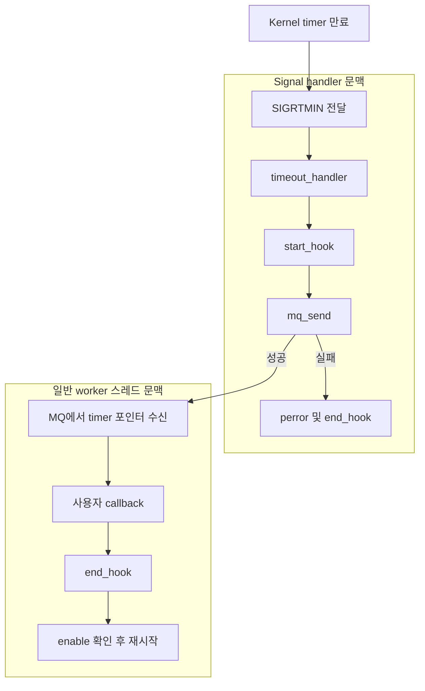

# System Timer signal 안전성 분석 및 수정 계획

- 작성일: 2026-09-19
- 상태: 코드 분석 및 구현 계획. 구현·빌드·실기기 검증 전.
- 대상: `System/main/src/system/system_timer.c`, `system_pm.c` 및 관련 Kernel 경로
- 권고: 기존 API와 타이머 소유권을 유지하면서 signal handler를 **만료 기록 및 worker 깨우기**로 축소한다. 이벤트 수명과 PM 인계 조건을 함께 해결한다.

## 1. 분석 기준과 증거 범위

| 항목 | 확인 기준 |
| --- | --- |
| System | `/Volumes/T7/Dev/ecode/System/main`, `be689e570bea4df2d8306c58d3174604d2b5b1a4` |
| Kernel | `/Volumes/T7/Dev/ecode/Kernel/main`, `1069aa91a68dda3d9136dc6422df79bb729b5ad9` |
| 분석 방법 | 실제 구현과 공개 헤더의 정적 호출 경로 추적 |
| 지침 | System 및 Kernel의 `AGENTS.md`, 로컬 빌드 스크립트의 기본 helper 위치에서 확인한 `/Users/seokhun/conanhelper/AGENTS.md` |
| 미확인 | 제품 rootstrap/lockfile이 선택한 실제 Kernel 리비전, 제품별 설정, 런타임 재현, 보드 PM 동작 |

인접 Kernel checkout은 호출 경로를 확인하기 위한 기준이다. 제품 펌웨어에 동일한 소스가 포함되었다고 간주하지 않는다. 아래의 교착·재진입·수명 문제는 코드상 가능한 경로이며, 특정 현장 장애나 MM assertion의 원인을 입증한 결과가 아니다.

이 문서는 원래 `ecode/System/`에서 작성되었으며, 현재는 TizenRT `codex/docs`의 `docs/`에 보관한다. 소스 링크는 로컬 `ecode/System/main` 및 `ecode/Kernel/main` checkout의 절대 경로이며, 줄 번호는 위 리비전 기준이다. 이번 분석은 문서 작성만 수행하고 소스 코드는 변경하지 않았다.

## 2. 현재 동작

### 2.1 생성과 signal 전달

`system_timer_create()`는 다음 순서로 동작한다.

1. 최초 호출이면 전역 MQ와 `system_timer_worker`를 생성한다.
2. 호출 스레드에서 `sigaction(SIGRTMIN, ...)`으로 `timeout_handler()`를 등록한다.
3. `sigev_notify = SIGEV_SIGNAL`, `sigev_signo = SIGRTMIN`, `sival_ptr = timer`로 POSIX timer를 생성한다.
4. Kernel은 생성 당시 `getpid()`를 `pt_owner`에 저장한다.
5. 만료 시 Kernel의 `timer_sigqueue()`가 `sig_dispatch(pt_owner, &info)`를 호출한다.

Kernel의 `HAVE_GROUP_MEMBERS` 설정과 mask 상태에 따라 그룹 내 전달 경로가 달라질 수 있다. 기본 대상은 생성 owner이며, Linux의 process-wide timer 동작을 그대로 가정하면 안 된다.

근거: [System 생성부](/Volumes/T7/Dev/ecode/System/main/src/system/system_timer.c) 166–217행, [Kernel 생성부](/Volumes/T7/Dev/ecode/Kernel/main/os/kernel/timer/timer_create.c) 196–247행, [Kernel 만료 전달](/Volumes/T7/Dev/ecode/Kernel/main/os/kernel/timer/timer_settime.c) 112–132행, [signal 라우팅](/Volumes/T7/Dev/ecode/Kernel/main/os/kernel/signal/sig_dispatch.c) 435–494행.

### 2.2 실행 문맥



사용자 callback인 `timer->function()`은 이미 worker에서 실행한다. Signal 문맥에 남아 있는 작업은 `start_hook()`, `mq_send()`, 오류 로그, 전송 실패 시 `end_hook()`이다.

근거: [handler와 worker](/Volumes/T7/Dev/ecode/System/main/src/system/system_timer.c) 54–136행.

### 2.3 반복 및 중지 의미

- Kernel timer의 `it_interval`은 0이다. 즉, 각 arm은 one-shot이다.
- Worker가 callback과 `end_hook()`을 마친 뒤 `enable`을 확인하고 다시 arm한다.
- 따라서 반복은 **callback 처리 완료 후 interval만큼 기다리는 fixed-delay 방식**이다. 일정한 절대 주기로 실행되는 fixed-rate 방식이 아니다.
- 현재 `stop()`은 Kernel timer를 disarm하고 `enable = false`로 설정한다. 이미 MQ에 들어간 callback을 제거하지 않는다.
- Worker는 callback 실행 전에 `enable`을 검사하지 않는다. 이미 들어온 callback은 stop 이후에도 실행될 수 있다.
- `destroy()`는 `timer_delete()`, `sem_destroy()`, `memset()`을 수행한다. MQ에 남은 포인터나 실행 중 callback을 기다리는 절차는 없다.
- 공개 헤더는 생성 스레드가 종료되면 해당 timer도 제거되는 per-thread timer라고 설명한다.

근거: [start/stop/destroy](/Volumes/T7/Dev/ecode/System/main/src/system/system_timer.c) 220–310행, [공개 계약](/Volumes/T7/Dev/ecode/System/main/include/system/system_timer.h) 46–62행.

## 3. 확인된 위험 경로

### 3.1 MQ 전송에서 동적 메모리 할당

```text
timeout_handler()                  [signal 문맥]
  → mq_send()
    → mq_msgalloc()
      → 일반 메시지 풀이 비었으면 kmm_malloc()
```

`mq_send()`는 메시지 버퍼를 `mq_msgalloc()`으로 확보한다. `mq_msgalloc()`은 하드웨어 interrupt 문맥이면 예약 풀을 이용하고, 그 외 문맥에서는 공용 풀이 비었을 때 `kmm_malloc()`을 호출한다.

Signal handler는 중단된 스레드에서 실행되는 비동기 문맥이다. 이를 하드웨어 ISR과 동일하게 취급해서는 안 된다. 이 경로에서는 중단된 코드의 allocator 동작과 재진입할 가능성이 있다. 매 만료마다 malloc을 호출한다는 뜻은 아니며, **공용 메시지 풀 고갈 조건에서 도달 가능**하다는 의미다.

근거: [mq_send](/Volumes/T7/Dev/ecode/Kernel/main/os/kernel/mqueue/mq_send.c) 168–175행, [mq_msgalloc](/Volumes/T7/Dev/ecode/Kernel/main/os/kernel/mqueue/mq_sndinternal.c) 180–229행.

### 3.2 가득 찬 MQ에서 signal handler가 대기

System MQ는 최대 메시지 수가 10이고 `O_RDWR | O_CREAT`로 열린다. `O_NONBLOCK`은 설정하지 않는다. 가득 차면 `mq_waitsend()`에서 공간이 생길 때까지 대기할 수 있다.

이에 따라 다음 교착 시나리오가 가능하다.

1. 원래 스레드가 worker callback에 필요한 자원 L을 보유한다.
2. 그 스레드에 timer signal이 들어온다.
3. Handler가 가득 찬 MQ에서 기다린다.
4. Worker는 callback에서 L을 기다리므로 큐 처리를 진행하지 못한다.
5. 원래 스레드는 handler가 돌아오지 않아 L을 해제하지 못한다.

`O_NONBLOCK` 추가는 이 대기만 피한다. 큐에 여유가 있을 때의 동적 할당과 hook 호출은 그대로 남는다. 메시지 풀 크기 확대도 고갈 확률을 줄일 뿐 안전성을 보장하지 않는다.

근거: [MQ 초기화](/Volumes/T7/Dev/ecode/System/main/src/system/system_timer.c) 35–37, 139–147행, [mq_waitsend](/Volumes/T7/Dev/ecode/Kernel/main/os/kernel/mqueue/mq_sndinternal.c) 279–325행.

### 3.3 PM hook에서 로그 및 잠금 재진입

```text
timeout_handler()
  → timer_expired_start_hook()
    → system_pm_suspend()
      → SYSTEM_LOG_DEBUG() → system_log() → semaphore 획득
      → open("/dev/pm") → ioctl(PMIOC_SUSPEND) → close()
```

`system_log()`는 로그 레벨 검사 후 전역 semaphore를 획득하고 문자열 포맷팅과 `puts()`를 수행한다. 로그가 활성화되어 있고 원래 스레드가 그 semaphore를 가진 채 중단되면 handler가 같은 자원을 다시 기다릴 수 있다.

MQ 전송 실패 시 handler가 호출하는 `end_hook()`도 `system_pm_resume()`을 통해 로그와 장치 접근을 수행한다. `open()` 자체가 POSIX에서 unsafe라는 주장을 하는 것이 아니다. **현재 wrapper 전체가 로그·동기화·장치 ioctl을 포함하므로 안전한 handler 연산으로 간주할 수 없다.**

근거: [PM wrapper와 hook](/Volumes/T7/Dev/ecode/System/main/src/system/system_pm.c) 86–123, 188–209행, [로그 잠금](/Volumes/T7/Dev/ecode/System/main/src/system/system_log.c) 144–148, 252–259행, [포맷팅과 출력](/Volumes/T7/Dev/ecode/System/main/src/system/system_log.c) 323–345행.

### 3.4 Handler의 오류 출력

- `si == NULL`이면 `printf()`를 호출한다.
- `mq_send()` 실패 시 `perror()`를 호출한다.
- 정상 만료에서도 MQ 및 PM hook 경로가 존재하므로 오류 출력만 제거해서는 해결되지 않는다.

POSIX는 async-signal-safe로 규정한 인터페이스와 조건을 별도로 정의한다. `printf`, `malloc`, `mq_send`는 그 보장 대상이 아니다. 반면 `sem_post` 같은 통지 수단도 타깃 구현과 설정별 부수 경로를 확인한 뒤 사용해야 한다. [POSIX Signal Actions](https://pubs.opengroup.org/onlinepubs/9799919799/functions/V2_chap02.html)

### 3.5 수명 및 상태 경합

| 현재 구조 | 가능한 결과 |
| --- | --- |
| MQ에 외부 소유 `system_timer *` 저장 | destroy 후 초기화된 객체 접근, 호출자가 저장소까지 해제하면 use-after-free |
| Callback 종료 후 timer를 다시 접근 | callback 안의 destroy 또는 다른 스레드의 destroy와 경합 |
| `enable` 검사와 재시작이 분리됨 | 그 사이의 stop이 뒤이은 재시작으로 덮일 가능성 |
| 최초 초기화를 `bool enable_init`만으로 제어 | 동시 create 시 worker/MQ 초기화 중복 가능성 |

이 항목들은 signal unsafe 호출과 구분되는 동시성 문제다. 새 bridge가 더 오래 pending 이벤트를 보관하게 되므로 함께 설계해야 한다. 각 경합은 테스트로 재현한 뒤 수정 효과를 판정한다.

## 4. 바로 적용할 수 없는 대안과 Kernel 제약

### 4.1 SIGEV_THREAD 단순 교체

확인한 Kernel의 `signal.h`는 `SIGEV_NONE`, `SIGEV_SIGNAL`을 정의한다. `timer_create()`에도 만료마다 thread callback을 실행하는 구현이 없다. 이 checkout에서는 필드 값만 바꾸는 대안이 아니다.

근거: [signal.h](/Volumes/T7/Dev/ecode/Kernel/main/os/include/signal.h) 327–330, 369행, [timer_create](/Volumes/T7/Dev/ecode/Kernel/main/os/kernel/timer/timer_create.c) 225–242행.

### 4.2 sigwaitinfo worker만 추가

동기적으로 signal을 소비하면 처리 코드는 일반 스레드 문맥에서 실행할 수 있다. 그러나 현재 구조에서는 다음을 함께 변경해야 한다.

- Timer owner, 수신 스레드, 관련 스레드의 signal mask 및 그룹 라우팅.
- 생성 스레드 종료 시 timer 정리라는 기존 계약.
- 여러 timer가 같은 signal 번호를 사용하는 경우의 만료 식별 및 보존.

현재 Kernel의 `sig_addpendingsignal()`은 **signal 번호별로 하나의 pending entry만 유지**하고 새 signal의 `siginfo`로 덮어쓴다. 따라서 여러 timer를 하나의 `SIGRTMIN` waiter에 모으고 `sival_ptr`만으로 timer를 식별하면 이벤트가 유실될 수 있다. Handler가 실행되는 동안 같은 번호가 pending되는 기존 방식에도 이 제약은 잠재한다.

근거: [pending 병합](/Volumes/T7/Dev/ecode/Kernel/main/os/kernel/signal/sig_dispatch.c) 234–280행, [waiter 처리](/Volumes/T7/Dev/ecode/Kernel/main/os/kernel/signal/sig_timedwait.c) 229–257행.

### 4.3 Handler 축소 후에도 남는 Kernel 경로

Kernel에는 signal action pool이 부족할 때의 `kmm_malloc()`과 동적 signal action 정리 시 `sched_kfree()` 경로가 있다. System handler를 고쳐도 Kernel signal subsystem 전체의 allocator 재진입 안전성이 입증되는 것은 아니다.

후속 Kernel 검토는 signal action/pending 구조의 할당과 해제, pending 병합, 풀 고갈 시 동작을 별도로 다룬다. Timer interrupt에서 action을 확보하는 경우와 handler 종료 후 pending signal을 처리하는 경우도 구분한다.

근거: [action 할당](/Volumes/T7/Dev/ecode/Kernel/main/os/kernel/signal/sig_allocatependingsigaction.c) 97–143행, [handler 종료 처리](/Volumes/T7/Dev/ecode/Kernel/main/os/kernel/signal/sig_deliver.c) 204–219행, [action 해제](/Volumes/T7/Dev/ecode/Kernel/main/os/kernel/signal/sig_releasependingsigaction.c) 95–132행.

## 5. 수정 목표와 범위

### 5.1 첫 구현의 목표

1. `timeout_handler()`에서 stdio, 일반 로그, MQ, 동적 할당/해제, hook, blocking lock을 제거한다.
2. 기존 callback 직렬 실행과 fixed-delay 반복 의미를 보존한다.
3. 기존 공개 함수 signature와 `system_timer` 구조체 레이아웃을 유지한다.
4. Signal에서 worker로 넘기는 이벤트의 수명·동기화를 명시한다.
5. PM timer의 만료부터 callback 완료까지 필요한 절전 방지를 보존한다.

### 5.2 별도 후속 범위

- Kernel signal 자체의 메모리 할당/정리 안전성.
- Signal 단계에서 이미 합쳐진 만료 이벤트의 무손실 전달.
- 모든 timer를 전용 timer service가 소유하는 구조로의 전환.
- CLOCK_REALTIME 또는 반복 주기 정책 변경.

첫 구현이 성공해도 “전체 timer 경로가 무손실이며 Kernel까지 async-signal-safe”라고 보고하지 않는다. PM 보존과 새로 도입한 객체 수명 안전성은 첫 구현의 완료 조건이다.

## 6. 권고 구조

```text
일반 create 문맥
  → 초기화 1회 보장
  → 내부 슬롯 및 식별 토큰 준비
  → Kernel timer 생성

signal handler
  → signal 종류/토큰의 최소 검증
  → 이미 준비된 슬롯에 pending 기록
  → 전용 signaling semaphore로 worker 깨우기
  → 반환

일반 worker 문맥
  → pending 이벤트 인수 및 유효성 확인
  → PM 인계 조건 충족 확인
  → start_hook → callback → end_hook
  → 동일 실행 세대가 계속 활성인 경우에만 재arm
```

이는 책임 분리를 나타낸 구조도다. PM 인계 방식이 확정되기 전까지 hook을 worker로 이동하는 패치를 완료본으로 간주하지 않는다.

### 6.1 내부 슬롯과 공개 ABI

- Signal handler가 공개 `system_timer *`를 역참조하지 않도록 한다.
- 내부 고정 슬롯 테이블과 `slot + generation` 식별 토큰을 우선 검토한다. 슬롯 저장소는 library/service 수명 동안 유지한다.
- `sigev_value`에 전달할 토큰의 표현은 실제 ABI의 `int`/포인터 폭을 확인해 정한다. 서로 다른 포인터·정수 폭을 가정한 임의 cast는 사용하지 않는다.
- 일반 API와 worker가 공개 timer 주소를 내부 슬롯에 연결한다. Handler는 token과 signal용 atomic 상태만 다룬다.
- 슬롯 수는 제품의 동시 timer 사용량과 메모리 예산을 확인해 정한다. 새 상한을 조용히 도입하지 않는다. 용량 초과는 생성 단계에서 명시적으로 실패하고 이미 생성한 자원을 회수한다.
- 슬롯 재사용 시 generation을 바꾸고 이전 토큰을 거부한다. Generation wrap 시 오래된 signal이 새 timer를 가리키지 않도록, wrap된 슬롯의 사용 중지 또는 입증된 signal 정리 경계를 둔다.
- 슬롯이 `CLOSING`인 동안 신규 이벤트를 받아들이지 않는다. 이미 인수한 실행 참조가 없어야 공개 객체와의 연결을 해제할 수 있다.

### 6.2 Handler의 허용 연산

허용 목록은 토큰 해석, 타깃에서 lock-free인 것으로 확인한 atomic 상태 전이, 안전성이 확인된 `sem_post()`, 필요한 `errno` 보존 정도로 제한한다.

- `volatile`만으로 다중 producer 및 SMP 동기화를 구현하지 않는다.
- Handler가 중단한 스레드도 획득할 수 있는 mutex/spinlock을 사용하지 않는다.
- Atomic 구현이 내부 `libatomic` 잠금 호출로 내려가지 않는지 타깃 컴파일 결과를 확인한다.
- 잘못된 토큰과 통지 실패는 안전한 고정 상태에 기록하고 일반 문맥에서 진단한다. 오류 경로에서도 출력하지 않는다.
- `sem_post()`를 감싼 함수에 로그나 할당을 넣지 않는다.

### 6.3 깨우기와 pending의 관계

Pending 저장소가 처리할 이벤트의 기준이고 semaphore는 깨우기 수단이다. Semaphore 횟수만으로 timer를 식별하지 않는다.

구현 전에 다음 인터리빙을 상태 전이 표로 고정한다.

1. Producer가 pending을 기록하고 consumer가 읽는 사이.
2. Consumer가 pending을 비운 직후 새 이벤트가 도착하는 경우.
3. Consumer가 sleep을 준비하는 순간 producer가 통지하는 경우.
4. 여러 생성 스레드가 동시에 통지하는 경우.
5. Consumer가 callback을 실행하는 동안 다른 timer가 만료되는 경우.

통지 병합을 사용한다면 lost wakeup이 없음을 검증한다. 반대로 매 이벤트마다 post한다면 카운터 누적과 `SEM_VALUE_MAX` 도달을 제어해야 한다. Pending을 단순 bool로 합쳐서 중복 만료 의미를 바꾸지 않는다. 정상적인 one-shot/rearm 경로와 사용자의 명시적 재start 경로를 구분해 처리 정책을 정한다.

확인한 Kernel은 `sem_init(..., 0)`에서 holder 추적 설정에 따라 signaling semaphore 표시를 설정한다. Priority inheritance 설정과 semaphore history 등의 부수 경로까지 대상 제품 설정에서 확인한다. Mutex 용도로 사용하던 `timer->semaphore`를 알림용으로 재사용하지 않는다.

근거: [sem_init](/Volumes/T7/Dev/ecode/Kernel/main/lib/libc/semaphore/sem_init.c) 103–143행, [sem_post](/Volumes/T7/Dev/ecode/Kernel/main/os/kernel/semaphore/sem_post.c) 199–236행, [signaling holder 제외](/Volumes/T7/Dev/ecode/Kernel/main/os/kernel/semaphore/sem_holder.c) 720–727행.

### 6.4 Worker와 API의 직렬화

- 서비스 초기화는 일반 문맥의 동기화로 정확히 한 번 수행하고 실패 시 재시도·정리 상태를 정의한다.
- 내부 잠금은 상태 조회/전이와 실행 참조 인수에만 사용한다. Callback, hook, 로그, 장치 접근 중에는 보유하지 않는다.
- Worker는 callback 실행에 필요한 참조를 확보한 뒤 잠금을 해제한다.
- Callback 종료 후 무조건 `system_timer_start()`를 호출하지 않는다. Callback 시작 때의 실행 세대와 현재 상태를 다시 비교하여 stop/destroy/change_interval을 덮어쓰지 않게 한다.
- Callback의 self-stop은 재arm을 막는다. 외부 destroy는 이미 실행 중인 callback의 종료를 기다리는 방식과 기존 호출 관행의 호환성을 확인한다.
- Callback의 self-destroy는 자기 종료를 기다려 교착하지 않도록 내부 정리를 지연한다. 사용자 callback 인자 수명, PM end_hook에 필요한 데이터, callback 반환 후 공개 객체 접근 여부를 별도로 설계한다.
- Callback에서 다른 timer를 destroy하는 경우도 단일 worker 때문에 대기 순환이 생기지 않아야 한다.

### 6.5 Generation이 해결하는 범위

Create 시 토큰에 넣은 generation은 **destroy 후 같은 슬롯/주소를 재사용하는 문제**를 구별한다. 이것만으로 같은 timer의 stop/start 사이에 늦게 도착한 signal을 구별할 수는 없다. 현재 Kernel의 `sigev_value`는 create 때 저장되어 이후 arm에도 사용되기 때문이다.

따라서 아래를 구분한다.

- 객체 generation: create/destroy와 슬롯 재사용 식별.
- 실행 epoch: 일반 문맥에서 start/stop/change_interval과 worker 재arm의 경합 제어.
- Signal의 arm 식별: 현재 Kernel payload만으로는 충분하지 않음.

첫 변경에서 stop을 “반환 후 어떤 callback도 절대 시작하지 않음”으로 새롭게 보장하지 않는다. 그 보장이 필요하면 timer별 signal drain/동기화 또는 Kernel의 arm 식별 전달을 별도로 설계한다. 공유 `SIGRTMIN`을 임의로 비우면 다른 timer 이벤트도 제거할 수 있다.

### 6.6 생성 스레드 종료

내부 registry가 추가되면 Kernel timer 삭제만으로 슬롯 정리가 끝나지 않는다. 생성 owner 종료, task cancel, binary unload 때 내부 슬롯·실행 참조·PM 보유 상태를 회수할 경로를 확인해야 한다.

기존 task/binary 종료 인계에 연결할 수 없다면 해당 수명 문제를 구현 선행 조건으로 남긴다. Timer를 worker 소유로 옮겨 자동 정리를 우회하면 공개 per-thread 계약이 바뀌므로 첫 변경에 묵시적으로 포함하지 않는다.

## 7. PM 보존 설계

현재 start_hook은 timer 만료 후 MQ에 넣기 전에 PM suspend count를 확보하고, end_hook은 callback 후 이를 해제한다. 따라서 **callback 실행 시간뿐 아니라 worker 대기 구간도 보호**하려는 구조다. 다만 기존 hook 자체가 로그·장치 접근 중 대기할 수 있어 현재 구현이 모든 인계 구간을 보장한다고 단정하지 않는다.

### 7.1 우선 확인할 조건

1. Timer wakeup 직후 새 pending을 기록하고 worker를 runnable로 만드는 시점.
2. 단일 코어 및 SMP에서 PM idle 진입을 차단하는 실제 조건.
3. Worker가 다른 callback이나 PM 장치 접근에서 block된 동안 새 PM timer가 만료되는 경우.
4. `TIMER_WAKEUPSOURCE`가 보장하는 범위와 만료 후 PM hold 인계 범위.
5. Cancel/destroy 또는 hook 실패 시 PM count가 정확히 회수되는지.

### 7.2 구현 선택

- **System만으로 보존 가능함이 입증되는 경우:** handler의 안전한 통지와 scheduler 상태가 필요한 구간을 보호하도록 구성하고 hook을 일반 문맥으로 이동한다.
- **보존할 수 없는 경우:** Kernel에 사전 등록된 PM hold 또는 pending-work guard를 안전한 만료 문맥에서 획득하고 일반 문맥에서 인수·해제하는 최소 기능을 설계한다. Handler에서 기존 `system_pm_suspend()`를 계속 호출하는 우회는 사용하지 않는다.
- **짧은 dispatcher를 추가하는 경우:** 사용자 callback은 기존 직렬 worker에 남기고 dispatcher가 만료/PM 인계를 담당할 수 있다. 그러나 dispatcher가 실행되기 전이나 blocking 중인 구간도 검증해야 하므로 thread를 하나 추가했다는 사실만으로 PM 보존이 완료되지는 않는다.

PM hold는 일반 문맥에서 확보한 독립 실행 상태에 기록한다. 슬롯이 제거되거나 callback이 self-destroy해도 end 처리에서 해제할 수 있어야 한다. PM hold 획득 실패 시 callback 실행 여부는 현재 동작과 호출자의 기대를 조사해 명시한다. 기존 코드는 실패를 기록한 뒤에도 MQ 전송을 진행한다.

## 8. 단계별 실행 계획

각 단계는 선행 조건과 산출물이 충족된 뒤 진행한다. 단계 번호는 작업 순서이며 모든 항목을 하나의 PR로 묶으라는 뜻은 아니다.

| 단계 | 구체 작업 | 완료 산출물/판정 |
| --- | --- | --- |
| 0. 제품 기준 고정 | 실제 lockfile/rootstrap, Kernel 리비전, 보드별 PM/SMP/PI/recovery 설정, toolchain atomic 지원 확인. timer 사용처의 동시 개수·stop/destroy/self-destroy·생성 owner 종료 관행 조사 | 적용 대상 목록과 동작 보존 표. 제품과 분석 checkout 차이를 명시 |
| 1. 상태·수명 설계 | 슬롯 토큰, capacity, generation wrap, 실행 epoch, callback 참조, owner 종료 회수, semaphore 통지 규칙 작성 | Handler/API/worker 인터리빙 표. stop 계약과 arm 식별 한계 확정 |
| 2. PM 인계 결정 | 7장의 조건을 Kernel 소스와 타깃 실행으로 확인. System 단독 또는 Kernel 보완 선택 | PM 보호 구간 도식, hold 획득/인계/해제 경로. 미해결이면 hook 이동 완료 판정 보류 |
| 3. 실제 코드 테스트 기반 | `system_timer.c`를 빌드하는 테스트 타깃 구성. OS 경계만 대체하고 signal 문맥의 금지 호출 감지. 실제 Kernel MQ 할당 경로는 타깃 테스트로 확인 | 현재 코드의 hook/MQ 호출로 실패하는 회귀 테스트. Mock timer 구현만 테스트하지 않음 |
| 4. Bridge 및 lifecycle 구현 | 초기화 직렬화, 내부 슬롯/통지, worker pending 처리, destroy/ref 정리 구현. 1·2단계 결과에 따라 hook 이동 및 handler MQ 제거 | 공개 ABI 유지. Handler 허용 연산 목록 만족. 수명 및 lost-wakeup 테스트 통과 |
| 5. 타깃 통합 검증 | ARM 빌드, 동시 만료/heap 부하/로그 중단/재start/cancel 실험, PM 보드 검증 | 보드·설정·commit·로그별 결과. Host/CI/보드 증거 분리 |
| 6. Kernel 후속 수정 | pending 병합 및 signal 할당/해제 정책 개선. 필요 시 timer service 대안 비교 | System 수정과 분리된 범위·리뷰·시험 결과. 무손실 주장을 위한 별도 증거 |

### 8.1 예상 파일별 변경

| 파일 | 계획된 책임 |
| --- | --- |
| `main/src/system/system_timer.c` | 최소 handler, 내부 registry/통지, worker 처리, API 상태 직렬화, 초기화·실패 정리 |
| `main/src/system/system_timer_internal.h` | 필요한 내부 선언만 추가. 공개 구조체 변경을 우회하는 용도 |
| `main/src/system/system_pm.c` | 일반 문맥의 hook 처리, PM hold 인계 및 종료 정리 |
| `main/include/system/system_timer.h` | 기본 방침은 signature/layout 유지. 계약 보완이 필요하면 호환성 검토 후 문서 변경 |
| `main/test/` 하위 신규 timer 전용 테스트 | 실제 production 소스 기반 상태·수명·handler 제한 회귀 테스트 |
| Kernel 관련 timer/signal/PM 파일 | 단계 2 또는 6에서 필요성이 입증된 항목만 별도 변경 |

테스트 폴더명과 빌드 등록 방식은 기존 test runner 규칙을 확인한 후 정한다. 기존 `test/code/framework/mock_timer.c` 및 `mock_thread_timer.c`는 다른 모듈을 위한 대체 구현이므로, 이들만 실행해서 production timer 검증으로 보고하지 않는다.

## 9. 검증 계획

| 검증 항목 | 방법 | 통과 기준 |
| --- | --- | --- |
| Handler unsafe 호출 | 실제 production 소스를 OS 경계 stub과 연결하고 handler 활성 구간의 로그/MQ/할당/잠금 호출 감지 | 정상·잘못된 토큰·실패 분기 모두 금지 호출 0회 |
| MQ allocator 재진입 | 실제 Kernel에서 메시지 풀을 압박하고 만료 발생. 고정 메모리 trace로 call context 확인 | 변경한 System handler에서 MQ/allocator 진입 없음 |
| 동시 만료 | 여러 생성 스레드, 기존 MQ 용량을 넘는 timer 수, SMP 대상에서 수행 | 새 bridge에 도달한 이벤트의 정책상 허용되지 않은 유실/중복 없음. Kernel 이전 유실은 별도 집계 |
| Lost wakeup | pending publish/consume/sleep 경계에 결정적 실행 제어 삽입 | pending이 남은 채 worker가 무기한 잠들지 않음 |
| 슬롯 부족·generation | capacity 경계, destroy/create 주소 재사용, wrap 정책 시험 | 생성 실패 시 누수 없음. 이전 이벤트가 새 timer callback으로 연결되지 않음 |
| Stop/rearm 경합 | worker 상태 확인과 재arm 사이에 stop/change_interval 삽입 | 명시한 epoch 정책대로 동작하고 사용자 stop을 worker가 덮어쓰지 않음 |
| Destroy | pending/실행 중/외부 destroy/self-destroy/다른 timer destroy | use-after-free, self-wait, PM hold 누수 없음 |
| 생성 owner 종료 | timer 활성/pending/callback 실행 중 owner 종료 및 binary unload | per-thread 계약 유지, registry/hold 누수 및 stale handle 접근 없음 |
| Fixed-delay | callback에 의도적인 지연을 넣고 시작·종료·다음 실행 시각 기록 | callback/end 처리 완료 후 interval 재arm 의미 유지 |
| Log 재진입 | 생성 스레드가 로그 잠금을 보유한 순간 만료 유도 | Handler가 로그 잠금을 요청하지 않고 원래 실행이 진행됨 |
| 초기화 실패 | 동시 create 및 worker/슬롯/semaphore 생성 실패 주입 | 초기화 중복 없음, 자원 회수, 이후 재시도 동작 일관성 |
| PM 정상/혼잡/실패 | rtl8721csm/rtl8730e 적용 설정에서 sleep→wakeup, 느린 worker, PM 장치 경합, destroy 시험 | 필요한 구간에 재진입 sleep 없음. 처리 후 suspend count가 기준으로 복귀 |
| ABI와 빌드 | 공개 header diff 및 대상 ARM 빌드, 지원되는 ABI 검사 | 공개 layout/signature 유지. target atomic에 잠금 fallback 없음 |

Signal/MM 문맥 계측에는 printf 대신 사전 할당 trace buffer 또는 debugger를 사용한다. Host harness의 결정적 인터리빙 성공은 타깃 Kernel 스케줄링과 실제 보드 PM의 증거를 대체하지 않는다.

빌드·시험 명령은 실행 시점의 환경과 실제 신규 test 경로를 확인한 뒤 사용한다. 모든 `cbuild.sh` 호출에는 지침대로 `--tty=false`를 포함한다. 예: `./cbuild.sh create --tty=false`. 이 문서 작성 중에는 빌드나 테스트를 실행하지 않았다.

## 10. 완료 판정과 남는 제한

첫 변경의 완료 조건은 다음과 같다.

- [ ] 제품의 실제 Kernel/설정 기준과 공개 동작 보존 범위가 고정되었다.
- [ ] Handler의 정상·오류 경로에서 로그, MQ, hook, 동적 할당 및 blocking lock이 제거되었다.
- [ ] 통지 primitive와 atomic 연산이 대상 toolchain/설정에서 안전함을 확인했다.
- [ ] 슬롯·callback·destroy·owner 종료·binary unload의 수명 규칙을 검증했다.
- [ ] Stop/change_interval과 worker 재arm 경합을 회귀 테스트로 검증했다.
- [ ] PM 만료 인계부터 callback 완료까지의 보호와 실패 시 해제를 실제 적용 보드에서 확인했다.
- [ ] 공개 ABI 및 fixed-delay/직렬 callback 의미를 유지했다.
- [ ] System bridge 이후의 전달 보장과 Kernel signal 병합/정리 제한을 결과 보고에서 구분했다.

PM 인계나 객체 수명이 미해결이면 첫 변경은 구현 완료가 아니다. Kernel pending 병합과 signal subsystem 전체 안전성은 별도 후속 범위로 남으며, 이를 해결하기 전에는 전체 timer 경로의 무손실·완전한 signal 안전성을 주장하지 않는다.
