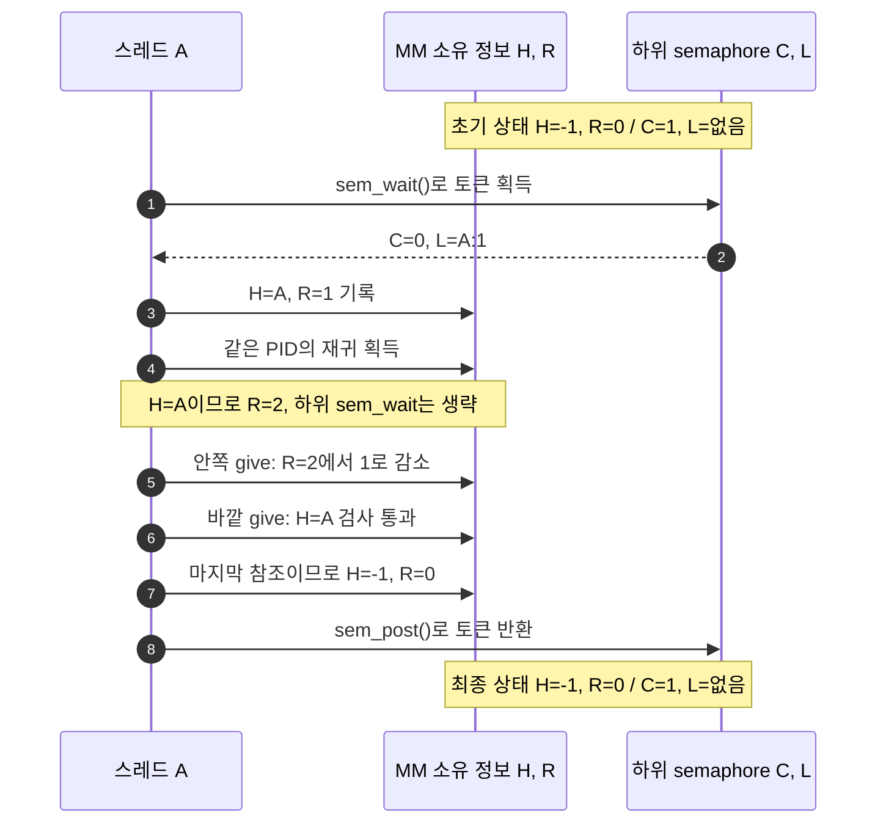
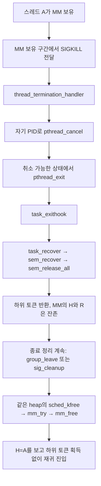
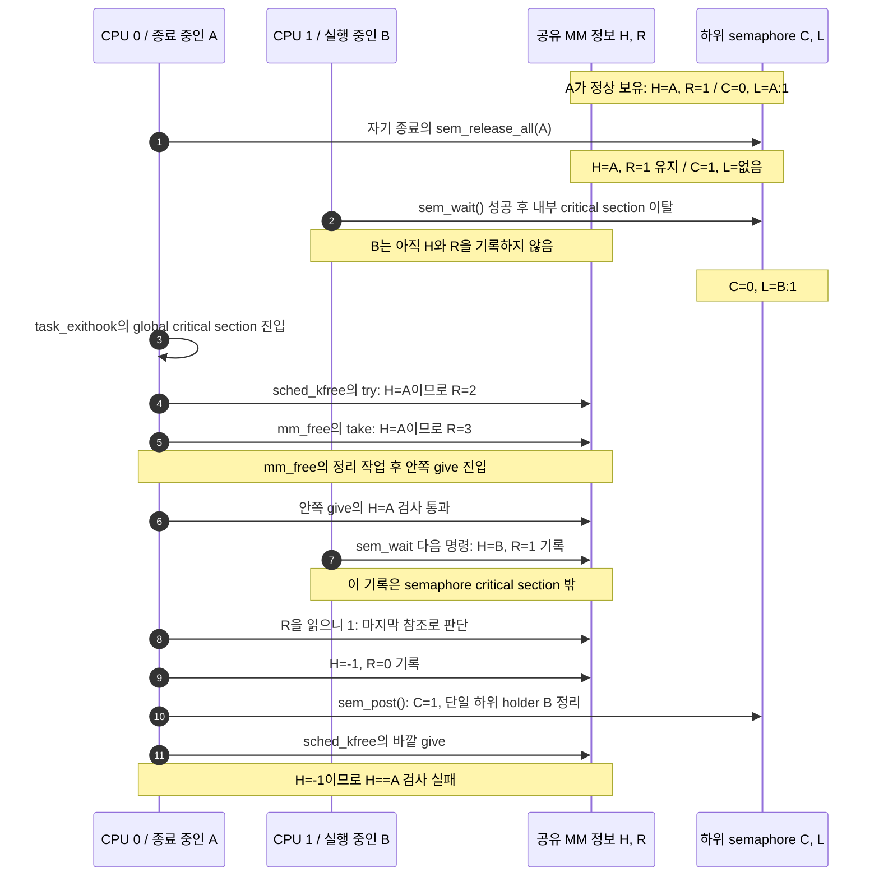
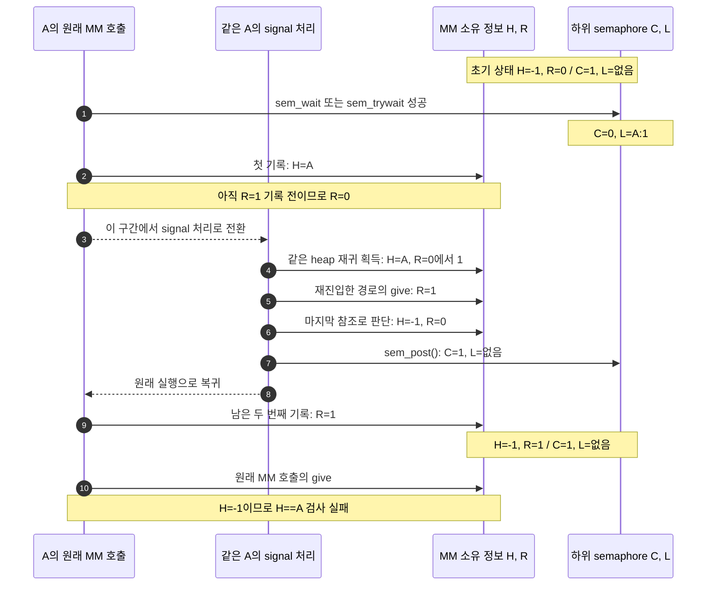
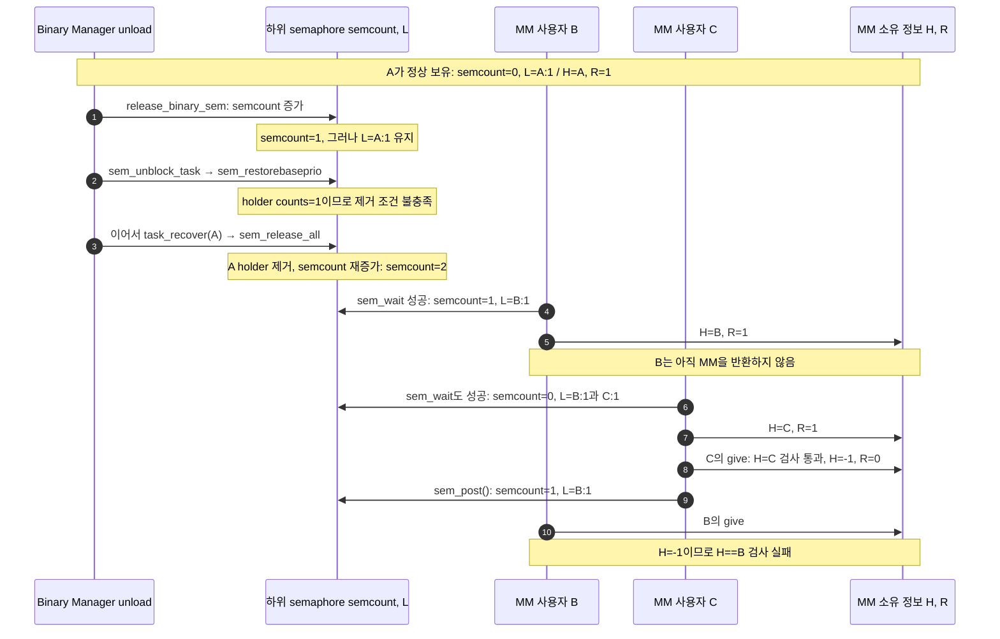

# MM semaphore 소유자 assert: 세 가지 이슈 분석

작성일: 2026-09-16\
분석 소스: `master`, 커밋 `29d2ed503c2915bd123ff020f5c76353aa19f34c`\
관찰된 장애: exit/cancel이 빈번한 상황에서 `heap->mm_holder == my_pid` 검사 실패, 당시 `mm_holder == -1`\
증거 한계: 장애 로그·콜스택·장애 펌웨어의 정확한 설정은 없음

> 세 이슈 모두 명시한 조건에서 MM 소유권이 깨지는 코드 경로와 제어된 호스트 테스트 결과가 있다. 따라서 수정 검토 대상이다. 다만 **실제 보드에서 세 경로를 모두 재현했다거나, 이번 장애의 직접 원인을 특정했다는 뜻은 아니다.** 특히 1번은 SMP 경로, 3번은 Binary Manager recovery 경로라는 조건이 중요하다.

이 문서의 Mermaid 블록은 편집 가능한 다이어그램 원본이다. 같은 폴더의 [HTML 문서](MM_Semaphore_Holder_Assert_Analysis.html)는 그림을 미리 렌더링해 포함하므로 Mermaid 플러그인이나 인터넷 연결 없이 읽을 수 있다.

## 1. 먼저 보는 비교표

| 구분 | 최초로 어긋나는 상태 | assert까지 이어지는 원리 | 확인한 주요 조건 |
| --- | --- | --- | --- |
| **1. 종료 recovery 뒤 MM 소유자 정보 잔존** | 하위 semaphore는 반환되지만 `mm_holder`와 재귀 횟수는 종료 중인 A의 값으로 남음 | A의 종료 정리와 다른 CPU의 B가 같은 heap에 진입하고, B의 소유자 기록 갱신이 A의 해제 판단과 겹침 | SMP, MM 보유 중 자기 종료, recovery 이후 같은 heap 정리, 하위 holder 회수 경로 |
| **2. MM 소유자·재귀 횟수 갱신 사이 재진입** | `mm_holder=A`를 쓴 뒤 아직 `mm_counts_held=1`을 쓰지 않아 `(A, 0)`이 노출됨 | 같은 PID의 signal 처리 경로가 재진입했다가 먼저 최종 해제하여 `mm_holder=-1`로 만듦 | 해당 명령 구간에서 같은 스레드의 같은 heap 재진입 가능. SMP나 Binary Manager는 필수가 아님 |
| **3. Binary Manager와 task recovery의 중복 반환** | 토큰을 반환한 뒤에도 하위 semaphore holder의 보유 횟수 1이 남음 | 다음 task recovery가 같은 토큰을 다시 반환하여 두 스레드가 MM에 진입. 하나가 먼저 해제한 뒤 다른 하나가 assert | 관리 목록에 등록된 kernel semaphore, `CONFIG_BINMGR_RECOVERY`, PI 활성화, 해당 binary의 보유 스레드와 unload/recovery |

1번과 3번은 모두 recovery와 관련 있지만, **남아 있는 기록이 다르다.** 1번은 MM 계층의 `mm_holder`이고, 3번은 하위 semaphore 계층의 `semholder_s`이다. 2번은 recovery 호출 없이도 성립하는 MM 상태 갱신 문제다.

## 2. 구조 이해: 하나의 lock을 두 계층이 관리한다

### 2.1 서로 다른 네 가지 값

| 문서 표기 | 실제 필드 / 자료구조 | 의미 |
| --- | --- | --- |
| `C` | `heap->mm_semaphore.semcount` | 하위 semaphore의 카운트. 대기자가 없는 예에서 1은 획득 가능, 0은 토큰 소진 |
| `H` | `heap->mm_holder` | MM이 기록한 소유 PID. `-1`은 소유자 없음 |
| `R` | `heap->mm_counts_held` | MM 계층의 재귀 획득 깊이 |
| `L` | `semholder_s` 및 TCB의 `holdsem` | 하위 semaphore가 기록한 holder와 보유 횟수. `A:1`은 A가 하위 토큰 하나를 보유한다는 뜻 |

**MM 재귀 횟수 `R`과 하위 holder의 `counts`는 같은 값이 아니다.** A가 MM에 재귀 진입하면 `R`만 증가하고 `sem_wait()`를 다시 호출하지 않는다. 따라서 `R=3`이어도 하위 기록은 `L={A:1}`일 수 있다.

이 문서의 상태 표는 이해를 위해 대기자가 없는 경우를 사용한다. 실제 `semcount`는 대기자가 있으면 음수가 될 수 있으므로, `C=0`이나 `C=1`의 설명을 모든 상황에 일반화하면 안 된다.

또한 `sem_release_all()`은 여기서 **heap 메모리 자체를 free하는 함수가 아니다.** 종료하는 스레드의 semaphore holder 기록을 제거하고 토큰을 반환하는 함수다. 사용자가 처음 추정한 “stale 메모리가 풀린다”는 상황은 이 문맥에서는 “하위 lock의 소유권이 반환되지만 MM 쪽 상태가 남는다”로 구분해야 한다.

### 2.2 정상 동작



안정된 시점의 정상 상태는 다음과 같다.

| 상태 | `C` | `H` | `R` | `L` |
| --- | ---: | --- | ---: | --- |
| 아무도 사용하지 않음 | 1 | -1 | 0 | 없음 |
| A가 한 번 획득 | 0 | A | 1 | A:1 |
| A가 재귀 진입 | 0 | A | 2 이상 | A:1 |
| A의 최종 반환 완료 | 1 | -1 | 0 | 없음 |

실제 코드는 여러 명령으로 이 상태를 바꾼다. 문제가 되는 것은 갱신 도중의 불완전한 상태를 다른 실행 경로가 보거나, recovery가 한 계층만 바꾸는 경우다.

### 2.3 이번 assert가 의미하는 것

분석 소스의 [mm_givesemaphore(), mm_sem.c:193](../../os/mm/mm_heap/mm_sem.c#L193)는 다음 순서로 실행된다.

```c
DEBUGASSERT(heap->mm_holder == my_pid);  /* 분석 소스 201행 */

if (heap->mm_counts_held > 1) {
    heap->mm_counts_held--;
} else {
    heap->mm_holder = -1;
    heap->mm_counts_held = 0;
    ASSERT(sem_post(&heap->mm_semaphore) == 0);
}
```

`H=-1` 자체는 최종 반환 뒤의 정상 값이다. 하지만 **아직 MM 참조를 반환해야 하는 스레드가 함수 입구에서 `H=-1`을 보는 것은 소유권 불일치**다. 다른 실행 경로가 먼저 최종 반환을 했거나, 소유 정보가 다른 이유로 지워진 상황을 뜻한다. 이 값 하나만으로 어느 경로가 원인인지는 알 수 없다.

사용자가 보고한 소스는 210행이지만, 이 문서의 기준 커밋에서 같은 assert는 201행이다. 비교 기준은 행 번호보다 `heap->mm_holder == my_pid` 식과 주변 실행 순서다.

## 3. 이슈 1: 자기 종료 recovery 이후의 MM 상태 잔존과 SMP 경합

### 3.1 핵심 원인

A가 MM을 가진 채 자기 종료 경로에 들어가면 `task_recover(A)`가 하위 토큰을 반환할 수 있다. 그런데 이 경로는 `heap->mm_holder`와 `heap->mm_counts_held`를 함께 정리하지 않는다.

이때 상태는 다음처럼 된다.

```text
recovery 전: C=0, H=A, R=1, L={A:1}
recovery 후: C=1, H=A, R=1, L=없음
```

하위 semaphore는 다른 스레드가 들어와도 된다고 판단하지만, MM은 여전히 A가 소유자라고 판단한다. **종료 중인 A의 후속 정리도 MM을 사용할 수 있다는 점**이 중요하다. A는 `H=A`를 보고 하위 semaphore 획득을 생략한다.

### 3.2 MM 보유 상태에서 자기 종료로 들어가는 소스 경로

확인한 진입 예는 signal 전달에 의한 자기 종료다. 기본 SIGKILL 처리기는 수신 스레드 문맥에서 동작하며, pthread이면 자기 PID로 `pthread_cancel()`을 호출한다. 취소가 즉시 실행되는 상태라면 `pthread_exit()`으로 연결된다.



관련 소스는 다음과 같다.

| 연결 | 코드 근거 |
| --- | --- |
| 기본 SIGKILL 처리기 등록 | [task_activate.c:123](../../os/kernel/task/task_activate.c#L123), 등록 호출 127행 |
| 다른 CPU에서 실행 중인 수신 스레드의 signal context 설정 | [arm_schedulesigaction.c:238](../../os/arch/arm/src/armv7-a/arm_schedulesigaction.c#L238), CPU pause 처리 286행 |
| signal 실행 전에 IRQ critical nesting 해제 | [arm_sigdeliver.c:104](../../os/arch/arm/src/armv7-a/arm_sigdeliver.c#L104) |
| SIGKILL 등록 처리기 호출 | [sig_deliver.c:156](../../os/kernel/signal/sig_deliver.c#L156), 실제 호출 172행 |
| pthread의 자기 취소 → 자기 종료 | [task_terminate.c:290](../../os/kernel/task/task_terminate.c#L290), [pthread_cancel.c:208](../../os/kernel/pthread/pthread_cancel.c#L208) |
| 종료 훅 → recovery → 후속 정리 | [pthread_exit.c:173](../../os/kernel/pthread/pthread_exit.c#L173), [task_exithook.c:612](../../os/kernel/task/task_exithook.c#L612), `group_leave` 659행, `sig_cleanup` 665행 |
| 토큰 회수 | [task_recover.c:125](../../os/kernel/task/task_recover.c#L125), [sem_recover.c:173](../../os/kernel/semaphore/sem_recover.c#L173), [sem_holder.c:987](../../os/kernel/semaphore/sem_holder.c#L987) |
| signal 정리의 실제 heap 접근 예 | [sig_cleanup.c:109](../../os/kernel/signal/sig_cleanup.c#L109), [sig_releasependingsigaction.c:130](../../os/kernel/signal/sig_releasependingsigaction.c#L130)의 `SIG_ALLOC_DYN → sched_kfree()` |

이 연결은 해당 signal/아키텍처 경로와 취소 상태가 성립하는 경우의 코드 근거다. 모든 보드의 signal 전달 방식이나 모든 `pthread_cancel()` 호출이 이 조건을 만족한다고 해석하면 안 된다.

### 3.3 `H=-1` assert로 이어지는 SMP 순서

아래에서 A는 CPU 0에서 자기 종료 중이고, B는 CPU 1에서 이미 실행 중인 스레드다. B는 A가 반환한 토큰을 획득한 뒤 **MM의 H/R을 기록하기 직전**에 있다. A의 정리는 `sched_kfree()`의 바깥 획득과 `mm_free()`의 안쪽 획득을 거쳐 두 번 반환한다.



| 시점 | `C` | `H` | `R` | `L` | 의미 |
| --- | ---: | --- | ---: | --- | --- |
| A가 정상 보유 | 0 | A | 1 | A:1 | 정상 |
| A의 recovery 후 | 1 | A | 1 | 없음 | MM 정보만 잔존 |
| B가 하위 토큰 획득 | 0 | A | 1 | B:1 | MM 소유자 기록은 아직 A |
| A의 종료 정리가 두 번 재귀 진입 | 0 | A | 3 | B:1 | A는 하위 토큰을 얻지 않고 진입 |
| A의 안쪽 give 검사 통과 뒤 B가 기록 | 0 | B | 1 | B:1 | A가 이어서 읽을 재귀 횟수가 1로 바뀜 |
| A의 안쪽 give가 최종 반환 수행 | 1 | -1 | 0 | 없음 | A가 B의 보유 중에 토큰을 반환 |
| A의 바깥 give | 1 | -1 | 0 | 없음 | **소유자 assert 실패** |

분석 커밋의 `sem_releaseholder()`는 posting 스레드가 holder가 아니더라도 기록된 holder가 하나뿐이면 그 holder의 count를 감소시키는 경로를 가진다. 그래서 위의 A가 수행한 `sem_post()`는 B의 단일 하위 holder를 정리하고, 이후 바깥 MM assert까지 진행할 수 있다. 근거: [sem_holder.c:839](../../os/kernel/semaphore/sem_holder.c#L839).

### 3.4 critical section이 있는데 왜 가능한가

`task_exithook()`의 후속 정리는 global critical section 안에 있다. 이를 무시하고 다른 스레드의 전체 MM 작업을 A의 안쪽에 끼워 넣는 설명은 올바른 증명이 아니다.

위 순서는 이 제약을 지킨다. B의 `sem_wait()`는 A가 후속 critical section에 들어가기 전에 끝난다. 이후 B가 수행하는 `mm_holder`와 `mm_counts_held` 기록은 `sem_wait()` 내부의 critical section 밖에 있다. **A가 global lock을 잡아도, 그 lock을 새로 획득하지 않고 실행 중인 B의 일반 메모리 기록까지 멈추지는 않는다.**

`sched_lock()`도 이미 다른 CPU에서 실행 중인 스레드를 정지시키지 않는다. 이 한계는 [sched_lock.c:87](../../os/kernel/sched/sched_lock.c#L87)에 명시되어 있다. SMP `this_task()`의 [sched_thistask.c:64](../../os/kernel/sched/sched_thistask.c#L64)도 local IRQ 저장·복원 경로다.

### 3.5 성립 조건과 제외해야 하는 해석

- `CONFIG_SMP`가 켜져 있고, B가 다른 CPU에서 이미 실행 중이어야 한다.
- A가 같은 heap의 MM을 보유한 채 자기 종료에 들어가야 한다.
- PI holder 기록과 종료 시 `sem_release_all()` 회수 경로가 작동해야 한다.
- recovery 이후 A의 정리 작업이 같은 heap을 다시 사용해야 한다. 동적으로 할당된 signal action 정리는 한 가지 구체적인 예다.
- B의 토큰 획득과 MM 소유 정보 기록이 A의 정리와 설명한 순서로 겹쳐야 한다.

**일반적인 다른 스레드의 `pthread_cancel(A)`와는 구분해야 한다.** 분석 소스의 원격 종료 경로는 [task_terminate.c:205](../../os/kernel/task/task_terminate.c#L205)에서 대상 스레드를 실행 목록에서 제거한 다음 recovery를 한다. 종료된 A가 원래의 MM 호출로 돌아와 `give`한다고 가정하는 설명은 이 경로의 근거가 아니다.

**통상적인 단일 CPU 종료 정리만으로 이 assert가 발생한다는 증명은 확보하지 못했다.** 앞서 검토했던 단일 CPU 중간 선점 가정은 후속 정리의 critical section 제약 때문에 근거에서 제외했다. 제어 테스트에서도 A만 정리하면 stale MM 상태는 남지만 해당 assert는 발생하지 않았고, B가 A의 정리 전에 완전히 끝나는 순서도 통과했다.

### 3.6 수정 시 해결해야 할 것

종료 recovery가 하위 토큰을 반환할 때 MM의 소유자·재귀 상태와 후속 정리의 접근 규칙도 일관되어야 한다. “종료 중인 A가 아직 소유자처럼 재귀 진입”하는 상태를 허용해서는 안 된다.

단순히 recovery 뒤에 `H=-1`, `R=0`을 쓰는 것만으로는 충분하다고 볼 수 없다. 이미 새 소유자가 들어왔는지, 기록을 어느 시점에 지우는지, SMP에서 획득과 반환을 어떻게 묶는지까지 설계해야 한다. MM 변경 도중 스레드를 종료시키는 경우 allocator 자료구조가 일관된지도 별도로 고려해야 한다.

## 4. 이슈 2: 소유자 기록 직후 같은 PID의 signal 재진입

### 4.1 핵심 원인

첫 MM 획득은 하위 토큰을 얻은 뒤 두 필드를 순서대로 쓴다.

```c
heap->mm_holder      = my_pid;
heap->mm_counts_held = 1;
```

이 순서는 [mm_takesemaphore(), mm_sem.c:177](../../os/mm/mm_heap/mm_sem.c#L177)와 [mm_trysemaphore(), mm_sem.c:129](../../os/mm/mm_heap/mm_sem.c#L129)에 모두 있다. 두 기록 사이에는 정상 초기 상태에서 다음 값이 노출될 수 있다.

```text
C=0, H=A, R=0, L={A:1}
```

같은 스레드의 signal 처리 경로가 이 순간 같은 heap에 재진입하면 `H=A`만 보고 재귀 획득으로 판단한다. `R`은 0에서 1이 된다. 재진입한 경로가 반환할 때는 `R=1`이므로 자신이 마지막 참조라고 판단하여 하위 토큰까지 반환한다.

원래 실행으로 돌아와서는 남은 `R=1` 기록만 수행한다. 그 결과 **원래 호출은 MM을 획득했다고 생각하지만 `H=-1`이고 토큰은 이미 반환된 상태**가 된다.

### 4.2 시퀀스 다이어그램

두 실행 레인은 서로 다른 스레드가 아니다. 원래 A의 실행을 같은 A의 signal 처리 경로가 잠시 중단시킨 구조다.



| 시점 | `C` | `H` | `R` | `L` |
| --- | ---: | --- | ---: | --- |
| 하위 토큰 획득 완료 | 0 | -1 | 0 | A:1 |
| 첫 기록 `H=A` 완료 | 0 | A | 0 | A:1 |
| signal 경로의 재귀 획득 | 0 | A | 1 | A:1 |
| signal 경로의 반환 완료 | 1 | -1 | 0 | 없음 |
| 원래 코드의 `R=1` 실행 | 1 | -1 | 1 | 없음 |
| 원래 호출의 give | 1 | -1 | 1 | 없음 — **assert 실패** |

### 4.3 재진입은 어디서 발생할 수 있는가

조건은 “같은 PID가 같은 heap을 다시 사용한다”이다. 사용자 signal callback의 메모리 접근이 한 예이며, 커널 signal 처리 자체에도 동적 메모리 해제 경로가 있다.

1. signal action용 사전 할당 목록이 비면 [sig_allocatependingsigaction.c:130](../../os/kernel/signal/sig_allocatependingsigaction.c#L130)에서 `kmm_malloc()`으로 구조체를 할당하고 `SIG_ALLOC_DYN`으로 표시한다.
2. signal 전달 후 [sig_deliver.c:219](../../os/kernel/signal/sig_deliver.c#L219)에서 `sig_releasependingsigaction()`을 호출한다.
3. `SIG_ALLOC_DYN`이면 [sig_releasependingsigaction.c:130](../../os/kernel/signal/sig_releasependingsigaction.c#L130)에서 `sched_kfree()`를 호출한다.
4. [sched_free.c:156](../../os/kernel/sched/sched_free.c#L156)의 바깥 try와 내부 `mm_free()`의 take/give가 같은 heap에 재진입할 수 있다.

다이어그램은 효과를 설명하기 위해 재진입을 take/give 한 쌍으로 축약했다. 실제 `sched_kfree → mm_free`처럼 두 겹이어도 `R`이 `0 → 1 → 2 → 1 → 0`으로 변하고 마지막 give가 하위 토큰을 반환하므로 같은 문제가 생길 수 있다.

**같은 heap이어야 한다.** user heap의 원래 획득과 kernel heap의 signal 정리를 서로 섞어서는 이 경로의 근거가 되지 않는다. 또한 해당 아키텍처·실행 문맥에서 두 기록 사이에 signal 처리가 가능한지는 장애 펌웨어에서 확인해야 한다.

### 4.4 확인 범위와 수정 방향

실제 MM 함수의 두 기록 사이에 같은 PID 재진입을 제어하여 `take`와 `try` 모두 해당 소유자 assert까지 확인했다. 조사 당시 로컬 ARM object에서도 holder 기록과 count 기록이 별도 store로 존재함을 확인했다. 다만 호스트 테스트는 실제 target signal 전달 대신 제어 지점을 사용했고, 하위 wait/post와 스케줄러 일부를 대체했다. **실제 signal 타이밍으로 보드에서 재현했다는 증거는 아니다.**

이 경로에는 SMP나 Binary Manager가 필수는 아니다. 빈번한 exit/cancel과 함께 signal 처리·동적 정리가 늘었다면 관찰된 상황과 양립하지만, 로그가 없어 이번 장애와의 연결은 아직 추정이다.

수정은 MM 소유자와 재귀 횟수를 갱신하는 동안 같은 스레드가 불완전한 상태를 보지 않게 해야 한다. 단순히 두 대입문의 순서를 뒤집거나 `volatile`을 붙이는 것으로 해결됐다고 판단해서는 안 된다. 하위 토큰 획득 직후, 소유 정보 기록 중, 마지막 반환 전후의 모든 전환을 함께 검토해야 한다.

예를 들어 `H=-1`로 지운 뒤 아직 `sem_post()`를 하기 전의 같은 PID 재진입은 대기 교착으로 이어질 수도 있다. 이는 여기서 설명한 **획득 중 소유자 assert**와는 다른 창이므로, 한쪽 수정으로 다른 창까지 해결됐다고 가정하면 안 된다.

## 5. 이슈 3: Binary Manager가 남긴 하위 holder와 중복 토큰 반환

### 5.1 핵심 원인

`binary_manager_release_binary_sem()`은 대상 binary 소속 holder를 찾으면 `semcount`를 증가시켜 토큰을 반환한다. 하지만 그 전에 해당 holder의 `counts`를 감소시키거나 holder를 제거하지 않는다.

[binary_manager_load.c:710](../../os/kernel/binary_manager/binary_manager_load.c#L710)의 핵심 순서는 다음과 같다.

```c
/* 대상 binary의 holder인 경우 */
sem->semcount++;
sem_unblock_task(sem, holder->htcb);
```

PI가 활성화된 semaphore에서는 `sem_unblock_task()`가 `sem_restorebaseprio()`로 들어간다. 이 함수는 holder의 `counts <= 0`인 경우에만 기록을 제거한다. 그런데 앞에서 `counts`를 줄이지 않았으므로 기존 값 1이 남는다.

```text
정상 보유:            C=0, L={A:1}
Binary Manager 반환:  C=1, L={A:1}  ← 반환했는데 보유 기록은 그대로
task recovery 반환:   C=2, L=없음   ← 같은 토큰을 다시 반환
```

### 5.2 두 회수 함수가 연달아 호출되는 실제 경로

중복 반환은 “recovery가 두 번 호출될 수도 있다”는 가정만으로 제시한 것이 아니다. 실행 중인 binary의 정상 unload 경로가 두 단계를 순서대로 호출한다.

- [binary_manager_load.c:393](../../os/kernel/binary_manager/binary_manager_load.c#L393): `binary_manager_release_binary_sem(bin_idx)`.
- 같은 함수의 [401행](../../os/kernel/binary_manager/binary_manager_load.c#L401), [416행](../../os/kernel/binary_manager/binary_manager_load.c#L416): RT/NRT 스레드 목록을 돌며 `task_recover(tcb)`.
- `task_recover → sem_recover → sem_release_all`에서 남은 holder를 다시 회수한다.

첫 단계에서 남은 하위 holder가 두 번째 단계의 “아직 반환하지 않은 보유분”으로 해석되는 것이 원인이다. 정상 `sem_release_all()`만 두 번 호출하는 경우에는 첫 호출이 TCB의 holder 목록을 비우므로, **반복 호출 그 자체만으로 이 중복 반환을 설명할 수 없다.**

### 5.3 시퀀스 다이어그램



스레드 C와 카운트를 구분하기 위해 이 그림과 표에서는 하위 semaphore 카운트를 `semcount`로 표기한다.

| 시점 | `semcount` | `H` | `R` | 하위 holder `L` |
| --- | ---: | --- | ---: | --- |
| A가 정상 보유 | 0 | A | 1 | A:1 |
| Binary Manager의 반환 직후 | 1 | A | 1 | A:1 — stale |
| A의 task recovery 직후 | 2 | A | 1 | 없음 |
| B 획득 | 1 | B | 1 | B:1 |
| B 반환 전에 C도 획득 | 0 | C | 1 | B:1, C:1 |
| C가 먼저 반환 | 1 | -1 | 0 | B:1 |
| B가 반환 시도 | 1 | -1 | 0 | B:1 — **assert 실패** |

두 스레드가 실제 명령을 동시에 실행할 필요는 없다. B가 MM을 보유한 상태에서 C가 실행되고 반환하는 순서만으로도 충분하다. 따라서 이슈 3 자체는 SMP를 필수로 요구하지 않는다.

### 5.4 적용 조건과 조기 검출이 안 되는 이유

**첫째, 해당 MM semaphore가 `g_sem_list`에 있어야 한다.** [sem_init.c:137](../../lib/libc/semaphore/sem_init.c#L137)은 `CONFIG_BINMGR_RECOVERY && __KERNEL__`에서 초기 카운트가 0이 아니고 kernel 영역에 있는 semaphore를 등록한다. MM은 [mm_sem.c:92](../../os/mm/mm_heap/mm_sem.c#L92)에서 카운트 1로 초기화한다. user heap까지 자동으로 해당한다고 일반화할 수 없다.

**둘째, PI 경로를 타야 한다.** [sem_post.c:154](../../os/kernel/semaphore/sem_post.c#L154)의 PI 분기와 [sem_holder.c:965](../../os/kernel/semaphore/sem_holder.c#L965)의 `counts <= 0` 조건이 stale holder의 근거다. PI가 비활성화된 분기에서는 holder를 직접 제거하므로 같은 설명을 그대로 적용할 수 없다.

**셋째, 대상 binary의 스레드가 그 MM semaphore를 보유해야 한다.** 관련 binary가 MM을 보유하지 않은 경우 이 토큰에 대해서는 문제가 만들어지지 않는다.

MM은 상호 배제 목적으로 semaphore를 쓰지만, 이 기준 소스의 `sem_init()`은 `FLAGS_INITIALIZED`로 초기화하고 MM은 별도로 `FLAGS_SEM_MUTEX`를 설정하지 않는다. 따라서 mutex flag가 있을 때만 적용되는 `semcount < 2` 검사에 이 MM semaphore가 걸린다고 기대할 수 없다. `semcount=2`가 되어도 뒤의 MM 소유자 검사에서야 장애가 드러날 수 있다.

### 5.5 확인 범위와 수정 방향

실제 소스에서 추출한 초기화, 획득, holder 관리, PI 복원, Binary Manager 반환, task recovery, MM 함수를 연결했다. 정상 초기 상태에서 출발하여 **stale holder나 `semcount=2`를 직접 주입하지 않고** 중복 반환과 소유자 assert를 확인했다.

대조 조건인 “일반 task recovery만 실행”과 “Binary Manager 등록 비활성화”에서는 중복 진입이 일어나지 않았다. 다만 호스트의 IRQ·스케줄러 대체 코드와 경합 없는 획득 경로를 사용했으며, 전체 binary unload를 target OS에서 구동한 검증은 아니다.

수정은 토큰 반환과 holder 보유분 소진을 일치시켜 **하나의 보유분이 정확히 한 번만 반환되게** 해야 한다. 이후 per-task recovery가 같은 보유분을 다시 반환하지 않아야 한다. holder 제거로 목록 순회 포인터가 무효화되는지, PI 복원 및 대기자 깨우기가 유지되는지도 같이 검토해야 한다.

단순히 `semcount`를 1로 제한하는 것은 원인 수정이 아니다. 그 방식은 남아 있는 holder 기록이나 대기자 accounting을 해결하지 못한다.

## 6. 이번 장애와의 관계

### 6.1 현재 가지고 있는 관찰

| 관찰 | 말할 수 있는 것 | 이 관찰만으로 말할 수 없는 것 |
| --- | --- | --- |
| `mm_holder == -1`에서 소유자 assert | 반환하려는 호출과 MM 소유 정보가 어긋남 | 어느 스레드·어느 함수가 먼저 지웠는지 |
| exit/cancel이 많이 발생 | 종료 recovery 및 signal 정리와의 연관성을 조사할 근거가 있음 | exit/cancel 하나만으로 1·2·3 중 어느 것이 원인인지 |
| 극히 낮은 재현 빈도 | 좁은 실행 순서 조건과 양립함 | 실제 경쟁 구간의 길이, 발생 확률, 세 후보의 우선순위 확정 |
| 로그와 콜스택 없음 | 코드와 제어 테스트 기반의 후보 분석은 가능 | 이번 장애의 직접 원인 확정 |

`semcount=2`를 assert 시점에 반드시 볼 수 있는 것은 아니다. 이슈 3의 예에서도 두 스레드가 토큰을 소비하고 하나가 반환한 뒤에는 `semcount=1`이다. **최종 값 하나만 보면 앞선 중복 반환을 놓칠 수 있다.**

### 6.2 로컬 설정과 장애 설정을 구분해야 한다

문서 작성 시 읽은 `master/os/.config` 및 생성된 `os/include/tinyara/config.h`는 다음과 같다.

| 설정 | 로컬 분석 checkout | 세 이슈 해석 |
| --- | --- | --- |
| `CONFIG_SMP` | 비활성 | 이 문서에서 입증한 1번의 SMP 순서는 이 빌드에 직접 적용되지 않음 |
| `CONFIG_PRIORITY_INHERITANCE` | 활성 | 하위 holder 및 PI 복원 경로의 관련 조건 |
| `CONFIG_SEM_PREALLOCHOLDERS` | 16 | 여러 하위 holder를 기록하는 분석 조건 |
| `CONFIG_BINMGR_RECOVERY` | 활성 정의 없음 | 이 문서에서 입증한 3번의 관리 목록 등록 경로는 이 빌드에 직접 적용되지 않음 |
| `CONFIG_BUILD_PROTECTED`, `CONFIG_MM_KERNEL_HEAP` | 활성 | user heap과 kernel heap을 구분해야 함 |

**장애 펌웨어도 이 설정과 같다면 1번의 SMP 경로와 3번의 Binary Manager 경로는 이번 장애 후보에서 제외해야 한다.** 이 경우 세 이슈 중에서는 2번의 실제 signal 재진입 가능 조건을 우선 대조할 수 있다. 그렇다고 2번이 원인으로 확정되는 것은 아니며, 다른 소유권 손상 원인까지 배제한 것도 아니다.

현재 로컬 설정이 실제 장애 설정과 같다는 정보는 없으므로, 위 조건을 장애 보드에 그대로 적용하지 않는다.

### 6.3 다음 장애에서 구분에 도움이 되는 최소 정보

추가 관측을 구현한다면 MM 안에서 다시 메모리를 할당하거나 일반 로그 I/O를 하는 방식은 피하고, 미리 확보한 고정 크기 버퍼에 짧은 이벤트를 남기는 방식이 적절하다. 아래는 구현 완료된 기능이 아니라 수집 항목 제안이다.

| 이벤트 / 값 | 구분에 도움이 되는 이유 |
| --- | --- |
| heap 주소와 semaphore 주소, PID, CPU 번호 | 같은 heap인지, SMP 겹침인지 구분 |
| `take/try/give`, holder·count 기록 전후, `H/R/semcount` | 2번의 `(H=A,R=0)` 노출 및 조기 반환 식별 |
| `task_recover`, `sem_release_all` 진입과 종료 대상 PID | 1번의 recovery 후 stale MM 상태 확인 |
| 자기 종료인지 원격 종료인지, signal 처리 중인지 | 1번의 자기 종료 전제와 2번의 재진입 전제 구분 |
| `binary_manager_release_binary_sem`, binary index, 하위 holder counts | 3번의 첫 반환 뒤 holder 잔존 확인 |
| assert 호출자와 중첩된 MM 호출 깊이 | 안쪽 반환 뒤 바깥 반환에서 실패했는지 확인 |

여러 필드를 동기화 없이 읽으면 기록 자체가 서로 다른 시점의 값일 수 있다. 따라서 상태 값과 함께 이벤트 순서 및 기록 지점도 남겨야 한다.

## 7. 검증 증거와 한계

이 문서는 앞선 조사에서 생성된 결과를 다시 읽고 기준 소스와 대조하여 정리했다. 문서 작성 자체가 새 보드 테스트나 수정 후 회귀 테스트를 수행한 것은 아니다.

| 이슈 | 수행한 확인 | 확인한 결과 | 아직 수행하지 않은 것 |
| --- | --- | --- | --- |
| 1 | 실제 MM·semaphore·holder·recovery 함수, 두 호스트 스레드, global IRQ 배제를 모사한 mutex 및 제어 지점 | B의 소유 정보 기록이 A의 안쪽 give와 겹칠 때 A의 바깥 give가 `H=-1` assert. 단일 CPU 순서 대조는 통과 | target SIGKILL 전달부터 allocator 변경·종료 완료까지 전체 OS 경로 실행, 실보드 재현 |
| 2 | 실제 MM 함수의 두 대입문 사이에 같은 PID 재진입. 하위 semaphore·scheduler 일부 대체 | take와 try 모두 `H=-1,R=1` 상태 뒤 소유자 assert. 정상 재귀 대조는 통과 | target의 실제 signal 전달 타이밍으로 동일 구간 재현 |
| 3 | 실제 초기화·획득·holder·PI·Binary Manager 반환·recovery·MM 함수 연결 | 정상 상태에서 `semcount: 0 → 1 → 2` 생성 후 소유자 assert. 등록 비활성/일반 recovery 대조는 통과 | 실제 OS에서 binary unload와 대상 workload를 함께 실행 |

1번 테스트에서는 종료 정리의 `try → take → give → give` 호출 형태를 사용했으며 allocator 본문의 실제 메모리 변경은 실행하지 않았다. 3번 테스트도 전체 Binary Manager 실행 환경이 아니라 관련 실제 함수와 호스트 대체 환경의 조합이었다.

기존 시험 결과의 핵심 관찰은 다음과 같다. 숫자 10, 20, 30은 시험 fixture의 PID다.

```text
[1] 자기 종료 + 두 CPU의 소유 정보 기록 겹침
self recovery:          semcount=1 holder=10 recursion=1
B obtained token:       semcount=0 holder=10 recursion=1
A inner assert passed:  semcount=0 holder=10 recursion=3
B publishes ownership:  semcount=0 holder=20 recursion=1
A inner free returned:  semcount=1 holder=-1 recursion=0
ASSERT heap->mm_holder == my_pid

[2] take / try의 holder와 count 기록 사이 재진입
claim interrupted:      semcount=0 mm_holder=10 mm_counts_held=0
nested call returned:   semcount=1 mm_holder=-1 mm_counts_held=0
outer claim completed:  semcount=1 mm_holder=-1 mm_counts_held=1
ASSERT heap->mm_holder == my_pid

[3] Binary Manager 반환 뒤 per-task recovery
valid A ownership:      semcount=0, A_held=1
after binary manager:   semcount=1, A_held=1
after task recovery:    semcount=2, A_held=0
C completes before B:   semcount=1, holder=-1, recursion=0
ASSERT heap->mm_holder == my_pid
```

여기서 시험용 assert 종료 코드 86은 실패 지점 관측용 값이며 TizenRT의 실제 panic 동작을 의미하지 않는다. 위 로그는 핵심 필드를 발췌한 설명용 요약이다. 당시 결과 파일의 사본은 다음 링크에 보관한다.

- [1번 SMP 순서 및 대조 결과](mm-sem-holder-assert/evidence/self_exit_smp_trace_results.txt)
- [2번 take/try 재진입 및 초기 대조 결과](mm-sem-holder-assert/evidence/minus_one_results.txt)
- [3번 Binary Manager / recovery 및 대조 결과](mm-sem-holder-assert/evidence/recovery_trace_results.txt)

2번 결과 파일에는 초기 조사 때 stale 상태를 직접 설정한 별도의 3번 후보 시험도 포함되어 있다. **3번의 stale 상태가 실제로 만들어진다는 근거는 그 초기 시험이 아니라 `recovery_trace_results.txt`의 정상 초기 상태 시험이다.** 마찬가지로 1번의 근거는 critical section 제약을 반영한 SMP 시험이며, 초기에 검토한 단일 CPU 중간 선점 가정이 아니다.

원본 시험 도구는 조사 시점의 `/private/tmp/tizenrt-mm-sem-analysis.2061YA/`에 있었다. 임시 경로의 도구 보존이나 다른 환경에서의 재실행을 보장하는 문서는 아니다. 이 문서에는 실행 방법 대신 원인, 상태 변화, 코드 근거와 검증 범위를 담았다.

## 8. 수정 범위와 완료 기준

세 이슈는 서로 독립적으로 검토해야 하지만, 최종 수정이 반드시 세 개의 패치가 될 필요는 없다. 1번과 2번은 MM 소유 상태의 일관성을 보장하는 설계가 겹칠 수 있고, 3번은 하위 holder와 토큰 반환 accounting을 별도로 바로잡아야 한다.

| 이슈 | 수정이 보장해야 할 성질 | 회귀 확인 범위 |
| --- | --- | --- |
| 1 | 하위 토큰을 회수한 종료 스레드가 stale MM 소유자로 재진입하지 않음. 새 소유자의 기록도 덮어쓰지 않음 | 자기/원격 종료 구분, SMP 겹침, recovery 후 같은 heap 정리, 일반 종료 |
| 2 | 획득·재귀·최종 반환의 중간 상태를 같은 PID 재진입이 완성된 소유 상태로 오해하지 않음 | take/try 양쪽, 정상 재귀, signal 동적 정리, 획득/반환 구간, user/kernel heap |
| 3 | 보유한 토큰 하나를 Binary Manager와 task recovery가 합쳐 한 번만 반환 | PI 활성/비활성, 등록/비등록 semaphore, 대기자 유무, holder 목록 순회, 일반 recovery |

assert를 제거하거나 실패 시 무조건 반환하는 것은 완료 기준이 아니다. 세 경로 모두 assert 전에 MM의 상호 배제가 깨질 수 있으므로, 올바른 소유권과 획득·반환 횟수가 유지되는지를 검증해야 한다.

현재 상태는 **코드 원인 분석 및 조건부 호스트 검증 완료, 실제 장애 원인 미확정, 소스 수정 미실시**다.
