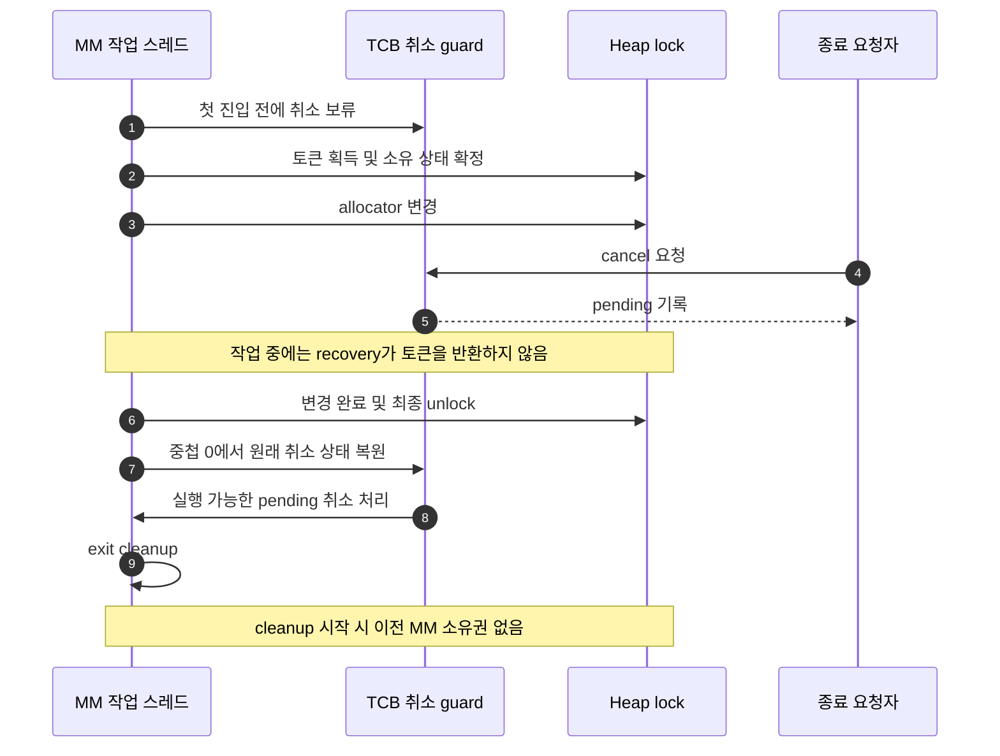
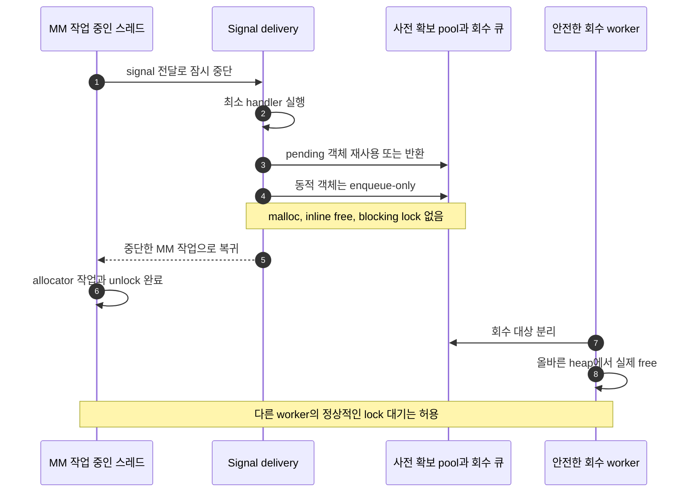
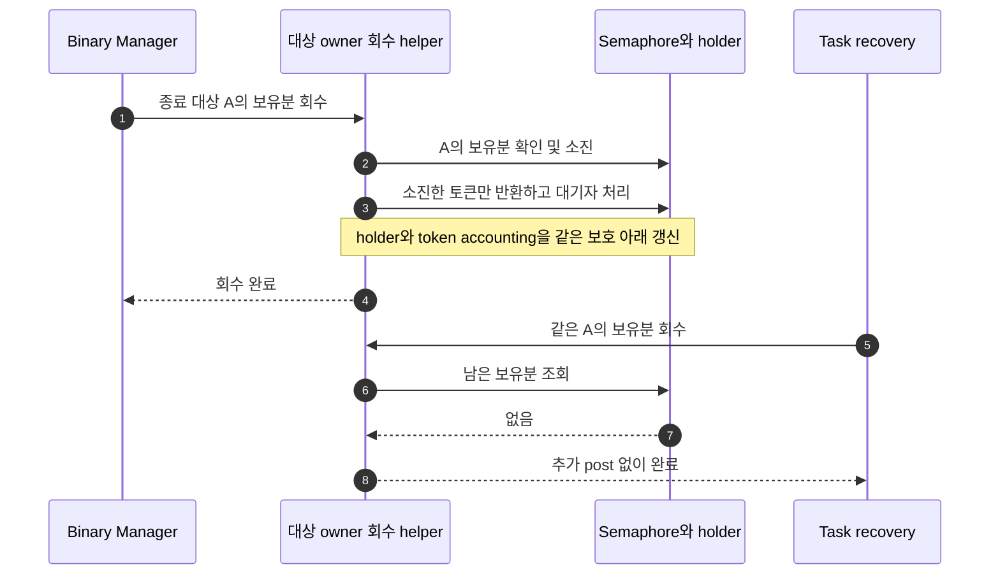

# MM semaphore 소유자 assert: 세 이슈의 수정 설계

작성일: 2026-09-17\
기준 소스: `master`, `29d2ed503c2915bd123ff020f5c76353aa19f34c`\
상태: **수정 설계. 제품 코드에 적용하거나 target에서 검증한 패치가 아니다.**

## 1. 결정 요약

세 이슈는 같은 assert에 도달할 수 있지만 깨뜨리는 불변식이 다르다. 따라서 하나의 `mm_holder` 보정으로 함께 해결하지 않는다.

| 이슈 | 깨지는 조건 | 권장 수정 | 수정 완료의 기준 |
| --- | --- | --- | --- |
| M1. MM 보유 중 자기 종료와 recovery | 하위 semaphore를 풀고도 종료 중인 실행이 MM 소유자로 계속 동작 | MM 구간의 취소 보류, 종료의 안전 지점 처리, 강제 종료의 heap 복구 정책 분리 | 살아 있는 MM 작업의 lock을 recovery가 반환하지 않음 |
| M2. 획득 상태 기록 중 signal 재진입 | `mm_holder`와 `mm_counts`의 중간 상태가 재진입 코드에 노출 | 앱 callback을 일반 실행으로 이동, 커널 signal bookkeeping에서 MM 제거, MM 상태 전이 통합 | signal 전달·후처리와 획득/반환 경계에서 부분 소유 상태를 사용하지 않음 |
| M3. Binary Manager와 task recovery의 중복 반환 | 같은 holder 보유분을 두 경로에서 반환 | 대상 holder의 보유분 소진과 토큰 반환을 하나의 내부 연산으로 통합 | 같은 보유분을 두 번 반환하지 않으며 PI·대기자 상태도 일치 |

**우선순위는 M3의 독립 수정 → M1과 종료 경로 정리 → M2의 공통 signal/MM 수정 및 framework 이전이다.** 이는 구현을 나누기 위한 순서다. 실제 제품에서는 켜진 설정과 실행 경로에 따라 배포 우선순위를 조정한다. M1·M2는 함께 검증해야 한다.

원인과 제어 시험의 자세한 근거는 [기존 세 이슈 분석](MM_Semaphore_Holder_Assert_Analysis.md)에 있다. signal 모듈별 수정은 [Signal 실행 구조 수정 설계](Signal_Execution_Model_Remediation_Design.md)에서 다룬다.

## 2. 관측 사실과 증거 수준

관측은 `heap->mm_holder == my_pid` assert 실패, 당시 `mm_holder=-1`, 빈번한 exit/cancel, 매우 드문 발생이다. 로그·콜스택·장애 펌웨어 설정은 없다. 사용자 소스의 210행은 이 기준 checkout에서는 [mm_sem.c:201](../../os/mm/mm_heap/mm_sem.c#L201)에 해당한다.

| 이슈 | 확인한 도달 경로 | 아직 확인하지 않은 것 |
| --- | --- | --- |
| M1 | 실제 관련 함수를 추출한 호스트 시험에서 SMP의 획득 상태 기록과 자기 종료 cleanup의 겹침 | 실제 보드에서 signal 전달부터 allocator 변경·종료 완료까지 실행 |
| M2 | 실제 MM 함수의 두 저장 사이에 같은 PID 재진입을 넣으면 take/try 양쪽에서 assert | target에서 자연 signal이 그 구간에 도착한 재현 |
| M3 | 실제 관련 함수를 연결한 호스트 시험에서 정상 초기 상태부터 `semcount: 0 → 1 → 2`와 assert | 전체 target binary unload 및 대기자·다중 보유분을 포함한 검증 |

따라서 “세 후보에 조건부 코드 경로가 있다”와 “이번 장애 원인을 확정했다”는 다른 결론이다. 호스트의 제어 지점 시험은 실제 발생 확률을 알려주지 않는다.

로컬 생성 설정은 SMP off, PI on, holder pool 16, protected + kernel heap, `CONFIG_BINMGR_RECOVERY` 활성 정의 없음이다. 장애 펌웨어가 같다면 **M1의 확인된 SMP 순서와 M3의 등록 기반 경로는 해당 장애 후보에서 제외**해야 한다. 이 사실은 해당 설정에서 실행되지 않는 결함의 소스 수정 필요성과 별개다.

## 3. 유지해야 할 불변식

표기의 `H`는 MM holder, `R`은 MM 재귀 횟수, `C`는 하위 semaphore count, `L`은 하위 holder의 보유 기록이다.

1. 하나의 heap에는 실제로 allocator를 변경하는 소유자가 최대 한 명이어야 한다. 같은 소유자의 내부 재귀는 별도로 관리한다.
2. 안정된 소유 상태에서는 `H=owner`, `R>0`이며 하위 lock이 그 소유권을 뒷받침해야 한다.
3. MM 재귀 획득 N번은 하위 semaphore 토큰 N개 획득이 아니다. 정상적으로 하위 토큰 하나를 가지고 `R`만 증가한다.
4. 반환할 holder 보유분을 먼저 확정하고, 그 보유분 하나당 반환을 정확히 한 번 수행한다. PI 변경·대기자 깨우기도 같은 연산의 일부다.
5. 소유권을 넘길 때 부분 상태를 재진입 코드가 정상 소유 상태로 해석하지 않아야 한다.
6. heap 메타데이터 변경이 끝나기 전에는 일반 취소로 소유자를 제거하지 않는다.

`C=0`만을 “누군가 보유 중”의 유일한 증거로 삼으면 안 된다. 대기자가 있으면 count가 음수일 수 있고, 깨운 task에 토큰을 전달하는 과정도 고려해야 한다. MM 소유 정보와 하위 holder의 순간 값을 아무 동기화 없이 읽어 불변식을 검사하는 것도 잘못이다.

## 4. M1: MM 구간을 종료에 대해 보호한다

### 4.1 현재 경로와 수정 지점

[thread_termination_handler](../../os/kernel/task/task_terminate.c#L274)에서 자기 `pthread_cancel`로 종료할 수 있다. [task_exithook](../../os/kernel/task/task_exithook.c#L612)의 recovery와 [sem_release_all](../../os/kernel/semaphore/sem_holder.c#L987)은 하위 semaphore 보유 기록을 정리하지만, MM의 `H/R`과 allocator 작업 완료를 함께 관리하지 않는다.

확인된 M1은 자기 종료 뒤 cleanup이 계속 MM을 사용하는 경로다. SMP에서 다른 CPU가 이미 얻은 토큰의 소유 상태를 기록하는 순간과 겹친다. 원격 취소로 대상이 먼저 실행 목록에서 제거되는 경로를 동일한 재현 순서로 취급하지 않는다.

권장 책임 분리는 다음과 같다.

| 책임 | 담당 위치 | 필요한 동작 |
| --- | --- | --- |
| MM 작업 중 일반 취소 보류 | MM lock 진입/반환과 TCB의 내부 guard | 첫 진입 전에 취소 보류, 마지막 안정된 반환 뒤 원래 상태 복원 |
| 종료 요청의 기록과 실행 | task/pthread cancellation 및 내부 종료 signal | guard 중에는 pending만 남기고 안전 지점에서 실제 종료 |
| 강제 fault/unload 판단 | Binary Manager·task recovery | 소유자가 사라진 heap을 재사용할 수 있는지 판단 후 복구 또는 재시작 |
| MM 소유 상태 일치 | MM 전용 lock/recovery 경로 | allocator 상태와 분리해서 `H=-1`만 쓰지 않음 |

### 4.2 취소 guard의 구체적 계약

새 이름은 설계용이다. 아직 존재하는 함수나 필드가 아니다.

```text
mm_operation_enter(): 취소 보류 진입, per-TCB 중첩 수 증가
mm_operation_leave(): 중첩 수 감소, 최종 진입분이면 원래 취소 상태 복원
```

이 두 내부 interface가 저장 위치·기존 취소 상태·중첩·실패 복구를 숨긴다. 호출자가 heap마다 별도의 이전 취소 상태를 저장하게 만들지 않는다.

- 첫 guard는 **MM 토큰 획득 전**에 진입한다. 이미 MM을 가진 뒤 disable하면 늦다.
- 상태는 현재 TCB에 둔다. shared heap에 old-state를 두면 다음 소유자가 덮거나 여러 heap 중첩이 꼬일 수 있다.
- take, try, 재귀 획득, 여러 heap 중첩을 모두 짝맞춘다. try 실패·오류 반환도 guard를 해제한다.
- 마지막 give에서 allocator 변경, `H/R` 정리, 하위 토큰 반환, 필요한 lock 해제가 끝난 후 취소 상태를 복원한다.
- 복원은 즉시 종료할 수 있다. 복원 뒤에는 heap 객체나 해제 완료 객체에 접근하지 않는 제어 흐름이어야 한다.
- 이미 사용자나 상위 OS 코드가 취소를 껐다면 그 상태를 유지한다. 내부에서 무조건 enable하지 않는다.
- idle, 초기화, 문맥 전환 등 정상 TCB를 사용할 수 없는 MM 경로는 별도 내부 경로로 다룬다. 사용자용 취소 API를 무조건 호출하지 않는다.

[task_setcancelstate](../../os/kernel/task/task_setcancelstate.c#L95)는 이미 `NONCANCELABLE`, `CANCEL_PENDING`, `CANCEL_DOOMED`를 다룬다. 특히 DOOMED 상태에서는 disable 요청 자체가 종료로 이어질 수 있다. 그러므로 진입 전 보호가 필요하다. [SmartFS semtake/give](../../os/fs/smartfs/smartfs_utils.c#L209)에 취소 보류를 lock 구간에 적용한 예가 있다. 복사만으로 MM의 특수 문맥까지 해결되는 것은 아니다.



guard를 진입시킬 때의 상태 갱신 역시 signal/원격 취소와 직렬화해야 한다. 중첩 수만 먼저 올리거나, disable 전에 old-state를 노출하는 새 경쟁을 만들지 않는다. TCB 필드와 기존 cancellation 상태 전이를 같은 내부 보호 규칙으로 묶는다.

실제 종료는 호출자가 이미 보유한 IRQ/SMP critical section까지 벗어난 안전 지점에서 실행해야 한다. 기존 `task_setcancelstate()`를 외부 critical section 안에 단순 삽입하면, 함수 자신의 lock을 풀어도 바깥 lock은 남아 있을 수 있다. guard의 상태 변경과 `do_exit` 실행을 분리해 이 조건을 지킨다. 또한 MM 획득 대기 중 취소를 보류하는 설계는 취소 응답 시간을 늘리므로, 사라진 owner 때문에 무기한 대기하지 않도록 아래 강제 복구 정책과 함께 검증한다.

### 4.3 guard만으로 처리되지 않는 종료

직접 `pthread_exit/exit`, 강제 task 삭제, task 재시작, fault 기반 binary recovery는 일반 취소 보류를 우회할 수 있다. 각 진입점에서 guard/heap 소유 상태를 확인하는 정책이 필요하다.

- 내부 종료 signal은 요청만 기록한다. 자기 `pthread_cancel` 및 `pthread_join`을 handler에서 수행하지 않는다.
- 정상 종료 요청은 MM 구간이 끝나는 안전 지점까지 기다린다. 모든 종료 요청을 단순히 `pthread_cancel` 호출로 바꾸는 것은 충분하지 않다.
- 복구 불가능한 fault에서는 allocator 코드가 중간까지 실행됐을 수 있다. lock 반환으로 free-list, 크기·통계 등 heap 일관성이 복구되는 것은 아니다.
- 격리된 binary 전용 heap 전체를 폐기할 수 있다면 해당 heap과 참조를 정지·폐기한 후 재생성한다. 공유 kernel heap 손상 가능성이 있으면 시스템 재시작 등 상위 복구 정책이 필요하다.
- 복구 시에는 대상 CPU/스레드가 더 이상 heap을 만지지 않는다는 정지가 먼저다. 단순 PID 확인이나 `sched_lock()`만으로 SMP 정지를 증명하지 않는다.
- MM semaphore를 일반 recovery에서 제외하기만 하면 영구 대기가 생긴다. 제외와 동시에 대기자 실패/격리/재시작 정책을 구현해야 한다.

이 구분은 실제 allocator의 rollback 기능 없이 “죽은 소유자의 lock만 robust하게 반환하면 된다”는 설계를 피하기 위한 것이다.

## 5. M2: 부분 소유 상태와 signal의 MM 재진입을 함께 없앤다

### 5.1 두 대입문의 순서만 바꾸지 않는다

[take의 177–178행](../../os/mm/mm_heap/mm_sem.c#L177), [try의 129–130행](../../os/mm/mm_heap/mm_sem.c#L129)은 `H`와 `R`을 별도로 기록한다. 그 사이 같은 PID가 MM에 들어오면 잘못된 재귀 깊이를 사용할 수 있다.

`R`을 먼저 쓰기, `volatile` 추가, assert 삭제, 재귀 mutex 치환만으로 allocator 재진입을 지원할 수 없다. 심지어 두 저장을 짧은 critical section으로 감싸도 **토큰 획득 직후부터 그 critical section 진입 전까지**, 그리고 **최종 상태 초기화부터 post까지**의 전이는 따로 남는다.

### 5.2 우선 수정: 커널 signal 전달의 bookkeeping을 할당 없이 수행

앱이 빈 handler만 실행해도 [sig_deliver](../../os/kernel/signal/sig_deliver.c#L209) 후처리에서 pending action 할당 및 동적 객체 free가 발생할 수 있다. 이를 앱의 잘못으로만 돌릴 수 없다.

| 현행 동작 | 권장 구조 |
| --- | --- |
| action pool 부족 시 `kmm_malloc` | delivery에서는 준비된 pool만 사용. 보충은 안전한 worker 문맥 |
| `sched_kfree`의 same-PID try 성공 뒤 즉시 free | signal dispatch 전체에서는 반드시 enqueue-only 해제 |
| pending signal을 action으로 변환하며 새 객체 요구 | 객체 예약 또는 소유권 이동으로 변환 실패를 관리. 처리 중인 pending을 먼저 버리지 않음 |
| pool 고갈 시 호출자가 암묵적으로 성공/유실 처리 | 신규 전송의 명시적 오류 또는 기존 pending 유지·재시도. 지원하는 signal 의미에 맞춰 정의 |

`sched_kfree`는 ISR이 아니고 try가 성공하면 즉시 해제한다. 같은 PID의 MM 재귀 try가 성공할 수 있으므로 현재 함수 이름만으로 지연 해제를 보장하지 않는다. [sched_free.c:156](../../os/kernel/sched/sched_free.c#L156)

제안하는 `sched_defer_free`는 enqueue-only인 **새 내부 interface**다. 이미 해제할 객체의 공간 또는 사전에 준비한 node를 이용하고, 큐 삽입에서 MM·stdio·대기 가능한 lock을 사용하지 않는다. kernel/user heap과 allocator 종류를 보존하며 실제 free는 안전한 문맥에서 실행한다.

worker wake도 이 제약의 일부다. 현재 [work_qsignal](../../os/wqueue/work_signal.c#L85)은 `kill(SIGWORK)`를 사용한다. 기존 delayed-free 코드를 복사해 이 함수를 호출하면 signal 객체 확보 경로로 다시 들어갈 수 있으므로, allocation-free wake를 사용하거나 wake 실패 후에도 idle/worker가 반드시 회수하는 규칙을 둔다.

여기서 안전 문맥은 “IRQ가 아니다”만으로 판단하지 않는다. signal 전달 중인 스레드에서 allocator나 garbage collector가 재귀 호출되어 같은 대기열을 즉시 비우지 않게 해야 한다. [sched_garbage.c](../../os/kernel/sched/sched_garbage.c#L151) 및 allocator 내부 delayed-free drain도 함께 점검한다.



pool 크기만 늘리는 것은 확률 완화다. 최대 pending 수와 고갈 시 동작, 변환 중 객체 소유권, IRQ 예약분 분리를 정해야 수정이 완결된다. 보충 worker가 없다면 고정 pool + 명시적인 한도/오류 계약을 선택할 수 있다.

### 5.3 MM 상태 전이의 최종 구조

목표는 `mm_sem + H/R + recovery`의 서로 다른 소유권 표현을 하나의 MM lock module에 모으는 것이다. 호출자는 `take/try/give`만 알고, 내부가 소유자·재귀·취소 guard·종료 검사를 관리한다.

| 빌드 | 설계 방향 | 주의점 |
| --- | --- | --- |
| Kernel/flat UP | 토큰 획득 확정과 소유 기록, 최종 소유 정리와 post의 전이를 내부 primitive에서 보호 | 일반 blocking wait를 긴 IRQ-off 구간으로 감싸지 않음 |
| Kernel/flat SMP | 모든 소유 상태 접근과 recovery가 동일한 SMP 보호 규칙 사용 | `sched_lock()`은 다른 CPU를 배제하지 않음. 기다리는 동안 spinlock 보유 금지 |
| Protected UMM | 커널이 지원하는 MM lock 전이/전달 보류 interface 설계 또는 커널 관리 lock 상태로 이전 | 사용자 영역에서 kernel IRQ primitive를 직접 호출하는 패치 금지. 포인터·heap lifetime과 syscall 비용 평가 |

가장 작은 수정 묶음은 먼저 **OS가 전달 과정에서 MM에 재진입하지 않게 하고, 잘못된 framework callback을 일반 실행으로 옮기는 것**이다. 그 뒤 lock 상태 전이 통합을 별도 패치로 검증한다. “두 store를 감쌌으므로 모든 창이 닫혔다”는 식으로 완결을 선언하지 않는다.

signal 전달 보류를 선택한다면 단순 필드 하나가 아니라 계약이 필요하다. 보류 시작은 토큰 획득 전, 종료는 안정된 상태 뒤여야 하고, 즉시 자기 전달·원격 CPU 전달·syscall 복귀를 모두 검사해야 한다. wait 중 취소/신호 처리, 보류 시간, pending 신호의 재전달도 정의한다. 이 작업은 타깃 architecture별 구현 확인이 필요하므로 이 문서에서 완료된 최소 패치라고 주장하지 않는다.

이 설계는 POSIX signal handler의 `malloc/free` 사용을 지원하는 약속이 아니다. 합법적인 최소 handler도 깨뜨리는 OS 내부 경로를 제거하고, allocator와 종료의 내부 불변식을 지키는 목적이다. [POSIX signal 규칙](https://pubs.opengroup.org/onlinepubs/9799919799/functions/V2_chap02.html#tag_16_04_03)

## 6. M3: 회수는 대상 보유분마다 정확히 한 번

### 6.1 현재 결함과 작은 수정 방향

[binary_manager_release_binary_sem](../../os/kernel/binary_manager/binary_manager_load.c#L691)은 대상 holder를 찾은 뒤 count를 올리고 `sem_unblock_task`를 호출한다. PI 활성 경로에서는 holder 보유 count가 남을 수 있어 뒤의 task recovery가 다시 반환한다.

최소 수정 방향은 **실제 대상 holder의 보유분을 먼저 감소시키고 반환하며, 제거 후에도 안전하게 순회**하는 것이다. Binary Manager 자신이 owner인 것처럼 일반 `sem_post()`를 호출하면 잘못된 holder를 대상으로 할 수 있다.

이전에 수행한 MM의 한 토큰 사례에 대한 방향 확인에서는 `sem_releaseholder(sem, 대상 TCB)`를 count 증가보다 앞에 두고, holder가 제거되기 전에 다음 항목을 보존했다. 원본은 assert, 후보는 중복 진입 차단으로 끝났다. 이 결과는 [보존한 출력](remediation-design/evidence/binary-mm-fix-direction.txt)에 있다. **PI on, 대기자 없음, 보유분 1인 호스트 시험이며 일반 semaphore 수정의 검증 완료가 아니다.** 이번 문서 작성에서 새로 실행한 시험도 아니다.

### 6.2 최종 내부 interface

권장 형태는 semaphore module 안의 대상 owner 기반 회수 helper다. 다음 이름은 설계용이다.

```text
sem_recover_owner(sem, terminated_owner)
  1. 해당 owner가 실제로 가진 보유분과 회수 가능한 lock 종류를 확인
  2. 보유 기록을 소진하거나 제거
  3. 소진한 수만큼 토큰 반환 또는 대기자에게 전달
  4. PI 및 대상 TCB의 holder 목록 정리
  5. 이미 회수한 owner면 추가 반환 없이 종료
```

Binary Manager와 per-task recovery가 같은 helper를 사용한다. 호출자는 `semcount`, holder linked list, 우선순위를 직접 수정하지 않는다. MM처럼 별도 복구 정책이 필요한 lock은 M1의 정책으로 먼저 분기한다.



일반화할 때 반드시 확인할 사항:

- linked holder와 embedded holder(`CONFIG_SEM_PREALLOCHOLDERS=0`) 양쪽.
- PI on/off 및 semaphore의 protocol별 holder 정책.
- 하나의 holder가 여러 count를 보유한 counting semaphore. MM의 재귀 `R`과 혼동하지 않음.
- 대상 binary에 여러 holder가 있고 다른 binary holder도 섞인 경우.
- 반환마다 깨우는 대기자, holder 이전, PI 복원, 취소 중인 대기자와의 직렬화.
- callback/helper 안에서 holder가 free되면 `holder->flink`를 다시 읽지 않음. 같은 critical section에서 순회 유효성 보장.
- TCB/PID 재사용 전 회수 완료. PID 숫자만으로 오래된 holder를 새 task와 연결하지 않음.
- recovery helper는 대상 owner와 정확히 일치하는 holder만 회수한다. 현재 일반 `sem_releaseholder`의 유일한 다른 holder를 선택하는 fallback을 종료 대상 검색에 재사용하지 않음.

`sem_release_all()`도 현재 holder 하나당 count를 한 번 올리는 구조다. 일반 보유분 N개로 helper를 확장할 때는 이 부분까지 검토해야 한다. M3의 한 토큰 결함 수정과 일반 counting semaphore 정합성 확대를 구분해 제출한다.

## 7. NuttX에서 참고할 점과 그대로 옮기면 안 되는 점

참조는 로컬 `nuttx/nuttx` checkout의 `f1837981fa06dba9fdc2772b5433317246625e19`다. 최신 upstream 전체의 안전성을 평가한 것이 아니다. 아래 링크는 비교에 사용한 NuttX 커밋의 고정 소스 링크다.

| NuttX 구현 | 참고할 점 | TizenRT 적용 시 차이 |
| --- | --- | --- |
| [mm_heap/mm.h의 mutex](https://github.com/apache/nuttx/blob/f1837981fa06dba9fdc2772b5433317246625e19/mm/mm_heap/mm.h#L225), [mm_lock](https://github.com/apache/nuttx/blob/f1837981fa06dba9fdc2772b5433317246625e19/mm/mm_heap/mm_lock.c#L61) | MM 잠금을 명시적인 mutex module로 관리 | TizenRT의 재귀 MM, protected UMM, recovery 규칙을 함께 설계해야 함 |
| [nxmutex_lock/unlock](https://github.com/apache/nuttx/blob/f1837981fa06dba9fdc2772b5433317246625e19/include/nuttx/mutex.h#L504) | semaphore primitive를 통해 lock 표현을 통합 | 새 NuttX의 mutex 상태 표현·원자 연산을 구형 TizenRT에 일부만 복사하면 안 됨 |
| [nxsig_alloc_pendingsigaction](https://github.com/apache/nuttx/blob/f1837981fa06dba9fdc2772b5433317246625e19/sched/signal/sig_allocpendingsigaction.c#L48) | 확인한 함수는 pool에서만 action을 얻으며 malloc fallback 없음 | pool 초기화·고갈·신호 변환 의미까지 검토 필요 |
| [mm_delayfree](https://github.com/apache/nuttx/blob/f1837981fa06dba9fdc2772b5433317246625e19/mm/mm_heap/mm_free.c#L84) | 해제할 메모리 자체를 delay-list node로 사용 가능 | `delay=true`여도 먼저 `mm_lock` 수행. 이번 enqueue-only interface로 그대로 쓸 수 없음 |
| [nxsig_release_pendingsigaction](https://github.com/apache/nuttx/blob/f1837981fa06dba9fdc2772b5433317246625e19/sched/signal/sig_releasependingsigaction.c#L86) | NuttX도 동적 종류의 release 분기가 존재 | `kmm_free`를 호출하는 분기가 있어 “signal 전체에서 MM이 없다”고 일반화 불가 |

NuttX의 설계는 참고 자료이며, 동일 파일 몇 개의 이식으로 이 세 이슈가 모두 해결된다는 근거는 아니다.

## 8. 패치 분리와 검증 계획

| 패치 | 범위 | 통과해야 할 시험 |
| --- | --- | --- |
| P1 | M3의 대상 holder 회수와 안전한 순회 | 원본 실패/수정 성공, 이중 recovery no-op, 다중 holder, waiter/PI, embedded holder |
| P2 | M1의 MM 취소 guard와 종료 요청 정책 | 획득 전·대기 중·보유 중·최종 post 전후 cancel, nested/try 실패, 기존 disable 보존 |
| P3 | M2/F9 signal pool·enqueue-only free | 빈 handler, pool 고갈, unmask 변환, same-PID MM 중단, 회수 지연/정확히 한 번 free |
| P4 | MM lock 상태 전이 통합 | take/try의 모든 전이 창, 최종 give/post 창, UP/SMP, protected user/kernel heap |
| P5 | framework signal 실행 구조 이전 | 별도 설계 문서의 F1–F10 및 종료/lifetime 시험 |

P2와 P3은 통합 종료 시험이 필요하다. P4는 architecture와 syscall 지원이 필요한 경우 별도 설계 검토 후 진행한다. 제품에서 활성인 F1 Binary Manager callback 이전은 P5 전체 완료를 기다리지 않고 병행 가능한 독립 수정이다.

검증 층을 구분한다.

1. **제어 순서 시험:** 기존 호스트 실패 시나리오를 그대로 유지해 원본 실패/수정 성공을 비교한다. 낮은 확률에 의존하지 않는다.
2. **실제 소스 단위의 오류 조건:** pool exhaustion, 실패 반환, holder 삭제, PI, waiter 취소를 확인한다.
3. **target 실행:** 실제 signal trampoline, cancellation, binary unload, SMP, user/kernel heap이 함께 동작하는 환경에서 확인한다.
4. **장시간 부하:** exit/cancel·signal·MQ pool 압박을 결합한다. 무발생은 도달 경로 차단 시험을 대신하지 않는다.

진단은 사전 확보한 고정 버퍼에 heap/sem/TCB 식별, CPU, 이벤트 순서, H/R/C/L, dispatch-depth, cancel guard-depth를 남기는 방식으로 한다. MM 내부에서 printf나 malloc을 추가해 관측 대상 자체를 바꾸지 않는다.

## 9. 제외한 단독 해결책

| 제안 | 충분하지 않은 이유 |
| --- | --- |
| assert 삭제 또는 `mm_holder=-1` 강제 대입 | 잘못된 동시 소유와 allocator 손상을 숨김 |
| `semcount`를 1로 clamp | stale holder와 waiter/PI accounting이 남음 |
| `H/R` 저장 순서만 교환 | 부분 상태와 획득·반환 전이 창이 남음 |
| `sched_lock()` 추가 | signal과 이미 실행 중인 다른 CPU를 모두 막는 수단이 아님 |
| signal에서 MQ를 `O_NONBLOCK`으로 변경 | 대기 조건 일부만 변경하며 할당·해제 재진입은 남음 |
| 모든 signal에서 malloc을 지원하도록 재귀 lock 확대 | allocator의 중간 변경 상태를 안전하게 만드는 설계가 아님 |
| 죽은 owner의 semaphore를 무조건 반환 | heap 일관성 확인 없이 다른 task를 손상된 heap으로 들여보냄 |

문서에 담긴 것은 적용 방향과 수용 기준이다. 새 제품 코드 변경·빌드·보드 실행·수정 커밋은 이 작업에 포함하지 않았다.
