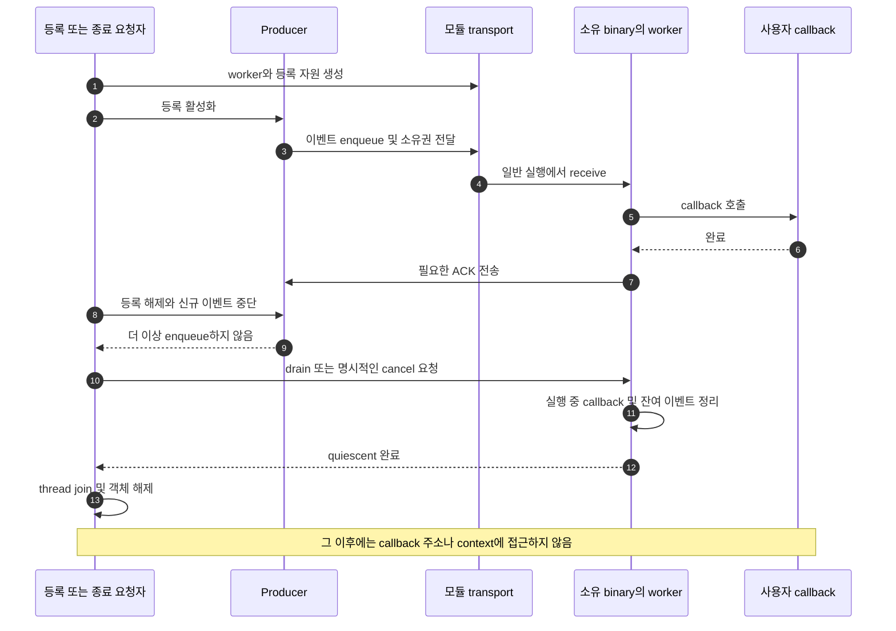
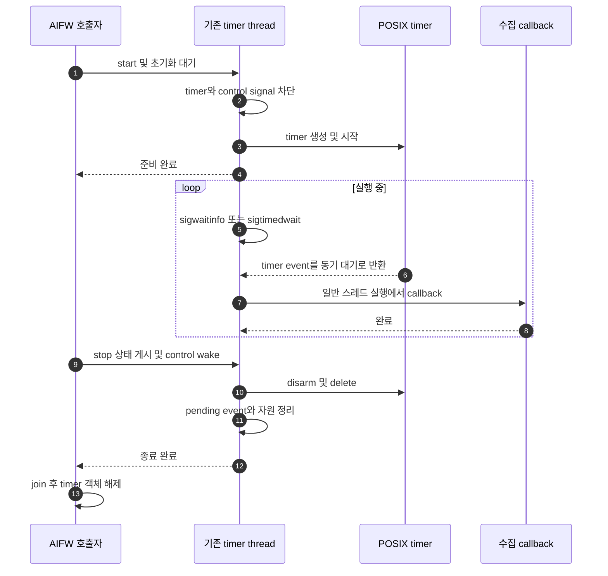

# Signal 실행 구조 수정 설계

작성일: 2026-09-17\
기준 소스: `master`, `29d2ed503c2915bd123ff020f5c76353aa19f34c`\
상태: **구조 설계. 아래 interface와 실행 흐름은 적용 전 제안이다.**

## 1. 결론: 처리 주체를 일반 실행 문맥으로 옮긴다

여러 handler가 실제로 MQ, allocator, stdio, mutex, 종료 처리를 수행한다. 그렇다고 모든 signal 함수 호출이 금지된 것은 아니다. `sem_post`나 `write` 등은 별도로 보장되는 함수이며, 일반 event loop의 timeout callback은 signal handler가 아니다. [POSIX signal 규칙](https://pubs.opengroup.org/onlinepubs/9799919799/functions/V2_chap02.html#tag_16_04_03)

권장 실행 구조는 세 가지로 제한한다.

| 현재 형태 | 선택할 구조 | 대표 대상 |
| --- | --- | --- |
| 먼저 MQ에 넣고 signal로 수신자를 깨움 | **수신 worker가 MQ를 직접 기다림**. 해당 내부 알림 signal 제거 | Binary Manager 상태 callback, Preference, Messaging; Task Manager는 현재 payload 전달 방식도 함께 변경 |
| timer용 thread가 이미 존재하지만 handler에서 callback 실행 | **그 thread가 signal을 동기적으로 기다린 뒤 callback 실행** | AIFW |
| 외부 signal 자체를 계속 수신해야 함 | **최소 signal bridge → 기존 event loop/worker** | libtuv, CU, 일부 샘플 |

커널 signal bookkeeping과 내부 종료 signal은 네 번째 별도 책임이다. 사용자 callback을 옮긴 뒤에도 [MM 이슈 수정 설계](MM_Semaphore_Remediation_Plan.md)의 M1/M2를 적용해야 한다.

근거 목록은 [Signal 안전성 감사](Signal_Handler_Async_Safety_Audit.md)에 보존했다. 이 문서는 그 감사의 F1–F10과 시스템 유틸리티·테스트·외부 예제를 모두 수정 대상으로 매핑한다. 저장소 밖 callback, prebuilt 코드, 모든 제품별 전처리 결과까지 조사했다는 의미는 아니다.

## 2. 모든 모듈에 적용할 실행 계약

### 2.1 handler의 역할

남기는 handler는 초기화가 끝난 안정된 알림 대상에 최소 통지를 보내고 복귀한다. MQ open/send/receive, malloc/free, 로그, 사용자 callback, 일반 mutex/sem_wait, 취소/종료/join은 worker에서 수행한다.

`errno`를 바꿀 수 있는 허용 함수를 호출하면 진입 시 저장하고 복귀 시 복원한다. 오류를 handler에서 printf로 보고하지 않는다. handler의 결과 확인용 assert도 실패 경로에 stdio/종료가 있으면 이 제약을 깨뜨릴 수 있다.

**아무 공유 구조나 handler에서 수정하고 sem_post하는 방식은 기본안이 아니다.** signal-safe 함수와 공유 메모리의 안전성은 별개다. `volatile`만으로 여러 CPU의 producer/consumer 큐를 만들지 않는다. 이 checkout의 [signal.h](../../os/include/signal.h)에는 `sig_atomic_t` 선언도 확인되지 않았다. lock-free atomic 지원·정렬·memory ordering을 확인하지 않고 C11 ring buffer를 필수 공통 기반으로 도입하지 않는다.

가장 작은 bridge는 payload를 옮기지 않고 안정된 기존 큐가 읽을 준비가 됐음을 알리는 것이다. payload 보관과 동기화는 이미 검증된 transport가 담당한다. 추가 payload가 필요하면 source가 일반 문맥에서 큐에 넣도록 경로 자체를 바꾼다.

### 2.2 TizenRT에 맞춘 알림 수단

| 수단 | 사용 조건 | 피할 오해 |
| --- | --- | --- |
| `sem_post` | 등록 전에 semaphore 생성, 수명 고정, consumer는 일반 문맥에서 wait | payload 소유권까지 해결하지 않음. 이벤트 개수와 semaphore count의 의미를 정의해야 함 |
| 비차단 pipe `write` | fd 사전 생성, 레코드 크기/원자성 확인, full/short write 정책 존재 | 파이프가 찼다고 무조건 알림을 버리면 안 됨 |
| `sigwaitinfo/sigtimedwait` | 대상 signal을 기다리는 thread에서 block하고 그 thread로 라우팅 | handler 내부에서 wait하는 방식이 아님 |
| `work_queue` | 일반 문맥 또는 해당 kernel interface가 보장하는 문맥에서 사용 | POSIX signal-safe 대체 함수로 간주하지 않음 |

TizenRT의 이벤트 semaphore는 PI를 끄는 처리가 필요하다. 생성 직후 `sem_setprotocol(SEM_PRIO_NONE)`을 적용하는 이유가 [semaphore.h:181](../../os/include/tinyara/semaphore.h#L181)에 설명돼 있다. 이는 producer가 post하고 consumer가 wait하는 이벤트 모델이 lock owner 모델과 다르기 때문이다. PI가 없는 설정에서는 해당 분기를 설정에 맞게 처리한다.

POSIX가 허용하는 함수라는 사실과 현재 RTOS 구현의 전체 호출 경로가 그 보장을 만족하는지는 구분한다. 새 bridge의 초기화·post/write·오류·종료 경로를 실제 설정에서 검증하고, 특히 커널 F9 수정 없이 모든 내부 signal 생성·반환이 이미 allocation-free라고 가정하지 않는다.

[work_qqueue](../../os/wqueue/work_queue.c#L124)는 `CONFIG_SCHED_USRWORK && !__KERNEL__`에서 `work_lock()`을 기다린다. 따라서 “handler에서 사용자 work_queue만 호출하도록 바꾸면 된다”는 수정은 채택하지 않는다. kernel work queue 사용 가능성과 user signal handler에서의 사용 가능성도 구분한다.

### 2.3 callback 실행 계약을 공개한다

worker로 옮기면 `getpid/pthread_self`, TLS, 우선순위, stack, reentrancy, callback 순서가 달라질 수 있다. 기존 등록 스레드에서 실행된다는 계약이 있다면 내부 변경만으로 취급하면 안 된다.

권장 기본값은 **등록한 binary/task group 안의 직렬 callback executor**다. 같은 모듈에서 대상·주소 공간·직렬화 계약이 같은 등록은 하나의 worker를 공유할 수 있다. 처음부터 handler마다 thread를 하나씩 만들거나 전체 OS의 모든 callback을 하나의 worker로 합치지 않는다.

특정 스레드의 실행 문맥을 반드시 보존해야 하는 callback은 그 스레드의 event loop/safe point에서 처리한다. 임의 명령에서 중단한 스레드에 복잡한 callback을 실행하면서 동시에 async-signal-safe 제약을 없애는 방법은 없다. 이 경우 협력적인 pump/safe-point 계약이 필요하다.

커널 worker가 앱 callback 주소를 직접 호출하는 설계는 기본안에서 제외한다. protected build의 주소 공간, 권한, stack과 binary unload 수명 문제가 있기 때문이다.

## 3. 큐와 callback 수명의 공통 계약

### 3.1 모듈 내부 interface

불필요한 공용 event bus를 새로 만들지 않는다. 먼저 각 모듈의 현재 등록/해제 interface 뒤에서 다음 책임을 구현한다. 동일한 계약이 실제로 반복되는 부분만 이후 private utility로 추출한다.

```text
register(callback, context)
  worker와 transport 준비 → 등록 완료 후 producer에게 공개

dispatch(event)
  정상 실행에서 수신 → 대상/세대/순서 확인 → callback → 필요한 ACK

unregister 또는 stop
  신규 입력 중단 → 기존 입력과 실행 중 callback 정리 → 수명 회수
```

event에는 대상, event 종류, correlation/sequence, 등록 generation, payload 길이/소유 규칙을 정의한다. 모든 필드를 무조건 모든 메시지에 넣는다는 뜻은 아니다. 현재 프로토콜이 이미 보장하는 정보는 재사용한다.

- producer의 stack 주소를 비동기 payload로 넘기지 않는다.
- 같은 주소 공간에서 pointer 전달을 유지한다면 enqueue 성공 시 소유권 이전/참조 유지, 실패 시 회수 주체를 명시한다.
- binary/주소 공간 사이에는 포인터를 기본 transport로 삼지 않는다. 기존 ABI를 유지해야 하는 곳은 유효성·pin·generation을 함께 관리한다.
- 한 이벤트를 callback이 여러 번 처리하지 않게 하고, 전달이 실패했다면 producer/요청자에게 실패가 돌아가야 한다.
- callback은 등록 table이나 transport lock을 잡은 채 호출하지 않는다. callback의 재등록/해제/reply가 같은 lock을 다시 요구할 수 있다.

### 3.2 종료 순서



| 상태 | 허용 동작 | 수명 규칙 |
| --- | --- | --- |
| PREPARING | 자원 생성, 실패 rollback | producer에게 아직 공개하지 않음 |
| ACTIVE | enqueue, dispatch | registry·queue·실행 중 callback 각각 필요한 참조 유지 |
| STOPPING | 기존 이벤트의 drain/cancel, 실행 중 callback 완료 | 새 이벤트 거부. 객체·fd·semaphore는 아직 유지 |
| QUIESCENT | join/최종 정리 | producer·handler·worker의 접근 종료를 확인 |
| DESTROYED | 없음 | 이전 generation의 메시지를 새 등록으로 해석하지 않음 |

callback 안에서 자기 unregister/stop을 호출하면 같은 worker를 join하거나 자기 완료를 기다리면 안 된다. 이 경우 stop 요청을 기록하고 callback 반환 뒤 retire한다. 동기 완료가 필요한 다른 호출자는 별도 정상 스레드에서 기다린다. binary unload 또한 이 완료 지점을 기다린 후 callback 코드와 data를 해제한다.

stop 메시지가 가득 찬 일반 data 큐 뒤에 영원히 막히지 않게 한다. 제어용 예약 슬롯, 별도 wake/control 경로, 또는 bounded wait + stopping 상태 재확인 중 모듈에 맞는 방식을 선택한다. 실패를 이유로 worker를 MM 보유 도중 강제로 cancel하는 기본 정책은 사용하지 않는다.

### 3.3 포화와 순서

| 이벤트 의미 | 기본 정책 |
| --- | --- |
| request/reply, Binary Manager 상태 전이와 ACK | 유실·임의 합치기 금지. 요청 실패 또는 제한된 backpressure를 명시 |
| notification으로 “현재 상태가 바뀌었다”만 의미 | 계약이 허용하는 경우에만 version 기반 합치기 |
| 주기적인 샘플링 tick | skip/overrun 누적/제한된 catch-up 중 의미를 결정 |
| 종료·해제 control | data 큐 포화에도 완료 또는 명시적인 실패가 가능한 경로 |

알림 한 번과 메시지 한 개가 반드시 같지는 않다. 특히 POSIX signal은 종류와 구현에 따라 합쳐질 수 있다. 실제 transport를 모두 drain하고 안정된 empty 상태까지 확인하는 consumer가 필요하다. pipe full을 무시하려면 **필요한 모든 pending 상태가 별도로 안전하게 보존되며 이미 전달된 wake가 그 상태를 모두 drain한다**는 증명이 먼저다.

## 4. F1: Binary Manager 상태 callback

현행 [binary_manager_signal_cb](../../framework/src/binary_manager/binary_manager_register_callback.c#L62)는 큐 이름 생성, open/getattr/receive, 사용자 callback, MQ 응답, close와 오류 로그를 수행한다. 이 전체를 상태 callback worker로 옮긴다.

권장 흐름:

1. 등록 시 해당 binary/task group에 callback worker와 수신 MQ를 준비한다. descriptor와 이름을 등록 단계에서 확보한다.
2. Binary Manager는 그 수신 MQ에 기존 state message를 넣는다. 새 protocol에서는 `SIGBM_STATE` 전송을 제거한다.
3. worker가 `mq_receive()`로 기다리고 메시지별 callback을 직렬 실행한다. 일반 실행이므로 MQ·로그·메모리 사용이 가능하다.
4. `need_response`는 **callback 완료 후** ACK한다. enqueue 또는 worker wake 직후에 성공 응답하지 않는다.
5. unregister/unload는 producer 정지, 미처리 상태 전이 처리/실패 응답, 실행 callback 완료, worker 종료 순으로 수행한다.

응답에 대상/요청 correlation이 충분한지 확인한다. 기존 response가 result 중심이므로 여러 요청을 병렬화한다면 기존 직렬화 계약을 유지하거나 request ID를 추가해야 한다. 포인터 `state_data.callback`을 유지할 경우 registered object 참조와 generation이 수신 완료까지 유지돼야 한다.

Binary Manager가 ACK를 기다리는 동안 callback이 다시 Binary Manager 요청을 보내는 순환 대기도 검토한다. manager의 상태 기계가 callback 응답 대기 중 처리해야 할 요청을 진행할 수 있도록 하거나, 동기 재진입을 허용하지 않는 callback 계약을 명시한다. worker 이전만으로 이 대기는 자동 해소되지 않는다.

기존 sender와 새 receiver를 혼합 배포할 경우 signal을 제거한 receiver에 구형 sender가 여전히 signal을 보내지 않게 protocol/version 또는 설정을 맞춘다. handler를 먼저 삭제하고 sender를 나중에 고치는 순서는 피한다.

시험: 여러 state 순서, ACK 지연·실패, callback의 재등록/자기 해제, 큐 포화, unload 직전 pending callback, 바이너리 재시작 후 옛 메시지. 이 경로는 `CONFIG_BINMGR_RECOVERY`와 별개이며 로컬 `CONFIG_BINARY_MANAGER`는 켜져 있다.

## 5. F2–F3: Task Manager 메시지·종료·정지

### 5.1 Unicast/broadcast

[taskmgr_msg_cb](../../framework/src/task_manager/task_manager_set_callback.c#L48)의 `TM_ALLOC/TM_FREE`, payload 조합, callback을 recipient의 일반 dispatcher로 옮긴다. 현재 signal 인자에 의존하는 payload도 정상 문맥의 producer에서 소유권이 정의된 큐에 넣도록 바꾼다.

- unicast request와 reply의 correlation 및 timeout 결과를 유지한다.
- broadcast 수신자별 payload 수명을 분리한다. 공용 payload를 쓴다면 마지막 consumer까지 참조를 유지한다.
- `task_manager_reply_unicast()`의 malloc/MQ 동작은 callback이 일반 문맥으로 옮겨진 뒤 실행한다.
- callback 실행 중 수신자 종료·등록 해제가 오면 진행 중/미시작 이벤트를 구분해서 reply 실패를 완료한다.
- 기존 callback이 등록 task의 PID/TLS를 전제한다면 독립 worker 이전의 동작 변경을 문서화한다. 동일 task 요구가 확정되면 cooperative dispatcher를 사용한다.

관련 소스: [callback 등록](../../framework/src/task_manager/task_manager_set_callback.c#L213), [reply 구현](../../framework/src/task_manager/task_manager_unicast.c#L113).

### 5.2 Stop callback과 실제 종료

[taskmgr_stop_cb](../../framework/src/task_manager/task_manager_set_callback.c#L122)의 callback/free와 [taskmgr_update_stop_status](../../framework/src/task_manager/task_manager_core.c#L431)의 ioctl/종료/free를 분리한다.

```text
Task Manager control 요청
  → 대상의 정상 실행에서 stop callback
  → STOP_CALLBACK_DONE 또는 실패 응답
  → control thread에서 종료 요청
  → MM guard 등 안전 지점 후 실제 task 종료
  → 완료 상태 회수
```

`sigqueue()`가 허용 함수라는 사실은 그 앞의 free와 사용자 callback을 정당화하지 않는다. 새 구조는 ACK도 기존 메시지/control transport로 처리할 수 있다. 응답 유실 시 무기한 대기하지 않도록 timeout과 실패 상태를 정의한다.

### 5.3 Pause/resume

[taskmgr_pause_handler](../../framework/src/task_manager/task_manager_core.c#L359)의 `sigpause()`를 금지 함수로 분류하지 않는다. 문제는 lock을 보유한 임의 지점에서 정지할 수 있다는 계약이다.

권장 구조는 `PAUSE_REQUESTED → 자원 반환 가능한 safe point → PAUSED_ACK → RESUME`이다. pause를 수행할 스레드는 MM·모듈 lock을 잡지 않은 지점에서 정지한다. 응답하지 않는 task를 무조건 suspend하는 기능을 유지한다면 강제 중단 API로 분리하고 공유 자원 일관성을 보장하는 정상 pause로 표현하지 않는다.

시험: callback 안의 reply, unicast timeout과 종료 경합, stop callback 자기 해제, pause 요청 당시 MM·파일 lock 보유, resume/stop 동시 요청.

## 6. F4: Preference 변경 callback

[preference_signal_cb](../../framework/src/preference/preference_callback.c#L31)의 snprintf/MQ 전체/user callback/로그를 preference notification worker로 이동한다. 등록 때 persistent queue/descriptor를 만들고 변경 producer가 직접 enqueue한다.

- key/value 문자열의 수명을 callback 종료까지 보장한다. 반환 후 저장하려면 callback 쪽에서 복사하는 계약인지 명시한다.
- “매 변경마다 callback” 계약이면 이벤트를 합치지 않는다. “최신 상태 재조회” 계약이면 key별 version을 전달하고 합치기를 허용할 수 있다.
- private/shared preference는 소유 binary와 접근 권한에 맞춰 라우팅한다.
- unregister는 등록 generation을 닫고 해당 callback 완료를 기다린다. descriptor close/unlink는 그 뒤 수행한다.

시험: 같은 key 빠른 반복 변경, 다중 key, callback 안에서 preference 재조회/변경, unregister 후 재등록, binary 종료 중 notification.

## 7. F5: Messaging IPC

[messaging_run_callback](../../framework/src/messaging/messaging_common.c#L184)은 수신·buffer 할당·파싱·callback·free·close/unlink·`mq_notify` 재등록을 수행한다. 이 루프를 port 소유자의 정상 receiver로 옮긴다.

기본안은 `mq_notify → signal` 연결을 없애고 worker가 MQ를 직접 받는 것이다. 여러 port가 있으면 기존 transport가 제공하는 wait/poll 지원을 먼저 확인하고, 지원되지 않는 기능을 가정해 단일 polling worker를 제안하지 않는다. port별 worker 비용과 기존 event loop 결합을 비교한다.

`mq_notify`를 유지해야 한다면 등록과 drain 사이의 missed wake 경합을 검증한다. notification은 큐 전체가 비워졌다는 보장이 아니므로 현재처럼 handler 실행 1회에 메시지 1개만 처리한 뒤 끝나는 구조를 그대로 옮기지 않는다.

payload 버퍼는 receive 성공 뒤 callback 종료까지 receiver가 소유한다. callback이 asynchronous reply를 위해 보관할 수 있는지와 copy 필요 여부를 정의한다. error path의 free 대상은 실제 소유 포인터 기준으로 정리한다. 별도의 pointer 결함이 확인되면 그 수정과 실행 문맥 변경을 구분한다.

시험: 다중 sender, request/reply 순서, 큰 payload, 공용 MQ pool 고갈, port close/reopen과 옛 generation 메시지, notification 재등록 경합, callback 자기 종료.

## 8. F6: AIFW timer

### 8.1 가장 작은 권장 변경

이미 있는 [aifw_timerthread_cb](../../framework/src/aifw/aifw_timer.cpp#L130)가 timer signal을 **block하고 `sigwaitinfo/sigtimedwait`로 받도록 변경**한다. [aifw_timer_cb](../../framework/src/aifw/aifw_timer.cpp#L235) handler 등록과 handler에서의 callback 실행을 제거한다.

[timer_create](../../os/kernel/timer/timer_create.c#L228)는 생성 thread를 `pt_owner`로 저장한다. 따라서 timer 생성도 기다릴 timer thread에서 수행한다. Linux의 process-wide signal 선택 규칙을 TizenRT에 그대로 가정하지 않는다.



### 8.2 timer 수명과 control

- 초기화 성공/실패를 start 호출자에게 전달한 후 timer를 공개한다. semaphore 초기화 전에 stop이 접근하지 않게 한다.
- stop/interval 변경은 정상 문맥에서 상태를 게시하고 reserved control signal 등으로 기다리는 thread를 깨운다. wait가 timer signal만 기다리면 기존 `sem_post` stop 요청으로는 깨어나지 않으므로 양쪽을 함께 수정한다.
- signal 번호와 목적 thread를 명확히 예약한다. timer 삭제 후 남은 이벤트는 살아 있는 객체와 generation에 대조하고 폐기한다.
- timer 객체를 handler payload의 raw pointer로 믿고 곧바로 dereference하지 않는다. waiter가 소유한 등록 상태로 유효성을 확인한다.
- callback이 느리면 중첩 실행하지 않고 직렬 처리한다. overrun은 샘플 누락 처리, 제한된 catch-up, 마지막 값만 사용 중 제품 의미에 맞춰 결정한다.
- callback 자신이 stop을 호출하면 상태만 바꾸고 반환한다. 자기 thread join은 하지 않는다. 외부 destroy는 종료 완료 후 수행한다.
- 기존 `aifw_timer_destroy()`의 즉시 `memset`처럼 실행 중 객체를 지우는 경로를 유지하지 않는다.

현재 [timer_create.c](../../os/kernel/timer/timer_create.c#L198)는 `CLOCK_REALTIME`만 허용한다. 이 작은 변경에서 확인 없이 `CLOCK_MONOTONIC` timer로 바꾸지 않는다. 벽시계 변경에 독립적인 주기 실행이 필요하면 별도 monotonic wait 구현을 검토하고 지원 범위를 시험한다.

`SIGEV_THREAD`로 상수만 바꾸는 대안도 현재는 사용할 수 없다. [signal.h](../../os/include/signal.h#L329)에는 `SIGEV_NONE/SIGEV_SIGNAL`만 있고 해당 실행 지원이 없다. 커널 기능 이식 없이 callback 문맥이 바뀌지 않는다.

이전 감사에서 확인한 CSV `fgets`, AI inference의 `new[]/delete[]`, data buffer의 mutex, 오류 정리의 free/로그/pthread_create는 위 구조에서 일반 callback 실행으로 함께 이동한다. 오류 정리 또한 종료 lifetime 계약을 따라야 한다.

시험: callback이 interval보다 느린 경우, stop/destroy와 tick 동시 발생, callback에서 self-stop, start 실패 rollback, interval 변경, timer 재시작, 다른 timer 신호와 구분, thread/descriptor 누수.

## 9. F7: libtuv TinyAra signal bridge

현행 [uv__signal_handler](../../external/libtuv/source/tinyara/uv_tinyara_signal.c#L143)는 `sem_wait`로 signal tree를 잠그고 handle을 순회한 뒤 pipe로 보낸다. worker 이전은 libuv의 callback을 임의 worker에서 실행한다는 뜻이 아니다. **callback은 기존 `uv_run` loop thread에서 실행**해야 한다.

권장 구조는 handler가 lifetime이 고정된 route에 `signum + route generation` 같은 작은 notification만 전달하고, handle 조회·목록 순회·caught/dispatched 관리·callback은 정상 loop 또는 정상 signal dispatcher에서 수행하는 것이다.

설계 시 닫아야 할 부분:

- `getpid()` 기반 PID hash bucket을 같은 것으로 재사용할 때 과거 이벤트가 새 task/loop에 전달되지 않음.
- loop별 fd를 handler가 참조하는 동안 close/reuse하지 않음. 먼저 route를 철회하고 진행 중 전달이 끝난 뒤 해제.
- 여러 loop가 같은 signal을 구독하는 경우 fan-out과 마지막 구독 해제를 정상 문맥에서 직렬화.
- signal generation 당시의 구독자와 dispatch 당시의 구독자 중 누구에게 전달할지 기존 의미 보존. raw handle 포인터를 queue에 넣었다면 handle 수명까지 pin.
- pipe full/short write를 단순 assert나 무조건 ignore로 처리하지 않음. 사전 확보된 pending 상태와 drain 규칙이 없으면 유실 없는 구현이라고 주장할 수 없음.

가능하면 TizenRT의 해당 실행 집단에서 안정된 signal 수신 thread가 동기 wait하고 loop pipe로 전달하는 방식을 우선 검토한다. 다만 task/thread별 signal 등록·라우팅과 libuv 공개 동작을 바꿀 수 있으므로 이 모듈은 별도 호환성 패치로 진행한다. handler route와 epoch를 원자적으로 관리할 primitive가 없다면, 검증되지 않은 lock-free table을 새로 만드는 대신 OS의 작은 지원 또는 동기 수신 구조를 선택한다.

다른 사본인 `external/iotjs/deps/libtuv/src/unix/signal.c`의 pipe 기반 lock과 이 TinyAra `sem_wait` 버전을 혼동하지 않는다. 전자의 구현을 일부 복사하는 것으로 전체 routing/lifetime을 해결하지 않는다.

시험: watch start/stop/close 연속 실행, 다중 loop/동일 signal, PID 재사용, fd 재사용, pipe 포화, signal 폭주 중 loop 종료, callback이 loop thread에서 실행되는지.

## 10. F8: libc AIO completion

[lio_sighandler](../../lib/libc/aio/lio_listio.c#L178)의 완료 검사·상태 복원·최종 notification·`lib_free`를 AIO completion의 정상 실행으로 옮긴다.

가능하면 I/O 완료를 이미 알고 있는 AIO 실행 측에서 목록 completion record를 갱신하게 한다. 각 I/O가 끝날 때 해당 record의 잔여 수를 줄이고, 마지막 완료가 목록 통지와 record 회수를 정확히 한 번 맡는다. 커널/사용자 영역 차이가 있으면 completion token을 소유 영역으로 전달한다.

이 구조에서는 사용자 최종 `SIGEV_SIGNAL` 통지를 제공하는 것과 libc 내부 처리를 handler로 수행하는 것이 분리된다. 외부에 요구된 최종 signal은 유지하되, 내부 malloc/free를 signal에 의존하지 않는다.

호환성상 내부 signal이 필요하다면 동기 waiter 또는 allocation-free 최소 알림을 거쳐 정상 completion worker에서 처리한다. handler에서 `lib_free`를 deferred free로 바꾸는 것만으로 completion list 수명·중복 완료 문제를 해결했다고 보지 않는다.

시험: zero/one/many I/O, 부분 제출 실패, I/O cancel, out-of-order completion, 마지막 두 완료의 경합, 기다리는 호출자 종료, completion notification 실패, record 정확히 한 번 해제. caller의 aiocb/buffer 수명 규칙도 그대로 보존한다.

## 11. F9–F10: 커널 공통 signal과 종료

### 11.1 F9: 사용자 handler가 비어 있어도 적용해야 한다

[sig_deliver](../../os/kernel/signal/sig_deliver.c#L209) 후처리의 pending 변환·할당·free는 MM 재진입을 만들 수 있다. 수정은 [MM 문서 M2](MM_Semaphore_Remediation_Plan.md)의 다음 묶음이다.

1. delivery 중 action/pending 할당을 사전 확보 pool·예약 객체로 제한한다.
2. 동적 객체 반환은 enqueue-only로 하고 actual free는 별도 안전 문맥에서 한다.
3. pool 고갈 시 이미 접수한 pending을 잃지 않으며, 새 요청의 실패와 재시도 규칙을 정의한다.
4. 객체 소유권을 pending → posted → retire로 한 번만 이동시킨다.
5. TCB에 delivery 전체를 나타내는 내부 상태가 필요하면 handler 호출만이 아니라 **unmask와 release 후처리까지** 포함한다.

architecture의 `xcp.sigdeliver` 하나만으로 모든 직접 전달 경로를 감지한다고 가정하지 않는다. 자기 signal의 직접 dispatch, syscall 복귀, 다른 CPU를 통한 전달을 함께 대조한다. handler가 정상 복귀하지 않는 내부 종료 경로도 TCB 및 queued object 정리가 중복되지 않아야 한다.

enqueue-only queue는 IRQ/SMP 규칙에 맞춰 보호하되, queue lock을 보유하고 actual free하거나 worker 완료를 기다리지 않는다. deferred free용 wrapper 자체를 malloc하면 목적을 잃는다. 같은 중단 스레드에서 garbage collection이 다시 drain하지 않는 조건도 필요하다.

### 11.2 F10: 내부 종료 signal

[thread_termination_handler](../../os/kernel/task/task_terminate.c#L274)는 앱이 POSIX SIGKILL handler를 등록한 예가 아니라 TizenRT 내부 종료 메커니즘이다. 이를 일반 사용자 handler 규칙 위반이라는 말만으로 설명하지 않는다.

정상 종료는 `요청 기록 → MM/OS 보호 구간 종료 → 정상 종료 절차`로 바꾼다. handler 안에서 자기 cancel을 즉시 실행하거나 join하지 않는다. M1의 per-TCB 취소 guard를 종료 요청 경로와 일관되게 사용한다.

강제 fault recovery는 별도 정책이다. allocator 중간 상태를 정상으로 복원할 수 없다면 heap 격리/폐기 또는 상위 재시작을 선택한다. generic `sem_release_all`로 토큰만 풀어 정상 실행을 계속시키는 구조를 회복 보장으로 취급하지 않는다.

시험: MM 획득 전후와 보유 중 자기 종료, 원격 cancel, task restart, binary unload, pending 종료 요청 여러 번, cleanup 중 추가 signal, 여러 heap 중첩, SMP 대상 정지.

## 12. 유틸리티·테스트·외부 예제의 수정 목록

아래 항목은 framework F1–F10 외에 이전 감사에서 찾은 범위를 모두 매핑한 것이다. Linux 전용 외부 예제를 현 TizenRT 장애 원인으로 주장하지 않는다.

| 대상 | 변경 방향 | 검증 기준 |
| --- | --- | --- |
| [CU sigint](../../apps/system/cu/cu_main.c#L135) | handler는 종료 요청 통지만. 정상 main/control 흐름에서 입출력 중단·cancel/join·close·exit | read 중 signal에도 종료 진행, cleanup 중복 없음. `close` 자체를 금지 함수로 오해하지 않음 |
| [RTC example](../../apps/examples/rtc/rtc_main.c#L198) | alarm은 wait/알림만. ioctl·printf를 main/worker로 이동 | alarm 정보 보존, fd 수명, 반복 alarm |
| [MM signal stress](../../apps/examples/testcase/le_tc/stress/stress_mm_sem_signal.c#L119) | 정상 최소 handler 회귀 시험과 의도적인 unsafe MQ 재진입 시험을 별도 모드로 분리 | unsafe 모드는 비정상 사용 주입 시험임을 표시. POSIX 준수 증거로 사용하지 않음 |
| [ostest signest](../../apps/examples/testcase/ostest/signest.c#L113) | handler의 출력·실패 보고를 사전 확보 관측 기록으로 바꾸고 일반 test thread에서 assert | signal 중첩이라는 원래 시험 의미 유지, 기록 포화 정책 |
| [ostest death_of_child](../../apps/examples/testcase/ostest/sighand.c#L83) | handler의 printf를 정상 test 흐름으로 이동 | 실제 child 이벤트와 출력 순서 구분 |
| [tc_pthread sigmask_handler](../../apps/examples/testcase/le_tc/kernel/tc_pthread.c#L110) | 오류를 최소 상태로 전달하고 handler 밖에서 출력 | 오류 분기에서도 stdio 없음 |
| [tc_signal handlers](../../apps/examples/testcase/le_tc/kernel/tc_signal.c#L60) | handler 내부 `TC_ASSERT` 대신 결과 전달, 정상 test thread에서 판정 | 실패 시 출력·종료가 handler에서 발생하지 않음 |
| flag-only/빈 handler: libcoap·RTC/MQ·IoTivity 일부 | unsafe 함수 제거 대상은 아님. flag 타입·읽기/쓰기 동기화 확인 후 필요한 최소 변경 | volatile을 SMP 동기화 보장으로 오해하지 않음 |
| [IoTivity Linux ocserverslow](../../external/iotivity/iotivity_1.2-rel/resource/csdk/stack/samples/linux/SimpleClientServer/ocserverslow.cpp#L277) | alarm은 host event loop를 깨우고 request 처리·container pop·payload destroy·OICFree·로그는 loop에서 | 지연 응답·종료 수명·순서 보존 |
| [TinyDTLS client](../../external/wakaama/examples/shared/tinydtls/tests/dtls-client.c#L232) | 종료 알림 뒤 정상 main loop에서 `dtls_free_context` 등 cleanup | context 사용 중 해제 방지 |
| [Telegesis sigHandler](../../external/iotivity/iotivity_1.2-rel/plugins/zigbee_wrapper/telegesis_wrapper/src/telegesis_socket.c#L572) | 로그만을 위한 handler 작업은 제거하거나 정상 흐름에서 결과 출력 | 로그를 위해 별도 범용 worker를 만들 필요 없음 |
| [WPA Linux alarm](../../external/wpa_supplicant/src/utils/eloop.c#L713) | 정상 loop/control에서 로그와 종료. loop 자체가 멈춘 watchdog이면 종료 목적에 맞는 별도 최소 경로 설계 | 멈춘 loop에 맡겨 watchdog 효력을 없애지 않음. 즉시 `_exit`는 cleanup 없는 정책이므로 구분 |
| [curl alarmfunc](../../external/curl/hostip.c#L539) | 무조건 위반으로 분류하지 않음. 빌드별 resolver와 `siglongjmp` 이후 규칙 확인; 가능하면 지원되는 비동기 resolver/timeout 경로 선택 | 단순 `CURLOPT_NOSIGNAL` 변경으로 DNS timeout 보장이 사라지지 않는지 확인 |

다음은 이번 signal 수정의 대상이 아니다: 일반 event loop에서 실행하는 [Eventloop timer](../../framework/src/eventloop/eventloop_timer.c#L115), [WPA 일반 timeout](../../external/wpa_supplicant/src/utils/eloop.c#L898), 별도 pthread에서 실행하는 [ST Things timeout](../../framework/src/st_things/things_stack/utils/things_wait_handler.c#L214). 별도의 재진입·종료 결함이 있다면 그 근거로 검토한다.

## 13. NuttX 비교에서 채택할 구조

로컬 비교 기준은 `nuttx/nuttx`, `f1837981fa06dba9fdc2772b5433317246625e19`다. 최신 버전이라는 의미는 아니다.

| 확인한 코드 | 적용할 생각 | 그대로 가져오지 않는 이유 |
| --- | --- | --- |
| [nxsig_notification](https://github.com/apache/nuttx/blob/f1837981fa06dba9fdc2772b5433317246625e19/sched/signal/sig_notification.c#L105)의 `SIGEV_THREAD` branch | 이벤트 발생과 callback 실행 문맥을 분리 | TizenRT에 해당 sigevent 지원 없음. protected 앱 callback 실행 위치도 별도 확인 필요 |
| 같은 파일의 [notification worker](https://github.com/apache/nuttx/blob/f1837981fa06dba9fdc2772b5433317246625e19/sched/signal/sig_notification.c#L65) | callback을 정상 worker에서 실행 | 공용 HPWORK/LPWORK에 임의 앱 callback을 모으면 blocking/주소 공간/우선순위 문제가 생길 수 있음 |
| 같은 파일의 `nxsig_cancel_notification` → `work_cancel_sync` | pending 제거뿐 아니라 실행 중 callback 종료까지 수명 관리 | 현재 TizenRT의 단순 work cancel과 같은 보장이라고 가정하지 않음. 자기 worker에서 sync cancel하는 경우도 고려 |
| [signal action pool](https://github.com/apache/nuttx/blob/f1837981fa06dba9fdc2772b5433317246625e19/sched/signal/sig_allocpendingsigaction.c#L48) | 전달 시 malloc fallback을 없애는 방향 | 고갈·예약·pending 변환 정책까지 이식 대상 |
| [TCB_FLAG_SIGNAL_ACTION](https://github.com/apache/nuttx/blob/f1837981fa06dba9fdc2772b5433317246625e19/sched/signal/sig_deliver.c#L84) | 명시적인 signal 처리 상태 | 확인한 구현은 handler 뒤 flag를 내리고 나서 unmask/release를 수행. TizenRT의 free 차단용으로 그대로 검사하면 범위가 부족 |

NuttX의 `SIGEV_THREAD` 구현은 장기적인 공통 알림 지원 설계에 참고할 수 있다. 이번 최소 변경은 AIFW 기존 thread의 동기 wait, MQ 기반 모듈의 직접 receive, kernel의 pool/retire 구조다. 이 세 가지를 위해 먼저 전면적인 `SIGEV_THREAD` 이식을 요구하지 않는다.

## 14. 실행 순서와 완료 기준

| 단계 | 변경 묶음 | 완료 조건 |
| --- | --- | --- |
| A | kernel F9 + MM M1/M2, M3는 독립 회수 수정 | 빈 handler에서도 MM 재진입 차단, 안전 종료, 정확히 한 번 회수 |
| B | 활성 경로인 Binary Manager F1 | callback/ACK가 정상 실행, unload와 수명 정합 |
| C | AIFW F6, Preference F4, Messaging F5 | module별 signal 의존 제거 또는 동기 wait, stop/drain 검증 |
| D | Task Manager F2/F3 | 메시지·종료·pause의 실행 계약과 응답 순서 검증 |
| E | libtuv F7, AIO F8 | loop/ABI 의미와 completion lifetime 유지 |
| F | 유틸리티·테스트·외부 코드 | unsafe 출력·정리를 정상 실행으로 이전, 진단용 예외 명시 |

이는 의존성을 보여 주는 작업 분리다. 제품에서 특정 모듈이 활성이라면 그 수정을 앞당길 수 있다. 로컬 설정에서는 Binary Manager·SIGKILL handler가 켜져 있고 AIFW/Task Manager/Preference/Messaging/libtuv/AIO는 꺼져 있다. 실제 장애 설정은 아직 다르거나 같다고 확인되지 않았다.

각 패치의 수용 기준:

- **실행 문맥:** callback과 MQ/stdio/MM 호출이 실제로 정상 실행에서 일어나는지 관측한다. 함수가 worker라는 이름인지만 보지 않는다.
- **압박 조건:** MQ full/empty, 공용 메시지 pool 소진, signal action pool 소진, pipe full에서 대기·실패·재시도가 설계대로 동작한다.
- **수명:** unregister/stop/destroy/unload가 event enqueue·callback 실행과 겹쳐도 stale pointer, 중복 free, 자기 join이 없다.
- **계약:** callback 순서, thread identity, reply correlation, ACK 시점, timer overrun 의미가 유지되거나 변경 사항이 명시된다.
- **MM/종료:** allocator 내부에서 signal을 받는 제어 시험과 exit/cancel 반복을 결합한다. handler를 최소화한 정상 시험을 필수로 둔다.
- **빌드:** UP/SMP, PI on/off, protected user/kernel heap, 모듈 enable/disable 조합을 구분한다. 한 호스트 시험 통과를 target 전체 검증으로 확대하지 않는다.
- **자원:** 반복 등록/해제 후 thread·descriptor·timer·메시지·callback 객체가 남지 않는다.

이번 작업에서 완료한 것은 코드 근거에 연결된 수정 구조와 검증 계획이다. runtime 패치, 새 재현, 보드 테스트, commit은 수행하지 않았다.
