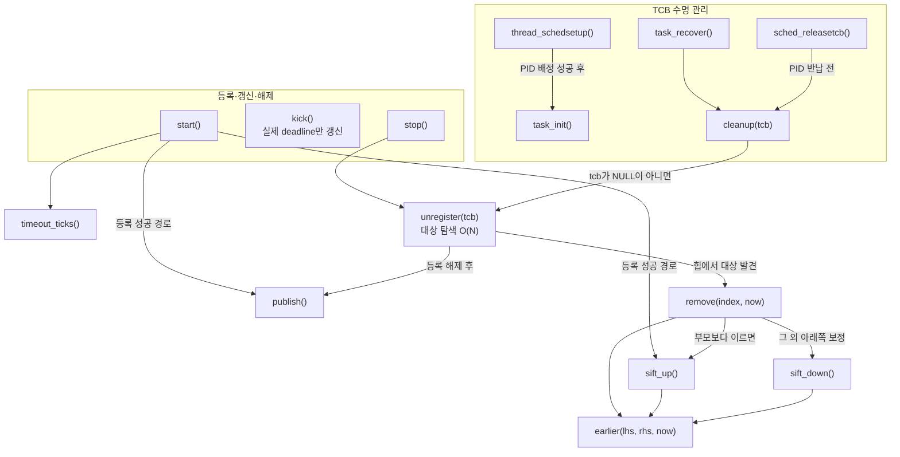
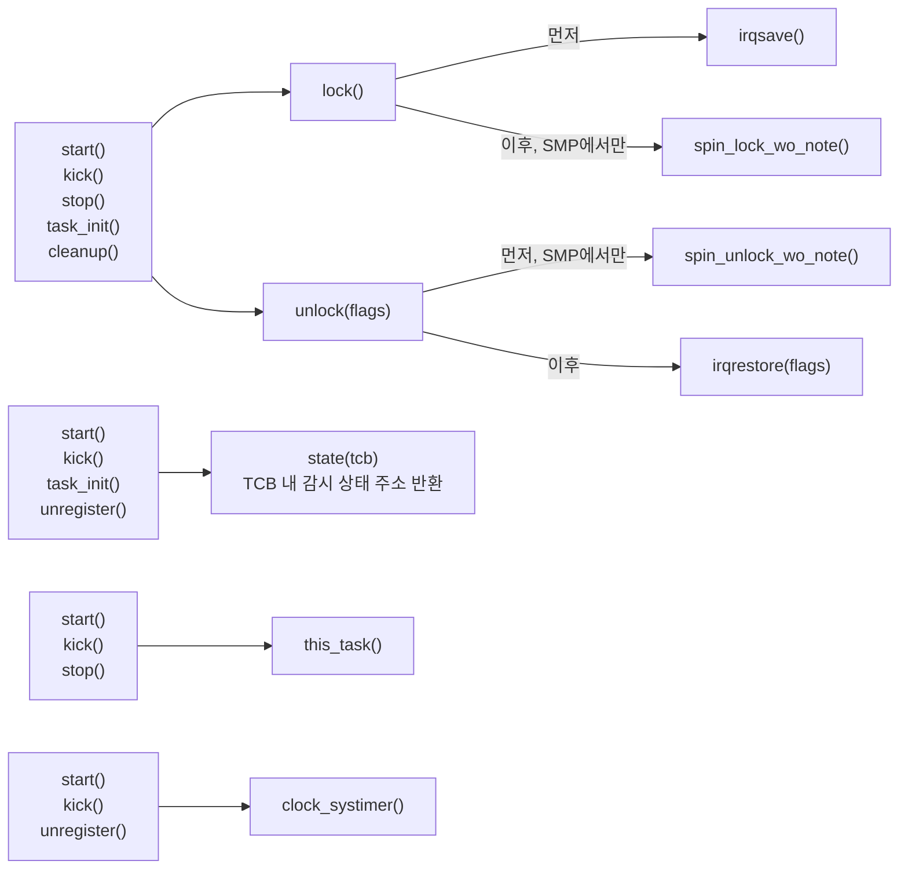
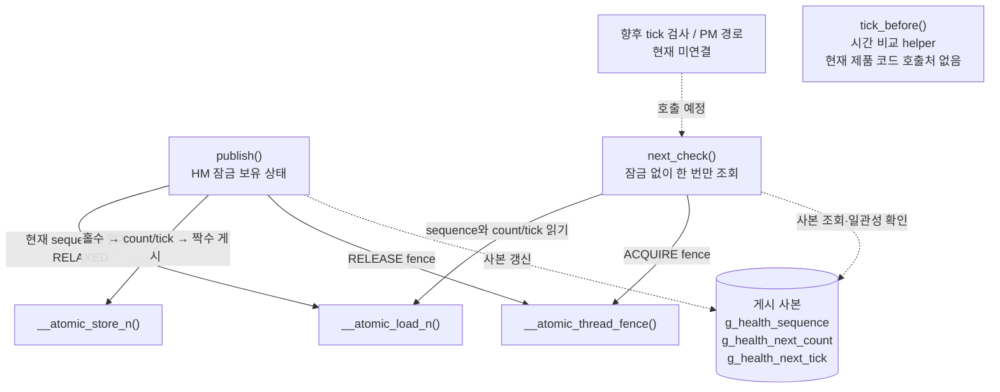

# 2단계: 등록·갱신·해제와 TCB 수명

전제: 1단계가 확인·커밋됐고 사용자가 2단계 시작을 지시했다. [공통 진행 방식](README.md)과 [설계 문서](../HealthMonitorImplementationPlan.md)의 3~6절을 사용한다.

## 목표

실제 등록 상태와 정적 최소 힙을 만들고, 스레드가 종료되면 참조가 안전하게 제거되도록 한다. 등록 기능과 종료 정리를 같은 커밋에 포함한다.

## 구현 범위

1. `CONFIG_MAX_TASKS` 크기의 정적 힙과 전용 spinlock, 최소 검사 시각의 게시 상태를 구현한다.
2. START에서 `health_monitor_state(tcb)`로 얻은 상태의 timeout·deadline을 설정하고 힙에 삽입한다. 상태 접근은 [저장공간 접근 규칙](../HealthMonitorImplementationPlan.md#41-자료구조)을 따른다.
3. KICK에서 등록 여부를 확인하고 deadline만 갱신한다. 이전 deadline의 만료 여부를 검사하거나 힙을 재정렬하지 않는다.
4. STOP에서 자신을 찾아 힙에서 제거하고 감시 상태를 해제한다. O(N) 대상 탐색을 허용한다.
5. 대상 TCB를 받는 내부 정리 함수를 구현하고 종료·PID 반납·TCB 해제 전에 연결한다. 초기 상태, 중복 정리, task 재시작과 PID/TCB 재사용 시 잔여 상태도 확인한다.
6. 로컬 IRQ 마스킹과 잠금 순서, 잠금 밖에서 읽는 최소 시각의 게시 방식을 구현한다.

예상 변경 위치: 신규 커널 감시 모듈과 Make.defs/Makefile 연결, TCB 초기화·종료·해제 경로. driver, system tick 호출, PANIC, PM, HW WDT 연결은 이후 단계에 둔다.

## 이 단계 완료 시 동작

커널 내부에서 등록·갱신·해제할 수 있고 종료 시 힙 참조가 제거된다. 아직 앱 장치와 자동 만료 검사는 연결되지 않는다.

## 검증

- 여러 timeout의 등록, 루트·중간·마지막 항목 제거, 빈 힙 전환을 확인한다.
- KICK 뒤 실제 deadline만 바뀌고 검사 예약 시각은 유지되는지 확인한다.
- 중복 START, 미등록 KICK·STOP의 반환 정책을 확인한다.
- 등록 후 종료·해제·재사용에서 힙이 해제된 TCB를 가리키지 않는지 확인한다.
- SMP 동시 호출의 잠금 범위와 종료 경로의 잠금 순서를 점검한다. 가능한 환경에서는 두 CPU의 등록·갱신·해제를 함께 실행한다.

호스트 검증과 보드 검증은 결과를 구분한다. 검증 편의를 위한 임시 공개 ioctl이나 제품용 디버깅 기능은 만들지 않는다.

## 사용자 확인 항목

- 힙과 전역 상태가 필요 이상으로 복잡해지지 않았는가?
- KICK의 실제 코드가 O(1)이며 늦은 KICK도 허용하는가?
- 잠금 내부에 어떤 처리가 들어가고, 종료 정리는 어느 경로에서 수행되는가?

완료 기준: 등록 상태와 힙 일관성, TCB 제거 경로, 잠금 순서를 코드와 검증 결과로 확인할 수 있다. 사용자 확인 후 커밋하고 대기한다.

## 구현·검증 결과 (2026-09-15)

### 등록과 저장공간

[health_monitor.c](../../os/kernel/health_monitor/health_monitor.c)에 정적 힙과 내부 동작을 구현했다. [Make.defs](../../os/kernel/health_monitor/Make.defs)를 kernel Makefile에 연결해 `CONFIG_HEALTH_MONITOR=y`일 때만 포함한다. 상태 접근은 1단계의 `health_monitor_state(tcb)`로 통일했다.

- START: timeout 검증, 미등록 확인 후 실제 deadline과 힙 예약을 설정한다. 힙 삽입은 O(log N)이다. 정적 배열 경계 보호를 위해 가득 찼을 때 `-ENOSPC`를 반환하며 공개 헤더에도 명시했다.
- KICK: 전용 잠금 아래에서 등록 여부를 확인하고 실제 deadline만 갱신한다. 힙·예약 게시값을 변경하지 않으며 이전 deadline도 검사하지 않는다. 자료구조 처리 비용은 O(1)이다.
- STOP/cleanup: 등록된 TCB를 힙에서 O(N)으로 찾아 제거하고 필요한 방향으로 재정렬한다. 상태를 미등록으로 초기화한다. 미등록 STOP은 `-ENOENT`, 미등록 cleanup은 무동작이다.
- 힙 비교: 한 연산의 now를 고정하고 예약 시각의 signed offset을 비교한다. 같은 예약 시각의 대상도 각각 유지한다. 이번 단계에는 만료 검사나 힙 예약을 최신 deadline으로 옮기는 timer 로직이 없다.

대상 ARM 객체에서 전역 BSS는 2,065 B다: 힙 2,048 B, 힙 개수 4 B, 게시용 sequence/count/tick 12 B, SMP 잠금 1 B. 최종 링크 정렬은 별도다. 1단계 TCB 증가량(스레드당 8 B)은 그대로이며 추가 TCB 필드는 없다.

### 잠금과 최소 예약 게시

스레드 경로는 로컬 `irqsave()` 후 전용 `spin_lock_wo_note()`를 사용하고 반대 순서로 복구한다. UP에서는 로컬 IRQ 마스킹만 사용한다. 계측 없는 spinlock을 선택해 잠금 경로에 note callback이 끼어들지 않게 했다.

현재 TCB는 감시 잠금 진입 전에 얻는다. 잠금 안에서는 TCB 상태·정적 힙·시간 읽기·게시만 처리하며, 공용 스케줄러 잠금, 할당, 세마포어·뮤텍스 대기, 로그, PANIC을 호출하지 않는다. timeout 변환의 64비트 산술은 START에만 필요하다. 스레드 경로의 spinlock 경합 대기시간은 O(1) 자료구조 비용과 별개다.

최소 예약은 힙과 별개의 32비트 atomic sequence/count/tick으로 게시한다. writer는 전용 잠금 아래에서 odd → 데이터 갱신 → even 순으로 게시하고, writer의 release와 reader의 acquire 메모리 순서 및 sequence 비교로 사본의 일관성을 한 번만 확인한다. 32비트 atomic이 lock-free가 아니면 컴파일 단계에서 거부해 숨은 라이브러리 잠금으로 대체되지 않도록 했다.

`health_monitor_next_check(&check_at)`의 내부 규약은 다음과 같다.

| 반환값 | 의미 | 출력값 |
|---|---|---|
| 1 | 일관된 비어 있지 않은 예약 사본 | 가장 이른 예약 tick. 0도 유효 |
| 0 | 일관된 빈 목록 사본 | 변경하지 않음 |
| `-EAGAIN` | 게시와 겹쳐 일관된 사본을 얻지 못함 | 변경하지 않음 |

조회는 잠금·재시도 루프·힙/TCB 역참조 없이 O(1)이다. 사본은 이후 바뀔 수 있으므로 만료 확정용이 아닌 진입 판단용이다. 후속 timer/PM 처리는 [공통 게시 규칙](../HealthMonitorImplementationPlan.md#6-smp와-tcb-수명-보호)을 따르며, 아직 실제 호출 지점은 연결하지 않았다.

### TCB 수명 연결

| 연결 지점 | 처리 |
|---|---|
| [thread_schedsetup()](../../os/kernel/task/task_setup.c)에서 PID 배정 성공 직후 | `health_monitor_task_init(tcb)`로 새 task/pthread 상태 초기화. 아직 runnable이 아니며 등록되지 않은 TCB만 대상 |
| [task_recover()](../../os/kernel/task/task_recover.c) 시작 부분 | 정상 종료·강제 삭제·task 재시작·binary unload의 공통 복구 경로에서 대상 TCB 감시 해제 |
| [sched_releasetcb()](../../os/kernel/sched/sched_releasetcb.c)의 PID 보유 경로 | timer 자원 정리 및 PID 반납 전에 다시 cleanup. 중복 호출은 안전하며 PID 미배정 실패 경로는 건너뜀 |

종료 처리가 공용 잠금을 보유한 경우에도 잠금 순서는 공용 스케줄러 잠금 → 감시 잠금이며 역순 획득은 추가하지 않았다. PID 슬롯 반납과 TCB 해제 전에 감시 상태 및 힙 참조를 제거한다. 초기화와 cleanup 모두 호출자가 아닌 전달받은 TCB를 대상으로 한다.

정상 exit의 `atexit`/`on_exit` 호출 순서는 변경하지 않았다. 해당 콜백은 기존 `task_recover()`보다 앞에 있으므로 그동안은 감시가 유지되고, 복구 지점에서 해제된다. 이 단계에서 종료 hook을 독립적으로 연결했지만 실제 보드의 종료·재시작 실행 검증은 아직 하지 않았다.

### 실행한 검증

재현 가능한 [호스트 테스트](../../os/kernel/health_monitor/tests/README.md)를 추가했다. 제품 레지스트리 소스를 직접 컴파일하며 OS primitive와 TCB 표현만 호스트 모델로 대체한다. 제품용 테스트 ioctl이나 디버깅 인터페이스는 추가하지 않았다.

```sh
make -C os/kernel/health_monitor/tests test
```

- ASan/UBSan을 사용한 UP/SMP 모델 모두 통과했다. 각각 50,000개 무작위 연산을 독립 모델과 비교하고 힙 순서·등록 상태·최소 예약을 확인했다.
- 초기값, invalid/duplicate START, full capacity, 미등록 동작, 늦은 KICK과 힙 불변, 루트·중간·마지막 제거, 동일 예약, tick 0/wraparound, 과거 예약과 최대 미래 예약의 정렬을 확인했다.
- 대상 cleanup, 중복 cleanup, 같은 TCB의 재등록, 해제 후 PID 재사용을 확인했다. 상태 사본의 odd sequence 및 sequence wraparound도 검사했다.
- 시작 barrier를 사용한 두 host worker가 각각 50,000회 등록·KICK·해제를 실행했다. 별도 writer는 100,000회 등록·해제를, reader는 1,000,000회 최소 예약 조회를 실행했다. 이 검증을 포함한 전체 UP/SMP 실행을 5회 더 반복해 통과했다.
- 기준 보드의 보호 모드 커널 빌드는 OFF 242개, ON 243개 객체로 통과했다. OFF 아카이브에는 health monitor 심볼이나 참조가 없다. 기존 소스의 6개 경고는 두 구성에 동일하게 남아 있다.
- 신규 레지스트리는 ARM `-Wall -Wextra -Werror -Wshadow -Wundef` 컴파일도 통과했다. ARM 객체에서 실제 init/cleanup hook 호출, KICK에 힙 탐색이 없는 것, 최소 예약 조회에 호출·대기 루프가 없는 것을 확인했다. atomic 라이브러리나 할당·세마포어·PANIC 심볼 의존성은 없다.
- 원본 defconfig와 활성 빌드 환경은 변경하지 않았다. 이전 검증용 `/tmp/health-monitor-step1.isS8Pw` 복사본을 재사용하고 이번 로그·객체는 `/tmp/health-monitor-step2.fHM7I7`에 보관했다. 주요 파일은 `host.log`, `repeated-host.log`, `kernel-on-full.log`, `kernel-off.log`, `health-monitor-arm.log`, `lifecycle-arm.log`, `size.log`다.

### 최종 정리 및 재검증 (2026-09-16)

- 사용자 검토 과정에서 각 함수의 역할·잠금 전제·복잡도와 atomic 게시·조회 설명을 주석으로 보강했다. 호출 관계도와 `remove()`/`unregister()` 책임 분리를 아래에 기록했으며, 검토된 동작은 변경하지 않았다.
- 커밋 직전 새 출력 디렉터리에서 ASan/UBSan 호스트 테스트를 다시 빌드·실행해 UP/SMP 모두 통과했다. 무작위 연산, 동시 등록·해제, 게시 사본 조회 검증을 포함한다.
- 최종 소스의 ARM `-Wall -Wextra -Werror -Wshadow -Wundef` 컴파일을 재실행해 통과했다. 생성한 객체는 앞서 주석 보강 후 검증한 ARM 객체와 바이트 단위로 동일하다. 전체 커널 ON/OFF 빌드 결과는 위의 기존 검증 기록을 유지한다.
- 최종 재검증 산출물은 `/tmp/health-monitor-step2-final.d2fZlc`의 `host.log`, `arm-compile.log`, `health-monitor.o`에 보관했다. 아래의 보드 실행·전체 펌웨어·ThreadSanitizer 검증 제한은 그대로 남는다.

### 검증 제한과 사용자 확인

- 호스트 모델은 실제 ARM IRQ·cache ordering·scheduler를 실행하지 않는다. 실제 두 CPU에서의 동시 등록과 종료·재시작, ISR와 종료 경합, task_init 실패 경로 등은 보드 검증이 남아 있다.
- ThreadSanitizer는 `unexpected memory mapping`으로 실행에 실패했고 atomic fence 계측 제한 경고도 있어 통과로 간주하지 않는다. 상세는 위 검증 디렉터리의 `tsan.log`에 남겼다.
- 전체 펌웨어 링크·부팅·보드 실측은 미실행이다. 전체 Kconfig 파싱에 관한 1단계의 기존 타 보드 절대경로 제한도 이번 변경에서 해결하지 않았다.
- 자동 만료·리셋, ioctl 드라이버, PM, HW WDT는 미구현이다. 현재 등록을 해도 자동으로 감시/리셋하지 않는다. 다음 단계 구현이나 제품 설정 활성화는 하지 않았다.

사용자 검토를 거쳐 ① 내부 최소 예약 조회의 1/0/`-EAGAIN` 규약, ② 정적 배열 경계 보호용 `-ENOSPC`, ③ 공통 `task_recover()` + PID 반납 전 중복 cleanup 위치를 유지했다. 2026-09-16 사용자가 최종 정리와 커밋을 지시했으며, 구현·테스트·주석·문서를 `health_monitor: implement registry and task cleanup`으로 확정한다. 3단계는 별도 시작 지시를 기다린다.

## 함수 호출 관계와 내부 책임 (2026-09-16)

현재 2단계 구현과 `CONFIG_HEALTH_MONITOR=y` 기준이다. 그림에서는 HM 함수의 `health_monitor_` 접두사를 생략했다. 실선은 실행 순서가 아니라 직접 호출 관계이며 조건부 호출도 포함한다. 공통 잠금·상태 접근은 별도 그림으로 분리했다. 테스트 코드를 제외하면 START/KICK/STOP의 드라이버 진입과 `next_check()`의 tick·PM 호출은 아직 연결되지 않았다.

### 등록·갱신·해제와 TCB 수명



`kick()`은 힙 관련 함수와 `publish()`를 호출하지 않는다. `remove()`에서 마지막 슬롯 자체를 제거하면 위·아래 보정은 필요 없다.

### 공통 잠금·상태·시간 접근

묶음 상자에 적힌 각 함수가 연결된 함수를 직접 호출한다. 상태 확인 결과에 따른 조건부 호출도 포함한다.



`unregister()`와 힙 보조 함수들은 호출자가 이미 잠금을 보유한 상태에서 실행된다. 내부에서 다시 잠그지 않는다.

### Atomic 게시·조회

실선은 함수 호출, 점선은 레이블에 적힌 데이터 접근 또는 향후 연결이다. 메모리 게시 방식과 반환 규약은 위의 [잠금과 최소 예약 게시](#잠금과-최소-예약-게시)를 따른다.



`publish()`와 `next_check()`는 서로 호출하지 않고 동일한 게시 사본을 통해 정보를 주고받는다. `next_check()`는 힙이나 TCB에 직접 접근하지 않는다. `__atomic_always_lock_free()`는 컴파일 시 조건 검사이므로 런타임 호출 관계도에서 제외했다.

### remove()와 unregister()를 분리한 이유

두 함수는 각각 **힙 항목 제거**와 **감시 등록 전체 해제**를 담당한다.

- `health_monitor_remove(index, now)`: 위치를 이미 알고 있는 힙 항목을 제거한다. 마지막 항목으로 빈자리를 채우고 필요한 방향으로 재정렬한 뒤 비활성 꼬리 슬롯을 비운다. 힙과 힙 개수만 바꾸며 O(log N)이다. TCB의 timeout/deadline이나 최소 예약 게시값은 변경하지 않는다.
- `health_monitor_unregister(tcb)`: 대상 TCB의 등록 여부를 확인하고 O(N)으로 힙 위치를 찾는다. `remove()`로 힙에서 제거한 뒤 timeout/deadline을 초기화하고 `publish()`로 새 최소 예약을 게시한다. STOP과 lifecycle cleanup이 공유하는 해제 절차다.

즉, `unregister()`를 읽을 때 **대상 찾기 → 힙 제거 → 감시 상태 초기화 → 최소 예약 게시**라는 흐름이 보이도록 힙 조작 알고리즘을 `remove()`에 둔 것이다. 두 함수 모두 private `static` 함수이며 호출자가 잡은 동일한 잠금 안에서 실행된다. 이 분리로 공개 인터페이스나 추가 잠금이 생기지는 않는다.

현재 `remove()`의 제품 코드 호출처는 `unregister()` 하나뿐이다. 따라서 재사용이나 성능을 위해 반드시 분리해야 하는 것은 아니며, 합쳐도 기능과 시간복잡도는 유지할 수 있다. 현재 분리는 자료구조 조작과 등록 해제 절차를 따로 읽을 수 있게 하려는 선택이다. 이번 문서 보강에서는 함수 통합·이름 변경 등 구현 변경은 하지 않았다.
