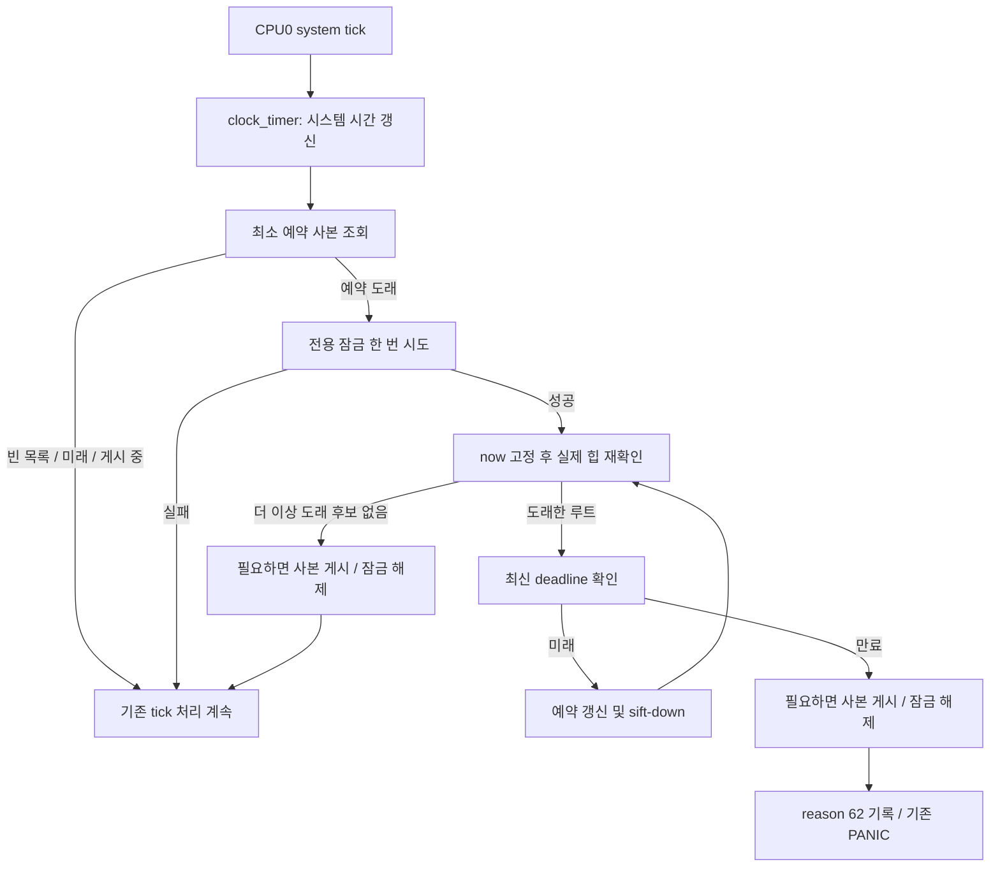

# 4단계: tick 검사·PANIC·reboot reason

전제: 3단계가 확인·커밋됐고 사용자가 4단계 시작을 지시했다. [공통 진행 방식](README.md)과 [설계 문서](../HealthMonitorImplementationPlan.md)의 5~6절, 8.1절을 사용한다.

## 목표

CPU0의 system tick에서 실제 timeout을 판정하고 기존 PANIC으로 리셋한다. 검사 함수와 실제 장애 처리를 같은 커밋에서 연결한다.

## 구현 범위

1. 평상시에는 힙의 최소 검사 시각만 비교하는 진입 경로를 구현한다.
2. ISR은 전용 잠금을 획득할 수 있을 때 검사하고, 획득 실패 시 다음 tick으로 연기한다.
3. 검사 기준 시각을 고정하고 도래한 후보를 모두 확인한다. 최신 deadline이 미래면 재정렬하고, 만료됐으면 장애를 확정한다.
4. system tick의 시간 갱신 및 기존 공용 잠금 처리 순서를 고려해 호출 위치를 연결한다.
5. 신규 timeout reason을 추가하고, 전용 잠금을 해제한 후 reason 기록과 기존 PANIC으로 진입한다.

예상 변경 위치: 감시 모듈, sched_processtimer.c, reboot reason 정의와 필요한 연결. PM wakeup·HW WDT 시작 정책은 다음 단계에서 연결한다. 별도 지연 한도, 후보 개수 제한, 추가 로그 수집은 두지 않는다.

## 이 단계 완료 시 동작

등록 스레드가 검사 시점에 deadline을 넘기면 리셋한다. PM 연동 전이므로 절전이 개입하지 않는 검증 조건을 명시하고, 정상 sleep까지 완성됐다고 보고하지 않는다.

## 검증

- 정상 KICK 유지와 KICK 중단에 따른 timeout 리셋을 확인한다.
- 이전 deadline이 지난 뒤 ISR 검사 전에 KICK하면 새 deadline을 인정하는지 확인한다.
- 도래한 예약 시각이 같은 경우와 서로 다른 경우 모두 정상 대상을 재정렬하고 실제 만료 대상을 찾는지 확인한다.
- ISR 잠금 획득 실패 시 대기 없이 반환하고 후속 tick에서 처리하는지 확인한다.
- 전용 잠금 밖에서 PANIC이 호출되고 해제된 TCB를 추가로 읽지 않는지 점검한다.
- 실제 보드 검증이 가능하면 신규 reason과 기존 PANIC 출력을 확인한다. 보드의 누락 tick 반복 처리도 검토한다.

## 사용자 확인 항목

- 실제 검사 순서가 단순하고 평상시 tick이 O(1)인가?
- 늦은 KICK, STOP, 만료 확정의 순서가 합의한 정책과 같은가?
- PANIC 시점, 신규 reason, 기존 진단 출력의 범위가 적절한가?

완료 기준: 자동 검사에서 리셋까지 연결됐으며 실행한 검증과 미검증 HW fallback 범위를 구분해 제시했다. 사용자 확인 후 커밋하고 대기한다.

## 구현·검증 결과 (2026-09-16)

### 검사 흐름

- [health_monitor_timer()](../../os/kernel/health_monitor/health_monitor.c)는 CPU0의 system tick에서 실행한다. UP에서는 단일 CPU가 검사한다.
- [sched_process_timer()](../../os/kernel/sched/sched_processtimer.c)의 `clock_timer()` 직후에 연결했다. 실제 시간이 갱신된 뒤 검사하며 CPU load 측정, round-robin 스케줄러 및 software watchdog의 공용 잠금 획득보다 앞선다.
- 빈 힙, 미래의 최소 예약, 게시와 겹친 `-EAGAIN`은 잠금 획득·힙 접근·TCB 역참조 없이 반환한다. 평상시 알고리즘 비용은 O(1)이다.
- 도래한 예약이 있으면 전용 잠금을 한 번 시도한다. 성공한 뒤 힙을 다시 읽고 `now`를 한 번 고정한다. 진입 판단 직후 다른 CPU가 STOP하거나 KICK한 경우에도 최신 상태로 판정한다.
- 루트의 `check_at <= now`인 동안 최신 deadline을 확인한다. deadline도 `<= now`이면 만료를 확정한다. 미래면 예약을 최신 deadline으로 옮기고 기존 sift-down으로 정렬한다. 정상인 도래 후보는 모두 처리하며 개수 제한은 없다. 최초 만료를 발견하면 장애 처리로 나간다.
- 예약을 바꿨으면 최소 예약 사본을 한 번 게시하고 잠금을 해제한다. KICK의 O(1) 동작과 기존 START/STOP 정책은 유지한다. 후보 K개의 처리는 O(K log N)이다.



### ISR 잠금과 장애 처리

기존 `spin_trylock_wo_note()`는 함수 자체에 루프가 없어도 ARMv7-A의 `up_testset()`에서 STREXB 실패 시 재시도한다. 새 내부 `health_monitor_trylock()`은 같은 전용 잠금에 **weak compare/exchange 한 번**을 사용한다. 잠금 점유 또는 exclusive store 실패는 모두 다음 tick으로 연기한다. 일반 스레드의 기존 spinlock 획득·해제 경로는 유지한다.

CAS 성공에는 acquire, 실패에는 relaxed 순서를 사용한다. 잠금 크기의 native atomic 지원은 정적 검사로 확인하며, 실제 단일 시도 여부는 대상 ARM 객체로 별도 확인했다. [GCC 문서](https://gcc.gnu.org/onlinedocs/gcc/_005f_005fatomic-Builtins.html)에 따라 weak 연산은 실패할 수 있으며, **lock-free 여부만으로 모든 포트·컴파일러에서 내부 재시도가 없다고 보장하지 않는다.** 다른 도구 체인/포트로 옮길 때도 생성 코드를 확인해야 한다.

신규 `REBOOT_SYSTEM_HEALTH_MONITOR_TIMEOUT = 62`를 [공용 reboot reason](../../os/include/tinyara/reboot_reason.h)에 추가했다. 만료 확정 후 전용 잠금을 해제하고, `CONFIG_SYSTEM_REBOOT_REASON`이 켜져 있으면 `up_reboot_reason_write()`로 기록한 뒤 기존 `PANIC()`을 호출한다. reason 기록을 꺼도 PANIC은 호출된다. 새 syscall, 추가 로그·덤프, 재부팅 구현을 만들지 않았다.

만료 확정 이후 KICK 또는 STOP이 실행되어도 현재의 장애 판정은 취소하지 않는다. 잠금 해제 이후에는 대상 TCB를 읽지 않으므로 다른 CPU에서 cleanup/free가 진행되어도 해당 포인터를 사용하지 않는다. 진단 범위는 기존 PANIC과 같다. CPU0에서 실행 중이던 스레드의 진단이 출력될 수 있으며, 만료된 스레드의 콜스택을 별도로 수집하지 않는다.

RTL8730E의 timer ISR은 누락 tick마다 `sched_process_timer()`를 반복 호출한다. 새 검사도 갱신된 tick마다 실행한다. 이전 tick에서 경합 때문에 연기됐다면 다음 반복에서 재시도할 수 있다. 별도 health monitor 시계나 반복 개수 제한은 도입하지 않았다.

### 실행한 검증

제품 소스를 읽기 전용으로 연결하고 빌드 산출물을 `/tmp/health-monitor-step4.hw7fjZ`에 분리했다. 원본 defconfig와 작업 트리의 빌드 설정은 변경하지 않았다.

| 검증 | 결과와 확인 범위 |
|---|---|
| Linux AArch64, GCC 5.4, ASan/UBSan | 기존 registry UP/SMP·driver/VFS UP/SMP와 새 timer UP/SMP/reason OFF **7종 모두 통과**. sanitizer 비활성화 옵션 없이 실행 |
| macOS Clang, ASan/UBSan | 새 timer UP/SMP/reason OFF 3종의 초기 실행 통과. 이후 보완된 전체 테스트의 최종 검증은 위 Linux 실행 결과 |
| RTL8730E 보호 모드 커널 ON/OFF | ARM GCC 10.3.1로 전체 kernel archive 빌드 통과. ON 243개·OFF 242개 객체. OFF archive에 health monitor 정의·참조 없음 |
| 변경된 커널 소스 엄격 컴파일 | health_monitor.c 및 sched_processtimer.c에 기존 ARM 플래그와 `-Wextra -Werror` 적용해 통과. 기존 플래그에 `-Wall -Wshadow -Wundef` 포함 |
| reboot reason OFF | 해당 설정을 끈 ARM 객체의 엄격 컴파일 통과. reason 쓰기 함수 의존성이 사라지고 `up_assert` 호출은 유지 |
| ARM 생성 코드 | ISR 획득은 단일 LDAEXB/STREXB 시도이며 실패 시 복귀. atomic helper·획득 재시도·WFE 호출 없음. unlock → reason 62 → up_assert 순서 및 clock_timer → health_monitor_timer → enter_critical_section 순서 확인 |

ON/OFF 전체 커널에서 기존 소스의 경고 3개가 동일하게 남았다(`wd_start.c`, `binary_manager_resource.c`, `log_dump.c`). 새 소스의 엄격 컴파일은 경고 없이 통과했다. 이전 단계의 다른 GCC 버전에서 기록한 경고 개수와 섞지 않는다.

[timer 테스트](../../os/kernel/health_monitor/tests/timer_test.c)는 실제 등록 구현, `sched_process_timer()` 및 기존 `reboot_reason_try_write_assert()`를 포함한다. 확인한 사례는 다음과 같다.

- 1,000 tick 동안 정상 KICK 유지, KICK 중단, 정확히 deadline인 tick에서의 만료 및 늦은 KICK 인정.
- 같은 예약과 서로 다른 예약 각각 최대 256개 처리. 갱신된 정상 대상 뒤에 있는 실제 만료 대상도 발견.
- tick 0/wraparound, 이미 지난 예약과 최대 미래 예약의 공존, 후보 수와 무관한 두 번의 시간 읽기(빠른 판단 1회·잠금 후 고정 `now` 1회).
- CPU1에서 검사하지 않음, 빈/미래/게시 중 사본 반환, 점유된 잠금 및 강제 weak-CAS 실패에서 한 번만 시도하고 다음 tick에서 처리.
- 잠금 획득 직전 STOP/KICK, 만료 확정 후 unlock 직후의 KICK·cleanup·TCB free. 후자의 경우에도 PANIC하며 해제된 TCB를 읽지 않음.
- reason 기록과 PANIC이 감시 잠금·스케줄러 공용 잠금 밖에서 호출됨. 실제 공통 assert helper가 새 reason을 유지하며, reason 비활성 구성도 PANIC함.
- 실제 system tick 함수의 시간 갱신 이후·CPU load/global-lock/watchdog 처리 이전 진입. 보드와 같은 tick 반복 호출에서 경계 tick에 만료 판정.

Linux에서 재현하는 호스트 명령:

```sh
make -C os/kernel/health_monitor/tests test OUT_DIR=/tmp/health-monitor-step4-tests
```

ARM 검증은 기준 설정을 임시 복사본에 적용하고 ON/OFF 구성을 생성했다. context는 kernel 컴파일에 필요한 `mm wqueue syscall drivers ../lib/libc` 하위 대상과 기본 헤더·링크를 생성했으며, 앱 전체 빌드를 수행한 것은 아니다.

```sh
cd <temporary-tree>/os
./tools/configure.sh rtl8730e/loadable_ext_ddr_st7785
# 임시 .config에 CONFIG_HEALTH_MONITOR=y 추가 후:
make -j1 context CONTEXTDIRS='mm wqueue syscall drivers ../lib/libc'
make -j4 -C kernel TOPDIR="$PWD" EXTRADEFINES=-D__KERNEL__ libkernel.a
# OFF 검증: kernel clean, 임시 .config에서 옵션 제거, config.h 재생성 후 같은 빌드
```

주요 산출물은 `host-linux-final.log`, `kernel-on.log`, `kernel-on-final.log`, `kernel-off.log`, `arm-strict.log`, `arm-no-reason.log`, `health-monitor-arm.asm`, `sched-processtimer-arm.asm`, `libkernel-on.a`, `libkernel-off.a`다. 4단계 변경의 Standards 및 Spec 독립 읽기 검토에서도 수정이 필요한 지적은 없었다.

이후 1~4단계 전체 셀프 리뷰에서 별도 참조 모델을 사용해 등록·KICK·STOP·cleanup·timer 검사를 섞은 250,000회 연산을 UP/SMP 각각 실행했다. 각 구성에서 49,848회 검사와 3,730회 만료 판정이 일치했고 ASan/UBSan 오류는 없었다. 임시 검증 코드는 위 디렉터리의 `self-review/random_timer.c`이며 제품 테스트에 자동 포함되지 않는다. 전체 리뷰의 경미한 M11 지적은 3단계 호스트 VFS shim의 prototype 인자명 생략으로, 이번 4단계 커밋에는 해당 파일 수정을 포함하지 않는다.

### 검증 한계와 사용자 확인 항목에 대한 답

- 평상시 tick은 O(1)이며, 도래 후보는 고정 `now`로 처리한다. 만료 확정 전의 KICK/STOP과 확정 후의 KICK/STOP 순서는 합의된 정책을 따른다.
- 호스트의 IRQ·CPU·시간·reason 저장소는 모형이다. PANIC은 호스트 프로세스를 재부팅하지 않고 가로채 호출 순서를 검사한다. ARM 캐시·실제 scheduler 종료 경합·보드 IRQ 실행을 증명하지 않는다.
- 실제 보드의 reason 보존·PANIC 출력·자동 리셋, ISR 실행 시간·잠금 대기시간은 미검증이다. 전체 펌웨어 링크·플래시·부팅도 이번 검증 범위에 포함하지 않았다. 기존 전체 Kconfig 파싱 제한과 ThreadSanitizer 미통과 상태를 이번 결과로 해소했다고 주장하지 않는다.
- 이번 호스트 테스트에는 PM이 개입하지 않는다. ARM 빌드는 기준 PM 설정을 유지한 **컴파일 검증**이다. 실제 timeout 보드 시험은 `CONFIG_PM`을 끈 별도 테스트 빌드 등으로 sleep이 발생하지 않게 해야 한다. 정상 절전의 wakeup 보장은 5단계 범위다.
- 기존 `CONFIG_WATCHDOG_FOR_IRQ` keepalive 위치와 HW watchdog 시작 정책은 변경하지 않았다. PANIC 자체가 다른 CPU의 공용 잠금이나 진단 경로에서 진행하지 못하는 장애의 HW fallback은 6단계 및 실기기 검증 범위다.
- 신규 static 저장공간·동적 할당·worker·추가 로그 수집은 없다. 기준 defconfig의 기능 활성화는 7단계에 남겨 두었다.

4단계 구현·검증과 전체 셀프 리뷰 후 사용자가 커밋을 승인했다. 본 커밋 `health_monitor: check deadlines from the system tick`으로 4단계를 완료하며, 5단계 구현은 별도 지시를 기다린다.

### 만료 대상 로그 보완 (2026-09-20)

실제 만료 PID·판정 now·최신 deadline을 잠금 안에서 작은 값으로 복사한다. 잠금 해제 및 reason 기록 뒤 기존 low-level 오류 로그로 출력하고 PANIC한다. 출력은 제품 DEBUG_ERROR/low-level 설정을 따르며 만료 TCB는 잠금 밖에서 역참조하지 않는다. 기존 PANIC의 현재 thread dump 의미는 유지한다.
