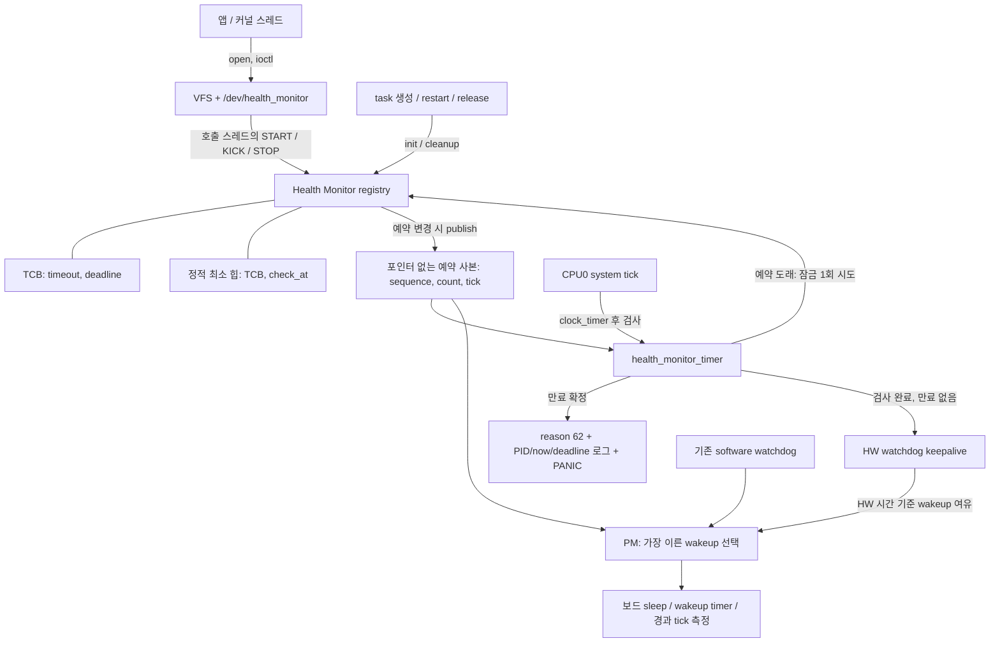
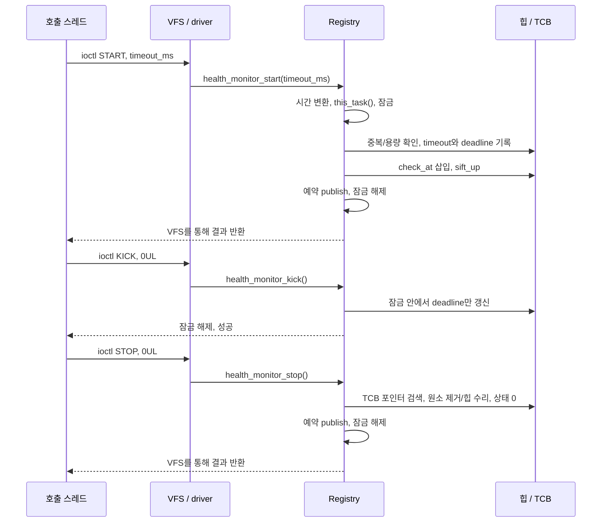
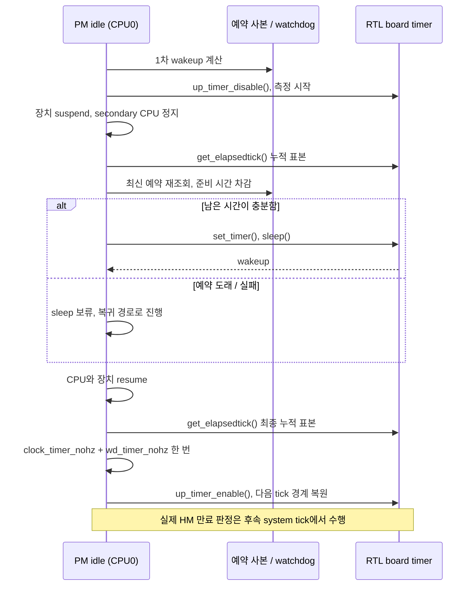

# Health Monitor 아키텍처와 구현

2026-09-20, `codex/260901-health-monitor`의 제품 코드 `6d4deed26f836378d961561c50617cde1a8ce00a` 기준이다. 이 문서는 구현된 동작을 설명한다. 설계 의도는 [구현 계획](../HealthMonitorImplementationPlan.md), 실제 실행 결과는 [사전 검증 보고서](../analysis/Health_Monitor_Preboard_Validation.md), RTL8730E 시험 명령은 [보드 시험 절차](board-validation.md)를 참고한다.

Health Monitor는 **스레드가 약속한 시간 안에 작업 진행을 알리는지** 검사한다. 스레드는 `/dev/health_monitor`에 START하여 제한시간을 등록하고, 실제 작업이 진행될 때 KICK하여 만료 시각을 연장한다. CPU0의 system tick이 최신 만료 시각을 검사하며, 만료를 확정하면 원인과 대상 정보를 기록하고 기존 PANIC 경로로 들어간다. 검사 자체가 진행되지 않는 장애는 별도의 하드웨어 watchdog이 담당한다.

제품의 모든 스레드를 자동 등록하지 않는다. 등록 대상, 제한시간, 정상 진행으로 인정할 KICK 위치는 해당 기능의 호출자가 정한다. CPU fault의 오류 메시지 전달은 기존 예외 처리/Binary Manager 경로를 사용한다.

## 1. 전체 구조와 책임



| 구성 | 소유하는 책임 | 구현 위치 |
|---|---|---|
| 공개 인터페이스 | 장치 경로, ioctl 번호, 호출 계약 | [tinyara/health_monitor.h](../../os/include/tinyara/health_monitor.h) |
| 장치 드라이버 | ioctl 분기, 인자 폭 검사, VFS 연결 | [drivers/health_monitor.c](../../os/drivers/health_monitor.c) |
| Registry | 등록 상태, 힙, 잠금, 예약 공개, 만료 판정 | [health_monitor.c](../../os/kernel/health_monitor/health_monitor.c), [내부 헤더](../../os/kernel/health_monitor/health_monitor.h) |
| TCB 수명 연동 | 생성 초기화, restart/해제 시 제거 | [task_setup.c](../../os/kernel/task/task_setup.c), [task_recover.c](../../os/kernel/task/task_recover.c), [sched_releasetcb.c](../../os/kernel/sched/sched_releasetcb.c) |
| System tick | 시계 갱신 뒤 검사, 성공한 검사 뒤 WDT 갱신 | [sched_processtimer.c](../../os/kernel/sched/sched_processtimer.c) |
| PM 공통 계층 | 예약 선택, 절전 보류, 정지 구간 시계 보정 | [pm_idle.c](../../os/pm/pm_idle.c), [pm_sleep_ops](../../os/include/tinyara/pm/pm.h) |
| RTL8730E 포트 | 경과 시간 측정, timer phase 복원, WDG4 소유권 | [timerisr.c](../../os/arch/arm/src/amebasmart/amebasmart_timerisr.c), [idle.c](../../os/arch/arm/src/amebasmart/amebasmart_idle.c), [watchdog_lowerhalf.c](../../os/arch/arm/src/amebasmart/amebasmart_watchdog_lowerhalf.c) |
| 보드 초기화 | VFS 초기화 후 장치 등록 | [rtl8730e_boot.c](../../os/board/rtl8730e/src/rtl8730e_boot.c) |

별도의 Health Monitor worker, 동적 등록 테이블, 범용 backend는 없다. 상태 변경과 판정에 필요한 자료구조는 하나의 전용 잠금으로 보호한다. 기존 Binary Manager의 fault sender는 Health Monitor가 추가한 worker가 아니다.

## 2. 앱에서 호출하는 계약

장치를 `O_RDWR`로 열고 `ioctl(fd, command, arg)`를 호출한다. START의 `arg`는 포인터가 아닌 **밀리초 값을 담은 `unsigned long`**이다. KICK/STOP에는 `0UL`을 전달한다.

| 호출 | 동작 | 결과 |
|---|---|---|
| `open(HEALTH_MONITOR_DEVPATH, O_RDWR)` | ioctl용 fd 확보 | 아직 등록되지 않음 |
| `HMIOC_START, timeout_ms` | 호출 스레드 등록, `deadline = now + timeout` | 성공 0; 잘못된 시간 EINVAL, 중복 EEXIST, 용량 부족 ENOSPC |
| `HMIOC_KICK, 0UL` | 등록된 호출 스레드의 최신 deadline 연장 | 미등록이면 아무 변경 없이 성공 |
| `HMIOC_STOP, 0UL` | 호출 스레드의 등록 제거 | 미등록이면 ENOENT |
| `close(fd)` | fd 해제 | 등록은 유지됨 |
| read/write 또는 알 수 없는 ioctl | 지원하지 않음 | 각각 ENOSYS / ENOTTY |

표의 errno는 앱에서 `-1`과 `errno`로 관측한다. 내부 registry/driver는 음수 errno를 반환하며 VFS가 변환한다. 예를 들어 START의 0ms는 registry를 변경하지 않고 `-EINVAL`로 돌아간다. 넓은 `unsigned long` 환경에서 `UINT32_MAX`를 넘는 인자도 드라이버가 잘림 없이 거부한다.

**감시 소유자는 fd가 아니라 현재 호출 스레드다.** A와 B가 fd 하나를 공유해도 각각 자신의 등록만 START/KICK/STOP한다. A가 등록한 뒤 B에게 fd를 넘겨도 B의 KICK이 A를 갱신하지 않는다. fd를 닫은 채 감시를 계속할 수 있으며, 같은 스레드가 다시 열어 STOP할 수도 있다. fd의 유효 기간과 동시 close는 호출자가 관리한다.

일반적인 호출 순서는 다음과 같다. 각 오류 반환을 처리하고, 정상적으로 감시를 마칠 때는 같은 스레드에서 STOP한다.

```text
open → START(timeout_ms)
       → 제한시간 안에 끝나는 작업 단위 수행 → KICK
       → 제한시간 안에 끝나는 작업 단위 수행 → KICK
       → ...
       → STOP → close
```

KICK은 타이머처럼 무조건 반복하기보다 실제 작업 진척을 나타내는 위치에 둔다. 정상적으로 긴 대기/작업을 수행해야 한다면 그 시간을 포함해 제한시간을 정하거나, 감시를 끝낸 뒤 다시 START하는 정책을 호출자가 선택한다. 이미 START한 제한시간을 바꾸는 별도 ioctl은 없다.

## 3. 저장공간과 시간 표현

### TCB 상태와 최소 힙

[`struct tcb_s`](../../os/include/tinyara/sched.h)에 다음 상태가 들어간다. `CONFIG_HEALTH_MONITOR`가 꺼져 있으면 이 필드도 빠진다.

```c
struct health_monitor_s {
    uint32_t deadline;
    uint32_t timeout;
};
```

- `timeout`: 등록된 제한시간의 tick 수. 0이면 미등록이다.
- `deadline`: 가장 최근 START/KICK이 정한 실제 만료 시각이다. 0도 정상적인 wrap 이후 시각이다.
- `health_monitor_state(tcb)`: 내장 필드의 주소를 구하는 inline 함수다. 메모리 할당이나 PID 조회를 하지 않는다.

Registry의 정적 배열 원소는 `{ tcb*, uint32_t check_at }`이다. 제품 용량은 `CONFIG_MAX_TASKS`이며 32비트 ARM에서는 원소당 8B다. 등록된 TCB 하나당 힙 원소가 정확히 하나 존재한다. 미등록 TCB는 힙에 없어야 한다. QEMU의 작은 용량 시험에만 별도 capacity override가 있다.

`deadline`과 `check_at`은 역할이 다르다.

| 값 | 의미 | 바뀌는 시점 |
|---|---|---|
| TCB `deadline` | 실제 만료 판정 기준 | START, KICK, STOP/cleanup |
| Heap `check_at` | 다시 살펴볼 예약 시각 | START, 도래한 예약의 timer 검사 |
| 공개 `next_tick` | 가장 이른 `check_at`의 사본 | 힙 삽입/제거/수리 후 publish |

START는 두 시각을 같게 만든다. KICK은 `deadline`만 변경한다. 이전 예약이 도래하면 tick이 최신 deadline을 읽어 만료 여부를 판단하거나 예약을 새 deadline으로 옮긴다. KICK마다 힙을 재정렬하지 않아도 되는 이유다.

### 시간 변환과 wrap

시간 기준은 PM 보정을 포함한 `(uint32_t)clock_systimer()`다. `timeout_ms`를 64비트 중간값으로 마이크로초로 바꾸고 tick 단위로 **올림**한다.

```text
timeout_ticks = (timeout_ms × 1000 + USEC_PER_TICK - 1) / USEC_PER_TICK
허용 범위: 1 .. INT32_MAX ticks
deadline = uint32(now + timeout_ticks)
before(a, b) = int32(a - b) < 0
```

대표 설정은 1ms tick이므로 최대 timeout은 2,147,483,647ms다. 이 올림은 요청한 지속시간을 tick 수로 줄이지 않지만, START 시점의 tick 내 위상까지 재는 고해상도 실시간 보장은 아니다. 판정 시점은 tick 해상도, IRQ 지연, 잠금 경합의 영향을 받는다.

`UINT32_MAX → 0` wrap을 허용하며 `now == deadline`은 만료다. 비교 가능한 거리는 반 범위 미만을 전제로 한다. 오래된 예약을 2³¹ tick 이상 방치하는 상황까지 시간 순서를 보장하지 않는다. 힙 원소끼리는 단순 `lhs - rhs`를 비교하지 않고 같은 `now`에 대한 signed offset을 비교한다. 이미 지난 예약과 최대 미래 예약이 함께 있을 때 잘못 정렬되는 것을 피한다.

## 4. START / KICK / STOP의 내부 호출 흐름



START는 현재 TCB를 찾은 후 전용 잠금 안에서 검사와 삽입을 끝낸다. 실패하면 기존 등록을 바꾸지 않는다. KICK은 같은 잠금 안에서 등록 여부와 최신 시간을 확인한다. STOP은 TCB 포인터를 O(N)으로 찾고, 마지막 원소를 빈자리에 옮긴 뒤 필요한 방향으로 힙을 수리한다. TCB에 별도 heap index를 넣지 않는다.

| 경로 | 자료구조 연산량 | 부가 사항 |
|---|---|---|
| START | O(log N) | 정적 배열 삽입, 동적 할당 없음 |
| KICK | O(1) | 힙/공개 예약 갱신 없음 |
| STOP / 등록된 cleanup | O(N) 검색 + O(log N) 수리 | 전체 O(N) |
| 미등록 cleanup | O(1) | 반복 호출 허용 |
| 미래/빈 예약의 tick | O(1) | TCB 접근 및 전용 잠금 없음 |
| 도래한 예약 K개 검사 | O(K log N) | 고정 후보 개수 제한 없음 |

이 표는 자료구조 작업량이다. 스레드 경로의 SMP 잠금 대기까지 O(1) 시간으로 보장한다는 뜻은 아니다. STOP 검색이나 ISR 최악 지연을 추가 최적화할지는 실제 등록 수와 보드 측정 결과를 근거로 판단한다.

## 5. 잠금, 예약 공개, TCB 수명

### 단일 잠금의 보호 범위

스레드/lifecycle 경로는 로컬 IRQ를 먼저 저장·차단하고, SMP이면 전용 spinlock을 획득한다. 해제는 spinlock 반환 후 저장한 IRQ 상태 복원 순서다. UP에서는 로컬 IRQ 차단만 사용한다. Heap/count/TCB의 Health Monitor 상태를 이 잠금으로 함께 보호한다.

잠금 순서는 **scheduler 잠금 → Health Monitor 잠금**이다. Health Monitor 잠금 안에서는 scheduler 잠금을 역으로 획득하지 않는다. `this_task()` 조회는 잠금 전에 수행하고, 잠금 연산의 note callback도 사용하지 않는다. 로그와 PANIC은 잠금 밖에서 수행한다.

Tick ISR은 스레드 경로의 기다리는 잠금을 사용하지 않는다. SMP에서 weak compare/exchange를 **한 번만 시도**하며 경합이나 exclusive-store 실패는 다음 tick으로 넘긴다. 단순히 lock-free인 함수라는 것만으로 무반복이 보장되는 것은 아니므로 대상 컴파일러의 생성 명령도 검증 대상이다.

### 포인터 없는 예약 사본

Tick의 대부분은 미래 예약을 확인하고 끝난다. PM도 TCB를 열어 볼 필요 없이 다음 검사 시각만 필요하다. 이를 위해 별도의 32비트 atomic 값 세 개를 공개한다.

```text
sequence: 갱신 버전. 홀수는 기록 중, 짝수는 기록 완료
next_count: 등록 수. 빈 상태와 tick 0 예약을 구분
next_tick: 힙 root의 check_at
```

Writer는 registry 잠금 아래서 sequence를 홀수로 바꾸고 release fence, count/tick 저장, 짝수 sequence의 release store 순으로 공개한다. Reader는 acquire sequence 읽기 → count/tick 읽기 → acquire fence → sequence 재확인 순서로 **한 번** 읽는다. 처음이 홀수이거나 버전이 달라졌으면 `-EAGAIN`이다. 모든 사본 접근은 atomic이며 native lock-free 지원을 compile-time assert로 요구한다.

`health_monitor_next_check(&tick)`의 반환 계약은 다음과 같다.

- `1`: 일관된 비어 있지 않은 사본이며 `tick` 출력이 유효하다.
- `0`: 일관된 빈 사본이다. 출력 인자는 바꾸지 않는다.
- `-EAGAIN`: 게시와 겹쳤다. 출력 인자를 바꾸지 않으며 tick 검사/PM sleep을 보류한다.

일관된 사본도 반환 직후에는 오래된 값이 될 수 있다. 따라서 이 값만으로 만료를 확정하지 않는다. 사본에는 TCB 포인터가 없어 종료 중인 TCB를 잠금 없이 역참조하지 않는다. 유한 버전 수의 전제로 한 번의 read가 sequence 전체 주기인 2³¹회 publish를 가로질러서는 안 된다.

### 종료와 재시작

생성 시 [`task_setup.c`](../../os/kernel/task/task_setup.c)의 공통 setup에서 PID 배정 후, 실행 가능해지기 전에 `health_monitor_task_init(tcb)`가 상태를 0으로 초기화한다. 이미 등록된 TCB를 이 초기화 함수로 지우면 힙에 포인터가 남으므로 restart는 cleanup을 사용한다.

[`task_recover.c`](../../os/kernel/task/task_recover.c)의 `task_recover()`와 [`sched_releasetcb.c`](../../os/kernel/sched/sched_releasetcb.c)의 공통 TCB 해제 경로는 `health_monitor_cleanup(tcb)`를 호출한다. 대상은 현재 호출 스레드와 다를 수 있다. PID 재사용/TCB 해제 전에 힙에서 제거하며, 같은 살아 있는 TCB에 반복 호출해도 안전하다. 함수 자체가 task를 중지시키거나 TCB를 보유하는 것은 아니다. 생존 보장과 teardown 중 재등록 방지는 lifecycle 호출자의 책임이다. Restart 후에는 다시 START해야 한다.

## 6. Tick 검사와 만료 판정

[`sched_process_timer()`](../../os/kernel/sched/sched_processtimer.c)는 다음 순서로 실행한다.

```text
clock_timer()
  → health_monitor_timer()
      → true이면 up_wdog_keepalive() [IRQ watchdog 설정 시]
  → 기존 CPU load / scheduler / software watchdog 처리
```

SMP의 실제 검사자는 CPU0 하나다. 다른 CPU의 Health Monitor hook은 false를 반환한다. CPU0에서는 다음 순서로 검사한다.

1. 예약 사본을 한 번 읽는다. 불안정하면 false, 비어 있거나 미래이면 true로 끝낸다.
2. 예약이 도래했으면 전용 잠금을 한 번 시도한다. 실패하면 false로 끝낸다.
3. 잠금 안에서 힙을 다시 읽고 `now`를 한 번만 캡처한다.
4. 도래한 root의 TCB에서 **최신 deadline**을 읽는다. deadline도 도래했으면 만료를 확정한다.
5. KICK으로 연장되어 있으면 root의 `check_at`을 최신 deadline으로 옮기고 sift-down한다. 다음 도래한 root를 계속 처리한다.
6. 바뀐 힙의 예약을 공개하고 잠금을 해제한다. 만료가 없으면 true를 반환한다.
7. 만료이면 reason/log를 기록하고 PANIC한다. 이 경로로 WDT를 갱신하지 않는다.

한 pass는 같은 `now`를 사용하므로 미래로 옮긴 원소를 다시 검사하지 않는다. 처리 후보를 몇 개로 제한하여 뒤에 있는 실제 만료를 계속 놓치는 정책도 없다. 단, 발견한 첫 실제 만료에서 PANIC하므로 같은 tick의 모든 만료 PID를 열거하는 기능은 아니다.

예를 들어 1ms tick에서 다음 동작이 가능하다.

```text
t=100 START(100ms): deadline=200, check_at=200
t=150 KICK:         deadline=250, check_at=200
t=200 tick:         최신 deadline=250 확인, check_at을 250으로 수리
t=250 tick:         추가 KICK이 없다면 만료
```

KICK은 기존 deadline이 지났는지 거부 검사하지 않는다. 따라서 **tick이 잠금 안에서 만료를 확정하기 전에** 도착한 KICK은 지난 deadline도 연장할 수 있다. 반대로 tick이 만료를 확정한 뒤 다른 CPU가 KICK/STOP해도 결론은 취소되지 않는다. 이것이 KICK과 만료의 경계다.

### 로그와 치명적 오류 경로

만료를 확정한 잠금 구간에서 PID와 최신 deadline을 값으로 복사한다. 이후 TCB가 종료·해제되어도 해당 포인터를 다시 읽지 않는다. 잠금 해제 뒤 실행 순서는 다음과 같다.

```text
up_reboot_reason_write(REBOOT_SYSTEM_HEALTH_MONITOR_TIMEOUT)  [설정 시, 값 62]
lldbg("HEALTH MONITOR TIMEOUT pid=... now=... deadline=...") [오류 로그 설정 시]
PANIC()
```

`now`와 `deadline`은 밀리초 문자열이 아닌 32비트 tick 값이다. 대표 설정에서만 1 tick = 1ms다. 제품 로그는 `CONFIG_DEBUG_ERROR`와 해당 아키텍처의 low-level 출력 지원을 따른다. 기존 PANIC dump의 현재 실행 TCB와 실제 만료된 TCB는 다를 수 있으므로 추가 로그의 PID를 구분해 읽는다.

PANIC 이후의 자동 리셋/정지는 보드 assert 정책에 따른다. QEMU `hello`의 AUTORESET과 protected 구성의 SYSTEM_HALT가 다른 것이 그 예다. 하드웨어 watchdog 리셋과 재부팅 후 reason 유지 여부는 보드에서 별도로 확인해야 한다.

## 7. PM: 제한시간에 절전 준비와 복귀 시간을 포함하기

절전 동안 KICK이 없으면 제한시간은 계속 흐른다. PM은 등록된 thread의 deadline을 직접 연장하지 않는다. 다음 세 값 중 가장 이른 양의 지연을 wakeup으로 선택한다.

| 입력 | 시간 기준 | 준비 시간 처리 |
|---|---|---|
| 기존 software watchdog | OS tick 기준 남은 지연 | 정지 후 누적 경과 tick을 뺌 |
| Health Monitor의 `check_at` | 공개 예약 − OS tick | 정지 후 누적 경과 tick을 뺌 |
| IRQ hardware watchdog | AON 하드웨어 시간 기준 여유 | 이미 경과 시간을 반영하므로 다시 빼지 않음 |

Health Monitor가 KICK 후 남겨 둔 오래된 `check_at` 때문에 일찍 깨어날 수는 있다. 이는 최신 deadline을 놓치지 않기 위한 보수적인 예약이다. PM에서 예약을 수리하거나 만료를 확정하지 않는다.

활성 등록이 있으면 timed wakeup, tick suppression과 보드의 `sleep`, `set_timer`, 누적 `get_elapsedtick` 지원이 필요하다. 예약이 도래했거나 사본이 불안정하거나 지원이 부족하면 sleep을 보류한다. 실제 tick 값 0을 “예약 없음”으로 해석하지 않는다. `CONFIG_PM_SLEEP_ENTRY_WAIT_MS`보다 짧은 여유도 보류하고, 보드 timer의 unsigned 마이크로초 범위를 넘는 지연은 일찍 깨도록 제한한다.



누적 콜백이 있으면 장치 suspend 전에 timer를 정지한다. 그러면 suspend/CPU 정지/실제 sleep/resume 전체와 실패·중단 경로를 하나의 시간 구간으로 측정할 수 있다. 중간 표본은 남은 wakeup 계산용이며 OS 시계를 중간에 보정하지 않는다. CPU와 장치를 복귀시킨 뒤 최종 표본으로 OS 시계와 software watchdog을 **각각 한 번** 보정하고 timer를 재개한다. software watchdog의 callback 만료 처리는 여기서 실행하지 않는다.

콜백이 없는 기존 보드는 활성 Health Monitor sleep을 보류한다. 활성 등록이 없으면 기존 경로를 사용할 수 있고, 실제 sleep 이후에만 기존 `get_missingtick`으로 보정한다. 두 콜백의 결과를 합산하지 않는다. 이는 선택적 보드 콜백 하나로 기존 포트의 동작을 유지하는 구조다.

현재 `pm_idle()`은 전역 critical section과 scheduler 잠금, secondary idle 확인 아래 진입한다. 현재 PM 콜백에는 START/KICK 호출이 없다. START API 자체가 idle PID를 거부하는 것은 아니므로 향후 PM 콜백에서 등록을 변경한다면 이 전제를 다시 검토해야 한다.

### RTL8730E의 경과 시간과 tick 위상

ARM timer는 power gating 후 초기화될 수 있으므로 절전 구간을 ARM count만으로 재지 않는다. [`amebasmart_timerisr.c`](../../os/arch/arm/src/amebasmart/amebasmart_timerisr.c)는 다음을 보존한다.

```text
timer disable 시:
  start_aon = SYSTIMER_TickGet()
  pending_cycles = ARM_count - (ARM_compare - cycles_per_tick)

누적 표본 시:
  elapsed_aon = uint32(AON_now - start_aon)
  sample_cycles = pending_cycles + elapsed_aon × GENERICTIMERFREQ / 32768
  elapsed_ticks = floor(sample_cycles / cycles_per_tick)
  sample_count = 현재 ARM_count

timer enable 시:
  compare = sample_count + cycles_per_tick - sample_cycles % cycles_per_tick
```

`pending_cycles`는 PM 상태 확인 동안 IRQ가 막혀 아직 처리하지 못한 whole tick과 fractional tick을 포함한다. 최종 보정 이후 timer enable까지 사용한 시간은 저장한 `sample_count` 기준의 다음 ISR이 따라잡는다. 재개할 때마다 현재 시각에 1 tick을 새로 더하는 방식에서 생기는 반복 보류의 fractional tick 손실을 피한다.

AON subtraction은 32비트 wrap을 처리하지만 측정 구간이 한 바퀴를 넘지 않는 것을 전제로 한다. 32,768Hz에서 약 36.4시간이며, timed wakeup은 unsigned 마이크로초 제한 때문에 이보다 훨씬 이르게 깨어나도록 제한된다. 실제 AON 주파수 오차, clock/power gating 유지 및 wakeup 지연은 물리 보드 검증 항목이다.

## 8. RTL8730E hardware watchdog의 역할

대표 설정은 `CONFIG_WATCHDOG_FOR_IRQ=y`, 간격 5000ms다. 초기화는 WDG4를 reset-only로 시작한다. IRQ 전달이나 PANIC 성공에 의존하지 않는 fallback이며, 시작한 WDG4를 멈출 수 있다고 가정하지 않는다.

Health Monitor ON일 때 WDT를 갱신하는 조건은 CPU0 tick의 `health_monitor_timer()`가 true를 반환한 경우다. 등록이 없거나 미래 예약만 있어도 정상 검사가 완료된 것이므로 갱신한다. 불안정한 사본, 잠금 실패, 만료 판정에서는 갱신하지 않는다. 별도의 “연속 검사 실패 횟수”나 추가 software timeout을 도입하지 않는다. Tick이 아예 멈추거나 검사가 장기간 진행되지 않으면 HW timeout에 도달한다.

`up_wdog_getwakeupdelay()`는 마지막 refresh 이후 AON 시간을 올림해 계산하고 **명목 timeout 절반까지 남은 여유** 안에서 깨도록 한다. 5000ms 설정에서는 마지막 refresh 후 약 2500ms가 PM wakeup 예산이다. 다른 절반은 진입/복귀, clock 오차, 다음 정상 tick의 여유로 남긴다. 이미 이 예산을 썼으면 sleep을 보류한다.

이 모드에서 `/dev/watchdog0`는 등록하지 않으며 다른 runtime 초기화 요청은 `-EBUSY`로 거부한다. `up_watchdog_disable()`도 tick 소유 WDG4를 끄지 않는다. 제품의 다른 watchdog 사용자가 이 소유권과 충돌하지 않는지 보드 통합 시 확인한다. Health Monitor OFF에서는 기존 IRQ watchdog의 tick 갱신 정책을 사용한다.

Software Health Monitor timeout의 reason은 62이고, hardware watchdog reset의 reason은 기존 54다. QEMU에서 관측한 software reset은 RTL8730E WDG4의 실제 reset 증거가 아니다.

## 9. 실제 사용자 CPU fault와 오류 메시지 전달

Health Monitor의 deadline 만료와 사용자 코드의 UDF/MPU fault는 서로 다른 진입점이다. ARMv8-M에서 관측한 후자는 다음의 기존 경로를 탄다.


구현 위치는 [`up_assert.c`](../../os/arch/arm/src/armv8-m/up_assert.c), [`binary_manager_recovery.c`](../../os/kernel/binary_manager/binary_manager_recovery.c), [`binary_manager.c`](../../os/kernel/binary_manager/binary_manager.c)다. `binary_manager_recover_userfault()`라는 이름의 함수는 fault 통지 이전의 thread 비활성화 및 sender 기동에도 사용되므로 메시지 검증에서 이 진입 경로는 실제로 실행된다. 제외한 복구는 **수신 이후 `binary_manager_recovery()`를 통한 binary 복구/reload**다.

시험에서는 등록/미등록 user thread가 실제 UDF 또는 보호된 kernel RAM 접근을 실행한다. 예외 레지스터와 fault PC, 원인 PID/binidx를 관측한 뒤 sender의 MQ 입력과 receiver의 출력을 비교한다. 시험 구성에서 메시지는 24B, command는 `BINMGR_FAULT`(10), priority는 100이며 binary index가 전달된다. `requester_pid`라는 기존 메시지 필드는 이 경로에서 binary index를 담는다. 이는 현재 검증 구성의 내부 메시지 형식이며 Health Monitor 공개 ioctl ABI가 아니다.

최신 QEMU 시험 20건은 오류 메시지 전달 뒤 recovery 호출 직전에 중단했다. 복구 성공이나 unload 중간 상태가 Health Monitor 제한시간보다 오래 지속되는 상황은 검증하지 않았다. GDB는 관측용 breakpoint와 읽기를 사용하며 target 메모리/레지스터 값을 써서 fault 결과를 만들지 않는다. [상세 결과](../analysis/Health_Monitor_Preboard_Validation.md)에서 이 범위를 확인할 수 있다.

## 10. 설정, 비용, 확인된 범위

제품 활성화는 [`rtl8730e/loadable_ext_ddr_st7785/defconfig`](../../build/configs/rtl8730e/loadable_ext_ddr_st7785/defconfig)에 적용되어 있다. `CONFIG_HEALTH_MONITOR`의 일반 기본값은 OFF이며 다른 모든 보드를 자동 활성화하지 않는다. RTL 검증 예제는 기본 OFF다. TASH 시험 명령을 쓰려면 별도 시험 복사본에서 `CONFIG_EXAMPLES_HEALTH_MONITOR=y`를 활성화한다.

최신 대표 설정 전체 빌드의 실측 비용은 다음과 같다. OFF는 HM과 IRQ watchdog을 함께 끈 비교 구성이고 ON은 대표 활성 구성이므로, 차이는 이 활성화 조합의 비용이다.

| 항목 | OFF | ON / test | 해석 |
|---|---:|---:|---|
| 기본 TCB | 232B | 240B | 스레드당 8B 증가 |
| task TCB | 252B | 260B | 8B 증가 |
| pthread TCB | 320B | 328B | 8B 증가 |
| Kernel `.data + .bss` | 135,196B | 137,292B | 정적 RAM 2,096B 증가 |
| Kernel TRPK | 1,680,042B | 1,680,458B | 최종 패키지 416B 증가 |

TCB 증가는 각 TCB 할당의 비용이며 static RAM 차이에 모든 향후 동적 task 수를 곱한 값이 포함된 것은 아니다. 정적 heap은 256 × 8B이고, 개별 ELF section 변화와 최종 패키지 크기는 linker 정렬/배치 때문에 동일하지 않을 수 있다.

검증 계층은 [사전 검증 보고서](../analysis/Health_Monitor_Preboard_Validation.md)에 연결한다.

- Host ASan/UBSan: 실제 registry/driver/timer/PM/RTL timer 소스를 모델 환경에서 검증. 잠금 및 시간을 제어한 경계 검사 포함.
- ARM 컴파일/RTL 전체 링크·패키지 검사: 대상 ABI, 설정 gating, ELF와 배포 이미지 무결성 확인.
- QEMU ARMv8-M 실행: 실제 UP scheduler, system tick, protected syscall, task 수명, CPU fault와 MQ 전달 확인.
- 물리 RTL8730E: SMP cache/IRQ 지연, ISR 최악 시간, AON 정확도, 실제 PM와 watchdog reset/reboot reason은 아직 미실행.

QEMU probe는 테스트 빌드에서만 합성 시각, PID cursor, 내부 판정 관측을 제공한다. 일반 제품 경로 시험과 통제된 경계 시험을 보고서에서 구분한다. 제품에 새로운 관리 ioctl이나 진단 worker를 노출하지 않는다.
