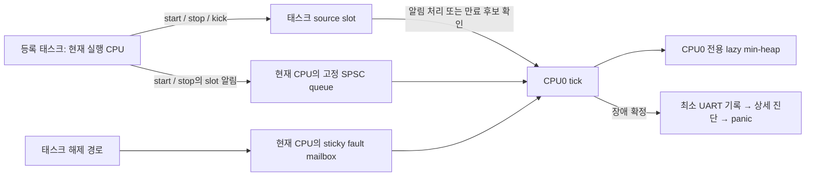

# Health Monitor SMP 구현 및 검증 보고서

## 1. 대상과 결론

- 구현 커밋: [`3e8af4d610eaeba99f91bc2625e40b01a4850ffa`](https://github.com/SeokhunEom/TizenRT/commit/3e8af4d610eaeba99f91bc2625e40b01a4850ffa)
- 브랜치: `codex/health-monitor`
- 검증 실행일: 2026-09-08, 명령 실행 시각 기준 22:25 KST
- 상세 계약: [Health Monitor core specification](health_monitor.md)

기존 UP 구현을 CPU0가 감시 상태와 heap을 관리하는 구조로 확장했다. 대상 커널 코드에는 atomic API, CAS, exclusive 명령 또는 새 shared lock을 도입하지 않았다. 태스크의 명시적 진행 신호를 사용하며 기존 `task_monitor`는 유지한다.

호스트 결정적 테스트, 실제 호스트 두 스레드 테스트, sanitizer 검사, ARM 실제 헤더 object 컴파일과 생성 assembly 검사를 통과했다. **전체 펌웨어 링크·부팅이나 실제 RTL8730E SMP 실행을 통과했다는 뜻은 아니다.** 실기기 성능과 하드웨어 장애 주입은 미검증이다.

## 2. 구현 범위와 파일

| 파일 | 역할 |
| --- | --- |
| [health_monitor.h](../os/include/tinyara/health_monitor.h) | self-only `start/stop/kick` API와 오류 계약 |
| [health_monitor.c](../os/kernel/health_monitor/health_monitor.c) | source publication, CPU별 전달 경로, CPU0 heap·장애 확정·진단 |
| [health_monitor_access.h](../os/kernel/health_monitor/health_monitor_access.h) | 정렬된 32-bit 접근과 full memory barrier |
| [health_monitor_internal.h](../os/kernel/health_monitor/health_monitor_internal.h) | tick·태스크 해제 hook 선언 |
| [Kconfig](../os/kernel/health_monitor/Kconfig) | 지원 구성 제한, 기본 비활성화 |
| [sched_processtimer.c](../os/kernel/sched/sched_processtimer.c) | 기존 tick hook 유지, SMP용 `irq_cpu_locked` 선언 헤더 보완 |
| [sched_releasetcb.c](../os/kernel/sched/sched_releasetcb.c) | 기존 PID 해제 전 Health Monitor hook 유지 |
| [test_core.c](../tests/health_monitor/test_core.c) | 접근 순서 교차·경계·오류·반복 테스트 |
| [test_threads.c](../tests/health_monitor/test_threads.c) | 호스트 producer와 CPU0 consumer 동시 실행 모델 |
| [run.py](../tests/health_monitor/run.py) | 임시 커널 adapter 생성, sanitizer 빌드·실행 |
| [compile_arm.py](../tests/health_monitor/compile_arm.py) | UP/SMP 실제 헤더 object 컴파일·assembly 검사 |

SMP는 현재 `ARCH_CHIP_AMEBASMART`만 허용한다. UP와 SMP 모두 실제 주기 timer interrupt가 필요하며, tickless·tick suppression·가짜 tick·`APP_BINARY_SEPARATION` 구성은 차단한다. 자동 태스크 등록, protected-user device/syscall ABI, Managed Binary Teardown 및 HW watchdog 소유권은 추가하지 않았다.

따라서 기존 `rtl8730e/loadable_ext_ddr_st7785` defconfig에 Health Monitor 설정만 추가해서 사용하는 단계가 아니다. 해당 defconfig의 binary separation과 tick suppression은 지원 범위 밖이며, 저장소 defconfig는 변경하지 않았다.

## 3. 동작 구조

### 3.1 쓰는 주체 분리



source slot의 writer는 해당 태스크다. 태스크 해제 hook은 source를 덮어쓰지 않고 종료 사실을 별도 mailbox에 기록한다. Heap, 위치 정보, 확정된 최초 장애와 감시 시간은 CPU0만 갱신한다.

각 CPU의 API·해제 경로는 로컬 IRQ 차단으로 같은 CPU의 producer를 직렬화한다. 다른 CPU를 멈추거나 lock 해제를 기다리지 않는다. 같은 태스크가 두 CPU에서 동시에 실행되지 않는 것과 PID 해제 순서는 기존 scheduler 계약에 의존한다.

### 3.2 atomic API 없는 publication

SMP 공유 데이터는 32-bit `LDR/STR`로 접근하고, 데이터와 version의 관측 순서는 full `DMB SY`로 보호한다. 정렬, cache coherency, shareable RAM이 필수 전제다. `volatile`만으로 동기화하거나 일반적인 64-bit load/store의 원자성을 가정하지 않는다.

Writer는 sequence를 odd로 표시하고 payload를 쓴 다음 even sequence를 publish한다. Reader는 epoch·sequence로 payload 읽기를 감싸 일관된 snapshot만 받아들인다. 읽기에 실패해도 안정될 때까지 반복하지 않는다.

낮은 sequence가 wrap할 때 별도 32-bit epoch를 증가시켜 높은 kick 빈도에서 수 주 만에 version이 소진되지 않게 했다. Epoch와 sequence 역시 개별 word로 읽고 쓴다. 최종 identity 소진과 시간 덧셈 overflow는 오류를 보고하고 CPU0에서 장애로 처리한다.

정상 tick의 시간 갱신은 공유 low word만 쓴다. 64-bit 시간의 high-word carry에만 sequence 보호를 적용한다. 태스크가 읽은 값은 일관된 이전/이후 시간 또는 재시도 가능한 읽기 실패여야 한다.

### 3.3 API와 등록 변경

| 경로 | 수행 내용 | heap 작업 |
| --- | --- | --- |
| `start(timeout_ms)` | queue 공간 확인, source 활성화, slot 알림 publish | 없음 |
| `kick()` | 시간·계약 확인, deadline과 publication version 갱신 | 없음 |
| `stop()` | 시간·계약과 queue 공간 확인, source 비활성화, slot 알림 publish | 없음 |
| CPU0 | 알림 slot의 최신 snapshot 반영, 만료 후보 확인 | 필요한 항목만 삽입·삭제·재정렬 |

알림은 과거의 start/stop 명령이 아니라 “이 slot을 다시 읽어라”는 뜻이다. CPU1에서 start하고 CPU0로 이동해 stop/restart한 뒤 오래된 CPU1 알림이 처리돼도, CPU0는 최신 상태를 반영한다. Full PID 확인과 publication identity로 slot 재사용을 구분한다.

Queue는 CPU마다 `CONFIG_MAX_TASKS`개의 유효 entry를 갖는다. 공간 확인은 source 변경 전에 수행한다. 가득 차면 `-ENOSPC`를 반환하며 실패한 start는 등록하지 않고, 실패한 stop은 기존 계약을 유지한다. Kick은 membership queue를 사용하지 않아 queue 포화 중에도 가능하다.

CPU0는 각 queue의 head를 tick마다 한 번 캡처한다. Producer가 계속 알림을 넣더라도 현재 tick에서 처리할 범위가 무한히 늘어나지 않는다. 읽지 못한 slot은 heap 재검사 항목으로 옮겨 뒤의 다른 태스크 알림을 막지 않는다.

### 3.4 최소 deadline 검사와 publication 정체

새 알림이 없고 root가 미래이면 source slot을 읽지 않는다. Root가 만료 후보일 때만 실제 source deadline을 읽고, kick으로 연장됐으면 heap을 보정해 다음 후보를 드러낸다.

Snapshot이 일관되지 않으면 해당 후보만 다음 tick에 재검사한다. 동일한 읽을 수 없는 epoch/sequence가 최초 관측 이후 두 tick 더 유지되면 publication 장애로 확정한다. Version이 진행했다면 정상 publication이 완료된 증거로 취급해 정체 시간을 다시 잡는다. 단순 읽기 충돌 횟수로 바쁜 정상 태스크를 장애로 판정하지 않는다.

CPU별 progress identity는 첫 등록 알림이나 fault-ready word를 내보내기 전에 producer가 멈추는 경우도 감시한다. 별도의 일반 CPU heartbeat는 아니므로, API 밖에서 멈춘 CPU는 그 CPU에서 실행돼야 할 등록 태스크의 timeout을 통해 검출한다.

| 상황 | 정상 경로 비용 |
| --- | --- |
| start / stop / kick | 태스크 측 O(1), 로컬 IRQ 차단 |
| 변경 알림 없음, root 미래 | O(CPU 수), 등록 source 읽기 0회 |
| 등록 변경 K개 | CPU0에서 O(K log N), 캡처한 queue 범위로 제한 |
| 만료·재검사 후보 R개 | CPU0에서 O(R log N) |
| Fatal Diagnostic Phase | 전체 source·cache·태스크 순회 허용 |

이는 구조적 연산량이며 실제 IRQ 지연의 마이크로초 상한을 측정한 결과는 아니다.

### 3.5 timeout·오류·진단

Timeout은 `ceil(timeout_ms * 1000 / USEC_PER_TICK)`으로 변환한다. API 내부에서 읽은 시간과 CPU0가 받아들인 snapshot이 경합의 판단 기준이다. 모든 CPU의 이벤트를 전역 CAS로 정렬하는 계약은 제공하지 않는다. 진행 중인 API가 성공을 반환하는 시점에 CPU0가 이미 장애를 확정하는 경합은 가능하다.

`-EAGAIN`은 시간 carry와 겹친 읽기 실패, `-ENOSPC`는 queue 포화이며 모두 계약 변경 없이 반환한다. 호출자는 결과를 확인하고 정상 실행 기회에 처리해야 한다. 성공할 때까지 busy retry하거나 stop 실패 뒤 정상 해제된 것으로 간주하면 안 된다.

늦은 kick/stop은 `-ETIMEDOUT`, 잘못된 publication은 `-EIO`, identity/시간 소진은 `-EOVERFLOW`와 함께 fault를 보고한다. CPU별 fault mailbox는 최초 ready 이후 불변이고, CPU0가 mailbox를 CPU 순서로 확인한 다음 deadline을 검사한다. “최초”는 전역 wall-clock상 가장 빠른 사건이 아니라 CPU0가 처음 확정한 장애다.

장애 확정 후 출력 순서는 다음과 같다.

1. Reason, PID, source slot, reporting CPU, 시간, deadline을 담은 최소 UART header.
2. 설정된 경우 기존 `REBOOT_SYSTEM_WATCHDOG` reason 기록.
3. Heap cache, 아직 heap에 반영되지 않은 source, CPU별 queue/progress/fault 상태 출력.
4. Live task 상태·우선순위·scheduler lock count·wait semaphore·stack 주소 출력.
5. Architecture `PANIC()` 및 반환할 경우 최종 정지 loop.

`3`은 publication 장애, `4`는 identity/시간 소진이며 기존 `1` timeout, `2` unexpected exit와 구분한다. 읽지 못한 source나 알 수 없는 PID는 불확실한 상태로 표시한다. 종료된 TCB의 stack 사본은 보존하지 않는다.

전체 태스크 순회와 panic은 SMP lock이나 CPU pause에서 멈출 수 있다. 최소 기록과 reboot reason은 그 전에 출력하지만, **HW watchdog을 소유하지 않으므로 상세 진단 정체나 CPU0 tick 정지 뒤 reset을 보장하지 않는다.**

## 4. 재실행한 검증과 결과

### 4.1 환경과 실행 명령

- Apple clang 21.0.0 (`clang-2100.1.1.101`)
- 호스트 target: `arm64-apple-darwin25.6.0`
- Python 3.9.6
- 구현 커밋과 같은 코드·테스트 파일로 아래 명령을 실행한 뒤 커밋했다.

```sh
python3 tests/health_monitor/run.py
HEALTH_TSAN=1 python3 tests/health_monitor/run.py
python3 tests/health_monitor/compile_arm.py
git diff --check
```

모두 종료 코드 0이었다. Sanitizer 진단과 whitespace 오류는 없었다. 이 절의 결과는 로컬 실행 결과이며 CI 실행 결과가 아니다.

### 4.2 호스트 테스트

| 검사 | 규모·관측 결과 | 증거 범위 |
| --- | --- | --- |
| 결정적 UP 모델 | 100,000회 churn 및 경계 테스트 PASS | production C source, fake kernel/IRQ/UART/panic |
| 결정적 SMP 모델 | 100,000회 churn 및 word-access 교차 테스트 PASS | 단일 호스트 스레드에서 접근 순서 강제 교차 |
| Native two-thread 모델 | API 시도 320,000회와 CPU0 tick 5,000회 동시 실행 PASS | producer 1개와 consumer 1개, 마지막에 drain tick 1회 추가 |
| ASan/UBSan | 기본 명령의 위 테스트들에서 진단 없음 | 호스트 메모리·정의되지 않은 동작 검사 |
| TSan | `HEALTH_TSAN=1`의 native-thread 모델에서 진단 없음 | 호스트 동기화 모델의 race 검사 |

320,000회는 성공 호출 수가 아니라 API 시도 수다. `-ENOSPC`와 `-EAGAIN`은 허용된 결과로 검사한다. TSan 명령에서도 결정적 UP/SMP 모델은 ASan/UBSan을 사용하며, native-thread 모델의 sanitizer만 TSan으로 바뀐다. 반복 실행한 결과를 더해 테스트 규모를 부풀리지 않는다.

출력 요약:

```text
PASS UP: API/queue errors, deadlines, lazy roots, exit, migration, word-boundary schedules, publication stalls, 100000 churn operations
PASS SMP: API/queue errors, deadlines, lazy roots, exit, migration, word-boundary schedules, publication stalls, 100000 churn operations
PASS: native-thread word-access model, 320000 API calls concurrent with 5000 CPU0 ticks
```

다음 시나리오를 포함한다.

- 잘못된 API 문맥·인자·상태, terminal fault 이후 오류.
- Timeout ceiling, 최대 millisecond timeout, 정확한 만료 경계.
- 32-bit 시간 carry, epoch/sequence wrap, 최종 identity 소진, retry key overflow.
- Kick으로 stale root가 연장돼도 다른 expired task가 드러나는지.
- Queue 포화의 원상 유지와 포화 중 kick.
- CPU 이동 후 start/stop/restart 알림 역전, PID 재사용, unexpected release.
- Snapshot 중간 변경 거부, busy writer의 queue 선두 차단 방지.
- 진행하는 publication과 멈춘 publication 구분, producer 정체 검출.
- Source scan이 없는 healthy tick, 최초 장애 보존, 미반영 등록의 fatal 출력.

Native-thread adapter에는 호스트 전용 `__atomic`과 mutex/condition barrier가 있다. 이는 대상 커널 구현이 아니라 sanitizer가 이해할 수 있는 coherent word 모델과 테스트 실행 순서 제어다. 배치마다 CPU0 tick을 한 번으로 제한해 호스트 OS가 fake IRQ-masked producer를 deschedule한 것을 RTOS CPU 장애로 오인하지 않게 했다. 배치 내부 두 스레드는 실제로 동시에 실행한다.

**호스트 모델은 ARM weak memory보다 강하며, TSan PASS가 실제 ARM 배리어·cache coherency·CPU migration 구현을 증명하지는 않는다.**

### 4.3 ARM object 및 assembly 검사

| 대상 | 검사 결과 |
| --- | --- |
| QEMU `tc_16m`, Cortex-M3 UP | 기능 on/off scheduler hook object 및 core object PASS |
| RTL8730E `loadable_ext_ddr_st7785` 기반, Cortex-A32 SMP | 기능 on/off scheduler hook object 및 core object PASS |
| 지원하지 않는 SMP port | compile guard에 의한 거부 확인 |
| `-O2` core assembly | `LDREX/STREX/SWP`, `__atomic`, `__sync`, `libatomic` 패턴 없음 |
| SMP assembly | full `DMB SY` 존재 |
| Core assembly 직접 참조 | 검사 대상 semaphore·spinlock·할당·VFS·sleep 이름 없음 |

```text
PASS: qemu/tc_16m enabled/disabled objects and no-atomic assembly
PASS: rtl8730e/loadable_ext_ddr_st7785 enabled/disabled objects and no-atomic assembly
PASS: unsupported SMP port rejected
```

임시 테스트 config에서는 `APP_BINARY_SEPARATION`, `SCHED_TICKSUPPRESS`, `PM_TICKSUPPRESS`, `HEAPINFO_USER_GROUP`를 해제한다. 실제 저장소 defconfig를 수정한 것이 아니며 원래 loadable 구성 전체를 빌드했다는 의미도 아니다.

Assembly 검사는 core translation unit의 패턴 검사다. 외부 함수까지 포함한 전체 firmware call graph 증명은 아니다. 특히 fatal 경로의 `sched_foreach()`와 panic 내부는 기존 lock을 사용할 수 있다.

## 5. 남은 검증과 적용 조건

다음은 이번 보고서에서 PASS로 분류하지 않는다.

- 전체 펌웨어 link·boot 및 RTOS SMP 환경의 실제 실행.
- 실제 CPU 이동·삭제·취소와 source writer 직렬화의 stress 검증.
- 실제 공유 RAM 속성, cache coherency와 ARM weak-memory 경합 재현.
- API latency, worst-case tick 지연, RAM 사용량과 linker map 측정.
- PM sleep 제외 시간, UART 출력·persistent reason의 실기기 확인.
- CPU0 tick 정지, CPU pause 실패, 진단 정체에 대한 HW reset 검증.

실기기 적용 전에는 위 검증을 수행하고, 사용 모듈별 timeout과 API 오류 처리를 정해야 한다. 원래 목표인 “진단이 멈춰도 반드시 reset”까지 확장하려면 보드 HW watchdog 소유권, feed 중단 및 panic/PM 연동이 추가로 필요하다.
