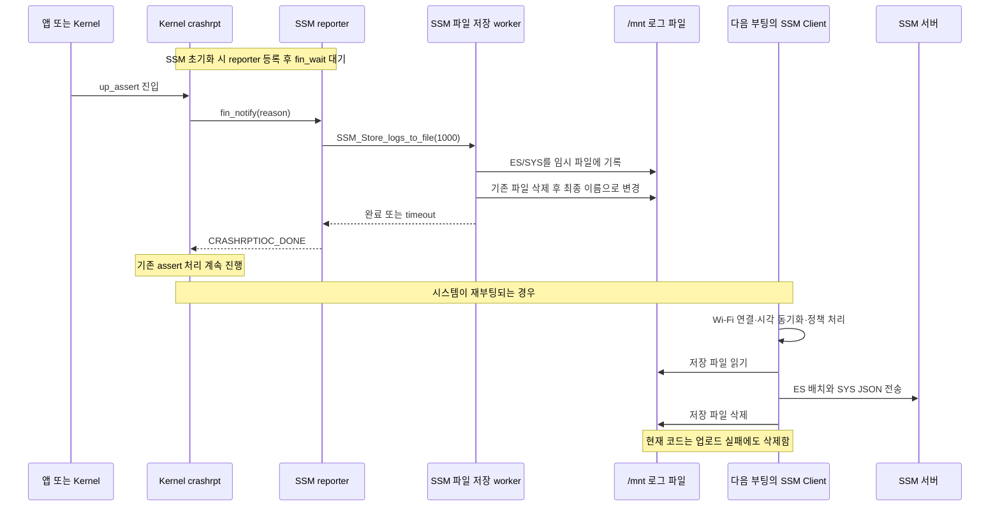

# SSM 재부팅 전 로그 저장·부팅 후 업로드: 변경 설명 및 코드 리뷰

작성일: 2026-09-19 · 검토 대상: Kernel, SSM_Release, TR_Utils의 아래 고정 커밋

## 1. 먼저 읽을 결론

이 변경의 목적은 **메모리에만 있던 SSM 로그를 재부팅 전에 파일로 남기고, 다음 부팅에서 네트워크가 준비되면 서버로 보내는 것**이다. Kernel은 저장할 시간을 마련하고, SSM은 실제 로그를 저장·복원·전송하며, TR_Utils는 크래시 저장 기능을 시험하는 앱을 제공한다.

큰 흐름은 연결되어 있지만 **현재 상태는 수정 후 재검토가 필요하다.** 전송 실패 후에도 파일을 삭제하고, 복원 시 첫 SYS 로그가 누락되는 문제가 있다. 저장 완료 판정, Kernel의 시간 제한, SmartFS의 시간 정보, 테스트의 성공 판정에도 결함이 있다.

또한 자동 저장이 연결된 지점은 **ARMv7-A의 assert 처리 진입부**다. 정상 재부팅 전체에 연결된 공통 종료 훅은 아니다. 하드웨어 fault·인터럽트 문맥의 assert는 이 방식으로 저장하지 않는다. 따라서 “모든 재부팅 직전에 반드시 저장한다”는 기능으로 설명하면 실제 범위보다 넓어진다.

검증은 고정 소스 정적 분석, 독립 Standards/Spec 리뷰, 실제 C 함수 일부를 추출한 호스트 재현으로 수행했다. 보드에서의 재부팅·플래시 영속성·실제 서버 수신은 확인하지 않았다.

## 2. 검토 기준과 범위

사용자가 제시한 요구사항을 기준으로 삼았다.

> SSM에 저장된 로그를 리붓하기 직전에 file로 저장하고 부팅 이후에 업로드 하는 기능

세 비교 URL의 `main...feature`는 **공통 조상부터 feature head까지의 변경**을 의미한다. 원격 main과 head를 조회한 뒤 아래 SHA로 고정했다. 세 브랜치 모두 main과 분기된 상태이므로, 최신 main에 병합한 최종 트리나 병합 충돌까지 검증한 결과는 아니다.

| 저장소 | 비교 URL | 조회한 main | 검토 head | 실제 diff 시작점: merge-base | 규모 |
|---|---|---|---|---|---|
| Kernel | [ssm_integration 비교](https://github.ecodesamsung.com/TizenRT/Kernel/compare/main...naman1-jain:Kernel:ssm_integration) | `74a9092d460473e2fa2febd177b233f50760d73b` | `2376ac39edd73b8bbc67340c240e94f76e4e7b31` | `32b18b46b8853b394781037e09dab0c4ad09a127` | 2 commits, 16 files, +801/−15 |
| SSM_Release | [pr_67 비교](https://github.ecodesamsung.com/TizenRT/SSM_Release/compare/main...naman1-jain:SSM_Release:pr_67) | `22796c7a2a413c7eda2d57e635f5130081c0ff4d` | `da03e7fbb8d6d43e2b6c9799524b21ee95c14b84` | `11babad06146f51bc4375e18600f2986e13fa1f0` | 8 commits, 22 files, +2994/−256 |
| TR_Utils | [ssm_integration_1 비교](https://github.ecodesamsung.com/TizenRT/TR_Utils/compare/main...naman1-jain:TR_Utils:ssm_integration_1) | `863a148a9e63d18204a725017e71ae900ad2a600` | `3661ba8a9735d4f4433c28859affe2edd9aaaed5` | `f0e23b8df2dd297bb535737d4f6c30f08366500c` | 2 commits, 13 files, +1969/−0 |

합계는 12 commits, 51 files, +5764/−271이다. 전체 SHA·커밋 메시지·파일 목록은 [manifest.json](evidence/manifest.json), 원본 변경은 [Kernel.diff](evidence/Kernel.diff), [SSM_Release.diff](evidence/SSM_Release.diff), [TR_Utils.diff](evidence/TR_Utils.diff)에 보존했다.

각 저장소에서 실행한 비교 명령은 `git diff <위 main SHA>...<위 head SHA>`이며, 커밋 목록은 `git log <main SHA>..<head SHA> --oneline`으로 확인했다. 기존 작업 디렉터리는 그대로 두고 별도의 임시 checkout에서 검토했다.

별도 기능 명세서나 이 head에 대응하는 PR은 확인되지 않았다. `pr_67`이라는 브랜치명 자체를 PR #67로 간주하지 않았다. `docs/agents/issue-tracker.md`도 없어 `code-review` 스킬의 이슈 추적 설정은 이용하지 못했다. 향후 해당 워크플로를 구성하려면 `/setup-matt-pocock-skills`를 실행하면 된다. 이번 리뷰는 사용자 요구사항과 커밋 설명을 명세로 사용했다.

## 3. 쉽게 이해하는 전체 흐름

### 세 저장소의 역할

| 저장소 | 쉬운 설명 | 실제 책임 |
|---|---|---|
| Kernel | 재부팅 처리에 들어가기 전에 “로그부터 남겨라”라고 알리고 잠시 기다리는 담당 | `/dev/crashrpt`, reporter 등록, 깨우기, 완료 대기, 파일 I/O용 ioctl |
| SSM_Release | 메모리 속 로그를 파일로 옮기고, 다음 부팅에서 서버로 보내는 담당 | ES/SYS 직렬화, 파일 복원, JSON 구성, 기존 mTLS 전송 경로 사용 |
| TR_Utils | 저장 담당이 제때 실행되는지 시험하는 도구 | 합성 데이터 저장 예제, APP_ASSERT/KERNEL_ASSERT 발생, 결과 파일 검사 |

### 실행 순서



그림은 현재 코드의 호출 흐름이다. 마지막 삭제, 저장 파일 교체, 제한 시간의 실제 보장 여부는 아래 리뷰에서 다룬다. 기존 assert 처리는 설정에 따라 사용자 바이너리 복구로 이어질 수도 있어, `up_assert()` 호출 자체가 항상 보드 재부팅을 뜻하지는 않는다.

### 파일에는 무엇이 들어가는가

SSM은 최종 파일 `/mnt/ssm_stored_logs`와 임시 파일 `/mnt/ssm_stored_logs_temp`를 사용한다. 파일 전체를 그대로 서버에 첨부하는 방식이 아니라, 파일을 읽어 기존 SSM JSON 이벤트로 재구성한 뒤 전송한다.

```text
<0#1609459200#CS001#연결 실패 메시지>
<1#retry_count#NUM#3>
<1#last_state#STR#connecting>
```

`0`은 ES 계열 이벤트이며 시간·코드·메시지를 저장한다. `1`은 SYS KPI이며 이름·NUM/STR 자료형·값을 저장한다. 일반적인 CSV가 아니라 자체 구분자 형식이다. 현재 형식에는 버전, 레코드 길이, checksum, 문자열 escape가 없다. 모든 로그를 무조건 저장하는 것도 아니다. ES는 정책의 활성화·레벨 조건을 적용하고, SYS는 `KPI_SEND_NONE`, `KPI_SEND_NOW`, 비활성 항목을 제외한다. [저장 코드](https://github.ecodesamsung.com/naman1-jain/SSM_Release/blob/da03e7fbb8d6d43e2b6c9799524b21ee95c14b84/DA-Service/SSM/src/SSM_file_logger.c#L88-L248)

## 4. 저장소별 변경 설명

### Kernel: assert 전에 저장 스레드가 실행될 기회 제공

1. **설정과 장치 등록**: `CONFIG_CRASH_REPORT` 및 기본 3000ms 제한을 추가하고 RTL8730E AILP 계열 8개 defconfig에서 활성화한다. ARMv7-A 초기화에서 `/dev/crashrpt`를 등록한다. 현재 등록은 `CONFIG_DEV_NULL` 블록 안에 있다. [설정](https://github.ecodesamsung.com/naman1-jain/Kernel/blob/2376ac39edd73b8bbc67340c240e94f76e4e7b31/os/drivers/Kconfig#L599-L632), [초기화](https://github.ecodesamsung.com/naman1-jain/Kernel/blob/2376ac39edd73b8bbc67340c240e94f76e4e7b31/os/arch/arm/src/armv7-a/arm_initialize.c#L163-L171)
2. **assert 훅**: `up_assert()`의 critical section·다른 CPU 정지보다 앞에서 `crashrpt_notify(reason)`를 호출한다. 앱 assert, Kernel assert, 하드웨어 fault의 reason을 구분한다. [assert 훅](https://github.ecodesamsung.com/naman1-jain/Kernel/blob/2376ac39edd73b8bbc67340c240e94f76e4e7b31/os/arch/arm/src/armv7-a/arm_assert.c#L586-L619)
3. **reporter와의 약속**: 한 스레드만 `REGISTER`할 수 있다. 이 스레드는 `fin_wait()`에서 쉬다가 Kernel이 깨우면 저장하고 `DONE`으로 완료를 알린다. Kernel은 reporter 우선순위를 높이고 완료 semaphore를 기다린다. [등록·완료 처리](https://github.ecodesamsung.com/naman1-jain/Kernel/blob/2376ac39edd73b8bbc67340c240e94f76e4e7b31/os/drivers/crashrpt.c#L164-L211), [통지·대기](https://github.ecodesamsung.com/naman1-jain/Kernel/blob/2376ac39edd73b8bbc67340c240e94f76e4e7b31/os/drivers/crashrpt.c#L316-L402)
4. **파일 I/O ioctl**: `FILE_OPEN`, `FILE_WRITE`, `FILE_FSYNC`, `FILE_CLOSE`는 Kernel의 `file_*` API를 사용한다. 함수 자체가 임시 파일 이름이나 rename을 관리하는 것은 아니다. **임시 파일 작성 후 rename 정책은 호출자 책임**이다. [파일 ioctl](https://github.ecodesamsung.com/naman1-jain/Kernel/blob/2376ac39edd73b8bbc67340c240e94f76e4e7b31/os/drivers/crashrpt.c#L213-L284)
5. **테스트용 assert 주입**: `/dev/null`에 새 ioctl을 추가해 인자가 NULL이 아니면 Kernel assert를 발생시킨다. 테스트 설정으로 제한되어 있지 않은 점은 S6의 수정 대상이다.

Kernel은 SSM 로그 형식이나 서버를 모른다. “reporter가 실행되도록 한다”는 역할만 담당한다. 하드웨어 watchdog 함수는 제공되지만 현재 구현은 아무 동작도 하지 않는다.

### SSM_Release: 저장·복원·전송의 실제 구현

- **공개 저장 API**: `SSM_Store_logs_to_file(time_limit_ms)`를 추가한다. 1000ms 미만은 거부하며 한 부팅 내 한 번만 실행하도록 상태를 유지한다. 별도 worker를 만들고 semaphore로 완료를 기다린다. 저장 직전 기존 ES/SYS 전송 간격을 30초 늘린다. [API](https://github.ecodesamsung.com/naman1-jain/SSM_Release/blob/da03e7fbb8d6d43e2b6c9799524b21ee95c14b84/DA-Service/SSM/src/SSM_client.c#L1736-L1739), [worker·timeout](https://github.ecodesamsung.com/naman1-jain/SSM_Release/blob/da03e7fbb8d6d43e2b6c9799524b21ee95c14b84/DA-Service/SSM/src/SSM_file_logger.c#L341-L420)
- **파일 헬퍼**: `SSM_file_helper.c`는 `fopen/fread/fwrite/fclose/fseek/stat/unlink/rename`의 결과를 SSM 반환값으로 바꾸는 계층이다. **SSM의 실제 저장은 일반 stdio를 사용하며, Kernel의 `CRASHRPTIOC_FILE_*`는 사용하지 않는다.** TR_Utils 예제와 실제 제품 경로가 다른 중요한 지점이다. [헬퍼](https://github.ecodesamsung.com/naman1-jain/SSM_Release/blob/da03e7fbb8d6d43e2b6c9799524b21ee95c14b84/DA-Service/SSM/src/SSM_file_helper.c#L14-L118)
- **정책·순번 접근**: ES/SYS 정책 구조체를 헤더로 옮기고 getter를 추가한다. 파일에서 복원한 이벤트 전송에 사용할 순번 갱신 함수도 추가한다.
- **부팅 후 자동 전송**: Wi-Fi·시각 동기화 이후 파일 존재 여부를 검사한다. 정책 처리 시간 뒤 파일 전송을 예약하고 기존 실시간 ES/SYS 전송을 조금 뒤로 미룬다. ES는 최대 20개씩 읽어 보내고 SYS는 최대 50개 테이블에 모아 `TizenRT_REPORT` 이벤트로 보낸다. [부팅 스케줄](https://github.ecodesamsung.com/naman1-jain/SSM_Release/blob/da03e7fbb8d6d43e2b6c9799524b21ee95c14b84/DA-Service/SSM/src/SSM_client.c#L463-L543), [복원](https://github.ecodesamsung.com/naman1-jain/SSM_Release/blob/da03e7fbb8d6d43e2b6c9799524b21ee95c14b84/DA-Service/SSM/src/SSM_file_logger.c#L831-L929)
- **crash reporter**: `SSM_init()`에서 조건부로 생성한다. assert 알림을 받으면 `SSM_Store_logs_to_file(1000)`을 호출하고 성공 여부와 관계없이 `DONE`을 보낸다. Kernel 설정의 3000ms와 SSM 저장 API의 1000ms는 서로 다른 제한이다. [reporter](https://github.ecodesamsung.com/naman1-jain/SSM_Release/blob/da03e7fbb8d6d43e2b6c9799524b21ee95c14b84/DA-Service/SSM/src/SSM_client.c#L2081-L2161)
- **쉘 명령**: `ssm store <time_limit_ms>`를 추가한다. 메시지는 재부팅을 안내하지만 실제 마지막 호출은 `exit(0)`이다. 이 함수 자체는 시스템 reboot API를 호출하지 않는다. 제품의 프로세스 종료 정책과 혼동하면 안 된다. [명령 구현](https://github.ecodesamsung.com/naman1-jain/SSM_Release/blob/da03e7fbb8d6d43e2b6c9799524b21ee95c14b84/DA-Service/SSM/src/SSM_command.c#L355-L396)
- **빌드·패키지·UTC**: 두 신규 C 파일을 빌드에 추가하고 파일 헬퍼·로거 UTC 등을 추가한다. toolchain을 제외한 kernel/system/ocf/trutils/wifi/dawit/miscs 요구 범위를 모두 `>=2.0 <3.0`으로 바꾼다. 따라서 기존 1.x 플랫폼에 이 SSM만 적용하는 변경은 아니다. [패키지 의존성](https://github.ecodesamsung.com/naman1-jain/SSM_Release/blob/da03e7fbb8d6d43e2b6c9799524b21ee95c14b84/conanfile.py#L49-L57)

### TR_Utils: 제품 로직이 아닌 크래시 시험 도구

| 추가 앱 | 하는 일 | 이 앱의 성공이 증명하지 않는 것 |
|---|---|---|
| `crashrpt_test` | 500개·50개 합성 노드와 메시지를 만들고 자체 reporter가 Kernel 파일 ioctl로 바이너리 보고서를 기록 | 실제 SSM 버퍼와 정책, SSM stdio 저장 경로, 복원 JSON, 서버 업로드 |
| `crashrpt_comprehensive_test` | APP_ASSERT와 `/dev/null`을 통한 KERNEL_ASSERT를 발생시키고 텍스트 메타데이터 파일 확인 | 모든 fault 종류, 정상 reboot, 저장된 ES/SYS 원본 보존, 서버 수신 |

두 앱에 Kconfig·Makefile·shell entry·README를 추가하고 RTL8730E 설정에서 둘 다 빌드하도록 켠다. 기본 디렉터리는 `/mnt`, reporter 우선순위는 254, stack은 8192이다. 파일 기록은 임시 파일 → fsync → close → rename 방식이다. [기본 예제 기록](https://github.ecodesamsung.com/naman1-jain/TR_Utils/blob/3661ba8a9735d4f4433c28859affe2edd9aaaed5/apps/examples/crashrpt_test/crashrpt_test_main.c#L410-L493), [comprehensive 예제](https://github.ecodesamsung.com/naman1-jain/TR_Utils/blob/3661ba8a9735d4f4433c28859affe2edd9aaaed5/apps/examples/crashrpt_comprehensive_test/crashrpt_comprehensive_test_main.c#L146-L222)

**SSM reporter와 테스트 reporter를 동시에 등록할 수 없다.** Kernel은 등록을 하나만 허용하므로 이미 SSM이 등록된 제품에서 예제를 실행하면 `EBUSY`가 된다. 예제 단독 시험과 SSM 통합 시험을 분리해야 한다. 또한 README 일부 예시는 `/tmp`를 사용하지만 실제 기본값은 `/mnt`다.

## Standards

이 절은 독립 Standards 리뷰 결과이며, 기능 결함을 다루는 Spec과 별도로 판단한다. 저장소의 `AGENTS.md`와 이들이 지정하는 공통 개발 가이드를 확인했다. `/conanhelper/AGENTS.md`와 환경변수 경로가 없어 로컬에서 확인한 [공통 가이드](/Users/seokhun/conanhelper/AGENTS.md)를 사용했다. 원격에서 관리되는 최신 가이드와의 일치까지 검증한 것은 아니다.

### 문서화된 규칙 위반: 2개

**ST1. 공개 심볼에 패키지 prefix가 없다.** 공개되는 `SSM_file_logger.h:11–17`의 `KPI_BUFFER_SIZE`, `kpi_file_data`는 SSM prefix가 없다. `conanfile.py`의 헤더 wildcard로 패키지에 포함되므로 공통 가이드 383–385행의 “헤더 파일에 명시된 모든 심볼은 패키지 이름으로 시작” 규칙에 해당한다. SSM prefix를 붙이거나 공개할 필요가 없다면 내부 헤더로 한정하는 것이 맞다. [헤더](https://github.ecodesamsung.com/naman1-jain/SSM_Release/blob/da03e7fbb8d6d43e2b6c9799524b21ee95c14b84/DA-Service/SSM/include/SSM_file_logger.h#L11-L17), [규칙](/Users/seokhun/conanhelper/AGENTS.md:383)

**ST2. 신규 crash 경로 단위테스트가 빠져 있다.** Kernel driver의 등록·완료·timeout·재진입과 SSM reporter의 실패 경로를 검증하는 UTC가 없다. 공통 가이드 299–303행은 신규 코드에 단위테스트를 요구한다. TR_Utils 수동 앱과 SSM 파일 로거 UTC는 이 경로를 대신 검증하지 않는다. CI/TEM 점수가 실패했다는 뜻은 아니며, 이번에는 그 수치를 확인하지 못했다. [Kernel 대상](https://github.ecodesamsung.com/naman1-jain/Kernel/blob/2376ac39edd73b8bbc67340c240e94f76e4e7b31/os/drivers/crashrpt.c#L157-L291), [SSM 대상](https://github.ecodesamsung.com/naman1-jain/SSM_Release/blob/da03e7fbb8d6d43e2b6c9799524b21ee95c14b84/DA-Service/SSM/src/SSM_client.c#L2081-L2171), [규칙](/Users/seokhun/conanhelper/AGENTS.md:299)

### 기존 관행과 문서 간 예외 확인: 1개

새 `<tinyara/crashrpt.h>` 및 `CRASHRPT*`/`crashrpt_*`는 공통 가이드의 package include/prefix 규칙을 문자 그대로 따르면 맞지 않는다. 다만 기존 Kernel 헤더 관행을 따른 형태이므로 곧바로 기능 결함으로 분류하지 않았다. 플랫폼 헤더에 적용되는 예외 범위를 확인하면 된다. [신규 헤더](https://github.ecodesamsung.com/naman1-jain/Kernel/blob/2376ac39edd73b8bbc67340c240e94f76e4e7b31/os/include/tinyara/crashrpt.h#L90-L250)

### 설계 판단: 3개

1. **Duplicated Code / Mysterious Name**: `SSM_Send_log_v2()`가 기존 전송 함수의 `dawit_tls_lock()` → create → connect → 인증 → write/read → 정리를 복제한다. JSON 생성과 전송을 분리한 공통 함수로 모으면 두 경로의 오류 처리 차이가 줄어든다. `v2`보다 전송 대상과 역할이 드러나는 이름이 낫다. [신규 함수](https://github.ecodesamsung.com/naman1-jain/SSM_Release/blob/da03e7fbb8d6d43e2b6c9799524b21ee95c14b84/DA-Service/SSM/src/SSM_client.c#L1782-L1936)
2. **Feature Envy**: 파일 로거가 ES/SYS의 가변 정책 배열을 getter로 받아 `SSM_status`, `level`, `status`를 직접 읽는다. 정책 소유 모듈에 저장 가능 여부를 묻는 인터페이스가 정책 변경을 한곳에 모으기 쉽다. [정책 직접 접근](https://github.ecodesamsung.com/naman1-jain/SSM_Release/blob/da03e7fbb8d6d43e2b6c9799524b21ee95c14b84/DA-Service/SSM/src/SSM_file_logger.c#L101-L118), [SYS 접근](https://github.ecodesamsung.com/naman1-jain/SSM_Release/blob/da03e7fbb8d6d43e2b6c9799524b21ee95c14b84/DA-Service/SSM/src/SSM_file_logger.c#L165-L190)
3. **타입 정보 손실**: 공개 함수의 `void *node`, `void *table`은 실제 입력 자료형이 정해져 있다. typed pointer를 사용하면 잘못된 호출을 컴파일 단계에서 잡을 수 있다. [공개 선언](https://github.ecodesamsung.com/naman1-jain/SSM_Release/blob/da03e7fbb8d6d43e2b6c9799524b21ee95c14b84/DA-Service/SSM/include/SSM_client.h#L54-L62)

이 세 항목은 설계 개선 의견이며 확정적인 규칙 위반으로 세지 않았다. 신규 헤더는 recipe에 포함되어 있고 의존성은 범위로 선언되어 있다. 기존 공개 함수 삭제·signature 변경은 확인되지 않았다.

**Standards 판정: 명시 규칙 위반 2개, 예외 확인 1개, 설계 의견 3개. 이 축에서 가장 중요한 미충족 항목은 crash 경로의 단위테스트 누락이다.**

## Spec

P1은 병합 전에 해결할 주요 결함, P2는 기능 정확성·진단·검증 신뢰성 결함을 뜻한다. S1–S5는 독립 Spec 리뷰의 순서를 유지했다. S6 이후는 주 검토자가 전체 호출 경로와 호스트 재현으로 보완한 항목이다.

### S1. [P1] 업로드에 실패해도 유일한 저장 파일을 삭제한다

**요구:** “부팅 이후에 업로드”.

`SSM_client_task_func()`는 파일 읽기/전송 결과가 실패여도 오류 로그만 출력한 뒤 `SSM_delete_stored_logs_file()`을 호출한다. 이후 `ssm_is_file_exist=false`로 바꿔 재시도도 중단한다. 그 안쪽 로거도 ES 배치 전송 결과를 무시하고, SYS 전송 실패를 반환값에 반영하지 않는다. 읽은 로그 수가 있으면 `DAWIT_SUCCESS`로 끝난다. [삭제 경로](https://github.ecodesamsung.com/naman1-jain/SSM_Release/blob/da03e7fbb8d6d43e2b6c9799524b21ee95c14b84/DA-Service/SSM/src/SSM_client.c#L528-L543), [ES 반환값 무시](https://github.ecodesamsung.com/naman1-jain/SSM_Release/blob/da03e7fbb8d6d43e2b6c9799524b21ee95c14b84/DA-Service/SSM/src/SSM_file_logger.c#L875-L878), [SYS 및 최종 반환](https://github.ecodesamsung.com/naman1-jain/SSM_Release/blob/da03e7fbb8d6d43e2b6c9799524b21ee95c14b84/DA-Service/SSM/src/SSM_file_logger.c#L903-L929)

**발생 조건과 영향:** 정책을 받은 뒤 Wi-Fi가 끊기거나 TLS/서버 응답이 실패하면, 재부팅 전 로그를 서버가 받지 못한 상태로 지운다. 파일 open 실패도 동일하게 삭제 경로로 흐른다.

**확인:** 실제 복원 함수에 실패하는 ES/SYS 전송 stub을 연결한 호스트 실행에서 반환값이 success였다. 최종 삭제는 caller의 정적 제어 흐름으로 확인했다. 실제 서버 실패를 주입한 보드 시험은 아니다.

**수정 방향:** 모든 대상 배치의 전송 성공을 확인한 뒤에만 파일을 삭제한다. 실패하면 파일과 재시도 상태를 유지한다. 일부 배치만 성공한 경우의 중복 방지를 위해 완료 위치나 안정적인 이벤트 식별자도 정해야 한다.

### S2. [P1] 복원할 때 첫 SYS 로그를 항상 소비해 버린다

**요구:** “SSM에 저장된 로그…업로드”.

ES 파서가 첫 SYS 레코드의 `>`까지 읽은 뒤 `type_value != 0`을 이유로 `is_eof=true`를 설정한다. 다음 SYS 루프는 파일 위치를 되돌리지 않고 그다음 레코드부터 읽는다. ES 개수가 20의 배수여도 다음 배치 읽기가 동일하게 첫 SYS를 소비한다. [레코드 소비](https://github.ecodesamsung.com/naman1-jain/SSM_Release/blob/da03e7fbb8d6d43e2b6c9799524b21ee95c14b84/DA-Service/SSM/src/SSM_file_logger.c#L478-L503), [SYS 재개](https://github.ecodesamsung.com/naman1-jain/SSM_Release/blob/da03e7fbb8d6d43e2b6c9799524b21ee95c14b84/DA-Service/SSM/src/SSM_file_logger.c#L881-L888)

**확인:** ES 1개+SYS 2개 입력에서 ES 1개와 두 번째 SYS 1개만 전송되었다. SYS 1개뿐인 파일은 전송 0개와 fail을 반환했다. 정상적으로 작성된 파일만으로 재현된다.

**수정 방향:** 하나의 레코드 파서가 타입을 반환하도록 하거나, ES가 아닌 레코드의 시작 위치로 되돌린 뒤 SYS가 읽게 한다. 정상 EOF와 레코드 타입 전환을 구별해야 한다.

### S3. [P1] close·rename 실패를 무시하고 저장 성공을 보고한다

**요구:** “리붓하기 직전에 file로 저장”.

writer는 `SSM_file_close()` 결과를 확인하지 않는다. 기존 최종 파일이 있으면 먼저 지운 뒤 `SSM_rename_file()`을 호출하고, 그 결과도 확인하지 않은 채 completion 결과를 success로 기록한다. [교체·완료 처리](https://github.ecodesamsung.com/naman1-jain/SSM_Release/blob/da03e7fbb8d6d43e2b6c9799524b21ee95c14b84/DA-Service/SSM/src/SSM_file_logger.c#L317-L338)

**발생 조건과 영향:** close 시 flush 오류가 발생하면 불완전한 파일을 성공으로 취급할 수 있다. 기존 파일 삭제 이후 reset 또는 rename 실패가 발생하면 부팅 시 찾는 최종 파일이 없어진다. 부팅 코드는 임시 파일을 복구 대상으로 찾지 않는다.

**대상 파일시스템 주의:** 이 Kernel의 SmartFS는 목적지 파일이 이미 있으면 rename을 `EEXIST`로 거부한다. 따라서 “unlink만 제거하고 POSIX overwrite rename을 쓰면 된다”는 처방은 이 대상에 그대로 적용할 수 없다. [SmartFS rename](https://github.ecodesamsung.com/naman1-jain/Kernel/blob/2376ac39edd73b8bbc67340c240e94f76e4e7b31/os/fs/smartfs/smartfs_smart.c#L1626-L1634)

**수정 방향:** write/flush/close/rename의 실패를 모두 전파한다. 별도 세대 파일이나 A/B 슬롯, 부팅 시 임시·완료 파일 복구 등 SmartFS 특성에 맞는 교체 절차가 필요하다. 기존 미전송 파일을 덮어쓰는 정책도 명시해야 한다. 영속성은 실제 저장 매체에서 reset을 주입해 확인한다.

### S4. [P1] reporter를 실행한 다음에 3초 제한을 시작한다

**요구:** “리붓하기 직전”의 제한된 저장 및 커밋 설명의 configurable deadline.

Kernel은 reporter를 최고 우선순위로 올린 후 `fin_notify()`로 깨우고, 이 호출이 돌아온 다음에 `clock_systimer()`와 `sem_tickwait()`를 호출한다. 같은 CPU에서 더 높은 우선순위 reporter로 전환되면, reporter가 CPU를 양보하기 전까지 timeout 설치 지점에 도달하지 못할 수 있다. 그 전에 실행한 reporter 시간도 timeout의 시작점에 포함되지 않는다. 먼저 호출하는 `crashrpt_arm_watchdog()`는 weak no-op이며 이 snapshot에는 override가 없다. [순서](https://github.ecodesamsung.com/naman1-jain/Kernel/blob/2376ac39edd73b8bbc67340c240e94f76e4e7b31/os/drivers/crashrpt.c#L363-L398), [빈 watchdog](https://github.ecodesamsung.com/naman1-jain/Kernel/blob/2376ac39edd73b8bbc67340c240e94f76e4e7b31/os/drivers/crashrpt.c#L307-L310), [깨우기 구현](https://github.ecodesamsung.com/naman1-jain/Kernel/blob/2376ac39edd73b8bbc67340c240e94f76e4e7b31/os/kernel/irq/fin_notify.c#L52-L79)

**영향과 증거 범위:** reporter의 무한 루프나 crash 시점의 비정상 실행이 재부팅을 무기한 지연할 수 있는 코드상 반례다. 대상 AILP 설정은 2-core SMP이므로 실제 보드에서 동일 현상의 발생 여부·CPU 배치는 별도 검증해야 한다. 이번 검토에서 보드 hang을 관측한 것은 아니다.

**수정 방향:** reporter 실행 이전의 절대 deadline과 실제 동작하는 독립 watchdog을 마련한다. 최고 우선순위 실행이 감시 주체를 굶기지 않도록 해야 한다. SSM이 새로 만드는 일반 우선순위 worker까지 포함한 종료 시간을 시험해야 한다.

### S5. [P2] SmartFS에서 복원 SYS 이벤트의 날짜가 1970년이 된다

**요구:** “저장된 로그…업로드” 시 진단 정보 보존.

SSM은 `stat().st_ctime`을 파일 생성 시각으로 간주한다. 그런데 대상 Kernel의 `smartfs_stat_common()`은 정상 stat에서도 `st_ctime=0`을 설정한다. SSM은 stat 실패일 때만 현재 시각으로 대체하므로, SmartFS의 성공+0 응답은 `1970-01-01 00:00:00`으로 JSON에 들어간다. [시각 추출](https://github.ecodesamsung.com/naman1-jain/SSM_Release/blob/da03e7fbb8d6d43e2b6c9799524b21ee95c14b84/DA-Service/SSM/src/SSM_file_logger.c#L250-L276), [JSON 시각](https://github.ecodesamsung.com/naman1-jain/SSM_Release/blob/da03e7fbb8d6d43e2b6c9799524b21ee95c14b84/DA-Service/SSM/src/SSM_client.c#L1985-L1994), [SmartFS 구현](https://github.ecodesamsung.com/naman1-jain/Kernel/blob/2376ac39edd73b8bbc67340c240e94f76e4e7b31/os/fs/smartfs/smartfs_smart.c#L1709-L1732)

**수정 방향:** 파일 내용에 저장 시각을 명시하고, 시각 동기화 전 저장된 경우의 표현도 정한다. 파일시스템 메타데이터를 이벤트 시각으로 사용하지 않는다. 이 결론은 해당 `/mnt`가 SmartFS로 구성된 대상에 적용한다.

### S6. [P1] 테스트용 `/dev/null` ioctl이 일반 빌드의 Kernel assert 진입점이 된다

**요구:** 로그 저장·업로드 기능 및 검증 도구 추가. 일반 장치의 임의 ioctl에 의한 시스템 중단은 요구 범위 밖이다.

새 `devnull_ioctl()`은 `cmd`를 검사하지 않고 인자가 NULL이 아니면 `ASSERT`를 실행한다. `CONFIG_CRASH_REPORT`나 테스트 전용 옵션으로 감싸지지도 않았다. `/dev/null`은 0666으로 등록되어 있다. 따라서 이 driver가 포함된 빌드에서는 crash 기능을 꺼도 일반적인 비NULL 인자의 ioctl이 Kernel assert로 이어진다. [새 handler](https://github.ecodesamsung.com/naman1-jain/Kernel/blob/2376ac39edd73b8bbc67340c240e94f76e4e7b31/os/drivers/dev_null.c#L121-L128), [장치 등록](https://github.ecodesamsung.com/naman1-jain/Kernel/blob/2376ac39edd73b8bbc67340c240e94f76e4e7b31/os/drivers/dev_null.c#L161-L164)

**수정 방향:** 전용 test driver/명령으로 분리하고 명시적인 테스트 설정에서만 빌드한다. 일반 ioctl은 기존의 지원하지 않는 명령 처리 의미를 유지한다. 실제 assert 명령은 이번 리뷰에서 실행하지 않았다.

### S7. [P2] 문자열 구분자를 escape하지 않아 로그 내용이 잘린다

**요구:** “SSM에 저장된 로그” 내용의 보존.

writer는 메시지에 들어 있는 `#`, `>`를 그대로 기록한다. reader는 모든 `#`에서 필드 번호를 늘리고 첫 `>`에서 레코드를 끝낸다. 예를 들어 `before#after`, `before>after` 모두 복원 메시지가 `before`가 된다. SYS 이름·문자열 값에도 같은 방식의 문제가 있다. [직렬화](https://github.ecodesamsung.com/naman1-jain/SSM_Release/blob/da03e7fbb8d6d43e2b6c9799524b21ee95c14b84/DA-Service/SSM/src/SSM_file_logger.c#L130-L141), [ES 파싱](https://github.ecodesamsung.com/naman1-jain/SSM_Release/blob/da03e7fbb8d6d43e2b6c9799524b21ee95c14b84/DA-Service/SSM/src/SSM_file_logger.c#L478-L563), [SYS 파싱](https://github.ecodesamsung.com/naman1-jain/SSM_Release/blob/da03e7fbb8d6d43e2b6c9799524b21ee95c14b84/DA-Service/SSM/src/SSM_file_logger.c#L649-L745)

**확인:** 두 ES 문자열 모두 원본 C 파서의 호스트 실행에서 손상을 재현했다.

**수정 방향:** 길이 기반 레코드 또는 명확한 escape 규칙을 가진 형식으로 바꾸고, 버전을 추가한다. 특수문자·빈 문자열·긴 문자열·절단 파일의 저장→복원 왕복 테스트가 필요하다.

### S8. [P2] TR_Utils 검증 함수가 틀린 보고서도 성공으로 판정한다

**요구:** 추가된 APP_ASSERT/KERNEL_ASSERT 시험에서 저장 결과와 reason의 일치 검증.

`verify_report()`는 Expected/Actual Reason이 달라도 `OK`를 반환한다. 필드 존재 여부도 별도로 검사하지 않아 `CRASH REPORT` 헤더만 있으면 두 기본값 0이 같아 PASSED가 된다. `verify_all_reports()`는 파일이 하나라도 있으면 실제 성공 개수와 관계없이 OK를 반환한다. [개별 검증](https://github.ecodesamsung.com/naman1-jain/TR_Utils/blob/3661ba8a9735d4f4433c28859affe2edd9aaaed5/apps/examples/crashrpt_comprehensive_test/crashrpt_comprehensive_test_main.c#L281-L347), [전체 검증](https://github.ecodesamsung.com/naman1-jain/TR_Utils/blob/3661ba8a9735d4f4433c28859affe2edd9aaaed5/apps/examples/crashrpt_comprehensive_test/crashrpt_comprehensive_test_main.c#L372-L391)

**확인:** Expected=2/Actual=3인 파일과 헤더만 있는 파일 모두 실제 검증 함수의 호스트 실행에서 OK였다. 따라서 “예제 검증 성공”만으로 reason 처리나 파일 완전성을 입증할 수 없다.

**수정 방향:** 필수 필드 존재, 허용 reason, 테스트 종류와 reason 일치를 검사하고 불일치면 ERROR를 반환한다. 전체 검증도 `count>0 && success==count`를 요구해야 한다. 부팅 후 기본 `verify`가 사용하는 RAM 순번은 초기화되므로 최신 파일 탐색 또는 명시 경로도 필요하다.

### S9. [P1] 파일에서 복원한 로그는 새 부팅의 전송 금지 정책을 우회한다

**요구:** “부팅 이후에 업로드”를 기존 SSM 정책 안에서 수행. 저장 기능 추가가 현재 전송 허용 여부를 무시하는 동작을 요구하지는 않는다.

정상 ES/SYS 경로는 `SSM_check_send_task()`와 `g_ssm_master_status`를 검사한다. 파일 복원 경로는 `SSM_is_policy_done()`만 확인하고 현재 master/type/event 정책을 다시 적용하지 않는다. 새 JSON 구성 함수와 하위 TLS 함수에도 이를 대신 차단하는 검사가 없다. [정상 경로의 검사](https://github.ecodesamsung.com/naman1-jain/SSM_Release/blob/da03e7fbb8d6d43e2b6c9799524b21ee95c14b84/DA-Service/SSM/src/SSM_client.c#L416-L459), [파일 경로의 검사](https://github.ecodesamsung.com/naman1-jain/SSM_Release/blob/da03e7fbb8d6d43e2b6c9799524b21ee95c14b84/DA-Service/SSM/src/SSM_file_logger.c#L839-L847), [파일 ES 전송](https://github.ecodesamsung.com/naman1-jain/SSM_Release/blob/da03e7fbb8d6d43e2b6c9799524b21ee95c14b84/DA-Service/SSM/src/SSM_client.c#L1939-L1974), [파일 SYS 전송](https://github.ecodesamsung.com/naman1-jain/SSM_Release/blob/da03e7fbb8d6d43e2b6c9799524b21ee95c14b84/DA-Service/SSM/src/SSM_client.c#L2021-L2055)

**발생 조건과 영향:** 이전 부팅에서 허용된 로그를 파일에 저장하고, 다음 부팅에서 정책 수신에 성공하되 `master_status=false`를 받으면 정상 로그는 차단되는 반면 저장 로그는 TLS 전송을 시도한다. 저장 시점의 필터만으로 다음 부팅의 정책을 대신할 수 없다. 이 경로는 독립 Spec 검토자가 추가로 확인했으며 실제 서버 수신을 관측한 것은 아니다.

**수정 방향:** 파일 전송도 공통 전송 가능 상태·정책 검사를 거치게 한다. 일시적으로 전송할 수 없는 상태와 정책상 전송하지 않을 데이터를 구별하고, 보류·폐기 정책을 명시한다.

**Spec 판정: 수정 필요. 기능·범위·검증 결함 9개(P1 6개, P2 3개). 이 축에서 가장 큰 데이터 보존 문제는 S1의 전송 실패 후 파일 삭제다.**

## 5. 결함과 별도로 명확히 해야 할 동작 범위

| 항목 | 현재 코드로 확인한 내용 | 필요한 결정·검증 |
|---|---|---|
| 정상 reboot·OTA·watchdog | 자동 연결은 `up_assert()`이며 일반 reboot 경로 추가는 없음. IRQ/hardware exception 문맥은 skip | 지원하는 재부팅 종류를 명세에 적고 필요한 경로에 저장 API 연결 |
| 첫 저장 이전 초기화 | SSM 초기화 뒤 reporter 등록. 초기화 실패는 로그를 남기고 계속 진행 | SSM 시작 전 crash, thread 생성/등록 실패, 초기 정책 미수신의 보장 범위 |
| 파일 I/O 경로 차이 | 예제는 Kernel ioctl, SSM은 일반 stdio와 새 worker 사용 | 예제 결과를 SSM 결과로 대신하지 말고 실제 경로 시험 |
| timeout 이후 | SSM은 timeout flag를 세우고 반환하며 worker join/cancel은 없음. reporter는 반환 결과와 무관하게 DONE | timeout 이후 worker와 재부팅 간 경합, 완료 파일 복구 규칙 |
| 로그 버퍼 lock | writer는 log/KPI lock과 heap allocation에 의존 | assert 발생 스레드가 해당 lock을 쥔 경우, heap 부족·손상 시 동작 |
| reporter 수명 | `g_report_in_progress`는 다시 false가 되지 않음. close에서 등록 TCB를 지우지 않음 | 항상 보드 reboot라는 전제인지 명시. 앱 복구·SSM 재초기화·reporter 종료를 지원하면 상태와 TCB 정리 필요 |
| helper API | `SSM_crash_reporter_store_logs(reason)`은 `SSM_Store_logs_to_file(0)`을 호출하므로 항상 인자 오류. 실제 reporter는 다른 1000ms 호출 사용 | 사용 의도가 있으면 인자 수정, 없으면 불필요한 공개 API 제거 |
| 보존 개수 | 고정 최종 파일 1개이며 다음 저장 시 이전 파일 교체 | 오프라인 상태에서 연속 reboot할 때 이전 미전송 로그를 버려도 되는지 결정 |
| 2.x 통합 | SSM 의존성을 7개 패키지 모두 2.x로 올림 | 호환 rootstrap과 대상 제품 조합으로 전체 빌드·부팅 확인 |

이 표의 조건부 항목은 보드에서 발생했다고 주장하는 결함 목록이 아니다. 기능이 어느 조건까지 책임지는지 정하고 시험해야 할 경계다.

## 6. 검증 결과와 남은 시험

### 이번에 직접 수행한 검증

| 증거 종류 | 수행 결과 | 한계 |
|---|---|---|
| 원격 변경 확인 | 인증된 사내 GitHub API와 Git으로 base/head/merge-base, 51개 변경 파일 확인 | 이후 브랜치 갱신은 별개 |
| 고정 소스 리뷰 | Standards와 Spec을 독립 검토하고 Kernel↔SSM↔TR_Utils↔SmartFS 호출 경로 교차 확인 | 실행 타이밍과 저장 매체 영속성의 실측 아님 |
| 호스트 재현 | 아래 7개 입력 시나리오를 원본 함수 추출 C 프로그램으로 실행. ASan/UBSan 진단 없이 종료 0 | 결함을 확인하는 재현 성공이며 제품이 정상이라는 PASS가 아님 |
| CI 조회 | 세 fork head의 check-runs와 commit status 항목 모두 0개 | API 집계 state의 `pending`은 실행 중인 job을 확인했다는 뜻이 아님. CI 통과 근거 없음 |
| 원본 작업 상태 | 원래 세 checkout의 HEAD·파일 상태 보존, 모두 clean | 문서와 evidence만 작업 디렉터리에 추가 |

호스트 프로그램은 고정된 `SSM_file_logger.c`의 파서·복원 함수, file helper의 read/seek/open/close, TR_Utils의 `verify_report()`를 그대로 추출했다. 주변 DAWIT 로깅·정책·전송만 stub으로 대체했다. DAWIT의 숫자 반환값은 호스트 fixture에서 성공 0/실패 −1로 정의했으며 실제 enum ABI나 mTLS를 검증하는 프로그램이 아니다.

| 입력 | 기대할 정상 동작 | 실제 관측 |
|---|---|---|
| ES 1개 + SYS 2개 | 1+2개 전송 | ES 1개, 두 번째 SYS 1개만 전송 |
| SYS 1개 | SYS 1개 전송 | 전송 0개, 반환 fail |
| ES/SYS 전송 stub 모두 실패 | 전체 실패 반환 | 전체 success 반환 |
| ES 메시지 `before#after` | 원문 보존 | `before`로 잘림 |
| ES 메시지 `before>after` | 원문 보존 | `before`로 잘림 |
| Expected=2, Actual=3 보고서 | 검증 실패 | OK 반환 |
| `CRASH REPORT` 헤더만 존재 | 필수 필드 누락 실패 | PASSED, OK 반환 |

재현 코드와 실행 로그:

- [원본 함수 추출·실행 스크립트](evidence/reproduce.py)
- [독립 실행 가능한 생성 C 소스](evidence/host_repro.c)
- [호스트 실행 결과](evidence/host-repro-results.txt)
- [컴파일 로그](evidence/host-repro-build.txt)
- [고정 head CI 조회 결과](evidence/ci-status.json)
- [checkout 보존 및 검토 시각](evidence/validation.json)

임시 checkout이 남아 있으면 `python3 evidence/reproduce.py`로 재생성할 수 있다. checkout 없이도 `host_repro.c`를 `clang -std=c11 -fsanitize=address,undefined`로 컴파일해 쓰기 가능한 임시 디렉터리에서 실행할 수 있다. 원본 구현을 고친 뒤에는 현재 결함을 기대하는 assertion도 정상 동작을 기대하도록 바꿔야 한다.

기존 SSM UTC에는 ES/SYS/mixed 입력이 있으나 중요 테스트들이 결과를 `(void)result`로 버리고 전송 개수·내용을 검증하지 않는다. 이것이 현재의 첫 SYS 누락 등을 놓칠 수 있는 이유다. [기존 mixed 테스트](https://github.ecodesamsung.com/naman1-jain/SSM_Release/blob/da03e7fbb8d6d43e2b6c9799524b21ee95c14b84/test/utc/SSM_file_logger_test.c#L301-L345)

### 수정 후 필요한 최소 시험

| 단계 | 시험 | 통과 기준 |
|---|---|---|
| 호스트 UTC | ES/SYS 0·1·경계 개수, ES 20개 경계, SYS 50개, 특수문자·빈 값·손상 파일 | 원본 로그와 복원 로그가 개수·내용·순서 면에서 일치 |
| 오류 주입 | TLS 실패, 서버 응답 실패, 파일 read/write/close/rename 실패 | 실패 전파, 미전송 데이터 보존, 재시도 후 삭제 |
| 정책 | 다음 부팅의 master/type/event 비활성화 및 기존 전송 제한 | 현재 정책에 맞춰 전송하거나 보류 |
| 저장 매체 | SmartFS 실제 대상에서 write/close/교체 각 구간 reset | 부팅 후 적어도 하나의 유효 완료 파일을 복구, false success 없음 |
| 시간 | 동기화 전·후 저장, SmartFS stat의 0 시간 | 알려진 시각은 정확히 보존, 미확정 시각은 구분 가능 |
| Kernel 단위/통합 | reporter 없음·중복 등록·등록 실패·DONE 없음·재진입·종료 | 정해진 오류와 수명 관리, 유효 TCB만 참조 |
| 보드 timeout | reporter busy loop·FS lock·메모리 부족·writer 지연, SMP 배치 변경 | 독립 watchdog을 포함해 약속한 시간 내 기존 reset 경로 진행 |
| SSM 통합 | 실제 ES/SYS 생성 → APP/KERNEL assert → reboot → 서버 readback | 저장 전 원본과 서버 수신 내용을 대응시켜 일치 확인 |
| 범위 회귀 | 정상 reboot·OTA·hardware fault·IRQ assert·연속 offline reboot | 지원 범위별 저장/미지원 동작과 보존 정책 일치 |
| 제품 빌드 | 고정 세 head와 호환 2.x 의존성을 묶은 대상 제품 | 빌드·링크·부팅·기존 실시간 SSM 회귀 통과 |

이번에는 저장소 전체 UTC, 타깃 빌드, 실제 보드, 실제 서버 전달 검증을 실행하지 않았다. 테스트별 토큰 사용량은 이 실행 환경에서 제공되지 않아 측정값을 기록하지 않았다.

## 7. 적용 순서 제안

1. 파일 업로드 실패 전파와 삭제 조건, ES/SYS 경계 파서를 먼저 고친다. 저장·복원·전송 수가 맞는지 호스트 UTC로 검증한다.
2. SmartFS에 맞는 파일 교체·복구 절차와 시각·형식을 정한다. 저장 실패를 성공으로 보고하지 않게 한다.
3. Kernel deadline과 실제 watchdog, reporter 수명을 정리하고 `/dev/null`의 테스트 주입을 제품 빌드에서 분리한다.
4. TR_Utils의 성공 판정을 고치고 SSM 실제 경로를 대상으로 통합 시험을 추가한다.
5. 호환 2.x 제품 조합에서 빌드·부팅·재부팅·서버 수신을 확인한 뒤 재검토한다.

Standards와 Spec의 판정은 각 절에서 독립적으로 제시했다. 이 문서는 설명·리뷰 산출물이며 구현 수정, commit/push, GitHub 리뷰 등록은 수행하지 않았다.

리뷰 집계: **Standards 규칙 위반 2개**(가장 중요한 항목: crash 경로 UTC 누락; 별도 예외 확인 1개·설계 의견 3개), **Spec 결함 9개**(P1 6개·P2 3개; 가장 큰 데이터 보존 문제: 전송 실패 후 파일 삭제).
