# TizenRT 신규 합류자 온보딩 가이드

## 대상 독자

이 문서는 TizenRT 저장소에 새로 합류한 개발자가 빌드 흐름, `rtl8730e/loadable_apps` 실행 흐름, `os/` 구조, `os/kernel` 기능 영역을 순서대로 추적할 수 있도록 돕는 한국어 온보딩 문서이다.

## 읽는 방법

- 이 파일은 빌드 흐름에서 커널 내부 기능까지 순서대로 읽을 수 있게 구성한다.
- 각 기술 주장은 가능한 한 출처 추적 표 또는 대표 소스 경로와 함께 확인한다.
- 출처가 확인되지 않은 기술적 단정은 본문에 채우지 않는다.
- 생성물, 캐시, 복사된 빌드 결과는 설계 근거가 아니라 검증 보조 자료로만 취급한다.
- 커널 동기화 구조를 볼 때는 [SemaphoreOperationGuide.md](SemaphoreOperationGuide.md), [LockingMechanismsGuide.md](LockingMechanismsGuide.md), [SchedulerOperationGuide.md](SchedulerOperationGuide.md)를 함께 읽는다.

## 기존 문서와의 관계

이 문서는 기존 문서를 대체하지 않고, 신규 합류자가 `rtl8730e/loadable_apps` 기준으로 읽어야 할 차이를 짚는다. 일반 절차는 아래 원문을 먼저 확인하고, 이 온보딩 문서에서는 현재 config와 소스 기준으로 보정한 내용을 따른다.

| 기존 문서 | 이 문서에서의 연결 방식 | 조정 내용 | 대표 출처 |
| --- | --- | --- | --- |
| [README.md](../README.md) | 저장소 개요와 Docker 빌드 진입점의 상위 문서로 연결한다. | Chapter 1은 README 수준의 빌드 안내를 `os/dbuild.sh`, `os/tools/configure.sh`, `os/Makefile.unix` 흐름으로 좁혀 설명한다. | `README.md`, `os/dbuild.sh`, `os/tools/configure.sh`, `os/Makefile.unix` |
| [docs/HowToSetEnv.md](HowToSetEnv.md) | 개발 환경 준비 문서로 연결한다. | 이 문서는 환경 설정을 반복하지 않고 Docker workflow, image/version 선택, destructive command 주의사항만 온보딩 관점에서 보정한다. | `docs/HowToSetEnv.md`, `os/dbuild.sh` |
| [docs/LoadableAppsConfigurationUserGuide.md](LoadableAppsConfigurationUserGuide.md) | loadable app 일반 설정 문서로 연결한다. | 해당 guide의 `CONFIG_ELF=y` 예시는 일반 설명이고, 현재 `rtl8730e/loadable_apps`는 `CONFIG_XIP_ELF=y`와 `# CONFIG_ELF is not set`을 기준으로 설명한다. | `docs/LoadableAppsConfigurationUserGuide.md`, `build/configs/rtl8730e/loadable_apps/defconfig` |
| [docs/HowToSupportProtectedBuild.md](HowToSupportProtectedBuild.md) | protected build 개념 문서로 연결한다. | Chapter 1과 2는 현재 config의 `CONFIG_BUILD_PROTECTED=y`, app binary separation, user/loadable build routing만 다룬다. | `docs/HowToSupportProtectedBuild.md`, `build/configs/rtl8730e/loadable_apps/defconfig`, `os/Directories.mk` |
| [docs/HowToPortTizenRTBinaryHeader.md](HowToPortTizenRTBinaryHeader.md) | binary header와 packaging 이식 문서로 연결한다. | Chapter 1의 post 단계와 Chapter 2의 binary metadata 설명에서 header/checksum/package 관점을 필요한 만큼만 연결한다. | `docs/HowToPortTizenRTBinaryHeader.md`, `os/Makefile.unix`, `os/include/tinyara/binary_manager.h` |

## 용어집

| 용어 | 설명 | 대표 출처 |
| --- | --- | --- |
| TinyAra | TizenRT의 커널과 OS 계층에서 이어지는 기존 RTOS 이름이다. | `os/Kconfig`, `os/kernel/init/os_start.c` |
| TizenRT | IoT 기기용 lightweight RTOS 플랫폼 트리이며 `os/`, `apps/`, `framework/`, `external/`로 주요 영역이 나뉜다. | `README.md`, `os/Kconfig` |
| TASH | TizenRT shell command loop와 builtin command 실행 표면이다. | `apps/shell/tash_main.c`, `apps/builtin/` |
| built-in app | `apps/` 트리에서 build에 포함되어 builtin registry와 shell entry로 연결되는 앱이다. | `apps/Makefile`, `apps/builtin/` |
| loadable app | `loadable_apps/`에서 별도 app binary로 빌드되어 `binary_manager`/`binfmt` 경로로 로드되는 앱이다. | `loadable_apps/Makefile`, `os/binfmt/` |
| BINFMT | loadable binary format handler를 등록하고 module load/exec/unload를 제공하는 OS 계층이다. | `os/binfmt/binfmt_initialize.c`, `os/binfmt/binfmt_loadbinary.c` |
| binary_manager | 부팅 후 binary metadata, request queue, load/update/recovery 상태를 관리하는 커널 daemon이다. | `os/kernel/binary_manager/binary_manager.c`, `os/include/tinyara/binary_manager.h` |
| protected build | kernel/common/app binary와 권한 경계를 나누는 build mode다. | `build/configs/rtl8730e/loadable_apps/defconfig`, `os/Makefile.unix` |
| app binary separation | 앱 binary를 kernel/common 영역과 분리해 loadable app build/install 경로를 활성화하는 설정이다. | `build/configs/rtl8730e/loadable_apps/defconfig`, `loadable_apps/Makefile` |
| defconfig | board/config별 Kconfig 입력 원본이며 `configure.sh`가 `os/.config`로 설치한다. | `build/configs/README.txt`, `os/tools/configure.sh` |
| Make.defs | board/config별 make 설정 원본이며 `configure.sh`가 build root의 `Make.defs`로 설치한다. | `build/configs/rtl8730e/Make.defs`, `os/tools/configure.sh` |

## 1. 빌드 전체 과정

TizenRT 빌드는 "보드와 설정을 고른다"에서 끝나지 않는다. `configure.sh`가 현재 checkout의 빌드 루트에 설정 파일을 설치하고, `dbuild.sh`가 Docker 컨테이너에서 `make`를 실행하며, `os/Makefile.unix`가 커널, 일반 앱, loadable app, 보드 후처리까지 순서대로 연결한다. 신규 합류자는 먼저 이 흐름을 따라가면 "어떤 파일이 원본이고, 어떤 파일이 빌드 중 생성되는 산출물인지"를 구분할 수 있다.

### 1.1 한 번에 보는 빌드 흐름

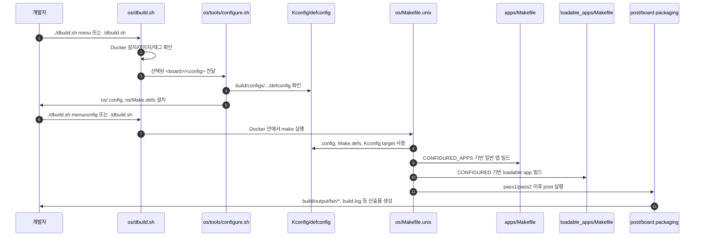

1. 작업은 보통 `os/`에서 시작한다. `dbuild.sh`는 Docker 실행 파일을 먼저 찾고, Docker가 없으면 안내 메시지와 함께 종료한다.
2. `dbuild.sh`는 기본 public image를 `tizenrt/tizenrt`, 기본 tag를 `1.5.8`로 둔다. 이미 `os/.config`가 있고 그 안에 `CONFIG_DOCKER_VERSION`이 있으면 해당 tag를 사용한다. `rtl8730e/loadable_apps`의 `defconfig`는 `CONFIG_DOCKER_VERSION="2.0.0"`을 둔다.
3. `./dbuild.sh menu`에서 board/config를 고르면 `dbuild.sh`가 `build/configs` 아래의 `defconfig` 목록으로 메뉴를 만들고, 최종 선택을 `tools/configure.sh <board>/<config>`로 넘긴다.
4. `configure.sh`는 `build/configs/<board>/<config>/defconfig`와 `build/configs/<board>/Make.defs`를 확인한 뒤 `os/.config`와 `os/Make.defs`로 복사한다. `CONFIG_APPS_DIR`이 없거나 명령행에서 app dir을 지정한 경우에는 `.config` 끝에 앱 경로를 덧붙인다.
5. `defconfig`는 Kconfig 값의 원본이고, 빌드 중 `include/tinyara/config.h`를 만드는 입력이다. `Make.defs`는 컴파일러, 링커, 아카이버, 플래그, 보드별 hook을 제공하는 Makefile fragment다.
6. Docker 기반 설정 수정은 `./dbuild.sh menuconfig`를 기준으로 설명한다. 이 wrapper는 컨테이너 안에서 `os/Makefile.unix`의 `menuconfig` target을 실행하므로, 호스트에 Kconfig frontend와 툴체인을 직접 맞춰야 하는 경로를 신규 온보딩 기본 절차로 두지 않는다.
7. 실제 빌드는 인자 없는 `./dbuild.sh` 또는 메뉴의 build 선택으로 시작한다. `dbuild.sh`는 저장소 루트를 컨테이너의 `/root/tizenrt`에 마운트하고 `/root/tizenrt/os`에서 `make`를 실행하며, 출력은 `build.log`에도 남긴다.
8. `os/Makefile.unix`는 `.config`, `tools/Config.mk`, `Make.defs`를 읽고 `APPDIR`, `LOADABLE_APPDIR`, `FRAMEWORK_LIB_DIR`, `EXTDIR`, `TOOLSDIR`를 계산한다. 이어서 `Directories.mk`를 포함해 kernel/user/loadable build directory graph를 만든다.
9. protected build에서는 `apps/`, `external/`, `framework/`, `tools/`가 user add-on 쪽으로 들어가고, flat build에서는 kernel add-on 쪽으로 들어간다. `loadable_apps`는 `USERDIRS`에 추가된다.
10. Kconfig target은 먼저 `apps_preconfig`를 실행하고, `APPSDIR`, `EXTERNALDIR`, `LIBDIR`, `LOADABLEDIR`를 넘겨 Kconfig frontend를 호출한다. 이 때문에 일반 앱과 loadable app의 Kconfig 항목도 같은 설정 화면에 합쳐진다.
11. 일반 앱은 `apps/Makefile`이 각 top-level `Make.defs`를 include하고, 하위 파일들이 `CONFIGURED_APPS`에 자기 디렉터리를 추가하는 방식으로 등록된다. 이후 `all`, `install`, `context`, `depend` target은 `CONFIGURED_APPS`의 각 디렉터리에 위임된다.
12. loadable app은 `loadable_apps/Makefile`이 각 하위 `Make.defs`를 include하고, 하위 파일들이 `CONFIGURED` 목록에 앱 디렉터리를 추가하는 방식으로 등록된다. `CONFIG_APP_BINARY_SEPARATION=y`이면 `all`은 `build install`을 함께 수행한다.
13. 최종 kernel target은 `build/output/bin/tinyara$(EXEEXT)`이고, `pass1deps`, `pass2deps`, `pass1`, `pass2` 다음에 `post`가 실행된다. `pass2`는 architecture 소스 디렉터리에서 kernel executable을 만들고, raw binary 설정이면 binary 변환도 수행한다.
14. 컴파일과 링크가 성공해도 빌드가 끝났다고 판단하면 안 된다. `post`는 app binary 검증, strip/compress/header/checksum, resource image, signing, board-specific binary script, Samsung header, bininfo, binary conversion, bootparam, flash partition validation, filesystem image, uImage 같은 보드/설정별 후처리를 이어서 실행할 수 있다.

### 1.2 명령 예시와 주의사항

아래 명령은 문서 이해를 위한 예시다. 이 checkout에는 다른 작업자의 dirty 변경이 있을 수 있으므로, 실제 실행 전에는 현재 상태와 작업 범위를 먼저 확인한다.

```bash
: "[상태 변경] 대화형 board/config 선택"
cd os
./dbuild.sh menu

: "[상태 변경] 명시적 board/config 선택"
cd os
./tools/configure.sh rtl8730e/loadable_apps

: "[상태 변경] Docker workflow에서 Kconfig 수정"
cd os
./dbuild.sh menuconfig

: "[상태 변경] 현재 설정으로 빌드"
cd os
./dbuild.sh

: "[상태 변경] 빌드 결과 다운로드. 실제 동작은 보드 Make.defs의 DOWNLOAD hook에 의존한다."
cd os
./dbuild.sh download all
```

| 목적 | 권장 진입점 | 상태 변경 | 주의 |
| --- | --- | --- | --- |
| board/config 대화형 선택 | `cd os && ./dbuild.sh menu` | 선택 완료 시 `os/Make.defs`, `os/.config`가 바뀐다. | 이미 빌드된 checkout이면 clean 또는 distclean 경로가 요구될 수 있다. |
| board/config 명시 선택 | `cd os && ./tools/configure.sh <board>/<config>` | `Make.defs`, `.config`, 필요 시 app dir 항목을 설치한다. | 이 명령은 설정을 바꾸는 명령이다. 기존 작업자 산출물이 있는 checkout에서 무심코 실행하지 않는다. |
| Kconfig 수정 | `cd os && ./dbuild.sh menuconfig` | `.config`가 바뀔 수 있다. | Docker workflow에서는 wrapper를 기본 절차로 둔다. |
| 현재 설정 빌드 | `cd os && ./dbuild.sh` | `build/output/*`, `build.log`, context/link 산출물이 생성 또는 갱신된다. | compile/link 성공 뒤에도 `post`의 packaging/validation 실패가 남을 수 있다. |
| 다운로드 | `cd os && ./dbuild.sh download all` | 대상 보드 flash 작업을 수행할 수 있다. | download option은 board flash spec과 `Make.defs` hook에 의존한다. |
| clean/distclean | `cd os && ./dbuild.sh distclean` | 설정과 생성 산출물을 지운다. | 보드/config를 바꾸기 전 필요한 경우에만 명시적으로 실행한다. 공유 dirty checkout에서는 실행 금지에 가깝게 취급한다. |

### 1.3 원본과 산출물 구분

| 분류 | 경로/항목 | 역할 | 문서에서의 취급 | 대표 출처 |
| --- | --- | --- | --- | --- |
| 원본 | `os/dbuild.sh` | Docker image/tag 선택, 메뉴, 컨테이너 실행, build log 기록 | Docker front door의 기준 | `os/dbuild.sh:21-29`, `os/dbuild.sh:37-52`, `os/dbuild.sh:505-521` |
| 원본 | `build/configs/<board>/<config>/defconfig` | board/config별 Kconfig 값 | 설정 의도와 Kconfig 입력의 기준 | `build/configs/README.txt:109-118` |
| 원본 | `build/configs/<board>/Make.defs` | toolchain, flags, board hook | 컴파일/링크/후처리 근거 | `build/configs/README.txt:80-108` |
| 원본 | `os/tools/configure.sh` | `Make.defs`, `defconfig`, app dir를 빌드 루트에 설치 | configure 동작의 기준 | `os/tools/configure.sh:105-159`, `os/tools/configure.sh:218-247` |
| 원본 | `os/Makefile.unix` | build root Makefile, context, pass1/pass2, post, Kconfig target | 전체 Make build graph의 기준 | `os/Makefile.unix:53-58`, `os/Makefile.unix:236-243`, `os/Makefile.unix:549-629` |
| 원본 | `os/Directories.mk` | kernel/user/add-on/loadable directory list 계산 | 어떤 디렉터리가 어느 build phase에 들어가는지 판단하는 기준 | `os/Directories.mk:62-73`, `os/Directories.mk:143-201` |
| 원본 | `apps/Makefile` | 일반 앱 `CONFIGURED_APPS` 등록과 target 위임 | app build registration의 기준 | `apps/Makefile:67-79`, `apps/Makefile:109-123` |
| 원본 | `loadable_apps/Makefile` | loadable app `CONFIGURED` 등록과 build/install/preconfig 위임 | loadable app build routing의 기준 | `loadable_apps/Makefile:52-101` |
| 생성/복사 산출물 | `os/.config` | `defconfig`가 configure 결과로 복사되고 app dir가 보정될 수 있는 파일 | 현재 선택 상태 확인용. 설계 근거는 원본 `defconfig`와 `configure.sh`에 둔다. | `build/configs/rtl8730e/loadable_apps/defconfig:21-38`, `os/tools/configure.sh:145-147`, `os/tools/configure.sh:226-247` |
| 생성/복사 산출물 | `os/Make.defs` | board `Make.defs`가 configure 결과로 복사된 파일 | 현재 선택 보드 확인용. 설계 근거는 `build/configs/<board>/Make.defs`에 둔다. | `build/configs/rtl8730e/Make.defs`, `os/tools/configure.sh:121-123`, `os/tools/configure.sh:218-220` |
| 생성 산출물 | `include/tinyara/config.h`, `include/tinyara/version.h`, `include/arch*`, `include/apps` | context target이 만드는 configured header/link | 빌드 결과 설명에만 사용한다. | `os/Makefile.unix:315-326`, `os/Makefile.unix:341-392` |
| 생성 산출물 | `build/output/libraries/*` | 하위 디렉터리 archive 결과 | 링크 입력 산출물로만 설명한다. | `os/Makefile.unix:134-138`, `os/Makefile.unix:435-440` |
| 생성 산출물 | `build/output/bin/tinyara$(EXEEXT)`, `*.bin`, app/common binaries | 최종 kernel executable, raw binary, app separation 결과 | 최종 산출물로 설명한다. 원본 근거로 쓰지 않는다. | `os/Makefile.unix:236-240`, `os/Makefile.unix:482-490`, `os/Makefile.unix:549-570` |
| 생성 산출물 | `build.log` | `dbuild.sh`가 `tee`로 남기는 빌드 로그 | 실패 분석 보조 자료. 성공 근거는 별도 검증으로 둔다. | `os/dbuild.sh:505-521` |

### 1.4 단계별 출처 추적

| 단계 | 온보딩 문서에서 설명할 핵심 | 출처 경로 | 줄 기준 | 확인 상태 |
| --- | --- | --- | --- | --- |
| Docker | `dbuild.sh`는 Docker 존재를 확인하고, public image/tag 변수를 둔다. | `os/dbuild.sh` | `21-29`, `37-52` | 출처 확인 |
| Docker | `.config`의 `CONFIG_DOCKER_VERSION`은 Docker tag를 덮어쓸 수 있고, public image/tag matching path를 정한다. | `os/dbuild.sh` | `66-84` | 출처 확인 |
| Docker | build 실행은 컨테이너에 repository root를 `/root/tizenrt`로 mount하고 `/root/tizenrt/os`에서 `make`를 실행하며 `build.log`를 기록한다. | `os/dbuild.sh` | `505-521` | 출처 확인 |
| configure | `configure.sh`는 `<board>/<config>` 인자를 요구하고 config directory, board `Make.defs`, config `defconfig` 존재를 확인한다. | `os/tools/configure.sh` | `96-159` | 출처 확인 |
| configure | `configure.sh`는 board `Make.defs`를 `os/Make.defs`로, config `defconfig`를 `os/.config`로 설치하고 app dir를 보정할 수 있다. | `os/tools/configure.sh` | `218-247` | 출처 확인 |
| Kconfig | `defconfig`는 variable/value 형식의 Kconfig 입력이며 `include/tinyara/config.h` 생성 입력이다. | `build/configs/README.txt` | `109-118` | 출처 확인 |
| Kconfig | `Makefile.unix`의 Kconfig target은 `apps_preconfig` 후 `APPSDIR`, `EXTERNALDIR`, `LIBDIR`, `LOADABLEDIR`를 넘긴다. | `os/Makefile.unix` | `681-699`, `780-786` | 출처 확인 |
| Makefile | `Makefile.unix`는 `.config`, `tools/Config.mk`, `Make.defs`를 읽고 `APPDIR`, `LOADABLE_APPDIR`를 계산한다. | `os/Makefile.unix` | `53-58`, `107-118` | 출처 확인 |
| Makefile | `Makefile.unix`는 `Directories.mk`를 포함하고, 최종 target `$(BIN)`을 `pass1deps pass2deps pass1 pass2 post`로 구성한다. | `os/Makefile.unix` | `169`, `236-243`, `621-629` | 출처 확인 |
| Makefile | `post`는 app binary preparation과 resource/signing/board-specific/header/bininfo/conversion/bootparam/validation/filesystem/uImage 후처리를 수행할 수 있다. | `os/Makefile.unix` | `493-619` | 출처 확인 |
| app | `apps/Makefile`은 top-level `Make.defs`들을 include해 `CONFIGURED_APPS`를 만들고 각 앱 target으로 위임한다. | `apps/Makefile` | `67-79`, `109-123` | 출처 확인 |
| loadable | `Directories.mk`는 `loadable_apps`를 `USERDIRS`에 추가한다. | `os/Directories.mk` | `201-215` | 출처 확인 |
| loadable | `loadable_apps/Makefile`은 하위 `Make.defs`를 include해 `CONFIGURED`를 만들고, app binary separation에서는 `all: build install`을 수행한다. | `loadable_apps/Makefile` | `52-101` | 출처 확인 |
| loadable | `rtl8730e/loadable_apps`는 app binary separation, protected build, 2-pass, common binary, XIP ELF, loadable example app 정보를 설정한다. | `build/configs/rtl8730e/loadable_apps/defconfig` | `21-38`, `1361-1366`, `1570-1581` | 출처 확인 |

### 1.5 신규 합류자가 기억할 점

- `build/configs/.../defconfig`와 `build/configs/.../Make.defs`가 원본이다. `os/.config`와 `os/Make.defs`는 현재 checkout에 설치된 결과다.
- Docker workflow에서는 `dbuild.sh`를 기준으로 설명하고 실행한다. 특히 Kconfig 수정은 `./dbuild.sh menuconfig`를 기준으로 둔다.
- compile/link 단계가 끝나도 보드별 packaging, signing, validation, filesystem image 생성이 이어질 수 있다. 마지막 실패 위치를 볼 때는 `build.log`뿐 아니라 `post` 단계의 소스 hook도 함께 본다.
- loadable app은 일반 builtin app과 같은 앱 트리에 섞이지 않는다. `apps/Makefile`의 `CONFIGURED_APPS`와 `loadable_apps/Makefile`의 `CONFIGURED`를 따로 추적한다.

## 2. rtl8730e/loadable_apps: OS 부팅부터 app 동작까지

이 장은 `rtl8730e/loadable_apps` 설정이 부팅 후 앱 실행으로 이어지는 흐름을 한 번에 따라간다. 핵심은 세 가지다. 첫째, 이 config는 앱을 kernel/common/app binary로 분리하고 `loadable ELF`를 만든다. 둘째, OS 부팅은 `os_start()`와 `os_bringup()`을 지나 `AppBringUp`에서 board와 앱 bring-up을 시작한다. 셋째, `TASH`와 builtin command 등록은 앱 초기화 표면이고, loadable app 실행은 `binary_manager`와 `binfmt`가 맡는 별도 경로다.

### 2.1 설정 기준점

`build/configs/rtl8730e/loadable_apps/defconfig`는 protected build, app binary separation, BINFMT, XIP ELF, binary manager를 함께 켠다. 따라서 이 구성은 앱을 `apps/libapps.a`에만 합치는 flat-style 설명으로 이해하면 안 된다.

| 항목 | 현재 설정 | 의미 | 출처 |
| --- | --- | --- | --- |
| app binary separation | `CONFIG_APP_BINARY_SEPARATION=y` | 앱 binary를 kernel/common 영역과 분리한다. `loadable_apps/Makefile`은 이 값이 켜졌을 때 각 loadable app의 `install`까지 수행한다. | `build/configs/rtl8730e/loadable_apps/defconfig:25`, `loadable_apps/Makefile:78-85` |
| app 개수 | `CONFIG_NUM_APPS=1` | 현재 기본 앱 slot은 1개다. `wifiapp`은 포함되고, `micomapp`은 `CONFIG_NUM_APPS > 1`일 때만 집계된다. | `build/configs/rtl8730e/loadable_apps/defconfig:26`, `loadable_apps/loadable_sample/wifiapp/Make.defs:19`, `loadable_apps/loadable_sample/micomapp/Make.defs:18-19` |
| common binary | `CONFIG_SUPPORT_COMMON_BINARY=y`, `CONFIG_COMMON_BINARY_NAME="common"` | common binary slot을 별도로 둔다. partition 문자열에도 `common`과 `app1` 이름이 들어 있다. | `build/configs/rtl8730e/loadable_apps/defconfig:28-30`, `build/configs/rtl8730e/loadable_apps/defconfig:348-350` |
| protected / 2-pass | `CONFIG_BUILD_PROTECTED=y`, `CONFIG_BUILD_2PASS=y`, `CONFIG_PASS1_TARGET="all"` | protected build와 2-pass build를 전제로 한다. | `build/configs/rtl8730e/loadable_apps/defconfig:33-35` |
| loadable format | `CONFIG_BINFMT_ENABLE=y`, `CONFIG_BINFMT_LOADABLE=y`, `CONFIG_XIP_ELF=y`, `# CONFIG_ELF is not set` | 현재 target의 주 경로는 XIP ELF다. 일반 `CONFIG_ELF=y` 예시는 기존 guide의 일반 설명으로만 봐야 한다. | `build/configs/rtl8730e/loadable_apps/defconfig:1361-1365` |
| board/app bring-up | `CONFIG_BOARD_INITTHREAD=y`, priority `240`, stack `2048` | `os_bringup()`이 `AppBringUp` kernel thread를 만들어 board와 앱 bring-up을 분리 실행한다. | `build/configs/rtl8730e/loadable_apps/defconfig:457-459`, `os/kernel/init/os_bringup.c:444-453` |
| app1 metadata | name `app1`, type `ELF`, version `190412`, RAM `5242880`, loading priority `LOW`, stack `8192`, priority `180` | binary manager가 header와 config metadata를 바탕으로 `load_attr_t`와 binary table을 채우는 기준이다. | `build/configs/rtl8730e/loadable_apps/defconfig:1574-1581`, `os/include/tinyara/binary_manager.h:205-218` |
| binary manager | `CONFIG_BINARY_MANAGER=y`, update/reload options enabled | boot 이후 user binary scan, load-all, request queue, update/recovery entry를 담당한다. | `build/configs/rtl8730e/loadable_apps/defconfig:1598-1603`, `os/kernel/binary_manager/binary_manager.c:111-185` |

### 2.2 부팅과 앱 bring-up 순서

reset/start anchor는 `rtl8730e/loadable_apps`의 loadable app 실행 흐름 자체가 아니라, OS에 들어오기 전 CPU/SoC 시작 문맥을 확인하는 기준점이다.

| anchor | 역할과 한계 |
| --- | --- |
| `os/arch/arm/src/armv7-a/arm_head.S` | ARMv7-A 공통 `__start` 경로다. SYS mode/IRQ mask, MMU page table, `.bss`/`.data`, `arm_boot()` 호출, 최종 `os_start` branch를 담당하는 generic arch anchor이며, rtl8730e loadable app을 직접 실행하지 않는다. |
| `os/arch/arm/src/amebasmart/amebasmart_boot.c` | Ameba Smart arch C boot 연속 구간이다. MMU mapping, vector mapping/copy, FPU, data 초기화, VBAR 설정 뒤 `app_start()`로 SoC 초기화를 넘긴다. board device 초기화는 주석처럼 이후 `os_start()`-`os_bringup()`-`board_initialize()` 경로에서 이뤄진다. |
| `os/board/rtl8730e/src/component/soc/amebad2/fwlib/ap_core/startup.S` | rtl8730e AmebaD2 AP-core vendor startup anchor다. `_boot`에서 vector base, cache/TLB/MMU, mode별 stack, SMP secondary 분기, VFP 설정을 마치고 primary core에서 `app_start`를 호출한다. |
| `os/board/rtl8730e/src/component/soc/amebad2/fwlib/ap_core/ameba_app_start.c` | AP-core `app_start()` 구현이다. TizenRT OS 빌드에서는 app binary separation page table 크기와 app RAM을 반영해 heap region을 잡고, `os_heap_init()`, `pinmap_init()`, flash parameter 복사를 수행한다. `CONFIG_PLATFORM_TIZENRT_OS`에서는 FreeRTOS `main()` 호출부가 제외되므로 loadable app 실행 경로와 구분해서 읽는다. |
| `os/board/rtl8730e/src/component/soc/amebad2/fwlib/ram_hp/ameba_startup.c` / `os/board/rtl8730e/src/component/soc/amebad2/fwlib/ram_lp/ameba_startup.c` | 이 checkout에서 HP 파일은 Realtek header 주석만 있고, LP 파일은 사실상 빈 파일이라 추가 런타임 흐름을 설명하지 않는다. required anchor coverage를 위한 확인 대상이다. |

`os_start()`는 앱을 직접 실행하는 함수가 아니라 커널이 스케줄 가능한 상태가 되도록 초기화하는 함수다. task queue와 idle TCB를 준비하고, semaphore, heap, idle group, IRQ, watchdog, filesystem, clock/timer, signal, mqueue, pthread, network static setup, architecture hook, libc, `binfmt` 순서로 기반을 만든 뒤 `os_bringup()`으로 넘어간다.

`os_bringup()`은 PATH, paging worker, workqueue, logm을 준비하고 `os_start_application()`을 호출한다. 현재 config는 `CONFIG_BOARD_INITTHREAD=y`이므로 `os_start_application()`은 `kernel_thread("AppBringUp", ...)`을 만든다. `AppBringUp` thread의 entry는 `os_start_task()`이고, 그 안에서 `os_do_appstart()`가 실행된다.

`os_do_appstart()`의 첫 큰 경계는 `board_initialize()`다. rtl8730e board 초기화는 IPC interrupt와 table, USB 조건부 초기화, log task, SPI, partition mount, GPIO, I2C, I2S, LCD/touch 조건부 초기화, watchdog/timer/RTC 같은 보드 장치 준비를 수행한다. 그 뒤 `os_do_appstart()`는 security/network/messaging/task monitor 같은 system service와 `binary_manager` thread를 조건부로 시작한다.

주의할 점은 `preapp_start()`의 위치다. `os_do_appstart()`가 직접 `task_create("appinit", ..., preapp_start, ...)`를 실행하는 분기는 `CONFIG_SYSTEM_PREAPP_INIT && !CONFIG_APP_BINARY_SEPARATION`에서만 컴파일된다. `rtl8730e/loadable_apps`는 app binary separation이 켜져 있으므로 이 direct appinit 분기는 빠진다. 대신 `binary_manager`가 loadable app을 실행하고, 현재 샘플에서는 `wifiapp`의 `main()`이 조건부로 `preapp_start(argc, argv)`를 호출한다.

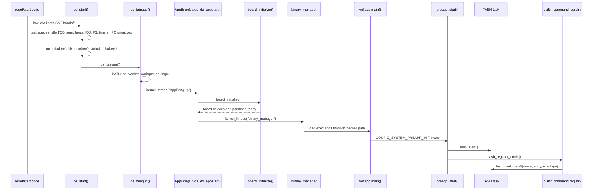

### 2.3 TASH, builtin apps, loadable apps의 경계

`TASH`는 shell task다. `preapp_start()`가 `tash_start()`를 호출하면 `tash_start()`는 `task_create("tash", ..., tash_main, ...)`로 shell loop를 띄운다. `tash_main()`은 console을 열고 prompt를 출력한 뒤 입력 라인을 `tash_execute_cmdline()`으로 넘긴다.

명령 등록은 shell task 생성과 구분된다. `preapp_start()`는 `tash_start()` 성공 뒤 `tash_register_cmds()`를 호출하고, `CONFIG_BUILTIN_APPS`가 켜져 있으면 `register_examples_cmds()`가 실행된다. `apps/builtin/builtin_list.c`는 generated header에서 `builtin_list[]`를 구성하고, 각 entry를 `tash_cmd_install()`로 TASH command table에 설치한다.

loadable apps는 이 command table 등록과 다르다. `loadable_apps/Makefile`과 각 앱 Makefile은 앱을 별도 ELF/XIP ELF binary로 만들고 `USER_BIN_DIR`에 설치한다. 런타임에서는 `binary_manager`가 user binary를 scan/load하고, `binfmt`가 등록된 handler로 binary를 로드해 task를 만든다. 정리하면 다음과 같다.

| 구분 | builtin apps | loadable apps |
| --- | --- | --- |
| 빌드 산출 | builtin registry entry와 app archive 경로에 연결된다. | `loadable.mk`가 앱 오브젝트와 `userspace/up_userspace`를 링크해 분리 binary를 만든다. |
| 노출 방식 | `register_examples_cmds()`가 `tash_cmd_install()`로 TASH 명령을 등록한다. | binary manager가 app partition/user binary를 scan하고 loader thread를 통해 실행한다. |
| 실행 진입 | TASH command 실행 시 등록된 entry가 호출된다. | `binfmt` handler가 `struct binary_s`를 채우고 `exec_module()`이 task를 활성화한다. |
| 현재 target에서의 예 | `CONFIG_BUILTIN_APPS=y`라서 builtin command 등록 경로가 있다. | `CONFIG_EXAMPLES_LOADABLE=y`, `CONFIG_NUM_APPS=1`이라 기본 loadable sample은 `wifiapp`/`app1` 경로다. |

### 2.4 loadable ELF 빌드와 설치

상위 `loadable_apps/Makefile`은 `.config`와 `Make.defs`를 포함하고, `*/Make.defs`를 모아 `CONFIGURED` 목록을 만든다. `CONFIG_APP_BINARY_SEPARATION=y`이면 `all: build install`로 각 configured app의 build와 install target을 실행한다. `OUTPUT_BIN_DIR`은 `$(TOPDIR)/../build/output/bin`으로 정의되어 하위 make의 `USER_BIN_DIR`로 전달되지만, 여기서는 해당 디렉터리의 기존 생성물을 근거로 사용하지 않는다.

`wifiapp/Makefile`은 app separation에서 `BIN = $(CONFIG_APP1_BIN_NAME)`으로 두고 `loadable.mk`를 포함한다. `micomapp/Makefile`도 같은 구조지만 `CONFIG_APP2_BIN_NAME`이 있을 때만 binary를 만든다. 현재 config는 `CONFIG_NUM_APPS=1`과 `# CONFIG_APP2_INFO is not set`이라 기본 설명은 `app1`/`wifiapp` 중심으로 둔다.

`loadable.mk`는 앱 C object와 `$(TOPDIR)/userspace/up_userspace` object를 함께 링크한다. 일반 ELF는 `CONFIG_ELF=y` 분기에서 처리되고, 현재 target의 XIP ELF는 `CONFIG_XIP_ELF=y` 분기에서 앱별 linker script와 `scripts/xipelf/userspace_all.ld`를 사용하며 common binary를 `-R $(USER_BIN_DIR)/$(CONFIG_COMMON_BINARY_NAME)`로 참조한다. 완성된 binary는 `postbuild`에서 앱 디렉터리의 `build/<BIN>`으로 옮겨지고, `install`에서 `$(USER_BIN_DIR)/$(BIN)`으로 설치된다.

### 2.5 binary_manager와 binfmt 런타임

`os_do_appstart()`가 `kernel_thread(BINARY_MANAGER_NAME, ..., binary_manager, NULL)`을 만들면 `binary_manager()`가 daemon 역할을 시작한다. daemon은 bootparam과 kernel/user partition 조건을 확인하고, `BINMGR_REQUEST_MQ` message queue를 만든다. app binary separation이 켜진 구성에서는 message receive loop에 들어가기 전에 `binary_manager_execute_loader(LOADCMD_LOAD_ALL, 0)`로 load-all loader thread를 먼저 실행한다.

load-all loader인 `loadingall_thread()`는 user binary 전체를 scan한다. common binary 지원이 켜져 있으면 `BM_CMNLIB_IDX`를 먼저 `binary_manager_load()`로 로드한다. 그 다음 user binary의 loading priority가 high이면 직접 `binary_manager_load()`를 호출하고, 낮은 priority이면 `binary_manager_execute_loader(LOADCMD_LOAD, bin_idx)`로 개별 loader thread에 넘긴다. 현재 `app1` metadata의 loading priority는 `LOW`이므로 이 설명에서 priority 분기가 중요하다.

`binary_manager_load()`는 binary table 상태가 `BINARY_INACTIVE`인지 확인하고, user/common binary header를 읽어 `load_attr_t`를 채운 뒤 `binary_manager_load_binary()`로 넘긴다. 그 아래에서 `load_binary()`는 `load_module()`과 `exec_module()`을 이어 실행하는 `binfmt` wrapper다. `load_module()`은 등록된 BINFMT handler list를 순회하며 handler의 `load()`가 성공하면 unload 함수를 저장한다.

현재 target은 `CONFIG_XIP_ELF=y`이므로 `binfmt_initialize()`에서 `xipelf_initialize()`가 호출되고, XIP ELF handler가 `register_binfmt()`로 등록된다. `xipelf_loadbinary()`는 userspace header를 읽어 text/data/bss/heap/entry 정보를 `struct binary_s`에 채운다. 이어 `exec_module()`은 app heap을 초기화하고 TCB/stack을 만들며, `task_init()`과 `task_activate()`로 앱 task를 시작한다. binary manager가 켜진 경우 이 시점에 TCB의 `app_id`, group의 `tg_binidx`, binary table의 `BINARY_LOADED` 상태도 갱신된다.

앱이 실제로 실행되면 app-side notify path가 시작된다. `wifiapp`은 app separation에서 `main()`을 제공하고, `CONFIG_SYSTEM_PREAPP_INIT`이면 `preapp_start()`를 호출한 뒤 `binary_manager_notify_binary_started()`를 보낸다. 이 API는 `BINMGR_NOTIFY_STARTED` 요청을 만들고 `BINMGR_REQUEST_MQ`로 전송한다. daemon이 이 요청을 받으면 requester pid의 TCB/group에서 bin index를 찾아 `BINARY_RUNNING`으로 바꾸고 state callback을 알린다. 즉 notify는 "로드를 시작하라"가 아니라 이미 활성화된 앱이 "시작됨"을 알리는 상태 갱신 경로다.

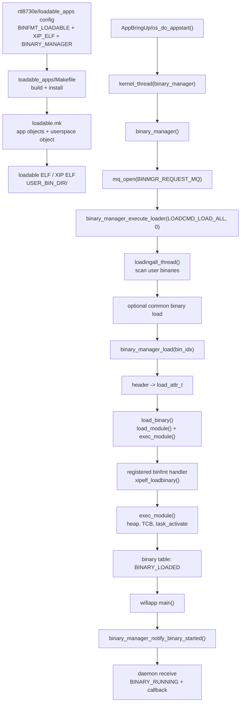

### 2.6 주요 데이터 구조

| 구조 | 역할 | 출처 |
| --- | --- | --- |
| `enum binary_state` | user binary 상태를 `BINARY_INACTIVE`, `BINARY_LOADED`, `BINARY_RUNNING` 등으로 표현한다. | `os/include/tinyara/binary_manager.h:98-107` |
| `binmgr_request_t` | daemon request message. `cmd`, `requester_pid`, name/type/callback union을 가진다. | `os/include/tinyara/binary_manager.h:243-252` |
| `load_attr_t` | binary load에 필요한 name, size, RAM size, stack, offset, priority, version을 담는다. | `os/include/tinyara/binary_manager.h:205-218` |
| `binmgr_uinfo_t` | user binary table entry. pid, state, active partition index, `load_attr_t`, partition info, callback list, `struct binary_s *`를 가진다. | `os/kernel/binary_manager/binary_manager_internal.h:141-158` |
| `BIN_*` macros | binary manager 내부에서 user binary table 필드를 읽고 갱신하는 접근 매크로다. | `os/kernel/binary_manager/binary_manager_internal.h:265-292` |
| `struct binary_s` | `binfmt`의 로드 단위다. handler가 section과 entry를 채우고 `exec_module()`이 task 생성에 사용한다. | `os/binfmt/binfmt_loadbinary.c:120-165`, `os/binfmt/binfmt_execmodule.c:173-228` |

### 2.7 출처 추적 행

| 주장 ID | 주장 | 출처 경로 | 줄 기준 |
| --- | --- | --- | --- |
| T10-CONFIG-APPSEP | `rtl8730e/loadable_apps`는 app binary separation과 protected/2-pass build를 켠다. | `build/configs/rtl8730e/loadable_apps/defconfig` | 25,33-35 |
| T10-CONFIG-XIP | 현재 target은 BINFMT loadable과 XIP ELF를 켜고 일반 ELF는 끈다. | `build/configs/rtl8730e/loadable_apps/defconfig` | 1361-1365 |
| T10-BOOT-ARMV7A-HEAD | `arm_head.S`는 ARMv7-A generic reset/start anchor로 MMU/cache, 초기 data 영역, `arm_boot()` 호출, `os_start` branch를 담당한다. | `os/arch/arm/src/armv7-a/arm_head.S` | 191-194, 520-552, 668-676, 687-713 |
| T10-BOOT-AMEBASMART | `amebasmart_boot.c`의 `arm_boot()`는 mapping/vector/FPU/data/VBAR 준비 뒤 `app_start()`로 SoC startup을 넘기며 board device init은 뒤쪽 OS bring-up 경로에 남긴다. | `os/arch/arm/src/amebasmart/amebasmart_boot.c` | 239-335 |
| T10-BOOT-APCORE-STARTUP | `ap_core/startup.S`는 rtl8730e AP core의 vector base, cache/TLB/MMU, mode stack, SMP primary/secondary 분기, `app_start` 호출을 담는 vendor startup anchor다. | `os/board/rtl8730e/src/component/soc/amebad2/fwlib/ap_core/startup.S` | 47-219 |
| T10-BOOT-APCORE-APPSTART | `ap_core/ameba_app_start.c`의 `app_start()`는 TizenRT OS 빌드에서 heap region, pinmap, flash parameter 같은 AP-core 초기화를 수행하고 FreeRTOS `main()` 호출부와 구분된다. | `os/board/rtl8730e/src/component/soc/amebad2/fwlib/ap_core/ameba_app_start.c` | 31-104, 110-152 |
| T10-BOOT-RAM-STARTUP-ANCHORS | `ram_hp/ameba_startup.c`는 header 주석만 있고 `ram_lp/ameba_startup.c`는 사실상 빈 파일이라, 이 checkout에서는 추가 boot flow를 제공하지 않는 확인 대상 anchor다. | `os/board/rtl8730e/src/component/soc/amebad2/fwlib/ram_hp/ameba_startup.c`, `os/board/rtl8730e/src/component/soc/amebad2/fwlib/ram_lp/ameba_startup.c` | `ram_hp:1-8`, `ram_lp:1` |
| T10-BOOT-OSSTART | `os_start()`는 RTOS queue, idle TCB, semaphore, heap, IRQ/FS/timer/signal/mqueue/pthread/lib/binfmt를 초기화한 뒤 `os_bringup()`을 호출한다. | `os/kernel/init/os_start.c` | 423-857 |
| T10-BOOT-APPBRINGUP | `CONFIG_BOARD_INITTHREAD`에서 `os_start_application()`은 `AppBringUp` kernel thread를 만든다. | `os/kernel/init/os_bringup.c` | 444-453 |
| T10-BOARD-INIT | `board_initialize()`는 rtl8730e IPC, log task, SPI, partition mount, GPIO/I2C/I2S, timer/RTC 등 board device setup을 수행한다. | `os/board/rtl8730e/src/rtl8730e_boot.c` | 411-470 |
| T10-PREAPP-TASH | `preapp_start()`는 `tash_start()` 뒤 `tash_register_cmds()`를 호출한다. | `apps/system/init/init.c` | 123-168 |
| T10-TASH | `tash_start()`는 `tash` task를 만들고 `tash_main()`은 console loop에서 command line을 실행한다. | `apps/shell/tash_main.c` | 334-389 |
| T10-BUILTIN | builtin registry는 `builtin_list[]`를 순회해 `tash_cmd_install()`로 command를 설치한다. | `apps/builtin/builtin_list.c` | 78-100 |
| T10-LOADABLE-BUILD | `loadable_apps/Makefile`은 configured app에 build/install target을 위임하고 `loadable.mk`가 XIP ELF link/install을 수행한다. | `loadable_apps/Makefile`, `loadable_apps/loadable.mk` | `Makefile:52-85`, `loadable.mk:53-92` |
| T10-BINMGR-DAEMON | `binary_manager()`는 request queue를 만들고 app separation에서 `LOADCMD_LOAD_ALL` loader를 실행한다. | `os/kernel/binary_manager/binary_manager.c` | 111-185 |
| T10-BINMGR-LOADALL | `loadingall_thread()`는 user binary scan, optional common load, priority별 load를 수행한다. | `os/kernel/binary_manager/binary_manager_load.c` | 472-531 |
| T10-BINFMT-XIP | `binfmt_initialize()`는 XIP ELF handler를 등록하고, XIP handler는 userspace header로 `struct binary_s`를 채운다. | `os/binfmt/binfmt_initialize.c`, `os/binfmt/libxipelf/xipelf.c` | `binfmt_initialize.c:77-117`, `xipelf.c:33-188` |
| T10-EXEC | `exec_module()`은 app heap과 TCB를 만들고 binary table을 `BINARY_LOADED`로 갱신한 뒤 task를 활성화한다. | `os/binfmt/binfmt_execmodule.c` | 173-343 |
| T10-NOTIFY | app notify는 request queue를 통해 daemon으로 전달되고 daemon은 requester group의 bin index를 `BINARY_RUNNING`으로 갱신한다. | `framework/src/binary_manager/binary_manager_notify.c`, `framework/src/binary_manager/binary_manager_interface.c`, `os/kernel/binary_manager/binary_manager_data.c` | `notify.c:30-46`, `interface.c:33-107`, `binary_manager_data.c:755-768` |

## 3. os/ 하위 모듈 아키텍처

`os/`는 TizenRT의 target-side core이자 빌드 루트다. 이 장은 세부 커널 알고리즘을 설명하기보다, `os/Kconfig`가 어떤 기능 영역을 설정 메뉴로 열고 `os/Directories.mk`가 그 설정을 어떤 빌드 디렉터리 집합으로 바꾸는지 보여준다. 커널 내부의 init, scheduler, task, group, binary manager 세부 동작은 뒤의 심화 장에서 다룬다.

### 3.1 한눈에 보는 구조

```mermaid
flowchart TD
    K["os/Kconfig<br/>설정 메뉴와 하위 Kconfig 소스"] --> Core["Core runtime modules"]
    D["os/Directories.mk<br/>NONFSDIRS/FSDIRS/USERDIRS/KERNDEPDIRS 구성"] --> Core

    Core --> Kernel["kernel<br/>OS init, scheduler, task, IPC, timer"]
    Core --> Arch["arch<br/>CPU/chip, interrupt, memory model"]
    Core --> Board["board<br/>target board 선택과 board init hook"]
    Core --> MM["mm<br/>kernel/user heap, granule/page allocator"]
    Core --> WQ["wqueue<br/>deferred work와 worker thread"]
    Core --> FS["fs<br/>VFS, inode, mount, filesystem"]
    Core --> Drivers["drivers<br/>upper-half driver와 /dev surface"]
    Core --> Syscall["syscall<br/>protected/kernel build call gate"]
    Core --> Binfmt["binfmt<br/>builtin/loadable binary loader"]
    Core --> Net["net<br/>network stack와 net manager 연결"]
    Core --> Audio["audio<br/>audio session/buffer core"]
    Core --> Compression["compression<br/>compressed binary/log support"]
    Core --> Crypto["crypto<br/>hash/random pool"]
    Core --> PM["pm<br/>power state, suspend/resume, tick suppression"]
    Core --> Logm["logm<br/>printf/syslog routing"]
    Core --> SE["se<br/>secure element abstraction"]

    Include["include<br/>public/internal header contract"] -. compile-time API .-> Core
    Tools["tools<br/>host-side build and generation tools"] -. build-time support .-> D
    Userspace["userspace<br/>protected/app binary object helper"] -. build-mode helper .-> D
```

`os/Kconfig`는 `arch`, `board`, `se`, `crypto`, `kernel`, `drivers`, `net`, `audio`, `fs`, `mm`, `wqueue`, `pm`, `syscall`, `binfmt`, `compression` 같은 `os/` 하위 설정을 연결한다. 같은 파일은 framework, library, application, loadable app, runtime/device manager 메뉴도 연결하지만, 이 장의 초점은 `os/` 내부 모듈의 경계와 책임이다.

### 3.2 빌드 포함 흐름

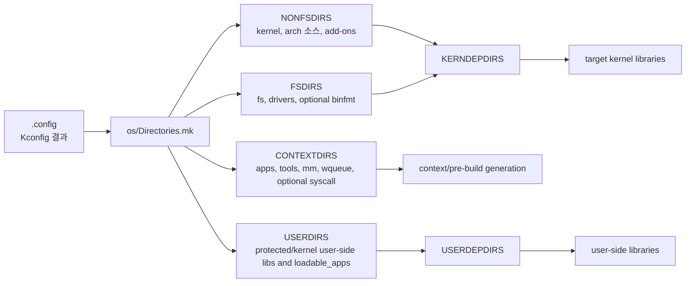

| 빌드 묶음 | `Directories.mk` 기준 | 포함되는 대표 디렉터리 | 의미 |
| --- | --- | --- | --- |
| 기본 kernel-side | `NONFSDIRS = kernel $(ARCH_SRC) $(TINYARA_ADDONS)` | `kernel`, 선택된 `arch` 소스, flat build add-on | 파일 디스크립터와 무관하게 커널 쪽에 들어가는 기본 축이다. |
| 파일/장치 계층 | `FSDIRS = fs drivers`, `CONFIG_BINFMT_ENABLE`이면 `binfmt` 추가 | `fs`, `drivers`, optional `binfmt` | descriptor/socket 설정에 따라 `KERNDEPDIRS`에 들어가며 VFS, device node, binary loader를 묶는다. |
| context 생성 | `CONTEXTDIRS += $(TOOLSDIR) mm wqueue`, `CONFIG_LIB_SYSCALL`이면 `syscall` 추가 | `tools`, `mm`, `wqueue`, `syscall` | 빌드 전 생성물이나 모드별 의존 파일이 필요한 영역이다. |
| user-side build | protected/kernel build의 `USERDIRS` | `libc`, `mm`, `wqueue`, add-on, `syscall`, `loadable_apps` | 보호 빌드나 kernel build에서 user-side 라이브러리와 loadable app 산출을 분리한다. |
| 조건부 kernel module | `CONFIG_AUDIO`, `CONFIG_COMPRESSION`, `CONFIG_CRYPTO`, `CONFIG_NET`, `CONFIG_PM`, `CONFIG_LOGM`, `CONFIG_SE` | `audio`, `compression`, `crypto`, `net`, `pm`, `logm`, `se` | Kconfig로 켠 기능만 `KERNDEPDIRS`에 추가한다. |
| cleanup-only/helper | `CLEANDIRS += userspace` 등 | `userspace`, optional tool subdir | 항상 런타임 모듈이라는 뜻은 아니다. `userspace`는 보호 빌드의 객체 생성 보조 지점이다. |

### 3.3 모듈 역할 표

| 모듈 | 주 역할 | 빌드/Kconfig 연결 | 런타임 책임 | 더 깊게 볼 영역 |
| --- | --- | --- | --- | --- |
| `arch` | CPU architecture, chip family, interrupt, MMU/MPU, boot memory 같은 하드웨어 공통층을 고른다. | `os/Kconfig`가 `arch/Kconfig`를 연결하고, `Directories.mk`는 `$(ARCH_SRC)`를 기본 kernel-side 디렉터리에 넣는다. | 부트 초반, interrupt entry/exit, address environment, arch별 board handoff 기반을 제공한다. | 특정 chip의 reset vector, syscall trap, linker script, interrupt dispatch는 `os/arch/<arch>/src/`에서 추적한다. |
| `board` | target board 선택과 board-specific option을 제공한다. | `board/Kconfig`는 보드 choice와 보드별 Kconfig를 연결한다. | board initialization, boardctl, crash dump hook, board-specific driver glue를 제공한다. | 실제 bring-up은 `os/board/<board>/`와 `build/configs/<board>/<config>/`를 같이 봐야 한다. |
| `kernel` | scheduler, task, init, IPC, timer, signal, binary manager 등 RTOS 핵심 기능 묶음이다. | `kernel/Kconfig`가 기능 옵션을 제공하고 `kernel/Makefile`은 하위 `Make.defs`를 모아 `libkernel`을 만든다. | OS start, task lifecycle, scheduling, IPC, timing, interrupt dispatch 이후 핵심 서비스를 담당한다. | init/sched/task/group/binary manager 내부 흐름은 kernel deep-dive 장에서 별도로 다룬다. |
| `drivers` | character/block/network/audio/power/sensor 등 upper-half driver와 공통 driver 기능을 모은다. | `drivers/Kconfig`가 driver class를 고르고 `drivers/Makefile`은 class별 `Make.defs`를 포함해 `libdrivers`를 만든다. | `/dev` node, upper-half API, block/char/network/audio 장치 연결을 제공한다. | 특정 장치는 `drivers/<class>/Make.defs`, chip lower-half, board 초기화 코드를 함께 확인한다. |
| `fs` | VFS, inode, mount, block/MTD, procfs, romfs/tmpfs/smartfs/littlefs 계층이다. | `fs/Kconfig`가 filesystem 선택을 열고 `fs/Makefile`은 VFS/inode/mount/filesystem `Make.defs`를 모아 `libfs`를 만든다. | file descriptor, mountpoint, inode tree, procfs, block/MTD 연결, syslog character path를 제공한다. | 저장소별 동작은 filesystem 구현, `fs/driver/*`, 그리고 board partition 설정을 함께 본다. |
| `net` | network stack, protocol menu, wireless/Bluetooth/network manager 연결점이다. | `net/Kconfig`의 `CONFIG_NET` 아래 LwIP, protocol, manager 메뉴가 열리고 `net/Makefile`이 `libnet`을 만든다. | socket/netdev/net manager와 LwIP 기반 TCP/IP 경로를 제공한다. | 외부 protocol 구현은 이 장에서 펼치지 않고, `net/Kconfig`의 연결점과 실제 출처 추적 장으로 넘긴다. |
| `mm` | kernel/user heap, granule/page allocator, heap region info를 담당한다. | `mm/Kconfig`가 heap/allocator 옵션을 제공하고 `mm/Makefile`은 flat/protected 모드에 따라 `libmm`, `libumm`, `libkmm` 산출을 나눈다. | runtime allocation, kernel/user heap 분리, loadable/app binary separation의 memory 기반을 제공한다. | protected build의 heap region 생성물과 multi-heap 정책은 memory 심화 절에서 따로 추적한다. |
| `wqueue` | delayed work와 worker thread를 제공한다. | `wqueue/Kconfig`는 high/low/user work queue를 설정하고 `wqueue/Makefile`은 user/kernel work queue library 산출을 분리한다. | interrupt bottom-half, delayed work, asynchronous cleanup, user work queue를 처리한다. | work item lifecycle은 scheduler, signal, driver callback 사용처와 함께 봐야 한다. |
| `syscall` | protected/kernel build에서 user code가 kernel service를 부르는 call gate다. | `syscall/Kconfig`는 `LIB_SYSCALL`을 정의하고 `syscall/Makefile`은 `syscall.csv`와 `mksyscall`로 proxy/stub을 생성해 `libproxies`, `libstubs`를 만든다. | user-to-kernel API marshaling, syscall number table, protected/loadable ABI 경계를 제공한다. | 생성된 proxy/stub은 직접 편집하지 않고 `syscall.csv`와 `os/tools/mksyscall.c`를 기준으로 본다. |
| `binfmt` | builtin app과 loadable ELF/XIP ELF loader 연결을 제공한다. | `binfmt/Kconfig`의 `BINFMT_ENABLE`과 ELF/builtin 선택에 따라 `Directories.mk`가 `binfmt`를 `FSDIRS`에 넣고 `binfmt/Makefile`이 `libbinfmt`를 만든다. | binary format registration, load/exec/unload, symbol lookup 기반을 제공한다. | loadable app build/install과 binary manager runtime은 boot/loadable 장에서 더 깊게 다룬다. |
| `audio` | audio device/session/buffer core다. | `audio/Kconfig`의 `CONFIG_AUDIO`가 켜지면 `Directories.mk`가 `audio`를 `KERNDEPDIRS`에 넣고 `audio/Makefile`이 `libaudio`를 만든다. | audio buffer, session, control API와 lower-level audio driver 사이 공통 계층을 제공한다. | codec, I2S, board audio, media framework 연결은 driver/framework 소스와 함께 본다. |
| `compression` | 압축 라이브러리와 compressed binary support 기반이다. | `compression/Kconfig`가 compression type과 compressed binary를 설정하고 `compression/Makefile`이 `libcompression`을 만든다. | compressed binary read/load와 log dump 등 압축/해제가 필요한 runtime 경로에 공통 기능을 제공한다. | compressed binary는 `binfmt`, log dump 압축은 kernel log_dump와 함께 추적한다. |
| `crypto` | OS 내부 hash/random pool 기능이다. | `crypto/Kconfig`의 `CONFIG_CRYPTO`, `CRYPTO_BLAKE2S`, `CRYPTO_RANDOM_POOL` 선택에 따라 `crypto/Makefile`이 `libcrypto`를 만든다. | random pool, hash, `/dev/urandom` 같은 소비 경로의 기반 기능을 제공한다. | TLS/secure element 가속은 `se`와 보안 stack 연결을 별도로 확인한다. |
| `pm` | power management domain과 suspend/resume/DVFS/tick suppression 연결점이다. | `pm/Kconfig`의 `CONFIG_PM` 아래 PM domain, DVFS, tick suppression 옵션이 열리고 `pm/Makefile`이 `libpm`을 만든다. | driver activity monitoring, low-power state transition, suspend/resume, timed wakeup을 제공한다. | board/chip idle, wake 소스, timer compensation은 `arch`, `board`, `drivers`와 같이 본다. |
| `logm` | printf/syslog routing을 받을 수 있는 logger module이다. | `os/Kconfig`가 `Kconfig.debug`를 불러오고, 그 안에서 `logm/Kconfig`가 연결된다. `Directories.mk`는 `CONFIG_LOGM`일 때 `logm`을 포함한다. | buffered logging task, printf/syslog routing, flush interval, optional TASH command를 담당한다. | syslog, debug macro, log dump와의 관계는 debug/logging 심화 절에서 보강한다. |
| `se` | secure element abstraction과 vendor backend 선택점이다. | `se/Kconfig`의 `CONFIG_SE`가 TLS hardware acceleration/security link driver를 선택하고, vendor별 Kconfig를 연결한다. `se/Makefile`은 vendor `Make.defs`를 모아 `libse`를 만든다. | hardware-backed secure element capability와 security link 연결을 제공한다. | vendor별 SE 구현과 mbedTLS/security framework 연동은 해당 vendor 경로에서 별도 확인한다. |
| `userspace` | protected/app-binary build에서 user-space object를 만드는 보조 디렉터리다. | `Directories.mk`는 cleanup 대상에 `userspace`를 포함하고 `userspace/Makefile`은 `up_userspace.c`로 app/common object를 만든다. | 독립 runtime service가 아니라 app/common binary object의 compile flag 차이를 제공한다. | app binary separation의 linker/layout 장에서 함께 본다. |
| `include` | POSIX-like public header와 `tinyara/` internal API header의 계약 표면이다. | 별도 top-level library는 아니지만 `os/Kconfig`의 redirect header 옵션과 각 모듈의 include 사용이 맞물린다. | kernel, drivers, fs, net, apps/framework가 공유하는 API/ABI를 제공한다. | public ABI와 internal `tinyara/` header, generated header 여부를 구분해서 본다. |
| `tools` | build/config/syscall/package/download 보조 host tool 모음이다. | `TOOLS_DIR`/`TOOLSDIR`가 Kconfig와 `Directories.mk`에 연결되고, `Config.mk`, `configure.sh`, `mksyscall.c`, package checker 등이 빌드에서 호출된다. | target runtime 책임은 없고 설정 복사, dependency 생성, syscall 생성, package/header 검증을 담당한다. | destructive configure/build tool은 실행 전 목적과 작업트리 영향을 확인한다. build pipeline 장에서 더 깊게 다룬다. |

### 3.4 더 깊게 볼 영역

- `kernel` 내부는 이 장에서 반복하지 않는다. `init`, `sched`, `task`, `group`, `binary_manager`는 각 kernel deep-dive 장에서 call flow와 자료구조를 따라간다.
- board bring-up은 `os/board`만으로 끝나지 않는다. `build/configs/<board>/<config>/defconfig`, `Make.defs`, linker/flash script가 함께 runtime image를 결정한다.
- `drivers`와 `fs`는 `/dev`, file descriptor, mountpoint를 사이에 두고 강하게 결합된다. 장치별 문제는 upper-half, lower-half, board init 순서로 추적한다.
- `mm`, `wqueue`, `syscall`, `userspace`는 flat/protected/kernel build mode에 따라 산출물이 달라진다. 빌드 모드 문제를 볼 때는 `Directories.mk`의 `NONFSDIRS`, `CONTEXTDIRS`, `USERDIRS`를 먼저 확인한다.
- `net`, `se`, 일부 framework 메뉴는 외부 라이브러리나 framework Kconfig를 연결하지만, 이 장에서는 연결점만 다룬다. 구현 상세는 해당 subsystem의 출처 추적에서 확인한다.
- `include`와 `tools`는 디렉터리로는 `os/` 아래 있지만 target runtime library module로 보지 않는다. 각각 compile-time contract와 host-side build support로 읽는다.

### 3.5 출처 추적 요약

| 주장 | 근거 |
| --- | --- |
| `os/Kconfig`가 주요 `os/` 하위 Kconfig를 연결한다. | `os/Kconfig:540-631` |
| framework/library/application/loadable/runtime/device manager 메뉴도 같은 top-level Kconfig에서 연결된다. | `os/Kconfig:572-683` |
| `Directories.mk`가 `NONFSDIRS`, `FSDIRS`, `CONTEXTDIRS`, `USERDIRS`, `KERNDEPDIRS`, `USERDEPDIRS`를 구성한다. | `os/Directories.mk:131-215` |
| descriptor/socket 설정에 따라 `fs`와 `drivers`가 `KERNDEPDIRS`에 들어간다. | `os/Directories.mk:217-228` |
| `audio`, `compression`, `crypto`, `net`, `pm`, `logm`, `se`는 CONFIG 조건으로 `KERNDEPDIRS`에 추가된다. | `os/Directories.mk:232-275` |
| `kernel`, `drivers`, `fs`, `net`, `binfmt`, `audio`, `compression`, `crypto`, `pm`, `logm`, `se`는 각 Makefile에서 library archive를 만든다. | `os/*/Makefile` |
| `mm`과 `wqueue`는 flat/protected/kernel build mode에 따라 user/kernel library 산출을 나눈다. | `os/mm/Makefile`, `os/wqueue/Makefile` |
| `syscall`은 `syscall.csv`와 `mksyscall`로 proxy/stub을 생성한다. | `os/syscall/Kconfig`, `os/syscall/Makefile` |

## 4. os/kernel 기능별 상세 분석

이 장은 `os/kernel` 내부 기능을 생명주기, 실행 상태, 태스크/그룹 자원, 동기화와 메시징, 시간/인터럽트, `binary_manager`, supporting feature 순서로 추적한다. 각 절의 출처 추적은 실제 파일 경로와 anchor를 기준으로 한다.

### 4.1 `init`: 커널 전역 상태를 만들고 첫 태스크들을 세우는 진입점

#### 역할

`init` 영역의 중심은 `os_start()`와 `os_bringup()`이다. `os_start()`는 커널이 C 코드로 들어온 뒤 가장 먼저 실행되는 OS 초기화 함수로, 태스크 큐와 idle TCB, PID hash, idle task group, 세마포어/IRQ/watchdog/clock/timer/signal/mqueue/pthread 같은 기본 시설을 준비한다. 그 뒤 board/architecture 초기화와 binfmt 초기화를 거쳐 `os_bringup()`을 호출하고, 마지막에는 idle loop에 들어간다.

`os_bringup()`은 기본 커널 시설이 준비된 뒤 초기 system task와 application start 경로를 만든다. paging worker, workqueue, logm, board/app bring-up thread, log dump, task monitor, binary manager, appinit/appmain 같은 시작점이 이 구간에서 연결된다.

#### 핵심 함수

| 함수 | 위치 | 책임 |
|---|---|---|
| `os_start()` | `os/kernel/init/os_start.c:423` | task list 초기화, idle TCB 생성, idle group 생성, 커널 시설 초기화, `os_bringup()` 진입, idle loop 실행 |
| `os_bringup()` | `os/kernel/init/os_bringup.c:498` | paging/workqueue/logm 시작 후 application bring-up 경로 실행 |
| `os_do_appstart()` | `os/kernel/init/os_bringup.c:271` | board 초기화, messaging/network/driver 보조 초기화, log dump/task monitor/binary manager/app task 생성 |
| `os_start_application()` | `os/kernel/init/os_bringup.c:444` | `CONFIG_BOARD_INITTHREAD`에 따라 `AppBringUp` kernel thread를 만들거나 현재 흐름에서 app start 수행 |

#### 핵심 자료구조와 전역 상태

| 이름 | 위치 | 의미 |
|---|---|---|
| `g_readytorun`, `g_pendingtasks`, `g_waitingforsemaphore`, `g_inactivetasks` | `os/kernel/init/os_start.c:142`, `os/kernel/init/os_start.c:190`, `os/kernel/init/os_start.c:194`, `os/kernel/init/os_start.c:232` | scheduler가 TCB 상태를 표현하는 전역 task queue |
| `g_tasklisttable[]` | `os/kernel/init/os_start.c:275` | `TSTATE_*` 값을 실제 queue로 매핑하는 표 |
| `g_idletcb[]` | `os/kernel/init/os_start.c:384` | CPU별 idle task TCB |
| `g_running_tasks[]` | `os/kernel/sched/sched.h:210` | interrupt context에서 CPU별 running task를 찾기 위한 참조 |
| `struct tcb_s` | `os/include/tinyara/sched.h:532` | 모든 task/thread 공통 제어 블록 |
| `struct task_group_s` | `os/include/tinyara/sched.h:372` | task group 단위 공유 자원 컨테이너 |

#### 호출 흐름

1. `os_start()`는 `g_os_initstate`를 `OSINIT_BOOT`로 두고, `dq_init()`으로 ready/pending/waiting/inactive queue를 초기화한다.
2. CPU별 `g_idletcb[]`를 0으로 초기화하고 pid, state, entry, flags, name, argv를 채운 뒤 ready/running 목록에 idle task를 넣는다.
3. `sem_initialize()`를 먼저 호출한다. 주석상 여러 subsystem이 세마포어에 의존하기 때문에 early init 대상이다.
4. kernel heap/page heap, app heap queue, PID hash, idle group을 만든다. idle group은 `group_allocate()`와 `group_initialize()`로 만들어지고 `GROUP_FLAG_NOCLDWAIT | GROUP_FLAG_PRIVILEGED`가 설정된다.
5. `sched_lock()` 뒤 IRQ, watchdog, filesystem, clock, POSIX timer, signal, mqueue, pthread, network setup, architecture board init, sysdbg, libc, binfmt를 순서대로 초기화한다.
6. `os_bringup()`은 paging worker와 workqueue를 시작하고, `os_start_application()`을 통해 `AppBringUp` thread 또는 현재 thread에서 `os_do_appstart()`를 실행한다.
7. `os_start()`는 `sched_unlock()` 후 idle loop에 들어가고, workqueue가 없을 때는 idle loop에서 `sched_garbagecollection()`을 수행한다.

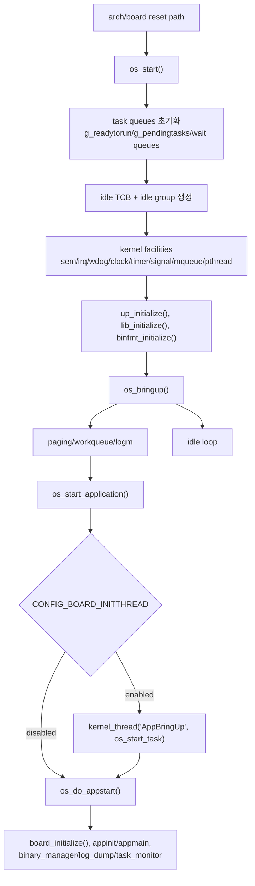

#### 사용 지점과 연결

- `task_create()`와 `kernel_thread()`는 `os_bringup()`에서 초기 system/app task를 만들 때 직접 사용된다. 예: `pgfill`, `AppBringUp`, `log_dump`, `taskmonitor`, `binary_manager`, `appinit`, `appmain`.
- `group_allocate()`와 `group_initialize()`는 boot 중 idle group 생성에도 사용되고, 이후 일반 task 생성의 group 생성에도 동일하게 사용된다.
- scheduler 전역 queue는 `os_start()`에서 초기화되지만, 실제 task 전이는 `task_activate()`, arch `up_unblock_task()`, `sched_addreadytorun()` 경로에서 일어난다.

#### 특징과 주의점

- `task_start()`는 일반 C 호출자가 직접 호출하는 app main 함수가 아니라, TCB에 저장되는 low-level task entry trampoline이다. `task_schedsetup()`이 `start`로 `task_start`를 저장하고, architecture context start 경로가 이 entry를 실행한다.
- `os_bringup()`은 configuration에 따라 많은 시작점이 조건부로 빠진다. 따라서 문서에서는 특정 board config에서 활성화 여부를 말할 때 defconfig 근거를 추가해야 한다.
- `g_readytorun`의 의미는 SMP 설정에 따라 달라진다. non-SMP에서는 head가 active task이고 tail이 idle task라는 설명이 직접 주석으로 존재한다. SMP에서는 unassigned ready task와 assigned task list가 나뉜다는 점까지가 소스에서 확인되는 범위다.

#### 출처 추적

| 주장 | 출처 |
|---|---|
| `os_start()`가 task queue를 초기화하고 idle TCB를 ready/running 상태로 넣는다. | `os/kernel/init/os_start.c:423`, `os/kernel/init/os_start.c:434`, `os/kernel/init/os_start.c:553`, `os/kernel/init/os_start.c:557` |
| `os_start()`가 idle group을 `group_allocate()`/`group_initialize()`로 만든다. | `os/kernel/init/os_start.c:622`, `os/kernel/init/os_start.c:628` |
| `os_start()`가 `os_bringup()` 호출 후 idle loop에 들어간다. | `os/kernel/init/os_start.c:856`, `os/kernel/init/os_start.c:857`, `os/kernel/init/os_start.c:860`, `os/kernel/init/os_start.c:866` |
| `os_bringup()`은 paging/workqueue 후 app start 경로를 호출한다. | `os/kernel/init/os_bringup.c:516`, `os/kernel/init/os_bringup.c:522`, `os/kernel/init/os_bringup.c:533` |
| `AppBringUp`은 board/application init을 별도 kernel thread로 offload하는 조건부 경로다. | `os/kernel/init/os_bringup.c:417`, `os/kernel/init/os_bringup.c:453` |

### 4.2 `sched`: TCB를 queue 사이에서 이동시키는 실행 상태 관리자

#### 역할

`sched`는 TCB의 `task_state`와 전역 queue를 함께 사용해 실행 가능, pending, blocked, inactive 상태를 표현한다. 이 절은 ready queue와 task lifecycle 연결에 필요한 대표 경로만 다룬다. priority policy 전체나 SMP migration 전체는 별도 scheduler 장에서 더 확장할 수 있지만, 여기서는 `g_readytorun`, `g_pendingtasks`, wait queue, `sched_addreadytorun()`, `sched_removereadytorun()`, `sched_setpriority()`, `sched_releasetcb()`의 역할을 중심으로 설명한다.

#### 핵심 함수

| 함수 | 위치 | 책임 |
|---|---|---|
| `sched_addreadytorun()` | `os/kernel/sched/sched_addreadytorun.c:121` | blocked/inactive TCB를 ready queue 또는 pending queue에 넣고, active task 변경 여부를 반환 |
| `sched_removereadytorun()` | `os/kernel/sched/sched_removereadytorun.c:113` | ready/running queue에서 TCB를 제거하고 필요 시 다음 TCB를 running 상태로 만든다 |
| `sched_setpriority()` | `os/kernel/sched/sched_setpriority.c:174` | TCB priority 변경, ready queue 재정렬, 필요 시 reprioritize/context switch 유도 |
| `sched_releasetcb()` | `os/kernel/sched/sched_releasetcb.c:131` | timer/PID/stack/address environment/group/TCB 자원을 해제 |
| `task_activate()` | `os/kernel/task/task_activate.c:116` | task setup이 끝난 TCB를 `up_unblock_task()`로 넘겨 scheduler ready path에 연결 |

#### 핵심 자료구조

| 이름 | 위치 | 의미 |
|---|---|---|
| `enum tstate_e` | `os/include/tinyara/sched.h:215` | TCB 상태값. pending, ready-to-run, assigned, running, inactive, semaphore/signal/mqueue/pagefill wait 상태를 포함 |
| `struct tcb_s.task_state` | `os/include/tinyara/sched.h:564` | 현재 TCB 상태 |
| `struct tcb_s.sched_priority` | `os/include/tinyara/sched.h:556` | ready queue 정렬과 preemption 판단에 쓰이는 priority |
| `g_readytorun` | `os/kernel/sched/sched.h:174` | non-SMP에서 head가 active task, tail이 idle task인 ready list |
| `g_pendingtasks` | `os/kernel/sched/sched.h:216` | preemption lock 때문에 즉시 running 후보로 올릴 수 없는 ready task 대기 list |
| `g_waitingforsemaphore`, `g_waitingforsignal`, `g_waitingformqnotempty`, `g_waitingformqnotfull`, `g_waitingforfill` | `os/kernel/sched/sched.h:220`, `os/kernel/sched/sched.h:225`, `os/kernel/sched/sched.h:233`, `os/kernel/sched/sched.h:241`, `os/kernel/sched/sched.h:247` | block reason별 wait queue |
| `g_inactivetasks` | `os/kernel/sched/sched.h:254` | 초기화되었지만 아직 activated되지 않은 TCB list |

#### 호출 흐름

1. `thread_schedsetup()`은 priority, PID, entry, flags, signal mask, architecture state를 설정한 뒤 TCB를 `g_inactivetasks`에 넣고 `TSTATE_TASK_INACTIVE`로 둔다.
2. `task_activate()`는 critical section 안에서 SIGKILL handler를 설정한 뒤 `up_unblock_task(tcb)`를 호출한다.
3. ARMv7-A 기준 `up_unblock_task()`는 `sched_removeblocked(tcb)`로 기존 blocked/inactive list에서 TCB를 빼고 `sched_addreadytorun(tcb)`로 ready path에 넣는다.
4. non-SMP `sched_addreadytorun()`은 현재 task가 preemption disabled 상태이고 새 task priority가 더 높으면 `g_pendingtasks`에 넣고 `TSTATE_TASK_PENDING`으로 둔다. 그렇지 않으면 `g_readytorun`에 priority 순서로 넣고, head가 바뀌면 새 TCB를 `TSTATE_TASK_RUNNING`, 밀린 TCB를 `TSTATE_TASK_READYTORUN`으로 조정한다.
5. `sched_removereadytorun()`은 제거 대상이 runnable list head이면 다음 TCB를 running 상태로 만든 뒤 제거 대상 TCB를 invalid 상태로 돌린다.
6. `sched_setpriority()`는 running/ready/blocked 상태별로 priority 변경의 영향을 나누며, ready/running TCB는 `sched_removereadytorun()`과 `sched_addreadytorun()` 또는 `up_reprioritize_rtr()`를 통해 queue 위치를 다시 계산한다.
7. 종료/실패 정리 경로에서 `sched_releasetcb()`는 timer, PID, stack, address environment, group, TCB 메모리를 정리한다.

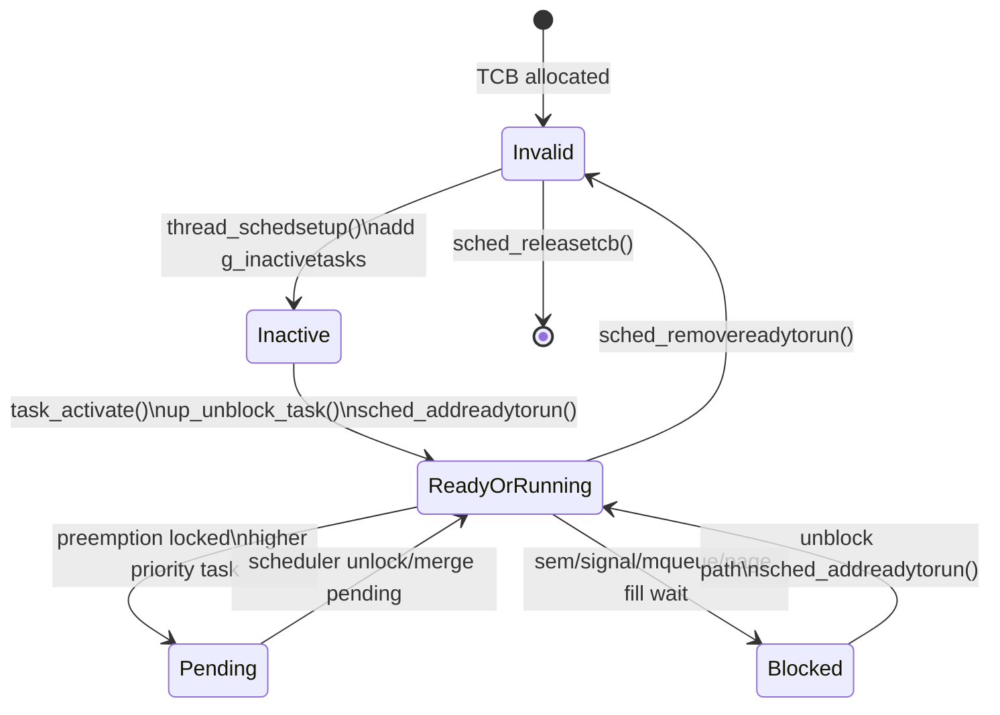

#### 사용 지점과 연결

- `task_create()`/`kernel_thread()`는 직접 scheduler queue를 다루지 않고 `task_activate()`를 통해 architecture unblock 경로로 넘긴다.
- semaphore, signal, mqueue, paging은 각각 wait queue를 사용하며, unblock 시점에는 결국 ready path로 돌아간다.
- `sched_releasetcb()`는 task 생성 실패와 task 종료 경로 모두에서 자원 해제의 마지막 단계로 호출된다.

#### 특징과 주의점

- `g_readytorun`만 보고 전체 scheduler 정책을 단정하면 안 된다. header 주석은 SMP에서 `g_readytorun`이 "unassigned ready task" 중심으로 바뀌고 `g_assignedtasks[]`가 별도로 존재한다고 설명한다.
- `sched_addreadytorun()`의 반환값은 head 변경 여부다. caller는 이 반환값을 보고 context switch 처리를 해야 한다는 assumption이 소스 주석에 있다.
- `sched_releasetcb()`는 group 해제도 호출하므로 task와 group lifecycle이 강하게 연결된다.

#### 출처 추적

| 주장 | 출처 |
|---|---|
| `g_readytorun`은 non-SMP에서 head가 active task이고 tail이 idle task인 ready list다. | `os/kernel/sched/sched.h:169`, `os/kernel/sched/sched.h:174` |
| wait queue와 inactive queue는 `sched.h`에 전역 queue로 선언된다. | `os/kernel/sched/sched.h:216`, `os/kernel/sched/sched.h:220`, `os/kernel/sched/sched.h:254` |
| `thread_schedsetup()`은 TCB를 `g_inactivetasks`에 넣고 `TSTATE_TASK_INACTIVE`로 설정한다. | `os/kernel/task/task_setup.c:403`, `os/kernel/task/task_setup.c:528`, `os/kernel/task/task_setup.c:530` |
| `task_activate()`는 `up_unblock_task()`를 호출하고 ARMv7-A 구현은 `sched_addreadytorun()`을 호출한다. | `os/kernel/task/task_activate.c:116`, `os/kernel/task/task_activate.c:144`, `os/arch/arm/src/armv7-a/arm_unblocktask.c:78`, `os/arch/arm/src/armv7-a/arm_unblocktask.c:93` |
| `sched_addreadytorun()`은 preemption lock 조건에서 `g_pendingtasks`로 보내고, 아니면 `g_readytorun`에 넣는다. | `os/kernel/sched/sched_addreadytorun.c:121`, `os/kernel/sched/sched_addreadytorun.c:134`, `os/kernel/sched/sched_addreadytorun.c:139`, `os/kernel/sched/sched_addreadytorun.c:146` |
| `sched_removereadytorun()`은 head 제거 시 다음 TCB를 running 상태로 만들고 제거 대상은 invalid로 둔다. | `os/kernel/sched/sched_removereadytorun.c:113`, `os/kernel/sched/sched_removereadytorun.c:129`, `os/kernel/sched/sched_removereadytorun.c:135`, `os/kernel/sched/sched_removereadytorun.c:145` |
| `sched_releasetcb()`는 timer/PID/stack/address environment/group/TCB 해제를 담당한다. | `os/kernel/sched/sched_releasetcb.c:131`, `os/kernel/sched/sched_releasetcb.c:153`, `os/kernel/sched/sched_releasetcb.c:157`, `os/kernel/sched/sched_releasetcb.c:177`, `os/kernel/sched/sched_releasetcb.c:201`, `os/kernel/sched/sched_releasetcb.c:207`, `os/kernel/sched/sched_releasetcb.c:212` |

### 4.3 `task`: user task와 kernel thread 생성, 시작, 종료의 공통 경로

#### 역할

`task` 영역은 user task와 kernel thread를 만들고 실행 가능 상태로 활성화하는 공통 생명주기를 제공한다. public API는 `task_create()`와 `kernel_thread()`로 갈라지지만, 둘 다 내부 `thread_create()`를 사용한다. `thread_create()`는 TCB 할당, group 할당, file/stack/scheduler setup, argv setup, group 초기화, binary-manager bookkeeping, activation 순으로 처리한다.

#### 핵심 함수

| 함수 | 위치 | 책임 |
|---|---|---|
| `thread_create()` | `os/kernel/task/task_create.c:132` | `task_create()`와 `kernel_thread()`의 공통 구현 |
| `task_create()` | `os/kernel/task/task_create.c:285` | user task 생성 wrapper |
| `kernel_thread()` | `os/kernel/task/task_create.c:318` | kernel privilege thread 생성 wrapper |
| `task_schedsetup()` | `os/kernel/task/task_setup.c:729` | task TCB의 priority/start/main/type 설정을 `thread_schedsetup()`에 위임 |
| `task_argsetup()` | `os/kernel/task/task_setup.c:809` | task name과 argv를 TCB/stack에 준비 |
| `task_activate()` | `os/kernel/task/task_activate.c:116` | 초기화된 TCB를 scheduler ready path로 이동 |
| `task_start()` | `os/kernel/task/task_start.c:132` | task entry trampoline. argc 계산 후 user/kernel entry main을 호출하고 반환 시 `exit()` 호출 |

#### 핵심 자료구조

| 이름 | 위치 | 의미 |
|---|---|---|
| `struct tcb_s` | `os/include/tinyara/sched.h:532` | PID, start function, main entry, priority, state, flags, stack, wait semaphore, signal, mqueue, errno, architecture context 등을 담는 공통 TCB |
| `struct task_tcb_s` | `os/include/tinyara/sched.h:685` | task/kernel thread용 TCB. 공통 TCB 위에 start hook, loadable binary info, restart priority, argv를 추가 |
| `entry_t` | `os/include/tinyara/sched.h:249` | pthread entry와 task `main_t` entry를 함께 표현하는 union |
| `g_alive_taskcount` | `os/kernel/sched/sched.h:260` | 생성 가능한 task 수 제한 확인에 사용되는 alive task count |

#### 호출 흐름

1. caller가 `task_create()` 또는 `kernel_thread()`를 호출한다. 두 함수는 thread type flag만 다르게 하여 `thread_create()`로 들어간다.
2. `thread_create()`는 `CONFIG_MAX_TASKS`와 `g_alive_taskcount`를 확인한 뒤 `struct task_tcb_s`를 `kmm_zalloc()`으로 할당한다.
3. task group이 활성화된 빌드에서는 `group_allocate(tcb, ttype)`로 group container를 먼저 붙인다.
4. file descriptor/socket descriptor 설정, stack 할당을 수행한다.
5. `task_schedsetup(tcb, priority, task_start, entry, ttype)`를 호출한다. 이때 TCB의 `start`에는 `task_start`, `entry.main`에는 caller가 넘긴 실제 main entry가 저장된다.
6. `task_argsetup()`이 task name과 argv를 준비한다.
7. `group_initialize()`로 initial group membership을 완성한다.
8. app binary separation과 binary manager가 함께 켜진 경우 현재 running task의 binary index를 새 group에 복사하고 binary thread list에 추가한다.
9. `task_activate()`가 TCB를 unblock하여 scheduler ready path로 넘긴다.
10. 새 task가 실제로 실행되면 `task_start()`가 `this_task()`로 자신의 TCB를 찾고 argv count를 계산한 뒤, protected/kernel build 여부에 따라 `up_task_start()` 또는 `tcb->cmn.entry.main(argc, argv)`를 호출한다. entry가 반환되면 `exit(exitcode)`로 종료 경로에 들어간다.

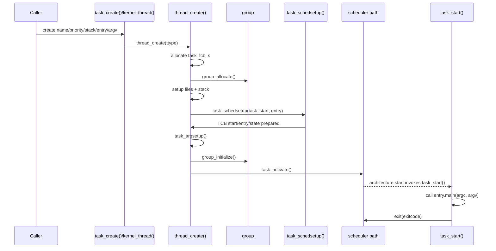

#### 사용 지점과 연결

- `os_bringup()`은 초기 kernel worker와 app entry를 만들기 위해 `kernel_thread()`와 `task_create()`를 호출한다.
- binary manager도 loader/fault message sender 같은 내부 thread를 `kernel_thread()`로 생성한다.
- 종료와 실패 정리 경로에서는 `sched_releasetcb()`가 group leave와 TCB 해제를 담당한다.

#### 특징과 주의점

- `task_create()`와 `kernel_thread()`는 거의 같은 생성 경로를 공유하지만, TCB type flag가 다르고 protected/app-binary-separation 빌드에서 권한과 memory attribute 전파가 달라질 수 있다.
- `task_start()`는 새 task의 main entry를 호출하는 trampoline이다. 소스 주석도 "low level entry point"로 설명하며, 호출 직후 `exit()`를 통해 반환된 task를 종료 처리한다.
- `thread_schedsetup()`은 TCB를 곧바로 ready list에 넣지 않고 `g_inactivetasks`에 넣는다. 실행 가능 상태 전환은 `task_activate()`가 담당한다.

#### 출처 추적

| 주장 | 출처 |
|---|---|
| `task_create()`와 `kernel_thread()`는 `thread_create()`를 공통으로 사용한다. | `os/kernel/task/task_create.c:132`, `os/kernel/task/task_create.c:285`, `os/kernel/task/task_create.c:298`, `os/kernel/task/task_create.c:318`, `os/kernel/task/task_create.c:320` |
| `thread_create()`는 TCB 할당 뒤 `group_allocate()`, stack setup, `task_schedsetup()`, argv setup, `group_initialize()`, `task_activate()` 순서로 진행한다. | `os/kernel/task/task_create.c:148`, `os/kernel/task/task_create.c:160`, `os/kernel/task/task_create.c:179`, `os/kernel/task/task_create.c:187`, `os/kernel/task/task_create.c:203`, `os/kernel/task/task_create.c:208`, `os/kernel/task/task_create.c:232` |
| `task_schedsetup()`은 `thread_schedsetup()`으로 priority/start/entry/type을 설정한다. | `os/kernel/task/task_setup.c:729`, `os/kernel/task/task_setup.c:735` |
| `thread_schedsetup()`은 `tcb->start`와 `tcb->entry.main`을 저장하고 TCB를 inactive list에 둔다. | `os/kernel/task/task_setup.c:403`, `os/kernel/task/task_setup.c:421`, `os/kernel/task/task_setup.c:425`, `os/kernel/task/task_setup.c:426`, `os/kernel/task/task_setup.c:529`, `os/kernel/task/task_setup.c:530` |
| `task_start()`는 task main을 호출하고 반환값으로 `exit()`한다. | `os/kernel/task/task_start.c:132`, `os/kernel/task/task_start.c:170`, `os/kernel/task/task_start.c:177`, `os/kernel/task/task_start.c:187` |

### 4.4 `group`: task와 pthread가 공유하는 자원 컨테이너

#### 역할

`group`은 task 단위로 공유되는 자원을 묶는 컨테이너다. `struct task_group_s`는 child exit status, environment, file descriptor, FILE stream, socket, signal pending queue, pthread join data, binary manager index 같은 그룹 공유 상태를 담는다. 일반 task 생성은 새 group을 만들고, pthread 생성은 부모 task의 group에 bind/join하는 구조다.

#### 핵심 함수

| 함수 | 위치 | 책임 |
|---|---|---|
| `group_allocate()` | `os/kernel/group/group_create.c:194` | task 생성 초기에 비어 있는 group container를 할당하고 TCB에 연결 |
| `group_initialize()` | `os/kernel/group/group_create.c:287` | 첫 member PID, group list 연결, main task id, exit hook queue, member count 초기화 |
| `group_bind()` | `os/kernel/group/group_join.c:186` | pthread TCB에 부모 task group pointer를 복사 |
| `group_join()` | `os/kernel/group/group_join.c:227` | pthread PID를 member list에 추가하고 member count 증가 |
| `group_leave()` | `os/kernel/group/group_leave.c:363` | task/thread exit 시 member 제거, 마지막 member면 group resource release |
| `group_findbygid()`, `group_findbypid()` | `os/kernel/group/group_find.c:120`, `os/kernel/group/group_find.c:164` | 전역 `g_grouphead` list에서 group 조회 |

#### 핵심 자료구조

| 이름 | 위치 | 의미 |
|---|---|---|
| `struct task_group_s` | `os/include/tinyara/sched.h:372` | group id, parent group id, main task id, member list/count, pthread join info, signal pending queue, environment, file/stream/socket list 등을 포함 |
| `g_grouphead` | `os/kernel/group/group_create.c:101` | 활성 group singly linked list의 head |
| `g_gidcounter` | `os/kernel/group/group_create.c:91` | 새 group id 할당용 counter |
| `tg_members`, `tg_nmembers`, `tg_mxmembers` | `os/include/tinyara/sched.h:391`, `os/include/tinyara/sched.h:394` | group member PID 목록과 개수 |
| `tg_envp`, `tg_filelist`, `tg_streamlist` | `os/include/tinyara/sched.h:459`, `os/include/tinyara/sched.h:471`, `os/include/tinyara/sched.h:483` | group별 environment와 open file/stream 상태 |

#### 호출 흐름

1. boot 중 idle task는 `os_start()`에서 `group_allocate()`와 `group_initialize()`로 privileged idle group을 갖는다.
2. 일반 task/kernel thread 생성은 `thread_create()` 안에서 `group_allocate()`를 먼저 호출한다. 이 단계는 group 구조체를 할당하고 TCB에 붙이며, 필요하면 stream list를 별도 할당하고 group id를 배정하고 parent environment를 복제한다.
3. TCB/stack/scheduler/argv setup이 끝난 뒤 `group_initialize()`가 첫 member PID를 넣고, group을 `g_grouphead`에 연결하고, main task id와 member count를 설정한다.
4. pthread는 새 group을 만들지 않고 `group_bind()`로 parent group pointer를 복사한 뒤, PID가 생긴 후 `group_join()`으로 member list/count를 증가시킨다.
5. task/thread가 종료되면 `group_leave()`가 member를 제거한다. 마지막 member가 나가면 `group_release()`가 child status, signal, pthread, file/stream/socket, environment, mqueue, address environment, group list, members array, stream list, group container를 해제한다.
6. loadable binary main task인 경우 `group_leave()`는 group release 전 binary manager bindata를 정리하고, release 후 `binfmt_exit()`로 loaded binary resource를 해제한다.

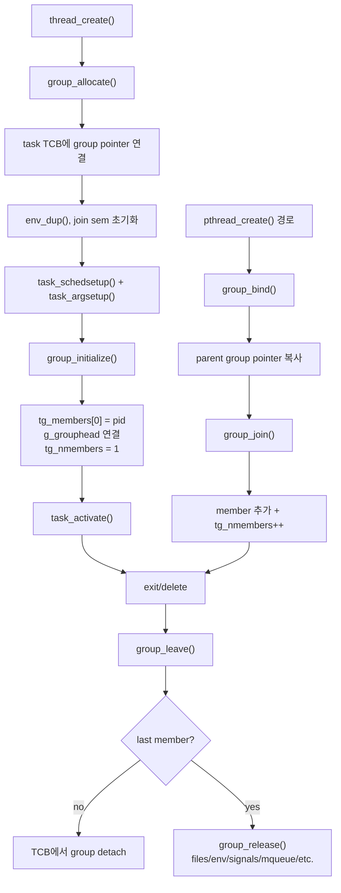

#### 사용 지점과 연결

- `os_start()`는 idle task의 group을 직접 만든다. 이 group은 idle task가 kernel/privileged group으로 동작하게 하는 출발점이다.
- `task_create()`와 `kernel_thread()`는 새 task group을 만든다.
- pthread는 같은 process-like 자원 묶음을 공유해야 하므로 `group_bind()`와 `group_join()`으로 기존 group에 붙는다.
- `sched_releasetcb()`는 TCB 해제 전에 `group_leave()`를 호출한다. task exit hook에서도 `group_leave()`가 쓰이므로 중복 호출 방지를 위해 group pointer detach가 필요하다.

#### 특징과 주의점

- group 생성은 두 단계다. `group_allocate()`는 early container 확보, `group_initialize()`는 PID가 생긴 뒤 membership과 global list 연결을 담당한다.
- group pointer는 raw pointer지만, 조회 API는 group id나 main pid 기반으로 `g_grouphead`를 순회한다. `group_findbygid()` 주석은 group이 사라질 수 있어 ID 기반 조회가 stale pointer보다 안전하다고 설명한다.
- 마지막 member가 나갈 때만 group resource가 해제된다. pthread가 남아 있으면 main task가 종료되어도 group은 계속 존재할 수 있다.
- loadable binary main task는 group leave 시 binary manager/binfmt 정리와 연결된다. 이는 아래 binary_manager 절에서 커널 daemon 관점으로 다시 이어진다.

#### 출처 추적

| 주장 | 출처 |
|---|---|
| `struct task_group_s`는 group shared resource container이고 reference-count 성격의 member count로 수명을 관리한다. | `os/include/tinyara/sched.h:338`, `os/include/tinyara/sched.h:354`, `os/include/tinyara/sched.h:372`, `os/include/tinyara/sched.h:391` |
| `group_allocate()`는 group 구조체를 할당하고 TCB에 붙이며 group id/environment/join semaphore를 준비한다. | `os/kernel/group/group_create.c:194`, `os/kernel/group/group_create.c:203`, `os/kernel/group/group_create.c:232`, `os/kernel/group/group_create.c:239`, `os/kernel/group/group_create.c:244`, `os/kernel/group/group_create.c:258` |
| `group_initialize()`는 initial member, `g_grouphead`, main task id, member count를 설정한다. | `os/kernel/group/group_create.c:287`, `os/kernel/group/group_create.c:308`, `os/kernel/group/group_create.c:322`, `os/kernel/group/group_create.c:323`, `os/kernel/group/group_create.c:341`, `os/kernel/group/group_create.c:357` |
| pthread는 `group_bind()`로 parent group을 복사하고 `group_join()`으로 member count를 늘린다. | `os/kernel/group/group_join.c:186`, `os/kernel/group/group_join.c:198`, `os/kernel/group/group_join.c:227`, `os/kernel/group/group_join.c:243`, `os/kernel/group/group_join.c:249` |
| `group_leave()`는 마지막 member가 나갈 때 group resource를 release한다. | `os/kernel/group/group_leave.c:363`, `os/kernel/group/group_leave.c:379`, `os/kernel/group/group_leave.c:383`, `os/kernel/group/group_leave.c:404`, `os/kernel/group/group_leave.c:421` |
| `group_release()`는 signals, pthread, files, streams, environment, mqueue, address environment, group list, members array, group container를 정리한다. | `os/kernel/group/group_leave.c:171`, `os/kernel/group/group_leave.c:182`, `os/kernel/group/group_leave.c:188`, `os/kernel/group/group_leave.c:198`, `os/kernel/group/group_leave.c:203`, `os/kernel/group/group_leave.c:217`, `os/kernel/group/group_leave.c:223`, `os/kernel/group/group_leave.c:229`, `os/kernel/group/group_leave.c:239`, `os/kernel/group/group_leave.c:246`, `os/kernel/group/group_leave.c:285` |

### 4.4 읽을 때의 체크포인트

- `init`, `sched`, `task`, `group` 네 영역은 task lifecycle 하나로 연결해서 읽는다.
- scheduler 정책 전체보다 ready/pending/inactive/wait queue와 task activation 관계를 먼저 확인한다.
- semaphore, signal, mqueue, paging, binary-manager 설명은 같은 TCB 상태 전환을 공유하는 후속 절과 함께 본다.


`semaphore`, `signal`, POSIX `mqueue`, TizenRT custom `messaging`은 모두 태스크 대기와 깨우기에 관여하지만 책임과 자료구조가 다르다. 이 절은 네 경로를 신입 개발자가 구분해서 읽을 수 있도록 소스 추적 기반으로 정리한다.

### 4.5-4.8 동기화와 메시징 경계

| 영역 | 주된 책임 | 블로킹 단위 | scheduler 연결 | 대표 자료구조 | 주요 사용자 |
|---|---|---|---|---|---|
| `semaphore` | 카운트 기반 동기화와 mutex형 semaphore의 소유자 추적 | semaphore count가 부족한 task | `TSTATE_WAIT_SEM`, `g_waitingforsemaphore`, `up_block_task()`, `up_unblock_task()` | `sem_t`, `struct semholder_s`, `waitsem` | pthread/mutex, task 종료 대기, messaging registry 보호, binary-manager 보조 경로 |
| `signal` | signal action, pending signal, signal wait를 TCB/task group에 연결 | signal set을 기다리는 task 또는 signal 때문에 깨워야 하는 task | `TSTATE_WAIT_SIG`, `g_waitingforsignal`, `sem_waitirq()`, `mq_waitirq()` | `sigactq_t`, `sigpendq_t`, `sigq_t`, `sigprocmask`, `sigwaitmask` | POSIX signal, POSIX timer, mqueue notify, binary manager thread mask |
| POSIX `mqueue` | named message queue의 message buffer, descriptor, queue fullness/emptiness 대기 | queue empty/full 상태 | `TSTATE_WAIT_MQNOTEMPTY`, `TSTATE_WAIT_MQNOTFULL`, `g_waitingformqnotempty`, `g_waitingformqnotfull` | `struct mqueue_msg_s`, `struct mq_des`, `struct mqueue_inode_s` | binary manager request/response, log dump, preference callback, framework messaging payload transport |
| custom `messaging` | port name별 receiver registry와 receiver enumeration | registry 보호용 semaphore 대기만 직접 사용 | 자체 wait state는 만들지 않고 `sem_wait()`로 registry lock을 잡는다 | `msg_port_node_t`, `msg_recv_node_t`, `g_port_node_list`, `port_list_sem` | framework messaging이 receiver pid 목록을 얻는 경로 |

주의할 점은 POSIX `mqueue`와 custom `messaging`이 서로 다른 계층이라는 점이다. `mqueue`는 실제 payload queue와 blocking send/receive를 제공하고, `messaging.c`는 `port_name -> receiver pid list`를 관리하는 registry다. framework messaging은 registry로 수신자 목록을 찾은 뒤, private port name에 대해 POSIX mqueue API를 사용해 packet을 보낸다.

### 4.5-4.8 초기화 순서와 공통 대기 큐

`os_start()`는 task list와 idle TCB를 만든 뒤 세마포어를 먼저 초기화한다. 그 다음 IRQ, watchdog, filesystem, clock/timer, signal, mqueue, pthread 순서로 커널 시설을 초기화한다. messaging registry는 더 늦게 `os_bringup()`의 app-start 준비 구간에서 `CONFIG_MESSAGING_IPC`일 때 초기화된다.

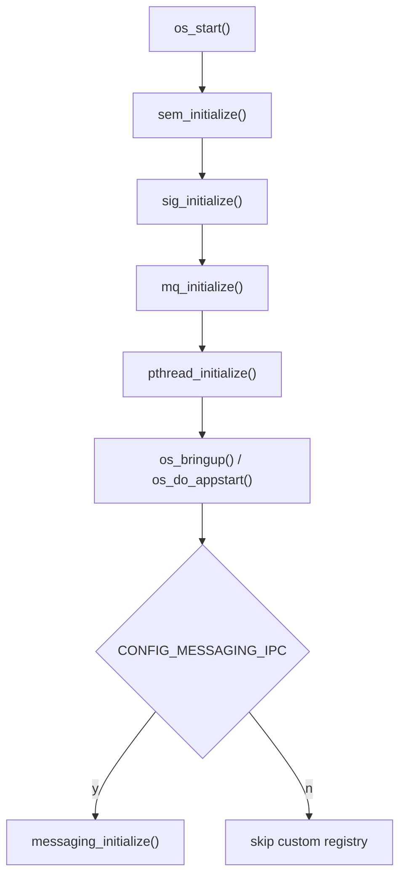

공통적으로 blocking primitive는 TCB의 상태와 전역 scheduler queue를 함께 바꾼다. `sched.h`는 `g_readytorun`, `g_pendingtasks`, `g_waitingforsemaphore`, `g_waitingforsignal`, `g_waitingformqnotempty`, `g_waitingformqnotfull` 같은 queue를 선언한다. semaphore와 mqueue는 실제 wait state를 직접 사용하고, signal은 signal wait뿐 아니라 semaphore/mqueue wait를 깨우는 interrupt path 역할도 한다.

#### 출처 추적

| 주장 | 소스 앵커 |
|---|---|
| semaphore는 다른 시설보다 먼저 초기화된다. | `os/kernel/init/os_start.c:567` |
| signal과 mqueue는 `os_start()` 후반의 약한 초기화 함수 호출로 연결된다. | `os/kernel/init/os_start.c:735`, `os/kernel/init/os_start.c:746` |
| custom messaging registry는 `os_start()`가 아니라 bring-up 중 `CONFIG_MESSAGING_IPC`에서 초기화된다. | `os/kernel/init/os_bringup.c:315` |
| scheduler는 semaphore/signal/mqueue별 대기 큐를 전역 queue로 가진다. | `os/kernel/sched/sched.h:220`, `os/kernel/sched/sched.h:227`, `os/kernel/sched/sched.h:233`, `os/kernel/sched/sched.h:241` |

### 4.5 세마포

#### 역할

`os/kernel/semaphore/`는 POSIX semaphore API와 커널 내부 동기화 primitive를 제공한다. 핵심은 `sem_t.semcount`를 원자적으로 검사하고, count가 부족하면 현재 task를 `TSTATE_WAIT_SEM` 상태로 옮기는 것이다. mutex형 semaphore에서는 holder 정보를 추적해 `priority inheritance`를 적용할 수 있다.

#### 핵심 함수와 자료구조

| 구분 | 항목 | 설명 |
|---|---|---|
| 초기화 | `sem_initialize()` | `CONFIG_PRIORITY_INHERITANCE`일 때 holder freelist를 준비한다. |
| wait | `sem_wait()` | count가 양수면 즉시 획득하고, 아니면 count를 음수로 내린 뒤 TCB의 `waitsem`에 대상 semaphore를 기록하고 block한다. |
| wake | `sem_post()`, `sem_unblock_task()` | count를 올리고, `g_waitingforsemaphore`에서 같은 semaphore를 기다리는 최우선 task를 찾아 깨운다. |
| interrupt/cancel | `sem_waitirq()` | signal 또는 timeout이 semaphore wait를 끊을 때 count와 holder priority를 복구하고 task를 깨운다. |
| PI | `sem_boostpriority()`, `sem_restorebaseprio()` | 기다리는 task priority를 holder에게 반영하고, release 후 다시 base priority로 되돌린다. |

주요 자료구조는 `sem_t`, TCB의 `waitsem`, holder tracking용 `struct semholder_s`, scheduler의 `g_waitingforsemaphore`다. `g_waitingforsemaphore`는 priority-ordered queue라서 `sem_unblock_task()`와 priority inheritance 계산이 같은 전제를 공유한다.

#### 대기 흐름

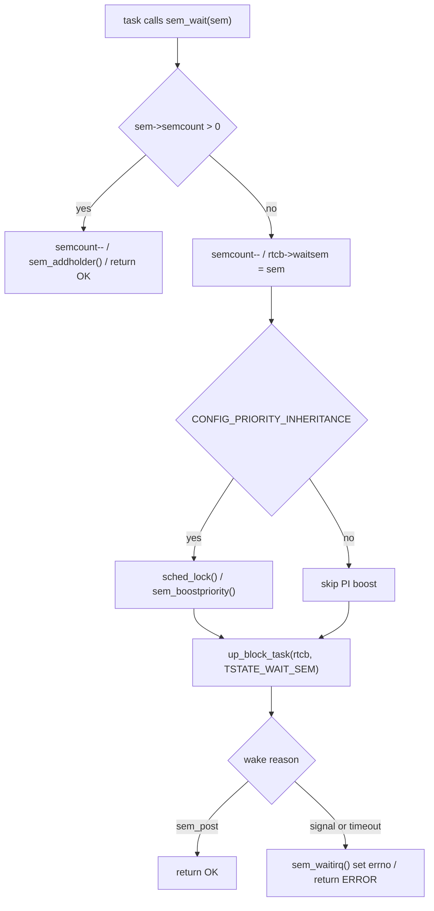

`sem_wait()`는 interrupt handler에서 호출할 수 없도록 assert한다. 반대로 `sem_post()`는 interrupt handler에서도 호출될 수 있으므로 critical section 안에서 count와 wait queue를 다룬다. signal이 도착하거나 timed wait가 만료되면 `sem_waitirq()`가 `TSTATE_WAIT_SEM` 상태를 확인한 뒤 `waitsem`을 비우고 `pterrno`를 `EINTR` 또는 `ETIMEDOUT`로 기록한다.

#### 스케줄러 상호작용

semaphore wait는 `up_block_task(rtcb, TSTATE_WAIT_SEM)`로 scheduler에 들어간다. wake는 `sem_unblock_task()`가 `g_waitingforsemaphore`를 scan해서 `waitsem == sem`인 TCB를 찾고 `up_unblock_task()`를 호출한다. `CONFIG_PRIORITY_INHERITANCE`가 켜져 있으면 block 전 `sched_lock()`으로 holder priority update와 block transition을 하나의 scheduler 관점에서 묶는다.

priority inheritance는 holder list가 있을 때만 의미가 있다. `sem_boostpriority()`는 현재 wait task보다 낮은 holder priority를 끌어올리고, `sem_restorebaseprio()`는 semaphore release 후 남은 waiter를 다시 계산해 holder priority를 되돌린다. 이때 interrupt가 `sem_post()`를 호출한 경우와 일반 task가 release한 경우를 분리한다.

#### 사용 지점과 특징

- `messaging.c`는 registry list와 port별 receiver list를 보호하기 위해 `port_list_sem`, `port_sem`을 사용한다.
- pthread mutex/condition, task group wait, 내부 daemon stop/wakeup 같은 여러 subsystem이 semaphore를 기반으로 한다.
- signal path는 semaphore wait를 끊기 위해 `sem_waitirq()`를 호출한다. 따라서 semaphore는 단순 lock API가 아니라 signal/timer/cancel path와 함께 봐야 한다.

#### 출처 추적

| 주장 | 소스 앵커 |
|---|---|
| `sem_wait()`는 count가 부족하면 TCB `waitsem`을 설정하고 `TSTATE_WAIT_SEM`으로 block한다. | `os/kernel/semaphore/sem_wait.c:184`, `os/kernel/semaphore/sem_wait.c:221` |
| `sem_post()`는 count를 올린 뒤 `sem_unblock_task()`로 waiter를 깨운다. | `os/kernel/semaphore/sem_post.c:213`, `os/kernel/semaphore/sem_post.c:223` |
| `sem_unblock_task()`는 `g_waitingforsemaphore`에서 같은 semaphore를 기다리는 task를 찾는다. | `os/kernel/semaphore/sem_post.c:129` |
| signal/timeout으로 semaphore wait가 깨지면 `sem_waitirq()`가 count와 `waitsem`을 복구한다. | `os/kernel/semaphore/sem_waitirq.c:119`, `os/kernel/semaphore/sem_waitirq.c:134` |
| priority inheritance는 `sem_boostpriority()`와 `sem_restorebaseprio()`로 holder priority를 조정한다. | `os/kernel/semaphore/sem_holder.c:864`, `os/kernel/semaphore/sem_holder.c:910` |

### 4.6 신호

#### 역할

`os/kernel/signal/`은 signal action 등록, pending signal 저장, signal handler dispatch, `sigwaitinfo()`류 대기, 그리고 signal 때문에 다른 blocking primitive를 깨우는 일을 담당한다. TizenRT의 signal path는 TCB별 queue와 task group pending queue를 함께 사용한다.

#### 핵심 함수와 자료구조

| 구분 | 항목 | 설명 |
|---|---|---|
| 초기화 | `sig_initialize()` | action freelist, pending action freelist, IRQ 전용 freelist, pending signal freelist를 만든다. |
| dispatch front door | `sig_dispatch()` | pid에서 TCB 또는 task group을 찾고 `sig_tcbdispatch()`로 넘긴다. |
| TCB 처리 | `sig_tcbdispatch()` | mask 여부, pending signal 추가, signal action queue, wait task unblock을 처리한다. |
| handler 실행 | `sig_deliver()` | TCB의 `sigpendactionq`를 `sigpostedq`로 옮기고 handler를 호출한다. |
| mqueue notify | `sig_mqnotempty()` | mqueue notification을 signal 형태로 보내기 위해 `sig_dispatch()`를 호출한다. |

주요 자료구조는 `sigactq_t`, `sigpendq_t`, `sigq_t`다. 전역 freelist는 `g_sigfreeaction`, `g_sigpendingaction`, `g_sigpendingirqaction`, `g_sigpendingsignal`, `g_sigpendingirqsignal`이고, task group에는 pending signal queue가 붙는다. TCB에는 `sigactionq`, `sigpendactionq`, `sigpostedq`, `sigprocmask`, `sigwaitmask`, `sigunbinfo`가 관여한다.

#### Signal queue와 전달 흐름

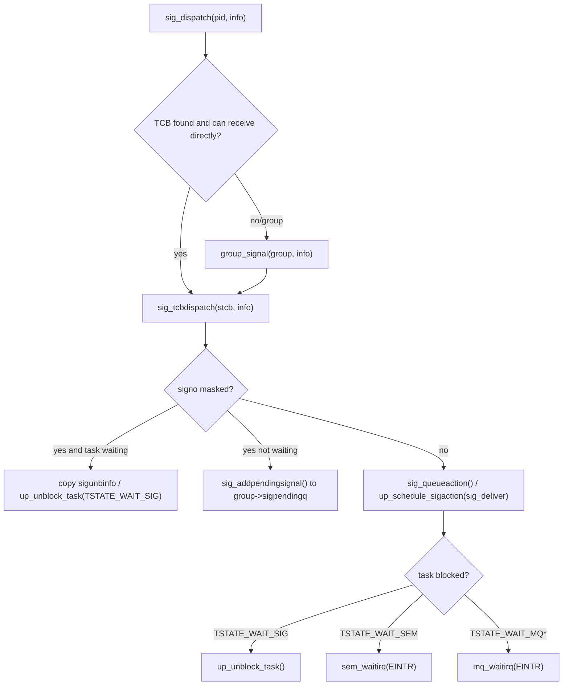

signal이 masked 상태면 즉시 handler를 실행하지 않고 pending signal로 저장한다. 단, 그 signal을 기다리던 task가 `TSTATE_WAIT_SIG` 상태라면 pending queue 대신 `sigunbinfo`에 정보를 복사하고 task를 깨운다. unmasked signal이면 action queue를 만들고 `up_schedule_sigaction()`으로 handler delivery를 예약한다.

#### 스케줄러 상호작용

signal wait는 `sig_timedwait()`나 `sig_suspend()`에서 `TSTATE_WAIT_SIG`로 block된다. signal dispatch는 대상 TCB 상태를 보고 `up_unblock_task()`를 호출할 수 있다. 더 중요한 점은 signal이 semaphore와 mqueue wait도 깨운다는 것이다. `sig_tcbdispatch()`는 대상 task가 `TSTATE_WAIT_SEM`이면 `sem_waitirq(stcb, EINTR)`를 호출하고, `TSTATE_WAIT_MQNOTEMPTY` 또는 `TSTATE_WAIT_MQNOTFULL`이면 `mq_waitirq(stcb, EINTR)`를 호출한다.

#### 사용 지점과 특징

- POSIX timer는 timeout에서 owner pid로 `sig_dispatch()`를 호출한다.
- POSIX mqueue notification은 `mq_dosend()`에서 `sig_mqnotempty()`를 거쳐 signal로 전달된다.
- binary manager thread는 시작 시 `SIGKILL`을 제외한 signal을 mask해서 daemon loop가 임의 signal에 흔들리지 않도록 한다.

#### 출처 추적

| 주장 | 소스 앵커 |
|---|---|
| `sig_initialize()`는 signal action/pending queue와 IRQ 전용 queue를 초기화한다. | `os/kernel/signal/sig_initialize.c:229` |
| `sig_tcbdispatch()`는 masked signal을 pending queue 또는 waiting task wakeup으로 처리한다. | `os/kernel/signal/sig_dispatch.c:309`, `os/kernel/signal/sig_dispatch.c:331` |
| unmasked signal은 action queue와 `up_schedule_sigaction()`으로 handler delivery를 예약한다. | `os/kernel/signal/sig_dispatch.c:359` |
| signal은 semaphore wait와 mqueue wait를 `EINTR`로 깨울 수 있다. | `os/kernel/signal/sig_dispatch.c:389`, `os/kernel/signal/sig_dispatch.c:395` |
| mqueue notification은 `sig_mqnotempty()`에서 `sig_dispatch()`로 전달된다. | `os/kernel/signal/sig_mqnotempty.c:144` |

### 4.7 m큐

#### 역할

`os/kernel/mqueue/`는 POSIX named message queue 구현이다. 여기서는 message buffer pool, descriptor pool, queue inode의 message list, send/receive blocking, priority-ordered message insertion, `mq_notify()` signal notification을 다룬다.

#### 핵심 함수와 자료구조

| 구분 | 항목 | 설명 |
|---|---|---|
| 초기화 | `mq_initialize()` | 일반 message freelist, interrupt 전용 message freelist, descriptor block을 만든다. |
| buffer allocation | `mq_msgalloc()` | thread context에서는 일반 freelist 후 동적 할당, interrupt context에서는 일반 freelist 후 IRQ 전용 freelist를 사용한다. |
| send wait | `mq_waitsend()` | queue가 full이고 blocking descriptor이면 `TSTATE_WAIT_MQNOTFULL`로 block한다. |
| receive wait | `mq_waitreceive()` | queue가 empty이고 blocking descriptor이면 `TSTATE_WAIT_MQNOTEMPTY`로 block한다. |
| send commit | `mq_dosend()` | priority 순서로 message를 삽입하고 notify/waiter wakeup을 처리한다. |
| receive commit | `mq_doreceive()` | message를 caller buffer로 복사하고 not-full waiter를 깨운다. |
| interrupt/cancel | `mq_waitirq()` | signal/timeout이 mqueue wait를 끊으면 waiter count를 줄이고 task를 깨운다. |

`struct mqueue_msg_s`는 `priority`, `msglen`, `mail[MQ_MAX_BYTES]`를 가진 실제 buffered message다. `g_msgfree`와 `g_msgfreeirq`는 message pool이고, `g_desfree`는 descriptor pool이다. queue 자체는 `struct mqueue_inode_s`에 있으며, message list, max count, wait count, notification fields를 가진다.

#### POSIX mqueue pool과 send/receive 흐름

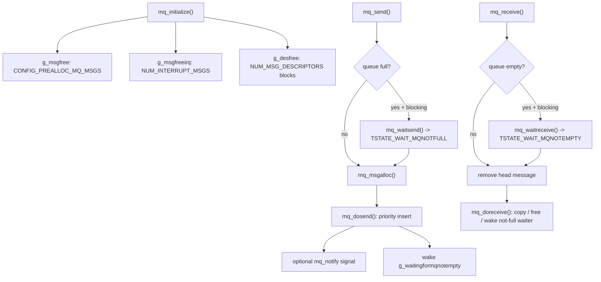

`mq_send()`는 full queue에서 `O_NONBLOCK`이면 `EAGAIN`으로 실패하고, blocking이면 `mq_waitsend()`가 TCB의 `msgwaitq`에 queue를 저장한 뒤 `TSTATE_WAIT_MQNOTFULL`로 block한다. `mq_receive()`도 empty queue에서 같은 방식으로 `TSTATE_WAIT_MQNOTEMPTY`에 들어간다. `mq_dosend()`와 `mq_doreceive()`는 각 반대편 waiter queue를 scan해 같은 `msgq`를 기다리는 최우선 task를 깨운다.

#### Signal과 binary manager 사용

mqueue는 signal과 직접 맞물린다. `mq_notify()`는 queue가 non-empty가 될 때 보낼 signal 정보를 queue에 저장하고, `mq_dosend()`는 message 삽입 후 `sig_mqnotempty()`를 호출한다. signal이 이미 mqueue wait 중인 task에 도착하면 `sig_tcbdispatch()`가 `mq_waitirq()`를 호출해 wait count와 `msgwaitq`를 정리한다.

binary manager는 POSIX mqueue의 대표적인 커널 사용자다. `binary_manager()`는 `BINMGR_REQUEST_MQ`를 `mq_open()`으로 만들고, daemon loop에서 `mq_receive()`로 `binmgr_request_t`를 기다린다. 응답은 `binary_manager_send_response()`가 requester pid 기반 private queue name을 열고 `mq_send()`로 전송한다. 이 경로는 custom messaging registry를 사용하지 않는다.

#### 출처 추적

| 주장 | 소스 앵커 |
|---|---|
| `mq_initialize()`는 `g_msgfree`, `g_msgfreeirq`, descriptor pool을 만든다. | `os/kernel/mqueue/mq_initialize.c:182`, `os/kernel/mqueue/mq_initialize.c:220` |
| message struct는 priority, length, payload storage를 가진다. | `os/kernel/mqueue/mqueue.h:88` |
| full queue에서 blocking sender는 `TSTATE_WAIT_MQNOTFULL`로 block한다. | `os/kernel/mqueue/mq_sndinternal.c:313` |
| empty queue에서 blocking receiver는 `TSTATE_WAIT_MQNOTEMPTY`로 block한다. | `os/kernel/mqueue/mq_rcvinternal.c:210` |
| send commit은 priority order insertion 후 notify와 non-empty waiter wakeup을 처리한다. | `os/kernel/mqueue/mq_sndinternal.c:373`, `os/kernel/mqueue/mq_sndinternal.c:426`, `os/kernel/mqueue/mq_sndinternal.c:443` |
| receive commit은 message를 free하고 not-full waiter를 깨운다. | `os/kernel/mqueue/mq_rcvinternal.c:295`, `os/kernel/mqueue/mq_rcvinternal.c:307` |
| binary manager는 request queue를 `mq_open()`하고 `mq_receive()` loop로 command를 받는다. | `os/kernel/binary_manager/binary_manager.c:177`, `os/kernel/binary_manager/binary_manager.c:196` |
| binary manager response는 private queue에 `mq_send()`로 응답한다. | `os/kernel/binary_manager/binary_manager_response.c:46`, `os/kernel/binary_manager/binary_manager_response.c:56` |

### 4.8 메시징

#### 역할

`os/kernel/messaging/messaging.c`는 TizenRT framework messaging을 위한 receiver registry다. 이름은 messaging이지만, 여기서 payload queue나 blocking receive를 직접 구현하지 않는다. 이 파일은 `port_name`별 receiver pid와 priority list를 저장하고, sender가 수신자 목록을 나눠 읽을 수 있게 한다.

#### 핵심 함수와 자료구조

| 구분 | 항목 | 설명 |
|---|---|---|
| 초기화 | `messaging_initialize()` | registry 보호용 `port_list_sem`을 초기화한다. |
| register | `messaging_save_receiver()` | port node를 찾거나 만들고, receiver pid/priority를 port별 list에 추가한다. |
| enumerate | `messaging_read_list()` | port name에 매달린 receiver pid를 `CONFIG_MESSAGING_RECV_LIST_SIZE` 단위로 읽는다. |
| unregister | `messaging_remove_list()` | 현재 pid의 receiver node를 제거하고, receiver가 0명이면 port node도 제거한다. |
| framework entry | `task_prctl.c`의 `PR_MSG_SAVE`, `PR_MSG_READ`, `PR_MSG_REMOVE` | user/framework API가 prctl option으로 registry 함수를 호출한다. |

자료구조는 `msg_port_node_t`와 `msg_recv_node_t`다. `msg_port_node_t`는 `port_name`, optional `sender_pid`, `nreceiver`, `port_sem`, `recv_node_list`를 가진다. receiver list는 priority 내림차순으로 삽입된다. 전역 port list는 `g_port_node_list`이고, list 보호에는 `port_list_sem`과 port별 `port_sem`을 사용한다.

#### 등록 테이블 흐름

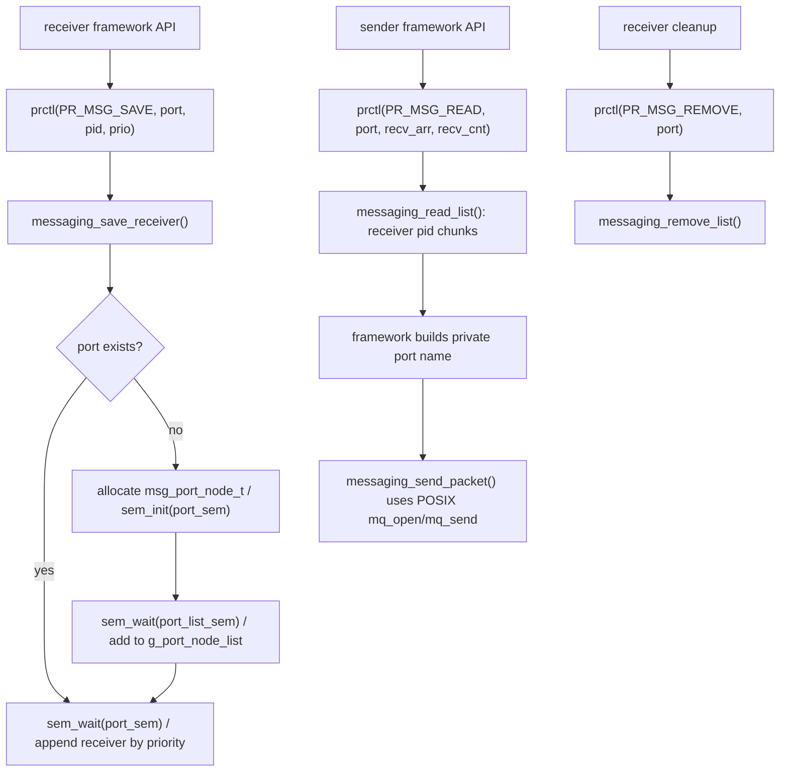

이 registry는 scheduler wait state를 직접 만들지 않는다. block 가능성은 registry 보호용 `sem_wait()`에서만 생긴다. 실제 payload send/receive, full/empty 대기, signal notification은 framework의 packet send 이후 POSIX mqueue 계층에서 처리된다.

#### Framework 연결

`task_prctl.c`는 `CONFIG_MESSAGING_IPC`에서 `PR_MSG_SAVE`, `PR_MSG_READ`, `PR_MSG_REMOVE`를 kernel messaging registry 함수로 넘긴다. framework sender는 `READ_MSG_RECEIVER()`로 receiver pid 목록을 얻고, 각 pid에 대해 `port_name + pid` 형태의 private port name을 만들어 `messaging_send_packet()`을 호출한다. `messaging_send_packet()` 내부는 `mq_open()`/`mq_send()` 기반이므로 registry와 transport가 분리된다.

#### 출처 추적

| 주장 | 소스 앵커 |
|---|---|
| `messaging_initialize()`는 `port_list_sem`만 초기화한다. | `os/kernel/messaging/messaging.c:382` |
| `messaging_save_receiver()`는 port node를 찾거나 만들고 receiver list를 priority 순서로 추가한다. | `os/kernel/messaging/messaging.c:190`, `os/kernel/messaging/messaging.c:101` |
| registry는 `sem_wait()`/`sem_post()`로 port list와 receiver list를 보호한다. | `os/kernel/messaging/messaging.c:206`, `os/kernel/messaging/messaging.c:224`, `os/kernel/messaging/messaging.c:366` |
| `PR_MSG_*` prctl option이 kernel messaging registry를 호출한다. | `os/kernel/task/task_prctl.c:190`, `os/kernel/task/task_prctl.c:207`, `os/kernel/task/task_prctl.c:229` |
| framework sender는 registry에서 receiver pid 목록을 읽고 private port name으로 packet을 보낸다. | `framework/src/messaging/messaging_sndinternal.c:207`, `framework/src/messaging/messaging_sndinternal.c:247` |
| packet 전송 함수는 POSIX mqueue header와 API를 사용한다. | `framework/src/messaging/messaging_sndinternal.c:21`, `framework/src/messaging/messaging_sndinternal.c:107` |

### 4.5-4.8 정리: 읽을 때의 체크포인트

- semaphore는 count와 holder priority를 중심으로 보는 동기화 primitive다. blocking의 핵심 단어는 `sem_wait`, `TSTATE_WAIT_SEM`, `priority inheritance`, `대기 큐`다.
- signal은 독립적인 notification 체계이면서 semaphore/mqueue wait를 `EINTR`로 깨우는 cross-cutting path다. `sig_dispatch`와 `sig_tcbdispatch`를 함께 봐야 한다.
- POSIX mqueue는 message pool, descriptor pool, queue fullness/emptiness wait를 가진 transport다. `mq_initialize`, `mq_waitsend`, `mq_waitreceive`, `mq_dosend`가 중심이다.
- custom messaging은 payload transport가 아니라 port-name receiver registry다. `messaging_save_receiver`, `messaging_read_list`, `messaging_remove_list`가 중심이고, 실제 packet은 framework가 private POSIX mqueue로 보낸다.


시간과 인터럽트 영역은 시간 기준, watchdog queue, POSIX timer, IRQ dispatch 흐름을 함께 봐야 한다. 이 절은 각 하위 기능의 책임과 스케줄러/시간 기준 연결 지점을 출처 추적으로 확인한다.

### 4.9 `clock`: 커널 시간 기준과 tick 누적

#### 역할

`clock` 영역은 시스템 시간이 어디에서 시작되는지와 tick counter가 어떻게 갱신되는지를 정한다. `clock_initialize()`는 RTC가 있으면 RTC 초기화와 선택적인 build-time 기반 시간 설정을 수행한 뒤, `clock_inittime()`으로 `g_basetime`을 채운다. tickless가 아닌 빌드에서는 `g_system_timer`도 0으로 초기화된다.

`clock_timer()`와 `clock_timer_nohz()`는 platform timer interrupt 경로가 호출해야 하는 tick 누적 함수다. 이 함수 자체는 scheduler queue를 직접 조작하지 않고 counter를 갱신한다. POSIX timer와 kernel watchdog은 이 counter와 tick 변환 helper를 기준으로 지연 시간을 계산한다.

#### 핵심 함수

| 함수 | 위치 | 책임 |
|---|---|---|
| `clock_initialize()` | `os/kernel/clock/clock_initialize.c:308` | RTC 초기화, 선택적 system init time 설정, `clock_inittime()` 호출 |
| `clock_inittime()` | `os/kernel/clock/clock_initialize.c:196` | `clock_basetime()`으로 `g_basetime` 설정, non-tickless에서 `g_system_timer` reset |
| `clock_synchronize()` | `os/kernel/clock/clock_initialize.c:353` | RTC 기준으로 system time을 재동기화하되 critical section으로 보호 |
| `clock_timer()` | `os/kernel/clock/clock_initialize.c:376` | 매 tick마다 `g_system_timer` 증가 |
| `clock_timer_nohz()` | `os/kernel/clock/clock_initialize.c:384` | tick suppress 구간에서 누락 tick 수만큼 `g_system_timer` 증가 |

#### 핵심 자료구조와 상태

| 이름 | 위치 | 의미 |
|---|---|---|
| `g_basetime` | `os/kernel/clock/clock_initialize.c:109` | wall-clock 계산의 기준 시각 |
| `g_system_timer` | `os/kernel/clock/clock_initialize.c:106` | non-tickless 빌드에서 누적되는 system tick counter |
| RTC 선택 분기 | `os/kernel/clock/clock_initialize.c:127` | `CONFIG_RTC_DATETIME`, `CONFIG_RTC_HIRES`, seconds-only RTC, no-RTC fallback 중 하나로 base time 결정 |

#### 호출 흐름

1. boot 초기화 흐름에서 clock 시설이 준비될 때 `clock_initialize()`가 호출된다.
2. `CONFIG_RTC`가 있으면 `up_rtc_initialize()`를 먼저 호출한다. `CONFIG_INIT_SYSTEM_TIME`이 켜져 있으면 build time 기반 값으로 RTC를 설정하는 `initialize_system_time()`도 실행한다.
3. `clock_inittime()`이 `clock_basetime(&g_basetime)`을 호출한다. RTC 설정에 따라 broken-out datetime, high-resolution time, seconds-only time, 또는 `CONFIG_START_YEAR/MONTH/DAY` fallback을 사용한다.
4. non-tickless 빌드에서는 `g_system_timer`를 0으로 둔다.
5. 이후 hardware timer interrupt 경로는 tick마다 `clock_timer()` 또는 tick suppress 구간 후 `clock_timer_nohz(ticks)`를 호출해 tick counter를 갱신한다.
6. POSIX timer 설정은 `clock_time2ticks()` 또는 `clock_abstime2ticks()`를 사용해 `struct timespec` 값을 watchdog queue tick delay로 바꾼다.

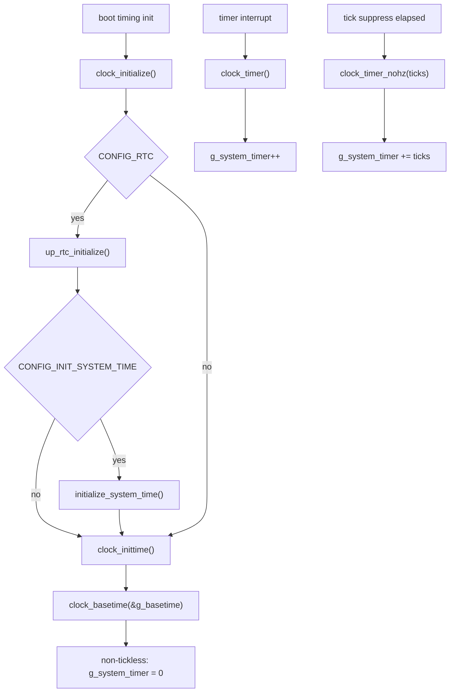

#### 사용 지점과 연결

- `timer_settime()`은 relative timeout을 `clock_time2ticks()`로, absolute timeout을 `clock_abstime2ticks(CLOCK_REALTIME, ...)`로 변환한다.
- watchdog queue는 delay를 tick 단위로 보관하므로, clock의 tick 기준이 POSIX timer와 kernel delayed callback의 공통 시간 단위가 된다.
- `clock_synchronize()`는 low-power state 등으로 system timer가 RTC와 어긋날 수 있는 경우를 위한 재동기화 hook이다. 주석은 시간이 뒤로 갈 수 있어 진행 중인 timer/delay에 나쁜 영향을 줄 수 있다고 경고한다.

#### 특징과 주의점

- `clock_initialize()`는 시간 기준을 세우지만 interrupt vector를 등록하지 않는다. tick interrupt를 실제로 연결하는 책임은 architecture/platform timer 쪽에 있다.
- `clock_timer()`는 counter 증가만 한다. watchdog 만료 실행은 `wd_timer()`/`wd_timer_nohz()` 쪽 책임이다.
- `CLOCK_REALTIME` 기반 POSIX timer는 clock 변환 결과를 watchdog queue로 넘기므로, wall-clock 변경이나 RTC 재동기화 설명을 timer 동작과 섞을 때 출처를 분리해야 한다.

#### 출처 추적

| 주장 | 출처 |
|---|---|
| `clock_initialize()`는 RTC 초기화 후 `clock_inittime()`을 호출한다. | `os/kernel/clock/clock_initialize.c:308`, `os/kernel/clock/clock_initialize.c:312`, `os/kernel/clock/clock_initialize.c:321` |
| `clock_inittime()`은 `g_basetime`을 설정하고 non-tickless에서 `g_system_timer`를 0으로 둔다. | `os/kernel/clock/clock_initialize.c:196`, `os/kernel/clock/clock_initialize.c:200`, `os/kernel/clock/clock_initialize.c:202` |
| `clock_timer()`와 `clock_timer_nohz()`는 `g_system_timer`를 tick 단위로 증가시킨다. | `os/kernel/clock/clock_initialize.c:376`, `os/kernel/clock/clock_initialize.c:380`, `os/kernel/clock/clock_initialize.c:384`, `os/kernel/clock/clock_initialize.c:386` |
| `clock_synchronize()`는 critical section 안에서 `clock_inittime()`을 다시 호출한다. | `os/kernel/clock/clock_initialize.c:353`, `os/kernel/clock/clock_initialize.c:359`, `os/kernel/clock/clock_initialize.c:360`, `os/kernel/clock/clock_initialize.c:361` |

### 4.10 `wdog`: tick 기반 kernel delayed callback queue

#### 역할

`wdog`는 hardware reset 장치가 아니라 커널 내부 delayed callback queue다. `wd_initialize()`는 preallocated watchdog 객체 pool을 free list에 넣고 active list를 비운다. `wd_start()`는 callback과 인자를 watchdog 객체에 저장한 뒤, 만료 tick 순서로 `g_wdactivelist`에 삽입한다. timer interrupt 쪽에서 `wd_timer()` 또는 `wd_timer_nohz()`가 lag 값을 줄이고, head가 만료되면 `wd_expiration()`이 callback을 interrupt context에서 실행한다.

`os/drivers/watchdog.c`의 하드웨어 watchdog upper-half는 `/dev/watchdogN` 장치로 lower-half driver를 등록하고 `WDIOC_START`, `WDIOC_STOP`, `WDIOC_KEEPALIVE` 같은 ioctl을 처리한다. 이 장치 driver는 시스템 reset/ping 장치 추상화이며, `os/kernel/wdog`의 `g_wdactivelist` callback queue와 같은 책임이 아니다.

#### 핵심 함수

| 함수 | 위치 | 책임 |
|---|---|---|
| `wd_initialize()` | `os/kernel/wdog/wd_initialize.c:162` | `g_wdfreelist`, `g_wdactivelist`, `g_wdnfree` 초기화 |
| `wd_create()` | `os/kernel/wdog/wd_create.c:110` | free list 또는 kernel heap에서 watchdog 객체 확보 |
| `wd_start()` | `os/kernel/wdog/wd_start.c:234` | callback, 인자, lag를 저장하고 active list에 tick 순서로 삽입 |
| `wd_cancel()` | `os/kernel/wdog/wd_cancel.c:109` | active watchdog을 list에서 제거하고 다음 항목의 lag를 보정 |
| `wd_gettime()` | `os/kernel/wdog/wd_gettime.c:105` | active list를 순회하며 남은 tick 합산 |
| `wd_expiration()` | `os/kernel/wdog/wd_start.c:131` | 만료된 head watchdog들을 제거하고 callback 실행 |
| `wd_timer()` | `os/kernel/wdog/wd_start.c:416`, `os/kernel/wdog/wd_start.c:456` | tickless/non-tickless timer interrupt 경로에서 lag 감소와 만료 처리 |
| `wd_timer_nohz()` | `os/kernel/wdog/wd_start.c:474` | tick suppress 구간에서 각 active watchdog의 lag를 감소 |

#### 핵심 자료구조와 상태

| 이름 | 위치 | 의미 |
|---|---|---|
| `g_wdfreelist` | `os/kernel/wdog/wd_initialize.c:79` | 사용 가능한 preallocated watchdog 객체 list |
| `g_wdactivelist` | `os/kernel/wdog/wd_initialize.c:86` | 만료 시간 순서로 정렬된 active watchdog list |
| `g_wdnfree` | `os/kernel/wdog/wd_initialize.c:93` | interrupt handler reserve를 지키기 위한 free 객체 수 |
| `g_wdpool[]` | `os/kernel/wdog/wd_initialize.c:103` | `CONFIG_PREALLOC_WDOGS` 크기의 preallocated pool |
| watchdog `lag` | `os/kernel/wdog/wd_start.c:374` | 이전 항목 대비 상대 tick delay |

#### 호출 흐름

1. `wd_initialize()`가 free/active queue를 초기화하고 `g_wdpool[]`의 객체를 `g_wdfreelist`에 넣는다.
2. 사용자는 `wd_create()`로 `WDOG_ID`를 얻는다. interrupt context이거나 reserve보다 free 객체가 많으면 preallocated free list에서 가져오고, 일반 task context에서 reserve가 부족하면 kernel heap allocation으로 fallback한다.
3. `wd_start(wdog, delay, callback, argc, ...)`는 critical section에 들어간다. 이미 active인 watchdog이면 `wd_cancel()`로 기존 예약을 제거한다.
4. callback function, PIC base, argc, parameter를 객체에 저장한다.
5. `delay`는 최소 1 tick이 되도록 보정되고, tickless 빌드에서는 list 조정 전 `sched_timer_cancel()`을 호출한다.
6. active list가 비어 있으면 새 watchdog을 head/tail로 넣는다. 이미 항목이 있으면 상대 `lag` 값을 계산하며 적절한 위치에 삽입하고 주변 항목의 `lag`를 보정한다.
7. `WDOG_SETACTIVE()`로 active flag를 세우고, tickless 빌드에서는 `sched_timer_resume()`으로 다음 interval event를 다시 잡는다.
8. timer interrupt 경로가 `wd_timer()`를 호출하면 head lag가 감소한다. `lag <= 0`이면 `wd_expiration()`이 만료 watchdog을 제거하고 callback을 실행한다.

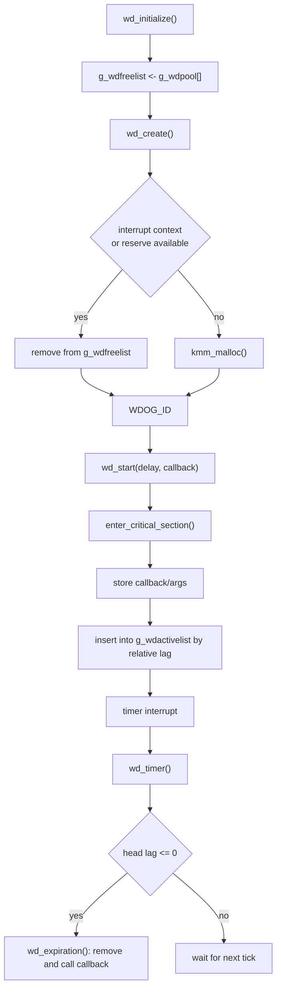

#### scheduler와 시간 기준의 관계

- `wd_start()`와 `wd_cancel()`은 `enter_critical_section()`으로 active list 변경을 보호하므로, timer interrupt 처리와 watchdog queue 변경이 섞이지 않는다.
- tickless build에서는 `wd_start()`가 list 변경 전후로 `sched_timer_cancel()`과 `sched_timer_resume()`을 호출해 scheduler interval timer를 다시 잡는다. `wd_cancel()`은 head watchdog이 제거될 때 interval timer를 재평가한다.
- `wd_timer()`는 interrupt가 비활성화된 timer interrupt logic으로 설명된다. 따라서 watchdog callback은 잠들거나 blocking lock을 잡지 말고, 긴 작업은 task/workqueue 문맥으로 넘겨야 한다.

#### hardware watchdog과의 구분

| 커널 `wdog` queue | hardware watchdog driver |
|---|---|
| `os/kernel/wdog/wd_start.c`의 `g_wdactivelist`에서 callback을 tick delay 순서로 실행한다. | `os/drivers/watchdog.c`가 lower-half device를 `/dev/watchdogN`으로 등록한다. |
| POSIX timer, silent reboot 같은 kernel timeout 사용자에게 delayed function callback을 제공한다. | application/driver가 `WDIOC_START`, `WDIOC_STOP`, `WDIOC_KEEPALIVE`, `WDIOC_SETTIMEOUT` 등 ioctl로 장치를 제어한다. |
| 만료 callback은 timer interrupt context에서 실행된다. | lower-half `start`, `stop`, `keepalive`, `settimeout`, `capture` operation으로 hardware watchdog을 조작한다. |

#### 사용 지점과 연결

- POSIX timer는 `timer_create()`에서 `wd_create()`로 watchdog 객체를 확보하고 `struct posix_timer_s.pt_wdog`에 보관한다.
- `timer_settime()`은 `wd_cancel()`로 기존 예약을 취소한 뒤, tick 변환 결과를 `wd_start()`에 넘긴다.
- `wd_gettime()`은 `timer_gettime()`이 남은 시간을 계산할 때 사용할 수 있도록 active list의 lag 합을 돌려준다.

#### 출처 추적

| 주장 | 출처 |
|---|---|
| `wd_initialize()`는 free/active list를 초기화하고 `CONFIG_PREALLOC_WDOGS` pool을 free list에 넣는다. | `os/kernel/wdog/wd_initialize.c:162`, `os/kernel/wdog/wd_initialize.c:169`, `os/kernel/wdog/wd_initialize.c:170`, `os/kernel/wdog/wd_initialize.c:176`, `os/kernel/wdog/wd_initialize.c:182` |
| `wd_create()`는 interrupt context 또는 reserve 조건에 따라 preallocated free list를 사용하고, 일반 task context에서는 heap allocation으로 fallback할 수 있다. | `os/kernel/wdog/wd_create.c:120`, `os/kernel/wdog/wd_create.c:127`, `os/kernel/wdog/wd_create.c:132`, `os/kernel/wdog/wd_create.c:156`, `os/kernel/wdog/wd_create.c:160` |
| `wd_start()`는 callback/args를 저장하고 active list에 relative lag 순서로 삽입한다. | `os/kernel/wdog/wd_start.c:234`, `os/kernel/wdog/wd_start.c:262`, `os/kernel/wdog/wd_start.c:269`, `os/kernel/wdog/wd_start.c:303`, `os/kernel/wdog/wd_start.c:343`, `os/kernel/wdog/wd_start.c:374` |
| `wd_expiration()`은 만료 watchdog을 active list에서 제거하고 callback을 interrupt context에서 호출한다. | `os/kernel/wdog/wd_start.c:131`, `os/kernel/wdog/wd_start.c:142`, `os/kernel/wdog/wd_start.c:145`, `os/kernel/wdog/wd_start.c:157`, `os/kernel/wdog/wd_start.c:161`, `os/kernel/wdog/wd_start.c:169` |
| `wd_timer()`는 timer interrupt handler context에서 watchdog function을 실행한다고 설명한다. | `os/kernel/wdog/wdog.h:150`, `os/kernel/wdog/wdog.h:153`, `os/kernel/wdog/wdog.h:155`, `os/kernel/wdog/wdog.h:170`, `os/kernel/wdog/wd_start.c:391`, `os/kernel/wdog/wd_start.c:410` |
| hardware watchdog driver는 lower-half를 upper-half device에 묶어 `/dev/watchdogN`으로 등록하고 ioctl로 start/stop/keepalive 등을 처리한다. | `os/drivers/watchdog.c:100`, `os/drivers/watchdog.c:266`, `os/drivers/watchdog.c:291`, `os/drivers/watchdog.c:304`, `os/drivers/watchdog.c:383`, `os/drivers/watchdog.c:468`, `os/drivers/watchdog.c:502` |

### 4.11 `timer`: POSIX timer API를 watchdog과 signal로 연결

#### 역할

`timer`는 POSIX per-thread timer API 표면을 제공한다. 실제 지연 실행은 kernel watchdog 객체가 담당하고, 만료 알림은 signal path로 전달된다. `timer_create()`는 `CLOCK_REALTIME`만 허용하고 `wd_create()`로 watchdog을 확보한 뒤 `struct posix_timer_s`에 보관한다. `timer_settime()`은 `struct itimerspec` 값을 tick delay로 바꿔 `wd_start()`에 `timer_timeout()` callback을 예약한다. callback은 watchdog interrupt context에서 실행되며 `sig_dispatch()`로 owner task에 `SI_TIMER` signal을 보낸다.

#### 핵심 함수

| 함수 | 위치 | 책임 |
|---|---|---|
| `timer_initialize()` | `os/kernel/timer/timer_initialize.c:124` | preallocated timer free list와 allocated timer list 초기화 |
| `timer_create()` | `os/kernel/timer/timer_create.c:196` | `CLOCK_REALTIME` timer 생성, watchdog 확보, owner/signal metadata 저장 |
| `timer_settime()` | `os/kernel/timer/timer_settime.c:307` | 기존 watchdog 취소, relative/absolute time을 tick으로 변환, watchdog 예약 |
| `timer_timeout()` | `os/kernel/timer/timer_settime.c:182` | watchdog 만료 시 signal 전송, periodic timer 재시작 |
| `timer_sigqueue()` | `os/kernel/timer/timer_settime.c:112` | `siginfo_t`를 채워 `sig_dispatch()` 호출 |
| `timer_restart()` | `os/kernel/timer/timer_settime.c:152` | periodic timer의 next interval을 `wd_start()`로 재예약 |
| `timer_release()` | `os/kernel/timer/timer_release.c:143` | reference count 감소, underlying watchdog 삭제, timer list/free 처리 |

#### 핵심 자료구조와 상태

| 이름 | 위치 | 의미 |
|---|---|---|
| `struct posix_timer_s` | `os/kernel/timer/timer.h:85` | POSIX 타이머 인스턴스 |
| `pt_owner` | `os/kernel/timer/timer.h:91` | signal을 받을 owner pid |
| `pt_delay` | `os/kernel/timer/timer.h:92` | 주기적 간격 틱 지연 |
| `pt_last` | `os/kernel/timer/timer.h:93` | 마지막으로 watchdog에 설정한 delay |
| `pt_wdog` | `os/kernel/timer/timer.h:94` | timing을 제공하는 kernel watchdog 객체 |
| `g_freetimers` | `os/kernel/timer/timer_initialize.c:90` | 사전 할당된 타이머 무료 목록 |
| `g_alloctimers` | `os/kernel/timer/timer_initialize.c:98` | 생성된 timer list. active와 inactive timer를 모두 포함 |

#### 호출 흐름

1. `timer_initialize()`가 preallocated timer를 `g_freetimers`에 넣고 `g_alloctimers`를 초기화한다.
2. caller가 `timer_create(CLOCK_REALTIME, evp, &timerid)`를 호출한다. 다른 clock id는 `EINVAL`이다.
3. `timer_create()`가 `wd_create()`로 underlying watchdog을 확보한다.
4. `timer_allocate()`가 timer object를 preallocated free list 또는 heap에서 얻고 `g_alloctimers`에 추가한다.
5. `timer_create()`가 owner pid, periodic delay 초기값, `pt_wdog`, signal number/value를 설정한다. `evp`가 없으면 `SIGALRM`과 timer pointer value를 사용한다.
6. caller가 `timer_settime()`을 호출하면 기존 watchdog 예약을 `wd_cancel(timer->pt_wdog)`로 먼저 취소한다.
7. interval이 있으면 `clock_time2ticks()`로 `pt_delay`를 채운다.
8. critical section 안에서 absolute timer는 `clock_abstime2ticks(CLOCK_REALTIME, ...)`, relative timer는 `clock_time2ticks()`로 first expiration delay를 계산한다.
9. delay가 양수이면 `wd_start(timer->pt_wdog, delay, timer_timeout, 1, timer)`를 호출한다.
10. watchdog 만료 시 `timer_timeout()`이 `timer_sigqueue()`를 통해 `sig_dispatch(timer->pt_owner, &info)`를 호출한다. periodic timer이면 `timer_restart()`가 다시 `wd_start()`를 호출한다.

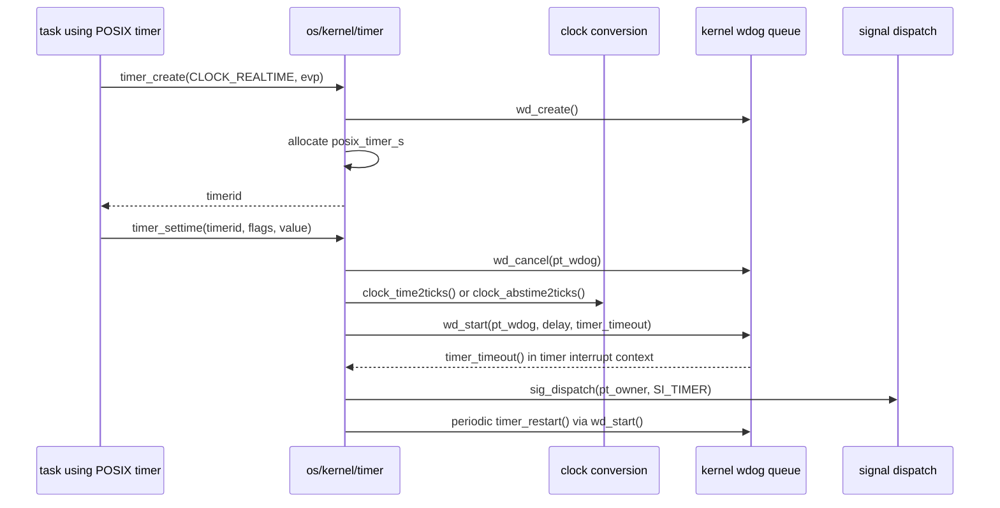

#### 사용 지점과 연결

- POSIX timer의 "timer" 객체는 `struct posix_timer_s`이고, 실제 timeout queue entry는 `pt_wdog`다.
- owner task 종료 시 `timer_deleteall(pid)`가 `g_alloctimers`를 순회해 같은 owner의 timer를 삭제한다.
- `timer_gettime()`은 `wd_gettime(timer->pt_wdog)`을 통해 watchdog queue에 남은 tick을 가져와 사용한다.

#### interrupt context 주의사항

- `timer_sigqueue()`, `timer_restart()`, `timer_timeout()` 주석은 watchdog timer interrupt context에서 실행된다고 명시한다.
- 만료 callback은 signal dispatch를 호출하지만, 이 흐름은 task context에서 임의 작업을 실행하는 것이 아니다. blocking API 호출이나 긴 작업은 timer callback path에 넣으면 안 된다.
- `timer_settime()`은 system timer 안정성을 위해 delay 계산과 `wd_start()` 구간을 critical section으로 보호한다.

#### 출처 추적

| 주장 | 출처 |
|---|---|
| `struct posix_timer_s`는 owner, delay, watchdog, signal value를 보관한다. | `os/kernel/timer/timer.h:85`, `os/kernel/timer/timer.h:90`, `os/kernel/timer/timer.h:91`, `os/kernel/timer/timer.h:92`, `os/kernel/timer/timer.h:94` |
| `timer_initialize()`는 preallocated timer free list와 allocated timer list를 초기화한다. | `os/kernel/timer/timer_initialize.c:124`, `os/kernel/timer/timer_initialize.c:131`, `os/kernel/timer/timer_initialize.c:135`, `os/kernel/timer/timer_initialize.c:141` |
| `timer_create()`는 `CLOCK_REALTIME`만 허용하고 `wd_create()`로 underlying timer를 확보한다. | `os/kernel/timer/timer_create.c:196`, `os/kernel/timer/timer_create.c:201`, `os/kernel/timer/timer_create.c:203`, `os/kernel/timer/timer_create.c:208`, `os/kernel/timer/timer_create.c:210` |
| `timer_create()`는 owner pid와 `pt_wdog`를 timer object에 저장한다. | `os/kernel/timer/timer_create.c:227`, `os/kernel/timer/timer_create.c:228`, `os/kernel/timer/timer_create.c:229`, `os/kernel/timer/timer_create.c:230` |
| `timer_settime()`은 기존 watchdog을 취소하고 absolute/relative time을 tick으로 변환한 뒤 `wd_start()`를 호출한다. | `os/kernel/timer/timer_settime.c:307`, `os/kernel/timer/timer_settime.c:325`, `os/kernel/timer/timer_settime.c:344`, `os/kernel/timer/timer_settime.c:353`, `os/kernel/timer/timer_settime.c:363`, `os/kernel/timer/timer_settime.c:370`, `os/kernel/timer/timer_settime.c:385` |
| `timer_timeout()`은 signal dispatch 후 periodic timer를 재시작할 수 있다. | `os/kernel/timer/timer_settime.c:182`, `os/kernel/timer/timer_settime.c:225`, `os/kernel/timer/timer_settime.c:226`, `os/kernel/timer/timer_settime.c:232`, `os/kernel/timer/timer_settime.c:235` |
| `timer_sigqueue()`는 `SI_TIMER` siginfo를 만들고 `sig_dispatch()`로 owner에게 전달한다. | `os/kernel/timer/timer_settime.c:112`, `os/kernel/timer/timer_settime.c:118`, `os/kernel/timer/timer_settime.c:119`, `os/kernel/timer/timer_settime.c:132` |
| `timer_release()`는 underlying watchdog을 `wd_delete()`로 해제하고 timer를 free/heap으로 돌려준다. | `os/kernel/timer/timer_release.c:143`, `os/kernel/timer/timer_release.c:160`, `os/kernel/timer/timer_release.c:164`, `os/kernel/timer/timer_release.c:170`, `os/kernel/timer/timer_release.c:174` |

### 4.12 `irq`: vector table 초기화와 interrupt dispatch

#### 역할

`irq` 영역은 architecture-specific interrupt entry가 공통 커널 handler table로 넘어오는 지점을 제공한다. `irq_initialize()`는 `g_irqvector[NR_IRQS]`를 0으로 지운 뒤 모든 vector handler를 `irq_unexpected_isr`로 채운다. driver나 architecture code는 `irq_attach()`로 특정 IRQ number에 ISR과 argument를 등록한다. 실제 interrupt가 발생하면 architecture-specific logic이 `irq_dispatch(irq, context)`를 호출하고, `irq_dispatch()`가 vector table에서 handler/arg를 찾아 호출한다.

#### 핵심 함수

| 함수 | 위치 | 책임 |
|---|---|---|
| `irq_initialize()` | `os/kernel/irq/irq_initialize.c:98` | `g_irqvector` 초기화와 default unexpected ISR 설정 |
| `irq_attach()` / `irq_attach_withname()` | `os/kernel/irq/irq_attach.c:97`, `os/kernel/irq/irq_attach.c:99` | IRQ number에 ISR, arg, optional debug name/count 등록 |
| `irq_dispatch()` | `os/kernel/irq/irq_dispatch.c:102` | IRQ number를 vector table에 매핑해 ISR 호출 |
| `irq_unexpected_isr()` | `os/kernel/irq/irq_unexpectedisr.c:98` | 등록되지 않은 IRQ 발생 시 log 후 panic |
| `enter_critical_section()` | `os/kernel/irq/irq_csection.c:172`, `os/kernel/irq/irq_csection.c:396` | IRQ/table/list 변경 구간을 interrupt-disabled critical section으로 보호 |

#### 핵심 자료구조와 상태

| 이름 | 위치 | 의미 |
|---|---|---|
| `struct irq` | `os/kernel/irq/irq.h:78` | ISR handler와 caller-provided arg, debug name/count를 담는 vector table entry |
| `g_irqvector[NR_IRQS]` | `os/kernel/irq/irq_initialize.c:76` | IRQ number별 dispatch table |
| `irq_unexpected_isr` | `os/kernel/irq/irq_unexpectedisr.c:98` | 기본값/unregistered 인터럽트 처리기 |
| `g_cpu_irqlock`, `g_cpu_nestcount[]` | `os/kernel/irq/irq.h:98`, `os/kernel/irq/irq.h:107` | SMP critical section 보호와 nested interrupt critical section 추적 |

#### IRQ 벡터/dispatch 경로

1. boot 초기화 흐름에서 `irq_initialize()`가 `g_irqvector`를 zero-fill하고 각 handler를 `irq_unexpected_isr`로 설정한다.
2. device/architecture code가 `irq_attach(irq, isr, arg)`를 호출한다.
3. `irq_attach()`는 IRQ number 범위를 확인한 뒤 critical section에 들어간다.
4. `isr == NULL`이면 가능한 경우 `up_disable_irq(irq)`를 호출하고 vector를 다시 `irq_unexpected_isr`로 돌린다.
5. 그렇지 않으면 `g_irqvector[irq].handler = isr`, `g_irqvector[irq].arg = arg`를 저장한다. debug IRQ info가 켜져 있으면 count와 name도 갱신한다.
6. interrupt가 발생하면 architecture-specific logic이 `irq_dispatch(irq, context)`를 호출한다.
7. `irq_dispatch()`는 IRQ number가 범위를 벗어나거나 handler가 없으면 `irq_unexpected_isr`를 선택한다. 정상 entry이면 handler와 arg를 읽고 debug count를 증가시킨다.
8. `CONFIG_IRQ_SCHED_HISTORY`가 켜져 있으면 IRQ scheduling status를 저장한 뒤, 최종적으로 `vector(irq, context, arg)`를 호출한다.

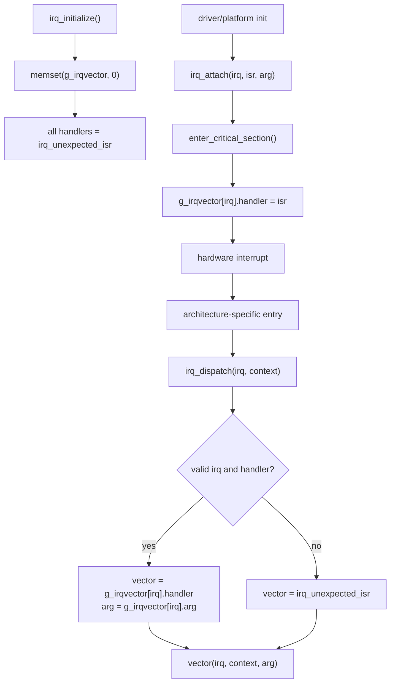

#### interrupt context 주의사항

- `irq_dispatch()`는 등록된 vector를 interrupt context에서 바로 호출한다. ISR 코드는 작업 범위를 짧게 유지하고, blocking 호출을 피하며, 긴 작업은 task/workqueue 문맥으로 넘겨야 한다.
- `irq_attach()`는 `enter_critical_section()`으로 vector table 변경을 보호한다. detach 쪽 주석은 모든 architecture가 centralized interrupt controller 소스를 끌 수 있는 것은 아니므로, platform에서 중앙 disable이 불가능하면 device interrupt 소스를 먼저 끄는 책임이 caller에게 있음을 설명한다.
- `irq_csection.c`는 SMP에서 다른 CPU가 IRQ spinlock을 가진 상태로 interrupt handler가 `enter_critical_section()`을 호출할 때 생길 수 있는 deadlock scenario를 문서화한다. 이것은 모든 ISR critical section을 금지한다는 뜻이 아니라, interrupt context locking을 짧게 유지하고 기존 primitive를 따라야 한다는 경고다.

#### scheduler와 시간 기준의 관계

- IRQ는 timer interrupt 처리의 진입 경로다. clock/watchdog 흐름은 platform timer ISR이 `clock_timer()`와 `wd_timer()` 또는 nohz/tickless 변형을 호출한다는 전제를 가진다.
- `CONFIG_IRQ_SCHED_HISTORY`가 켜져 있으면 scheduler history hook이 IRQ dispatch를 관찰할 수 있다.
- watchdog callback과 POSIX timer timeout callback은 timer interrupt logic에서 실행되므로 일반 IRQ handler와 같은 주의사항을 따른다.

#### 출처 추적

| 주장 | 출처 |
|---|---|
| `irq_initialize()`는 `g_irqvector`를 0으로 채우고 모든 IRQ에 `irq_unexpected_isr`를 설치한다. | `os/kernel/irq/irq_initialize.c:76`, `os/kernel/irq/irq_initialize.c:98`, `os/kernel/irq/irq_initialize.c:104`, `os/kernel/irq/irq_initialize.c:108`, `os/kernel/irq/irq_initialize.c:109` |
| `struct irq`는 handler와 arg, optional debug name/count를 저장한다. | `os/kernel/irq/irq.h:78`, `os/kernel/irq/irq.h:79`, `os/kernel/irq/irq.h:80`, `os/kernel/irq/irq.h:82`, `os/kernel/irq/irq.h:83` |
| `irq_attach()`는 critical section 안에서 ISR과 arg를 쓰고, NULL ISR은 `irq_unexpected_isr`로 되돌린다. | `os/kernel/irq/irq_attach.c:105`, `os/kernel/irq/irq_attach.c:113`, `os/kernel/irq/irq_attach.c:132`, `os/kernel/irq/irq_attach.c:138`, `os/kernel/irq/irq_attach.c:139`, `os/kernel/irq/irq_attach.c:151` |
| `irq_dispatch()`는 IRQ를 검증하고 handler/arg를 고른 뒤 optional debug/history를 기록하고 `vector(irq, context, arg)`를 호출한다. | `os/kernel/irq/irq_dispatch.c:102`, `os/kernel/irq/irq_dispatch.c:110`, `os/kernel/irq/irq_dispatch.c:114`, `os/kernel/irq/irq_dispatch.c:115`, `os/kernel/irq/irq_dispatch.c:117`, `os/kernel/irq/irq_dispatch.c:125`, `os/kernel/irq/irq_dispatch.c:131` |
| `irq_unexpected_isr()`는 등록되지 않은 interrupt를 log하고 panic으로 처리한다. | `os/kernel/irq/irq_unexpectedisr.c:98`, `os/kernel/irq/irq_unexpectedisr.c:100`, `os/kernel/irq/irq_unexpectedisr.c:101`, `os/kernel/irq/irq_unexpectedisr.c:102` |
| `irq_csection.c`는 SMP interrupt handler에서 critical section에 들어갈 때의 deadlock 주의사항을 설명한다. | `os/kernel/irq/irq_csection.c:66`, `os/kernel/irq/irq_csection.c:71`, `os/kernel/irq/irq_csection.c:74`, `os/kernel/irq/irq_csection.c:75`, `os/kernel/irq/irq_csection.c:80` |

### 4.9-4.12 통합 메모

- 읽는 순서는 `clock` -> `wdog` -> `timer` -> `irq`가 자연스럽다. `clock`이 time base, `wdog`가 delayed callback queue, `timer`가 POSIX-facing wrapper, `irq`가 interrupt entry/dispatch layer이기 때문이다.
- "watchdog"이라는 단어가 두 곳에서 나오므로 문서에는 `os/kernel/wdog`를 "kernel watchdog queue" 또는 "delayed callback queue"로, `os/drivers/watchdog.c`를 "hardware watchdog driver"로 계속 구분한다.
- 스케줄러와 시간 기준의 관계는 `wd_start()`의 tickless `sched_timer_cancel()`/`sched_timer_resume()`, `wd_cancel()`의 `sched_timer_reassess()`, timer interrupt context에서 실행되는 `wd_timer()`/`timer_timeout()`로 설명한다.

### 4.13 binary_manager

`binary_manager`와 `binfmt`는 loadable app 빌드나 샘플 앱 사용법을 반복하는 영역이 아니다. 여기서는 커널 쪽 daemon, request queue, binary table, `binfmt` handler, task/group hook, update/recovery 경로를 설명한다.

#### 1. 경계

`binary_manager`는 loadable app 코드를 실행하는 "앱 런처"라기보다, 부팅 후 binary metadata와 partition 상태를 관리하는 커널 daemon이다. 빌드에서는 `CONFIG_BINARY_MANAGER`가 켜질 때 core 소스가 들어가고, `CONFIG_APP_BINARY_SEPARATION`이 켜질 때 load/callback/deinit/recovery 관련 소스가 추가된다. `binfmt`는 binary format handler registry와 `load_module()` / `exec_module()` 실행 프레임을 제공한다. 두 계층의 책임은 다음처럼 나눠 보는 것이 좋다.

| 계층 | 책임 | 대표 소스 |
| --- | --- | --- |
| `framework/src/binary_manager` | app/framework caller가 `binmgr_request_t`를 만들고 `BINMGR_REQUEST_MQ`로 보낸다. 응답이 필요한 API는 pid 기반 private response queue를 기다린다. | `framework/src/binary_manager/binary_manager_interface.c:33-145`, `binary_manager_update.c:93-245`, `binary_manager_get_state.c:29-64`, `binary_manager_register_callback.c:113-208` |
| `os/kernel/binary_manager` | daemon lifecycle, partition scan, bootparam/resource/user binary table, request dispatch, load/update/recovery, state callback을 처리한다. | `os/kernel/binary_manager/binary_manager.c:111-288`, `binary_manager_load.c:155-788`, `binary_manager_data.c:64-881` |
| `os/binfmt` | configured format handler를 등록하고, `binary_manager`가 준비한 `load_attr_t`를 받아 module load/exec/unload를 수행한다. | `os/binfmt/binfmt_initialize.c:77-117`, `binfmt_loadmodule.c:128-260`, `binfmt_loadbinary.c:82-235`, `binfmt_execmodule.c:173-366` |
| task/group lifecycle | `binfmt`가 만든 task와 이후 생성되는 child task를 binary table list에 연결하고, 종료 시 list와 `struct binary_s`를 정리한다. | `os/kernel/task/task_create.c:219-224`, `task_exithook.c:649-659`, `group_leave.c:383-413` |

#### 2. Daemon 생명주기

`os_bringup()`은 system bring-up 후 `os_start_application()`으로 들어가고, board/service 초기화가 끝난 뒤 `CONFIG_BINARY_MANAGER`에서 `kernel_thread(BINARY_MANAGER_NAME, BINARY_MANAGER_PRIORITY, BINARY_MANAGER_STACKSIZE, binary_manager, NULL)`를 만든다. SMP 구성에서는 recovery 중 child loader가 순차 실행되도록 binary manager thread affinity를 CPU0으로 묶는다.

`binary_manager()`의 시작 순서는 다음과 같다.

1. `CONFIG_USE_BP`이면 `binary_manager_update_bpinfo()`로 bootparam을 scan하고 현재 in-use slot을 잡는다.
2. kernel partition table이 비어 있거나 `binary_manager_scan_kbin()`에 실패하면 오류 안내 loop로 들어간다.
3. `CONFIG_RESOURCE_FS`이면 resource partition을 mount한다.
4. `CONFIG_APP_BINARY_SEPARATION`이면 user binary count가 있는지 확인한다.
5. recovery가 켜져 있으면 `binary_manager_faultmsg_sender` thread를 먼저 띄운다.
6. `mq_open(BINMGR_REQUEST_MQ, O_RDWR | O_CREAT, ...)`로 daemon request queue를 만든다.
7. app binary separation에서는 receive loop 전에 `binary_manager_execute_loader(LOADCMD_LOAD_ALL, 0)`로 load-all loader를 시작한다.
8. 이후 `mq_receive()` loop에서 `BINMGR_*` command를 dispatch한다.

이 순서 때문에 "notify를 보내면 binary가 로드된다"가 아니다. load-all은 daemon 시작 직후 별도 loader thread로 먼저 시작되고, app-side notify는 실행된 binary가 자신의 start 상태를 알려 `BINARY_RUNNING`으로 바꾸는 후속 state update다.

#### 3. Queue와 요청 모델

공통 request type은 `os/include/tinyara/binary_manager.h`의 `enum binmgr_request_msg_type`와 `binmgr_request_t`가 정의한다. request에는 `cmd`, `requester_pid`, 그리고 command별 union data가 들어간다. `BINMGR_REQUEST_MQ`는 daemon input queue이고, `BINMGR_RESPONSE_MQ_PREFIX + pid`는 response가 필요한 호출의 private queue 이름이다. request priority는 일반 요청 `BINMGR_NORMAL_PRIO`, fault 요청 `BINMGR_FAULT_PRIO`로 분리된다.

| 요청 | 생성 쪽 | daemon 처리 | 커널 내부 의미 |
| --- | --- | --- | --- |
| `BINMGR_GET_INFO`, `BINMGR_GET_INFO_ALL`, `BINMGR_GET_INFO_INACTIVE_ALL` | framework update info API | `binary_manager_get_info_with_name()`, `binary_manager_get_info_all()`, `binary_manager_get_inactive_info_all()` | kernel/common/user/resource version과 inactive partition size/path 정보를 response queue로 돌려준다. |
| `BINMGR_GET_DOWNLOAD_PATH`, `BINMGR_GET_CURRENT_PATH` | framework path API | `binary_manager_get_inactive_path()`, `binary_manager_get_active_path()` | update download 대상 partition과 현재 실행 partition의 `/dev/mtdblockN` path를 구분한다. |
| `BINMGR_SETBP`, `BINMGR_SWAPBP` | bootparam API, `CONFIG_USE_BP` | `binary_manager_update_bootparam()`, `binary_manager_swap_bootparam()` | kernel/resource/user/common set을 검증한 뒤 inactive BP slot에 새 bootparam을 쓴다. |
| `BINMGR_UPDATE` | `binary_manager_update_binary()` | app separation이면 `binary_manager_execute_loader(LOADCMD_UPDATE, 0)`, 아니면 `binary_manager_check_update()` | update 후보를 검사하고, kernel update는 reboot, user/common/resource update는 unload 후 load-all로 이어진다. |
| `BINMGR_NOTIFY_STARTED` | `binary_manager_notify_binary_started()` | `binary_manager_update_running_state(requester_pid)` | requester TCB의 `group->tg_binidx`를 찾아 `BINARY_RUNNING`으로 바꾸고 `BINARY_STARTED` callback을 알린다. |
| `BINMGR_REGISTER_STATECB`, `BINMGR_UNREGISTER_STATECB` | framework callback API | callback node를 binary table의 `cb_list`에 추가/삭제 | 다른 binary의 started/unloaded/ready-to-unload 상태를 signal + callback queue로 받게 한다. |
| `BINMGR_FAULT` | recovery fault message sender | `binary_manager_recovery(requester_pid)` | fault가 난 binary index를 daemon queue로 합류시킨 뒤 reload 또는 board reset으로 처리한다. |

#### 4. 핵심 상태와 자료구조

`enum binary_state`는 user binary lifecycle을 `BINARY_UNREGISTERED`, `BINARY_INACTIVE`, `BINARY_LOADED`, `BINARY_RUNNING`, `BINARY_UNLOADING`, `BINARY_FAULT`로 표현한다. public header의 `load_attr_t`는 `binary_manager_load()`가 header에서 추출한 name, binary size, RAM size, stack size, offset, priority, version을 `binfmt`에 넘기는 계약이다.

kernel 내부의 핵심 table은 `binmgr_uinfo_t`다. `binary_manager_data.c`의 static `bin_table[USER_BIN_COUNT + 1]`이 이 entry들을 저장하고, index 0은 common binary가 켜졌을 때 `BM_CMNLIB_IDX`로 쓰인다. entry는 다음 정보를 한 곳에 묶는다.

| 필드 | 의미 |
| --- | --- |
| `bin_id`, `state`, `useidx`, `bp_idx`, `bin_count` | main task pid, current state, active A/B partition index, bootparam app index, 등록 partition 수 |
| `load_attr` | `load_binary()`에 넘긴 header-derived load metadata |
| `part_info[PARTS_PER_BIN]` | 각 A/B partition의 size, devnum, flash address |
| `load_priority[]`, `bin_ver[]`, `available_kernel_ver` | load scheduling priority와 version metadata |
| `rt_list`, `nrt_list` | recovery/unload 때 처리할 binary 소속 TCB list. priority가 `BM_PRIORITY_MAX`보다 높으면 realtime list, 아니면 non-realtime list에 들어간다. |
| `cb_list` | 다른 binary가 등록한 state callback list |
| `binp` | `binfmt`의 `struct binary_s` pointer. section address, heap, entry, unload function 같은 loader 상태를 담는다. |

`binmgr_kinfo_t`와 `binmgr_resinfo_t`는 kernel/resource partition set의 in-use index, partition metadata, version을 저장한다. `binmgr_bpdata_t`는 bootparam head/tail을 감싸며 active kernel set, app set, resource set, update reason을 기록한다.

#### 5. Load-all과 개별 load 경로

daemon이 만든 `LOADCMD_LOAD_ALL` loader는 `loadingall_thread()`로 들어간다.

1. `binary_manager_scan_ubin_all()`이 user/common binary partitions를 scan한다. bootparam을 쓰는 구성에서는 BP의 app data를 기준으로 `BIN_USEIDX()`와 `BIN_BPIDX()`를 갱신하고, 그렇지 않으면 A/B partition 중 최신 version을 고른다.
2. resourcefs가 켜졌으면 resource mount를 다시 시도한다.
3. common binary 지원 시 `binary_manager_load(BM_CMNLIB_IDX)`를 먼저 수행한다. common binary는 library로 표시되어 `load_binary()`가 `g_lib_binp`와 binary table state를 갱신하고 task를 만들지 않는다.
4. user binary 중 loading priority가 `BINARY_LOADPRIO_HIGH`인 것은 `binary_manager_load(bin_idx)`로 즉시 로드한다.
5. 나머지는 `binary_manager_execute_loader(LOADCMD_LOAD, bin_idx)`로 개별 `bm_loader` kernel thread를 만들어 낮은 priority로 위임한다.

개별 `binary_manager_load()`는 상태가 `BINARY_INACTIVE`인지 먼저 확인한다. 그런 다음 active partition의 header와 CRC/signature를 검사하고, 실패 시 다른 partition으로 `BIN_USEIDX()`를 토글해 재시도한다. header가 유효하면 `load_attr_t`를 채우고 `binary_manager_load_binary()`를 호출한다. 이 함수는 `load_binary(bin_idx, devpath, &load_attr)`를 최대 `BINMGR_LOADING_TRYCNT`만큼 시도하고 성공 시 `BIN_LOAD_ATTR()`, `BIN_NAME()`을 table에 저장한다.

`binary_manager_execute_loader()`는 command를 loader function으로 매핑한다. `LOADCMD_LOAD`는 binary loading priority를 `LOADER_PRIORITY_LOW/MID/HIGH`로 변환하고 `loading_thread`를 실행한다. `LOADCMD_LOAD_ALL`은 `loadingall_thread`, `LOADCMD_UPDATE`는 `update_thread`, recovery 구성의 `LOADCMD_RELOAD`는 `reloading_thread`로 이어진다. 모든 loader는 `kernel_thread(LOADER_NAME, loader_priority, LOADER_STACKSIZE, loader_func, ...)`로 실행된다.

#### 6. `binfmt` 통합

`binfmt`는 binary manager가 이미 고른 device path와 `load_attr_t`를 받아 format-specific load를 수행한다. 흐름은 다음과 같다.

1. `binfmt_initialize()`는 설정에 따라 builtin, ELF, XIP ELF handler를 초기화한다. `CONFIG_XIP_ELF`이면 `xipelf_initialize()`가 `register_binfmt(&g_xipelfbinfmt)`를 호출하고, `CONFIG_ELF`이면 `elf_initialize()`가 ELF handler를 등록한다.
2. `load_binary()`는 `struct binary_s`를 만들고 `load_attr_t`의 size, offset, stack, priority, binary index, version, name, RAM size를 `binary_s`에 옮긴다.
3. `load_module()`은 registered handler list `g_binfmts`를 순회하며 각 handler의 `load()`를 호출한다. 성공한 handler의 `unload` pointer는 `unload_module()`에서 쓰도록 `binary_s`에 저장한다.
4. XIP ELF handler는 binary header 다음의 `struct userspace_s`를 읽고 text/data/bss/heap/entry/constructor 정보를 `binary_s`에 채운다. 일반 ELF handler는 `libelf` load info를 만들고 section load, symbol bind, entry point 계산을 수행한다.
5. `load_binary()`는 section address 저장과 memory protection 초기화를 한 뒤 user app이면 `exec_module()`을 호출한다.
6. `exec_module()`은 app heap을 초기화하고 TCB/stack/task를 만들며, `newtcb->cmn.group->tg_binidx = binary_idx`로 group과 binary table index를 연결한다. 그 다음 `binary_manager_add_binlist()`, `BIN_ID = pid`, `BIN_STATE = BINARY_LOADED`, `BIN_LOADINFO = binp`를 갱신하고 `task_activate()`로 task를 ready 상태에 넣는다.

이 경계 때문에 `BINARY_LOADED`는 `exec_module()`이 task activation 직전에 갱신하는 상태이고, `BINARY_RUNNING`은 app/framework notify가 daemon에 도착한 뒤 갱신되는 상태다.

#### 7. Update 경로

`BINMGR_UPDATE`를 받은 daemon은 app separation 구성에서 `binary_manager_execute_loader(LOADCMD_UPDATE, 0)`를 호출한다. `update_thread()`는 먼저 `binary_manager_check_update()`로 update 가능성을 본다. kernel update가 필요하면 bootparam 또는 inactive kernel partition 기준으로 board reset 경로에 들어간다. user/common/resource update가 필요하면 running/loaded user binary를 `binary_manager_terminate_binary()`로 내리고, common binary와 resourcefs를 정리한 뒤 kernel module deinit, bootparam refresh를 수행하고 `LOADCMD_LOAD_ALL`을 다시 실행한다.

bootparam API를 쓰는 `BINMGR_SETBP` / `BINMGR_SWAPBP`는 update thread와 다른 request path다. `binary_manager_update_bootparam()`은 요청된 binary group mask를 검사해 kernel/resource/user/common의 inactive partition이 update 가능한지 확인하고, 모두 가능할 때만 inactive BP slot에 새 version과 active index를 기록한다. `binary_manager_swap_bootparam()`은 valid inactive set이 있는지 확인한 뒤 active index들을 토글한다.

#### 8. Recovery 경로

recovery가 켜져 있으면 daemon 시작 시 `binary_manager_faultmsg_sender`가 추가로 뜬다. fault handler 쪽은 `binary_manager_recover_userfault()`로 들어와 fault가 난 task의 `group->tg_binidx`를 찾고, realtime thread를 먼저 scheduling list에서 빼며 fault message sender를 깨운다. fault message sender는 preallocated `faultmsg_t`를 사용해 `BINMGR_FAULT` request를 `BINMGR_FAULT_PRIO`로 daemon queue에 넣는다.

daemon의 `BINMGR_FAULT` dispatch는 `binary_manager_recovery()`다. common binary가 켜진 구성에서는 common과 모든 user binary를 `BINARY_FAULT`로 바꾸고 scheduling에서 제외한 뒤 `binary_manager_execute_loader(LOADCMD_RELOAD, bin_idx)`를 실행한다. common binary가 없으면 fault binary만 deactivate한다. `reloading_thread()`는 user/common binary를 unload하고 resourcefs와 kernel-side modules를 정리한 뒤 `LOADCMD_LOAD_ALL` 또는 `LOADCMD_LOAD`로 다시 로드한다. reload thread 생성에 실패하거나 invalid binary index가 오면 `binary_manager_reset_board(REBOOT_SYSTEM_BINARY_RECOVERYFAIL)`로 간다.

#### 9. Task와 group hook

`binary_manager`가 loadable binary를 추적하려면 task lifecycle hook이 필요하다.

| 위치 | hook | 역할 |
| --- | --- | --- |
| `exec_module()` | initial loaded task 생성 | `task_init()` 이후 `group->tg_binidx`를 binary index로 설정하고 `binary_manager_add_binlist()`를 호출한다. binary table에는 main pid, `BINARY_LOADED`, version, `struct binary_s *`가 저장된다. |
| `task_create()` | loaded app이 만든 child task | 현재 task의 `group->tg_binidx`를 새 task group에 복사하고, 새 TCB를 binary table의 RT/NRT list에 추가한다. app task priority가 `BM_PRIORITY_MIN..BM_PRIORITY_MAX` 사이면 binary manager priority band와 충돌하므로 거부한다. |
| `task_exithook()` | task exit | `binary_manager_remove_binlist(tcb)`로 TCB list에서 빠진 뒤 `group_leave()`로 간다. |
| `group_leave()` | group 마지막 member exit | loadable main task이면 stack pointer 중복 free를 피하고, `binary_manager_clear_bindata(group->tg_binidx)`로 table state/id/list/callback을 정리한 뒤 `group_release()` 후 `binfmt_exit(((struct task_tcb_s *)tcb)->bininfo)`를 호출한다. |
| `binary_manager_terminate_binary()` | update/recovery unload | state를 `BINARY_UNLOADING`으로 바꾸고 필요하면 `BINARY_READYTOUNLOAD` callback을 기다린 뒤 semaphore holder를 해제하고 RT/NRT list의 child task를 recover/terminate한다. 마지막 main task를 terminate하면 `BINARY_INACTIVE`, list NULL, `BINARY_UNLOADED` callback으로 이어진다. |

이 hook들이 없으면 daemon은 loadable binary가 만든 child task, semaphore holder, group resource, app heap을 안정적으로 회수할 수 없다.

#### 10. Mermaid 흐름

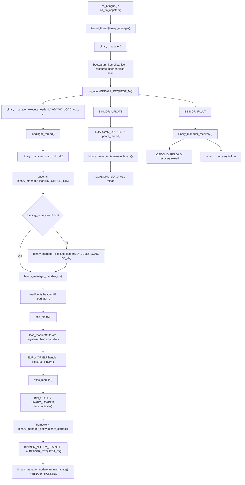

#### 11. Framework API 표면

framework 파일은 같은 queue 계약을 감싸는 얇은 wrapper다. `binary_manager_set_request()`가 command argument를 검증/복사하고 `requester_pid = getpid()`를 기록한 뒤, `binary_manager_send_request()`가 `BINMGR_REQUEST_MQ`를 write용으로 연다. `binary_manager_receive_response()`는 `bin_res_mq<pid>`를 만들고 daemon 응답을 기다린다.

| API | 요청 | 응답 동작 |
| --- | --- | --- |
| `binary_manager_notify_binary_started()` | `BINMGR_NOTIFY_STARTED` | 응답을 기다리지 않는다. daemon이 요청 처리 시 running state를 갱신한다. |
| `binary_manager_update_binary()` | `BINMGR_UPDATE` | 응답을 기다리지 않는다. update 작업은 loader thread에서 실행된다. |
| `binary_manager_get_update_info*()` | `BINMGR_GET_INFO*` | `binmgr_getinfo_*_response_t` 응답을 기다린다. |
| `binary_manager_get_download_path()` / `binary_manager_get_current_path()` | `BINMGR_GET_DOWNLOAD_PATH` / `BINMGR_GET_CURRENT_PATH` | path 응답을 기다린다. |
| `binary_manager_get_state()` | `BINMGR_GET_STATE` | `binmgr_getstate_response_t` 응답을 기다린다. |
| `binary_manager_register_state_changed_callback()` | `BINMGR_REGISTER_STATECB` | `SIGBM_STATE` handler를 설치한 뒤 등록 응답을 기다린다. callback 전달은 pid별 `binmgr_cb<pid>` queue와 signal을 사용한다. |
| `binary_manager_unregister_state_changed_callback()` | `BINMGR_UNREGISTER_STATECB` | 등록 해제 응답을 기다리고, 성공하면 기본 signal handler를 복구한다. |

#### 출처 추적

| 주장 | 출처 |
| --- | --- |
| `binary_manager`는 부팅 후 데몬, 요청 큐, 바이너리 테이블, 로드/업데이트/복구 경로를 담당한다. | `os/kernel/binary_manager/binary_manager.c:111-256`, `os/kernel/binary_manager/binary_manager_load.c:617-788`, `os/kernel/binary_manager/binary_manager_recovery.c:222-360` |
| `binfmt`는 설정된 핸들러 등록부와 모듈 로드/실행/언로드 실행 프레임을 제공한다. | `os/binfmt/binfmt_initialize.c:77-117`, `os/binfmt/binfmt_loadmodule.c:128-260`, `os/binfmt/binfmt_execmodule.c:173-366` |
| `binary_manager/Make.defs`는 핵심, bootparam, resource, load, callback, deinit, recovery 소스를 설정에 따라 추가한다. | `os/kernel/binary_manager/Make.defs:21-39` |
| `os_do_appstart()`는 binary manager 커널 스레드를 시작하고 SMP에서는 CPU0에 묶는다. | `os/kernel/init/os_bringup.c:357-373` |
| 데몬은 bootparam/kernel/resource/user 데이터를 스캔하고, `BINMGR_REQUEST_MQ`를 만든 뒤 `LOADCMD_LOAD_ALL`을 시작하며 `mq_receive()` 루프에서 요청을 분배한다. | `os/kernel/binary_manager/binary_manager.c:111-256` |
| 공개 요청 상수, 우선순위, 바이너리 상태, 헤더, `load_attr_t`, 요청/응답 구조체는 공유 헤더에 있다. | `os/include/tinyara/binary_manager.h:35-125`, `os/include/tinyara/binary_manager.h:145-293` |
| 내부 user/kernel/resource/bootparam 자료구조와 로더 명령 열거형은 `binary_manager_internal.h`에 모여 있다. | `os/kernel/binary_manager/binary_manager_internal.h:53-115`, `os/kernel/binary_manager/binary_manager_internal.h:141-263`, `os/kernel/binary_manager/binary_manager_internal.h:265-375` |
| user binary table은 정적 테이블이고, index 0은 common binary이며, 파티션 등록 과정은 상태/목록/callback 데이터를 초기화한다. | `os/kernel/binary_manager/binary_manager_data.c:64-68`, `os/kernel/binary_manager/binary_manager_data.c:411-458` |
| `binary_manager_scan_ubin_all()`은 bootparam 또는 스캔된 최신 버전에서 활성 파티션과 로드 우선순위를 고른다. | `os/kernel/binary_manager/binary_manager_data.c:562-672` |
| `binary_manager_load()`는 상태, 헤더/서명/CRC를 검증하고 `load_attr_t`를 채운 뒤 A/B 파티션을 재시도하며 `binary_manager_load_binary()`를 호출한다. | `os/kernel/binary_manager/binary_manager_load.c:155-318` |
| load-all은 common binary를 먼저 로드하고, 높은 우선순위 바이너리는 직접, 낮은 우선순위 바이너리는 개별 로더 스레드로 로드한다. | `os/kernel/binary_manager/binary_manager_load.c:472-531` |
| 업데이트 스레드는 업데이트 후보를 확인하고, 로드됨/실행 중 상태의 user binary를 종료하며, common/resource 언로드와 모듈 해제, bootparam 갱신 뒤 `LOADCMD_LOAD_ALL`을 실행한다. | `os/kernel/binary_manager/binary_manager_load.c:617-679`, `os/kernel/binary_manager/binary_manager_data.c:300-376` |
| `binary_manager_execute_loader()`는 `LOADCMD_LOAD`, `LOADCMD_LOAD_ALL`, `LOADCMD_UPDATE`, `LOADCMD_RELOAD`를 로더 함수에 매핑하고 `bm_loader`를 시작한다. | `os/kernel/binary_manager/binary_manager_load.c:728-788` |
| 복구 경로는 장애 메시지 송신자, `BINMGR_FAULT`, 바이너리 비활성화, `LOADCMD_RELOAD`, 실패 시 보드 리셋을 사용한다. | `os/kernel/binary_manager/binary_manager.c:162-170`, `os/kernel/binary_manager/binary_manager_recovery.c:222-360` |
| bootparam update/swap은 kernel/resource/user/common 후보를 검증한 뒤 inactive BP slot에 기록한다. | `os/kernel/binary_manager/binary_manager_bootparam.c:754-879`, `os/kernel/binary_manager/binary_manager_bootparam.c:956-1036` |
| 리소스 마운트/언마운트/업데이트는 resource partition 메타데이터와 `/res` romfs 마운트를 사용한다. | `os/kernel/binary_manager/binary_manager_resource.c:203-218`, `os/kernel/binary_manager/binary_manager_resource.c:298-449`, `os/kernel/binary_manager/binary_manager_resource.c:458-533` |
| framework 래퍼는 요청 생성/전송, 개별 응답 큐 대기, notify/update/state/callback API 구현을 담당한다. | `framework/src/binary_manager/binary_manager_interface.c:33-145`, `framework/src/binary_manager/binary_manager_notify.c:30-47`, `framework/src/binary_manager/binary_manager_update.c:33-245`, `framework/src/binary_manager/binary_manager_get_state.c:29-64`, `framework/src/binary_manager/binary_manager_register_callback.c:35-208` |
| `binfmt_initialize()`는 설정된 핸들러를 등록하고, `register_binfmt()`는 핸들러를 `g_binfmts`에 저장하며, `load_module()`은 그 목록을 순회한다. | `os/binfmt/binfmt_initialize.c:77-117`, `os/binfmt/binfmt_register.c:87-102`, `os/binfmt/binfmt_loadmodule.c:128-260` |
| `load_binary()`는 `struct binary_s`를 할당/채운 뒤 `load_module()`을 호출하고, common binary는 라이브러리로 처리하며 user app은 `exec_module()`로 넘긴다. | `os/binfmt/binfmt_loadbinary.c:82-235` |
| `exec_module()`은 app heap, TCB, task name, group `tg_binidx`, binary table state를 초기화하고 태스크를 활성화한다. | `os/binfmt/binfmt_execmodule.c:173-366` |
| XIP ELF 핸들러는 `struct userspace_s`를 읽어 section/entry/ctor field를 채우고 `xipelf_initialize()`를 통해 등록된다. | `os/binfmt/libxipelf/xipelf.c:25-188` |
| ELF 핸들러는 libelf init/load/bind를 사용하고 `elf_initialize()`를 통해 등록된다. | `os/binfmt/elf.c:203-274`, `os/binfmt/elf.c:294-324` |
| 자식 task 생성은 현재 `tg_binidx`를 복사하고 새 TCB를 binary manager list에 추가하며, exit hook은 제거하고 group leave는 binary table을 정리한 뒤 `binfmt_exit()`을 호출한다. | `os/kernel/task/task_create.c:219-224`, `os/kernel/task/task_create.c:291-298`, `os/kernel/task/task_exithook.c:649-659`, `os/kernel/group/group_leave.c:383-413` |
| `binary_manager_terminate_binary()`는 언로드 준비 callback, 세마포어 해제, 자식 종료, 언로드 상태 초기화, 언로드 완료 notification을 처리한다. | `os/kernel/binary_manager/binary_manager_load.c:328-452`, `os/kernel/binary_manager/binary_manager_load.c:691-726` |

### 4.14-4.22 지원 기능

이 절은 `paging`, `pthread`, `environ`, `errno`, `preference`, `debug`, `log_dump`, `silent_reboot`, `task_monitor`를 커널 보조 기능 관점에서 짧게 설명한다.

#### 지원 기능 요약

| 기능 | 역할 | 대표 파일/함수 | 사용/호출 지점 | 아키텍처 메모 |
|---|---|---|---|---|
| `paging` | page fault가 난 태스크를 `g_waitingforfill` 대기열에 묶고, 별도 page-fill worker가 필요한 page-in을 처리한다. | `os/kernel/paging/pg_worker.c:529`의 `pg_worker()`, `pg_dequeue()`(`:254`), `pg_startfill()`(`:357`), `pg_callback()`(`:175`), `os/kernel/paging/pg_miss.c:139`의 `pg_miss()` | `os/kernel/init/os_bringup.c:205`가 `CONFIG_PAGING`에서 `kernel_thread("pgfill", ...)`을 가장 먼저 시작한다. ARM data/prefetch abort 경로는 `pg_miss()`로 page fill을 예약한다(`os/arch/arm/src/armv7-a/arm_dataabort.c:176`, `os/arch/arm/src/armv7-a/arm_prefetchabort.c:147`). | 커널 공통부는 대기열, worker priority boost, completion unblock을 담당하고, 실제 page 할당/채우기는 `up_checkmapping()`, `up_allocpage()`, `up_fillpage()` 같은 arch 함수로 분리된다. non-blocking fill에서는 callback이 `SIGWORK`로 worker를 깨운다. |
| `pthread` | POSIX thread 생성/시작/종료, join, mutex/cond, thread-specific data, cancellation 보조 기능을 제공한다. | `pthread_initialize()`(`os/kernel/pthread/pthread_initialize.c:108`), `pthread_create()`(`os/kernel/pthread/pthread_create.c:247`), `pthread_start()`(`:187`), `pthread_join()`(`os/kernel/pthread/pthread_join.c:122`), `pthread_exit()`(`os/kernel/pthread/pthread_exit.c:113`) | `os/kernel/init/os_start.c:754-757`에서 `pthread_initialize()`가 호출된다. `pthread_create()`는 `group_bind()`로 호출자 group에 붙고(`os/kernel/pthread/pthread_create.c:303`, `os/kernel/group/group_join.c:186`), `pthread_schedsetup()`으로 scheduler 진입 준비를 한다(`os/kernel/pthread/pthread_create.c:373`). | task와 같은 scheduler/TCB 기반을 쓰되, group을 새로 만들지 않고 기존 group에 bind한다. join 상태는 `struct join_s`(`os/kernel/pthread/pthread.h:85`)로 group 안에서 관리하고, mutex 구현은 semaphore 및 priority-inheritance 보조 경로와 연결된다. |
| `environ` | task group별 environment 문자열 영역을 복제, 조회, 수정, 해제한다. | `get_environ_ptr()`(`os/kernel/environ/env_getenvironptr.c:89`), `env_dup()`(`os/kernel/environ/env_dup.c:99`), `env_release()`(`os/kernel/environ/env_release.c:97`), `setenv()`(`os/kernel/environ/env_setenv.c:103`), `getenv()`(`os/kernel/environ/env_getenv.c:95`) | `group_allocate()`가 새 group에 부모 environment를 복제한다(`os/kernel/group/group_create.c:244`). `group_leave()`는 마지막 group 자원 정리 때 `env_release()`를 호출한다(`os/kernel/group/group_leave.c:217`). bring-up은 `CONFIG_PATH_INITIAL`을 idle 환경에 넣고 앱 시작 뒤 `clearenv()`로 버린다(`os/kernel/init/os_bringup.c:508`, `:539`). | environment는 `struct task_group_s`의 `tg_envp`/`tg_envsize`에 묶인 group 자원이다. `CONFIG_DISABLE_ENVIRON`이면 `environ.h`가 `env_dup()`/`env_release()`를 no-op으로 접어 빌드 경계를 유지한다. |
| `errno` | 현재 실행 문맥에 맞는 errno 저장소를 찾아 libc/커널 API의 오류 전달을 일관화한다. | `get_errno_ptr()`(`os/kernel/errno/errno_getptr.c:102`), `set_errno()`(`os/kernel/errno/errno_set.c:95`), `get_errno()`(`os/kernel/errno/errno_get.c:96`) | `wdog`, `timer`, `mqueue`, `sched`, `pthread`, `semaphore`, `environ`, `task` 등 다수 커널 API가 실패 원인을 `set_errno()`/`get_errno()`로 주고받는다. 예: `pthread_create()` 실패 보존(`os/kernel/pthread/pthread_create.c:352`, `:360`, `:375`), `silent_reboot` watchdog 실패 로그(`os/kernel/silent_reboot/silent_reboot.c:311`, `:341`). | 정상 task context에서는 running TCB의 `pterrno`를 반환하고, interrupt context 또는 초기화/문맥전환 중에는 IRQ용 저장소를 사용해 interrupt handler가 태스크 errno를 덮어쓰지 않게 한다. |
| `preference` | private/shared preference key-value 저장소와 변경 callback 등록/통지를 제공한다. | `preference_write_key()`(`os/kernel/preference/preference_write.c:156`), `preference_read_key()`(`os/kernel/preference/preference_read.c:102`), `preference_check_key()`(`os/kernel/preference/preference_check.c:58`), `preference_remove_key()`(`os/kernel/preference/preference_remove.c:69`), `preference_register_callback()`(`os/kernel/preference/preference_callback.c:132`) | `task_prctl()`의 `PR_SET_PREFERENCE`, `PR_GET_PREFERENCE`, `PR_REMOVE_PREFERENCE`, `PR_CHECK_PREFERENCE`, callback 명령이 preference 함수로 dispatch된다(`os/kernel/task/task_prctl.c:290-354`). task 종료 경로는 등록 callback을 정리한다(`os/kernel/task/task_terminate.c:222`, `os/kernel/task/task_terminate_unloaded.c:145`). | 저장소 자체는 파일 기반 read/write/check/remove로 구성되고, callback 소스는 `CONFIG_PREFERENCE`와 mqueue/signal이 모두 있을 때만 추가된다(`os/kernel/preference/Make.defs:53-59`). framework preference layer는 이 커널 `prctl()` 경로를 사용자 API로 감싼다. |
| `debug` | system debug device, semaphore/task/IRQ history, 종료 정보, memory debug 보조 기능을 제공한다. | `sysdbg_init()`(`os/kernel/debug/sysdbg.c:943`), `save_semaphore_history()`(`:497`), `save_task_scheduling_status()`(`:606`), `save_irq_scheduling_status()`(`:696`), `dbg_save_termination_info()`(`os/kernel/debug/dbg_termination_info.c:102`) | `os_start()`가 `CONFIG_DEBUG_SYSTEM`에서 `sysdbg_init()`을 호출한다(`os/kernel/init/os_start.c:791`). semaphore/IRQ/task 종료 경로가 각각 history 또는 termination 저장 함수를 호출한다(`os/kernel/semaphore/sem_wait.c:172`, `os/kernel/irq/irq_dispatch.c:126`, `os/kernel/task/task_exithook.c:570`). | debug 기능은 scheduler 동작을 대신하지 않고 관찰/보존 계층으로 붙는다. `Make.defs`는 `CONFIG_DEBUG_SYSTEM`, `CONFIG_MEM_LEAK_CHECKER`, `CONFIG_DEBUG`, `CONFIG_ENABLE_STACKMONITOR`에 따라 sysdbg, leak checker, termination/stack 저장 소스를 나눠 넣는다. |
| `log_dump` | 런타임 로그를 chunk queue에 모으고, 별도 커널 thread에서 압축/읽기 준비를 처리한다. | `log_dump()`(`os/kernel/log_dump/log_dump.c:591`), `log_dump_init()`(`:133`), `log_dump_save()`(`:492`), `log_dump_set()`(`:282`), `log_dump_read()`(`:553`) | `os_bringup()`의 app-start 경로가 `CONFIG_LOG_DUMP`에서 `kernel_thread(LOG_DUMP_NAME, ...)`을 만든다(`os/kernel/init/os_bringup.c:335`). 내부 API는 `os/include/tinyara/log_dump/log_dump_internal.h:30-58`에 노출된다. | 메모리 사용을 제한하기 위해 `CONFIG_LOG_DUMP_CHUNK_SIZE`, `CONFIG_LOG_DUMP_MAX_SIZE`, `CONFIG_LOG_DUMP_MAX_FREE_HEAP`, `CONFIG_LOG_DUMP_NUMBUFS` 기준으로 chunk를 관리한다. save path는 현재 task 우선순위, scheduler lock, kmm lock 상태를 보고 즉시 압축하거나 worker를 깨운다. |
| `silent_reboot` | 지정 시간대/지연/lock 조건에 따라 watchdog 기반으로 조용한 재부팅을 예약하거나 보류한다. | `silent_reboot_initialize()`(`os/kernel/silent_reboot/silent_reboot.c:394`), `silent_reboot_lock()`(`:233`), `silent_reboot_unlock()`(`:249`), `silent_reboot_delay()`(`:278`), `silent_reboot_force_perform_after_timeout()`(`:326`) | `os_do_appstart()`가 `CONFIG_SILENT_REBOOT`에서 초기화와 `/dev/silent_reboot` driver 등록을 수행한다(`os/kernel/init/os_bringup.c:276-277`). LCD/touchscreen driver와 silent reboot driver가 lock/delay/query API를 사용한다(`os/drivers/lcd/lcd_dev.c:298`, `:313`, `os/drivers/input/touchscreen.c:510`, `os/drivers/silent_reboot/silent_reboot_driver.c:83-99`). | 시간 계산과 재부팅 예약은 kernel watchdog(`wd_create()`, `wd_start()`)에 의존하고, 실제 reset은 board 제어 경로로 내려간다. `CONFIG_SILENT_REBOOT`가 없으면 public header가 API를 no-op/false macro로 접는다(`os/include/tinyara/silent_reboot.h:49-55`). |
| `task_monitor` | 등록된 task/pthread가 주기적으로 active 상태를 갱신하는지 검사하고, 응답하지 않으면 system reset을 유도한다. | `task_monitor()`(`os/kernel/task_monitor/task_monitor.c:120`), `task_monitor_register_list()`(`:42`), `task_monitor_unregester_list()`(`:75`), `task_monitor_register()`(`os/kernel/task_monitor/task_monitor_utils.c:24`), `task_monitor_update_status()`(`:29`) | `os_bringup()`이 `CONFIG_TASK_MONITOR`에서 `kernel_thread("taskmonitor", ...)`을 시작한다(`os/kernel/init/os_bringup.c:342`). public wrapper는 `prctl(PR_MONITOR_REGISTER/PR_MONITOR_UPDATE)`를 호출하고(`os/kernel/task_monitor/task_monitor_utils.c:24-29`), `task_prctl()`은 등록과 active 갱신을 수행한다(`os/kernel/task/task_prctl.c:261-280`). 종료 경로는 monitor 등록을 해제한다(`os/kernel/task/task_terminate.c:219`, `os/kernel/task/task_terminate_unloaded.c:142`). | `g_monitored_tasks_list[]`와 interval bucket `g_que_list[]`로 검사 주기를 나누고, 검사 시 `sched_gettcb()`와 TCB의 `is_active`를 확인한다. 실패하면 `REBOOT_SYSTEM_WATCHDOG` reason을 남길 수 있고 `boardctl(BOARDIOC_RESET, 0)`로 reset한다. |

#### 출처 추적 행

| 기능 | 출처 추적 |
|---|---|
| `paging` | `os/kernel/paging/Make.defs:53-55`가 `CONFIG_PAGING`에서 `pg_miss.c`/`pg_worker.c`를 넣고, `os/kernel/init/os_bringup.c:205`가 `pgfill` worker를 생성하며, `os/kernel/paging/pg_worker.c:254-406`이 dequeue, arch mapping check, page allocate/fill, callback wakeup을 처리한다. |
| `pthread` | `os/kernel/pthread/Make.defs:53-81`이 pthread core/keys/signals/cleanup/affinity 소스를 조건부 추가하고, `os/kernel/init/os_start.c:754-757`이 초기화하며, `os/kernel/pthread/pthread_create.c:247-373`이 TCB 생성, group bind, join info, scheduler setup을 연결한다. |
| `environ` | `os/kernel/environ/Make.defs:53-57`이 `CONFIG_DISABLE_ENVIRON`이 아닐 때 환경 API를 빌드하고, `os/kernel/group/group_create.c:244`가 `env_dup()`으로 부모 환경을 복제하며, `os/kernel/group/group_leave.c:217`과 `os/kernel/init/os_bringup.c:508/539`가 해제/초기 PATH 흐름을 보여준다. |
| `errno` | `os/kernel/errno/Make.defs:53-56`이 errno pointer 및 syscall용 get/set 소스를 추가하고, `os/kernel/errno/errno_getptr.c:102`가 context별 저장소를 선택하며, `os/include/errno.h:453-473`이 public accessor를 선언한다. |
| `preference` | `os/kernel/preference/Make.defs:53-59`가 preference와 callback 소스를 조건부 빌드하고, `os/kernel/task/task_prctl.c:290-354`가 preference 명령을 dispatch하며, `os/kernel/preference/preference_callback.c:75-225`가 mqueue 기반 변경 통지와 pid별 callback 정리를 담당한다. |
| `debug` | `os/kernel/debug/Make.defs:19-34`가 debug 소스를 config별로 넣고, `os/kernel/init/os_start.c:791`이 `sysdbg_init()`을 호출하며, `os/kernel/semaphore/sem_wait.c:172`, `os/kernel/irq/irq_dispatch.c:126`, `os/kernel/task/task_exithook.c:570`이 history/termination 저장 호출 지점이다. |
| `log_dump` | `os/kernel/log_dump/Make.defs:19-21`이 `CONFIG_LOG_DUMP`에서 `log_dump.c`를 넣고, `os/kernel/init/os_bringup.c:335`가 worker를 시작하며, `os/kernel/log_dump/log_dump.c:133-175`, `:492-553`, `:591-632`가 초기화, save/read, worker loop를 구성한다. |
| `silent_reboot` | `os/kernel/silent_reboot/Make.defs:19-21`이 `CONFIG_SILENT_REBOOT`에서 core를 빌드하고, `os/kernel/init/os_bringup.c:276-277`이 초기화/driver 등록을 호출하며, `os/kernel/silent_reboot/silent_reboot.c:204-341`이 watchdog timer 예약과 delay/force timeout을 처리한다. |
| `task_monitor` | `os/kernel/task_monitor/Make.defs:21-23`이 monitor 소스를 추가하고, `os/kernel/init/os_bringup.c:342`가 worker를 시작하며, `os/kernel/task/task_prctl.c:261-280`과 `os/kernel/task_monitor/task_monitor.c:120-175`가 등록/update/check/reset 흐름을 연결한다. |

## 부록 A. 출처 표기 읽는 법

본문의 출처는 `경로:줄` 또는 `경로:줄-줄` 형식으로 적는다. 표 안에 여러 경로가 함께 있으면 해당 설명이 둘 이상의 파일을 함께 읽어야 이해되는 흐름이라는 뜻이다. `build/output/*`, object archive, dependency cache, copied config output처럼 빌드가 만든 파일은 원본 근거로 쓰지 않고 현재 상태를 확인하는 보조 자료로만 본다.

## 부록 B. QA 메모

### 비파괴 검증 명령

- `test -s docs/TIZENRT_ONBOARDING.md`
- `grep -n "빌드 전체 과정\|rtl8730e/loadable_apps\|os/ 하위 모듈\|os/kernel\|출처 추적" docs/TIZENRT_ONBOARDING.md`
- `sed -n '1,220p' docs/TIZENRT_ONBOARDING.md`

### 생성/캐시 산출물 주의

문서의 기준 근거에는 `build/output/*`, object archive, dependency cache, copied config output을 넣지 않는다. 후속 검증에서 해당 파일들이 보이면 현재 상태 확인용 보조 자료로만 기록한다.
